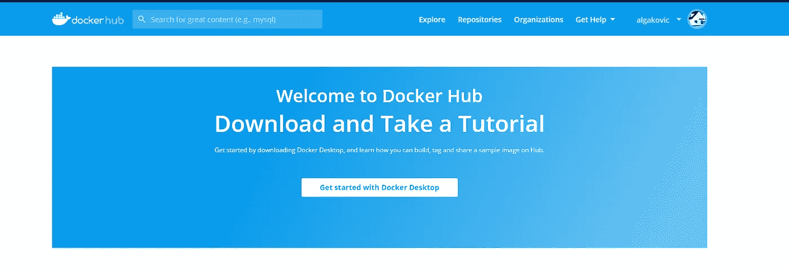
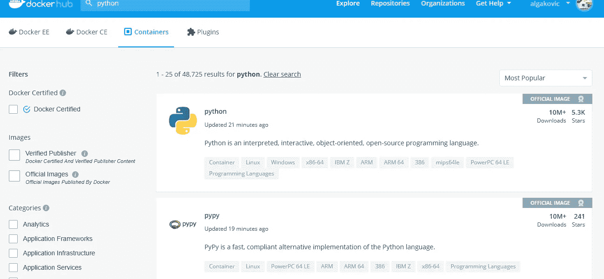
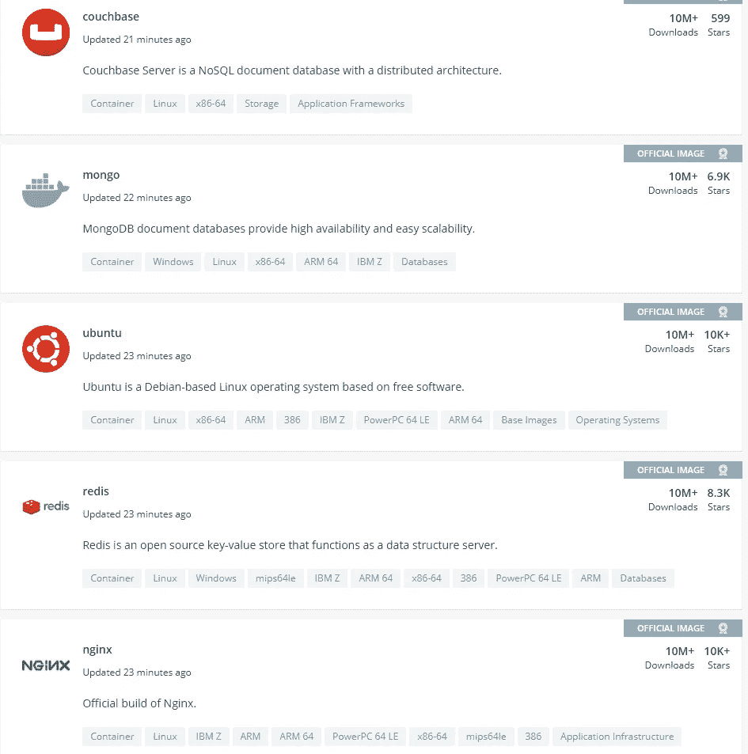
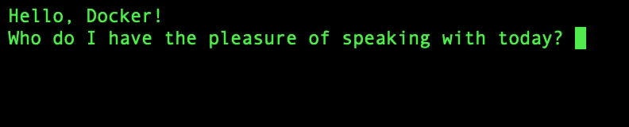
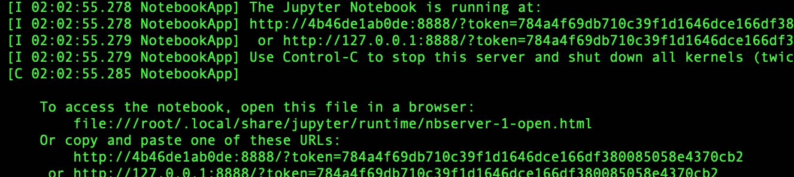

# 将 Docker 用作数据科学家

> 原文：<https://medium.com/analytics-vidhya/using-docker-as-a-data-scientist-8bbb203fb6b7?source=collection_archive---------15----------------------->


谁是德尼罗？ on [Unsplash](https://unsplash.com?utm_source=medium&utm_medium=referral)

大家好！

载有我们数据科学项目的船刚刚抵达港口！准备好卸下集装箱，点燃环境。等等……什么？希望有那么容易吗？嗯，基本上是。欢迎来到 Docker！

在这篇文章中，我们将学习

*   如何安装 Docker 桌面
*   如何对接——对接图像和对接中心
*   如何对接——对接集装箱
*   用 Docker 运行一个完整的数据科学项目

Docker 是现代的突破。一种我们可以保存和共享我们的项目的方式，包括它们的原始环境。不再有不兼容的诡计，它是快速和容易的。任何人都可以从 docker 映像注册中心获取一个 docker 映像，下载它，运行它，并在构建项目的相同环境中开始工作。我在我的文章[中解释了 Docker 是什么以及它是如何工作的。！](/@algakovic/what-the-hell-is-docker-dac692d9f248?source=friends_link&sk=cb4f9daef153a774c77d35a9e615916f)

在不同的机器上复制项目结果的能力在数据科学中非常重要。Docker 让这变得异常简单。


照片由[诺亚·卡特](https://unsplash.com/@granoahbars?utm_source=medium&utm_medium=referral)在 [Unsplash](https://unsplash.com?utm_source=medium&utm_medium=referral) 拍摄

如果你准备好了，我们走吧

# 如何安装 Docker 桌面

前往[https://www.docker.com/products/docker-desktop](https://www.docker.com/products/docker-desktop)开始安装你的操作系统。如果你没有 Docker ID，注册一个。

****注意:对于 windows 用户，可能需要 windows 功能更新 2004。此外，安装完成后，您可能需要重新启动以启用 Hyper-V 功能。***

在安装过程中，我将解释 Docker 行话中的几个关键词:

> Docker 注册表——上传和下载 Docker 图像的地方。Docker hub 是 Docker 命令行界面的默认设置。
> 
> 图片——这些是你下载和上传的。图像的实例称为容器。它们依赖于 Docker 文件和 Docker 守护进程
> 
> DockerFile —存在于容器中。你可以编辑这些。有一定的结构。可以把它们想象成一系列与 docker 守护进程对话的命令。
> 
> Docker 守护进程。哇哈哈…是的，我说守护进程。做所有艰苦的工作。相当于虚拟机的管理程序。与网卡内核、存储对话。把一切联系起来并在幕后运行。

希望安装进展顺利，我们现在已经完成了…

让我们通过在终端或 CMD (windows)中运行以下命令来检查 docker 是否安装成功。

```
docker info
```

如果成功，这将返回一个设置和 docker 相关版本信息的大列表。


照片由[布莱克·齐克](https://unsplash.com/@blakecheekk?utm_source=medium&utm_medium=referral)在 [Unsplash](https://unsplash.com?utm_source=medium&utm_medium=referral) 上拍摄

# 如何对接——对接图像和对接中心

Docker 映像可以从 docker hub 这样的注册表中提取。只需输入 docker pull 和该图像的链接(参见下面的代码)。

```
docker pull <link to image>
```

就这么简单。

我们可以在 Docker hub 上访问一个非常大的图像注册表，稍后您可以制作自己的注册表。让我们登录[码头中心](https://hub.docker.com/)。



码头枢纽

使用搜索栏搜索图像。尝试搜索 Python



搜索 Python

您可以看到返回的第一个图像是官方图像。你可以确定这些里面不会有任何恶意软件。

尝试勾选左边写着官方图片的方框，并清除顶部的搜索。



Docker hub 上的官方图片列表

你可以看到有许多不同的 docker 图像。Postgres，MongoDB，Ubuntu，一个 hello-world 镜像。甚至还有码头工人的形象！码头工人在码头工人在码头工人…

我们来看一两张图片。利用你所知道的，调出官方 hello-world 镜像和 ubuntu 版本

*提示要获取某个版本，请遵循以下语法

```
docker pull ubuntu:19.10
```

点击注册表中的一个 ubuntu 版本，你会看到一个 docker 文件。啊哈！一份文件。观察大写的单词，它们构成了文档的蓝图。“从零开始”表示文件是从零开始构建的。ADD 表示用于构建的文件。运行命令是 Dockerfile 复制所需环境的方式。
*结束**

使用查看本地工作目录中的图像

```
docker image ls
```

在终端或命令提示符下使用下面的命令删除不需要的图像(用图像 id 替换<imageid>)—您可以只使用图像 id 的前几个字符。</imageid>

```
docker image rm <imageid>
```


Gorjan Ivanovski 在 [Unsplash](https://unsplash.com?utm_source=medium&utm_medium=referral) 上拍摄的照片

# 如何对接——对接集装箱

Docker 容器是包含在映像中的实例化环境。它们由 Docker 文件管理，并由 Docker 守护进程赋予生命。

要启动 docker 映像的实例(容器),请使用

```
docker container run hello-world
```

太酷了！—但是 run 实际上启动了容器，然后关闭了它。如果我们需要呆在容器内，我们使用-it 标志，它代表交互

```
docker container run -it <imageid>
```

你看不到 hello-world 图像的不同，但你会看到 ubuntu 的不同。

无论如何，还是用我未婚妻塑造的一个形象吧。在您喜欢的目录中，尝试:

```
docker pull gingertonic/hello-docker-image
```

然后使用交互式运行命令

```
docker container run -it gingertonic/hello-docker-image
```



在你回答之前。打开新的终端。

我们可以检查当前运行的容器

```
docker container ls
```

我们可以优雅地阻止他们…

```
docker container stop <containerid>
```

而且强有力地…

```
docker container kill <containerid>
```

# 用 Docker 运行一个完整的数据科学项目

让我们从 Docker hub 中提取一些更有趣的内容。之前我创建了一个 Dockerfile，它构建了一个你可以从中工作的瘦数据科学环境。它有熊猫，Numpy，Jupyter，Matplotlib 和 Seaborn。它在我的 [Docker Hub 页面](https://hub.docker.com/r/algakovic/slim-ds-env)上。

您将从该页面中调出并运行它，在此之前，您还需要知道最后一件事，那就是端口。

```
docker pull algakovic/slim-ds-env
```

> 端口
> 在计算机网络中，端口是一个通信端点

其他项目可能会指定不同的端口，因此请查看 hub 页面上的 Other 文件以获取说明。在我的 docker 文件中，我指定了运行映像时使用的端口:8888，因为这是 Jupyter 笔记本的惯例。端口指令通常位于 Dockerfile 文件中 EXPOSE: <port>命令的旁边。</port>

那么这对你意味着什么呢？运行容器时，只需添加-p 标志，并为主机和端点指定端口 8888，如下所示:

```
docker container run -p 8888:8888 algakovic/slim-ds-env
```



# 摘要

科技领域的许多事情都可以很快实现，并让我们变得简单。Docker 就是其中之一，一点都不恐怖！标志友好，做法友好。上面你发现了关于 docker 关键字和安装 Docker 桌面。您使用 Docker 注册表(Docker Hub)来提取图像。您学习了如何管理您的映像并运行它们的实例(称为容器)。最后，你学会了如何拉一个完整的环境，并让它在任何时候。


在 [Unsplash](https://unsplash.com?utm_source=medium&utm_medium=referral) 上由[米奇 B.](https://unsplash.com/@mikeyhassnapped?utm_source=medium&utm_medium=referral) 拍摄的照片

# 来源

1.  [docker 是什么鬼？！](/@algakovic/what-the-hell-is-docker-dac692d9f248?source=friends_link&sk=cb4f9daef153a774c77d35a9e615916f) —文章
2.  如果你有机会的话，我强烈推荐乔纳森·费尔南德斯的 LinkedIn docker 短期课程
3.  [码头中心](https://hub.docker.com/)
4.  集装箱化究竟是什么
5.  [Docker hub 上的瘦数据科学环境](https://hub.docker.com/r/algakovic/slim-ds-env)