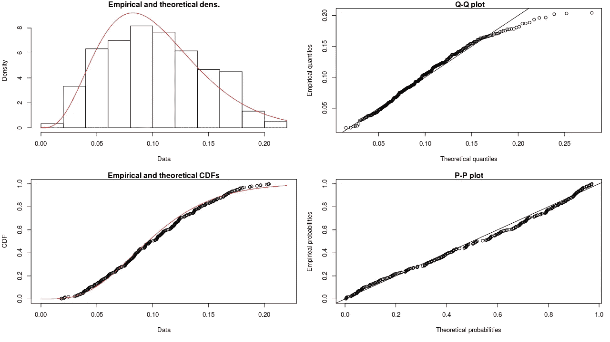
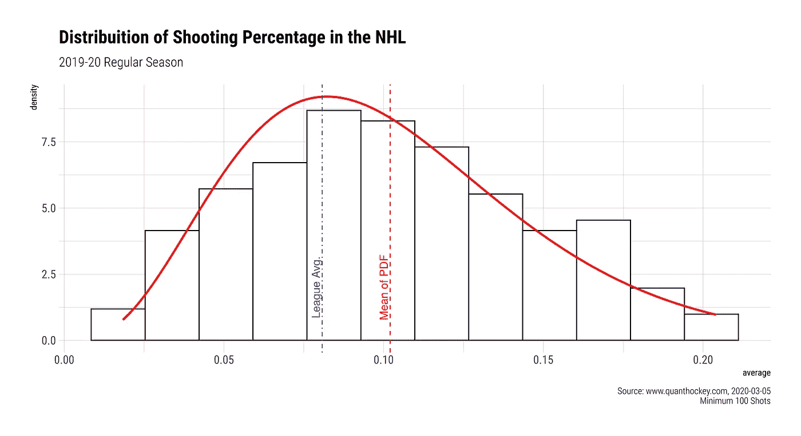
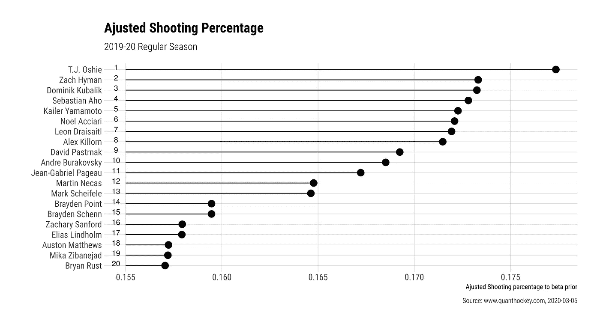
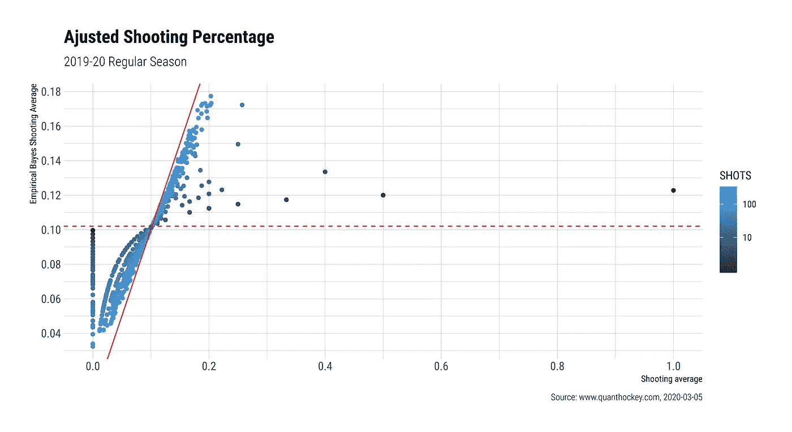

# 用经验贝叶斯估计确定最佳 NHL 射手

> 原文：<https://medium.com/analytics-vidhya/using-empirical-bayes-estimation-to-define-the-best-nhl-shooter-e6bda9361d58?source=collection_archive---------12----------------------->

## 2019-20 常规赛 NHL 球员的统计分析


格哈德·克劳斯在 [Unsplash](https://unsplash.com?utm_source=medium&utm_medium=referral) 上的照片

当我们开始分析成功率时，通常会遇到 1/1 和 0/1 的情况，即百分之百的成功或百分之零。随着 NHL 常规赛接近尾声，我问自己，谁是这个赛季的最佳射手。我知道大卫·帕斯特拉克在我写这篇文章的时候已经进了 48 个球，当我写完这篇文章的时候，他可能已经进了 2 个球，马修斯和奥韦奇金也是。但是，这些家伙通常有他们的线(一线)，并在游戏中发挥巨大的时间。肯定比任何队友都多。这是有道理的，更好的球员总是打得更多，在曲棍球，篮球，棒球等。带着这个问题，我开始寻找科学理论来作为我判断的基础，至少在我所知的科学没有偏见的地方，不要为布鲁因斯队欢呼，也不要为树叶队或帽子队欢呼。

在我的探索过程中，我看到了[这篇](http://varianceexplained.org/r/empirical_bayes_baseball/)大卫·罗宾逊写的关于经验贝叶斯估计的文章。谁描述了如何使用它来提高对每个球员在 MLB 击球率的期望。

# 数学背景

该方法在于找到一个符合真实数据的概率密度函数(PDF ),即给定 x₁、x₂、…、xₙ的值，有一个带有未知参数θ的函数 *f* ,它能够以最大的可能性给出 x₁、x₂、…、xₙ.的值

> 因为θ被假设为未知，我们也把 f 写成θ的函数。现在，由于 f *(* x₁，x₂，…，xₙ *|θ)* 表示当θ为参数的真值时，将观察到值 x₁，x₂，…，xₙ的可能性，因此似乎θ的合理估计值将是产生观察值的最大可能性的值。

一旦我们要用一个[贝塔分布](https://en.wikipedia.org/wiki/Beta_distribution)。所以θ~θ( *α，β* ) *。*所以这个想法很简单，用我们在这一季到目前为止的数据去寻找估计量 *α* 和 *β* 。最后，我们期望得到一个有序的球员名单，这些球员有更好的标准化投篮命中率。这个新的值列表也被称为*后验*密度函数，并且可以被定义为， *f(θ|* x₁，x₂，…，xₙ *，即*给定参数 *θ，*一个函数 *f* ，其具有产生x₁，x₂，…，xₙ.的最大可能性

这是目前联盟中最佳得分手的名单，要注意的是成功率或射门次数。好吧，统计数据告诉我们是的，但是在我们的内心深处，我们知道，它不是。为了调整这一点，我们将使用经验贝叶斯收缩对贝塔先验，这个名字看起来很花哨，但你会发现这很容易。首先，我们收集本赛季所有现役球员的数据。

首先，我们可以通过下面的方法得到本赛季的平均投篮命中率，并以 100 次投篮为阈值进行过滤，尽管这有点奇怪，但该方法必须能够计算出我们的 *α* 和 *β* 。另一种方法可以使用整个数据来拟合 PDF，但它们更复杂，我们坚持简单。

现在，使用 r 中的 **fitdistplus** 软件包，我们将拟合一个可以代表我们数据的密度函数，这次我们将使用 beta 分布。

```
fitpdf <- fitdistrplus::fitdist(career$average, “**beta**”, method = “**mle**”)
```

然后我们就只有 *α* 和 *β* 了。

关于 **fitdistplus** 的好处是，如果你绘制对象。它给出了一些其他的图，比如 Q-Q，P-P 和 CDF。



关注第一个图，我想指出两件事，一旦我们没有大量的数据，我们的 PDF 就不能完美地拟合。但是现在这是我们最好的选择。第二，我们将尝试将蓝色虚线“推向”红色虚线，也就是说，我们将在 PDF 的平均值方向上“缩小”这些值。



要做到这一点，我们只需用每个球员的数据更新 PDF 的整体先验*均值。我们已经有了球员数据，PDF 的含义有点复杂，我不打算在这里证明，你可以在这里看到。我们只接受 PDF 的期望值，定义为 E[θ|X₁，X₂，…，Xₙ] = ( *α /α+β)。*新的估计投篮命中率将由下式给出:*

```
SH% = (Goals + *α*)/ ( Shots *+ α + β*)
```

通过下面的代码，我们可以更新和提取 2019-20 常规赛 NHL 的最佳射手。

```
career_eb <- career %>% 
mutate(eb_average = (G + fitpdf$estimate[1]) / (SHOTS + fitpdf$estimate[1] + fitpdf$estimate[2]))
```

# 结果

应用上面的方法，我们可以重新排序射手的排名，看看平均发生了什么。需要注意的是，上面的列表中没有一个是图表。那些玩家被“缩小”到 PDF 的平均水平，离最佳结果很远。



现在我们可以看到“收缩”对真实数据的影响。虚线是 PDF 的均值，实线是 x = y，我们可以看到，出手次数多的球员接近连续线，均值没有变化。



这幅图清楚地表明，少数几个事件并不代表事件的平均数。我的意思是，如果你有几次运气好或者运气不好，并不意味着你会一直这样下去。你可以在 10 次投篮中得 5 分，在 7 次击球中击中 5 次，等等。但是所有的事件都趋向于向平均值移动。

# 结束语

经验贝叶斯估计是一种更精确方法的近似，但由于结果的简单性和准确性，它已被经常使用。在科学媒体中，它已被应用于工程、医学和生物领域。但是这种方法可以用于调整任何事件遵循[二项式分布](https://en.wikipedia.org/wiki/Binomial_distribution)的情况。

使用 R 中的**fitdistplus**包，编码被减少到几行，并且可以很容易地完成。最困难的部分是数据争论。

正如我们所看到的，即使是一个简单的方法也是获得一个好的估计的好方法，没有必要使用更复杂和更难实现的方法。

# 参考

1.  http://varianceexplained.org/r/empirical_bayes_baseball/,于 2020 年 5 月 3 日抵达 T4。
2.  工程师和科学家概率统计导论。**谢尔登·M·罗斯**，学术出版社，2014 年。

# 感谢

我要感谢 quanthockey.com[的家伙们提供的数据。](https://www.quanthockey.com/)