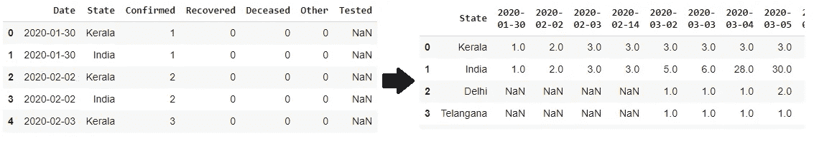
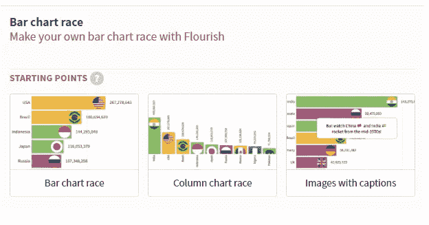
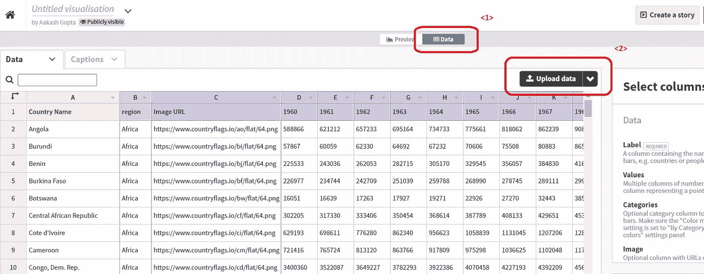
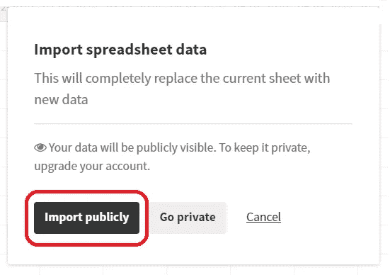
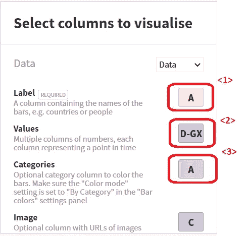
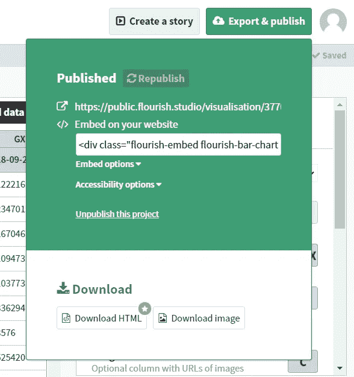

# 使用 fluorescent studio 创建条形图比赛

> 原文：<https://medium.com/analytics-vidhya/using-flourish-studio-to-create-bar-chart-races-44e25ba209e8?source=collection_archive---------21----------------------->

## 随着时间的推移观察新冠肺炎确诊病例

作为 Covid 印度特别工作组的一员(*一个志愿者团体*)，我们使用 Force 来可视化印度各邦的 Covid19 例增长情况。

在上面的视频中，我使用了无代码/低代码的方法来创建一个条形图比赛。条形图竞赛将一系列条形动画化，以直观显示数据值随时间的变化。

Instagram 上的原始帖子链接:

 [## 显示印度各邦 covid19 病例增长的竞赛图。。。。# Covid 19 印度#Covid…

### 编辑描述

www.instagram.com](https://www.instagram.com/p/CD_HiamH1bQ/) 

在以下步骤中，我们将了解它是如何实现的:

1.  了解源数据
2.  改变数据，使其与我们的可视化兼容
3.  上传到兴旺工作室
4.  想象条形图比赛

**来源数据**

在过去的 6 个月里，covid19india.org[的一群志愿者不知疲倦地跟踪疫情在全国的传播。](http://covid19india.org/)

我们将从他们的 api 端点提取数据，然后进行转换，这样我们就可以创建一个类似于视频中的条形图比赛。

数据可以从以下端点以 json 格式获得:

[https://api.covid19india.org/](https://api.covid19india.org/documentation/csv/)

或者可以从链接下载到 csv 文件:

[https://api.covid19india.org/documentation/csv/](https://api.covid19india.org/documentation/csv/)

**数据管理**

我们对这个特定的文件感兴趣:

[https://api.covid19india.org/csv/latest/states.csv](https://api.covid19india.org/csv/latest/states.csv)

> csv 文件具有长格式的确认、恢复和死亡人数的状态时间序列

我们将使用 *pandas 读取 *states.csv* 文件。*

使用 *pandas.unique()特性*我们获得了系列中唯一的日期&州名。这将用于在我们的最终数据集中创建行&列名。

信息是长格式的，需要转换成宽格式。宽格式适合创建条形图。

将长格式数据转换为宽格式

下一个要点是提供遍历整个数据集的代码(*一次一个州*)并将数据转置成一种更宽的形式。

一旦转换后，数据被导出到一个 csv 文件，可以上传到蓬勃发展工作室

**上传数据到兴盛工作室**

兴旺工作室有终身免费的选择。但是需要注意的是，可视化中的数据是公开的。

因此，一旦你登录到工作室，你开始一个“*新的可视化*，并从可用的模板中选择条形图比赛

条形图竞赛模板

工作室上传了样本数据，我们将用自己的数据集替换它。

将数据上传到模板

选择*数据*选项卡，点击*上传数据*

一个弹出窗口要求您接受条件- " *您的数据将公开可见。如果你想去私人网站，你需要订阅他们的付费版本。*

一旦我们用处理过的数据集替换了当前的工作表。我们为系列中的每个标签选择标签和值。

确保类别指向标签列，因为这将为我们提供更好的可视化效果。

现在可以保存和发布模板了

关于低代码或无代码方法是否有效，一直存在争议。

但是他们确实使访问民主化了。因为创建可视化和讲述美丽的数据故事不需要成为程序员。