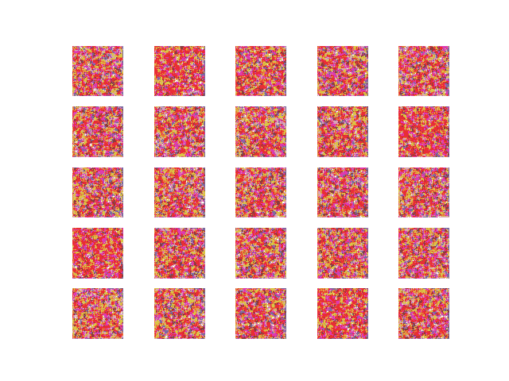
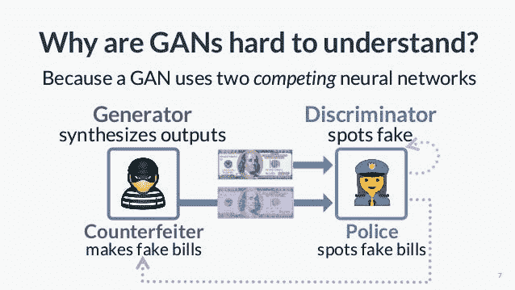
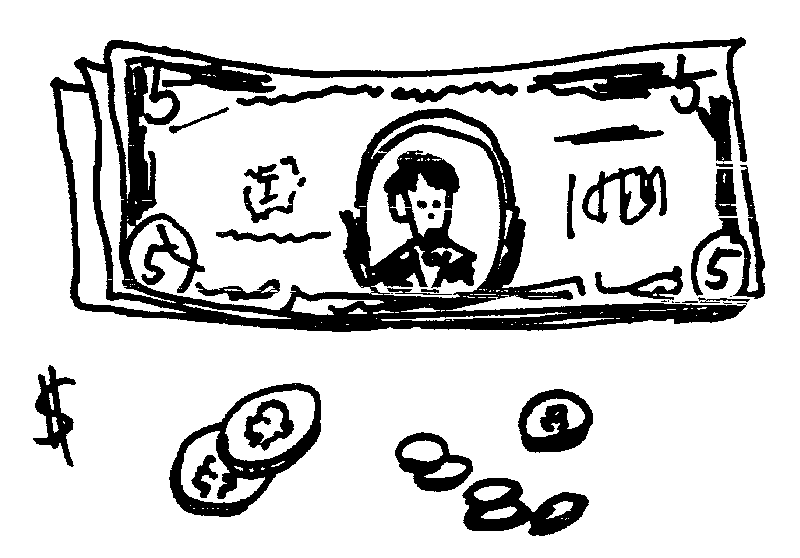
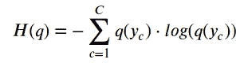
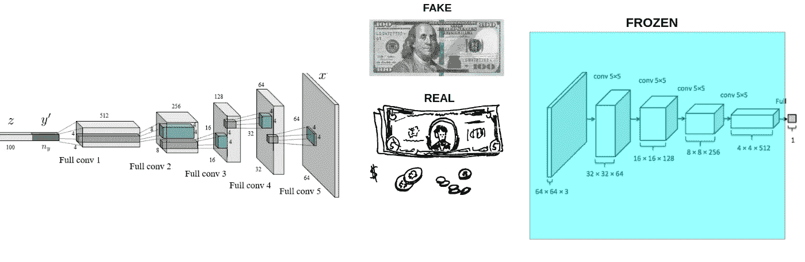
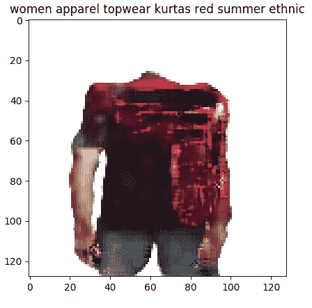
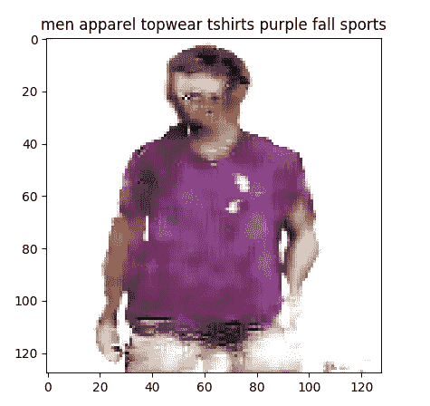
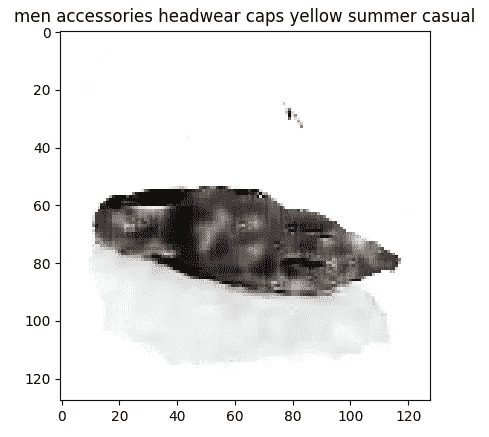
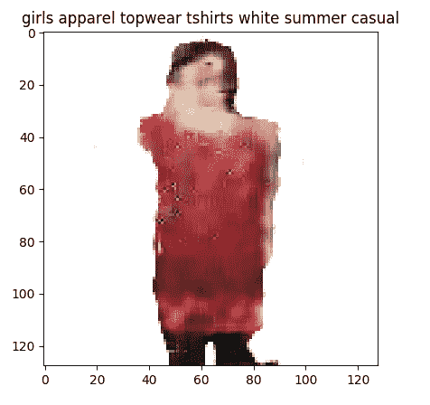
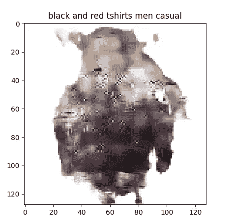

# 用甘做时尚

> 原文：<https://medium.com/analytics-vidhya/using-gan-for-fashion-6dc11012ac6a?source=collection_archive---------6----------------------->

如何用甘提升时尚产业？

甘是如何学习设计的

## 介绍

大家好！如果你打开这篇文章，很可能，你对这样的话题感兴趣:时尚，机器学习，深度学习，人工智能和定制。

如今，每个互联网或现实生活中的用户都想得到一个专门为他或她的需求而设计的产品。如何改善时装业，使其走向“完全定制”状态？其中一个想法是利用 GAN 的描述来生成服装。

那么，让我们开始吧！

## 内容

1.  介绍
2.  甘理解
3.  时尚的甘
4.  结论

## 甘理解

DCGAN 结构

上图是 DCGAN 或深度卷积生成对抗网络这类 GAN 的结构。

它是如何工作的？

首先，我们需要定义一个任务。我们的任务是通过**文本描述**来**生成**图像。这意味着我们将有一些编码的输入文本，我们将期待一个图像。你可能会想，为什么我们不使用转置卷积或某种带有修改输入形状的自动编码器呢？我们当然可以，想象力没有限制。但是我们的任务会复杂得多，因为我们需要计算输出图像和真实图像的损失(例如 MSE)。比理解 GAN 原理还难做。

简单点说吧。如何理解 GAN 架构和培养思路？

上图显示了一个与现实生活相似的例子。设想这样一种情况:有一个罪犯想制造质量非常好的假币，而有一个警察的目的是区分真钱和假币。在我们 90 年代的世界里，这是一种流行的想法。

那么，它们是如何相互作用的呢？我会让这个故事更接近 ML 的观点。我们一步一步来写吧。

**初步互动行动计划:**

1.  伪造者已经读取了一些材料(发生器输入噪声/编码指令)
2.  伪造者制造了一张假钞票(发电机输出)
3.  警官收到了这张钞票和一张真钞票的样品(鉴别器 2 输入)
4.  警察判定它是假的(鉴别器输出= 0)

这只是一次向前传球。如何让生成器和鉴别器更聪明？

例如伪造者制造了这个:)

首先我们需要**评估鉴别器**(警官)。官需要做两件事:知道真钱是什么样子的(真亏)，精通辨别假钱(假亏)。在我们的例子中，警官马克(或者可能是一些用于识别犯罪的每日奖金)将被计算为:(损失(真钱|警官决定)+损失(假钱|警官决定))* 1/2。

现在一些数学工作人员和我们将继续我们的故事。

我们将使用 **BCE 损失**(二元交叉熵)和下面一张图上的通用公式。

广义交叉熵

让我们想象一下，警察可能会告诉我们它是真的还是假的概率(0-100%或从 0 到 1)。而且官告诉我们:真钱:0.9 真 0.1 假(有地真 1 真 0 假)假钱 0.2 真 0.8 假(有地真 0 真 1 假)。现在我们来计算一下损失。

警官损失= 1/2 *(log 0.9 * 1-log 0.1 * 0)+(-log 0.2 * 0-log 0.8 * 1))= 1/2 *(0.04+0.09)= 0.065。

这是一种很好的损失！太好了，警官！

但是如何处理造假者呢？他/她还需要擅长制造假币(在现实生活中当然不是，但我们是数学家，为了更好的理解，可能会做任何类比)。在我们的案例中，我们甚至想让伪造者在制造假币方面做得更好！让我们帮助他/她！

我们将**告诉造假者警官的专业鉴定结果**(损失)并将**将警官的眼睛**闭上一段时间(鉴别器重量冻结)。

现在我们将学习伪造者(生成器)。我们**翻转标签**并使发生器**假数据为真数据**，我们将使用冻结的鉴别器为发生器工作！有点小把戏。

所以现在我们训练伪造者赚更多的钱。例如，伪造者的结果在下面的图片上。

发电机损耗= -log 0.1 * 1-log 0.9 * 0 = 1(这是一种巨大的损耗，我们将其告知发电机并更新其权重)。并且下一个动作重复前面描述的向前传递。

**训练的行动计划(隐喻):**

1.  评估警官了解真实金钱的能力(用真实数据评估真实损失)
2.  评估警官辨别假币的能力(用假数据伪造损失)
3.  计算官员评估中的中等误差(总损失为真实和虚假损失的一半)
4.  利用新的总体评估结果(整个模型的反向传播)提高官员和伪造者的知识
5.  关闭官员的眼睛(冻结鉴别器模式)
6.  让伪造者认为他/她通过使用“盲”官员的专业知识(翻转标签并计算发电机损耗 BCE 和更新发电机)来制造真钱
7.  睁开眼睛，警官！伪造者现在可以做更好的假钞了！(解冻鉴别器并再次向前传递)

回到机器学习。我们有兴趣让发电机变得更棒，对吗？我们不需要一个很酷的鉴别器作为我们的工作成果(在大多数情况下)。我们需要制造假数据！

现在让我们看看时尚的例子。

## 时尚的甘

结果看起来怎么样？

在上面的图像上显示了当训练的 GAN 具有作为文本的输入并且结果是图像时的例子。它是一种低质量的 128x128x3 图像的原型。

为了使这个项目成为现实，我们拍摄了 15 GB 的图片，每张图片都有相应的文字描述(性别、风格、颜色、描述等)。)

图像数据被修整成 128×128×3(RGB)图像，文本数据用 TFIDF 技术转换成 256 值向量。

在某些情况下，模特会猜测主要的想法，比如颜色或男/女/中性类型。一些新数据(文字描述)呢？

某种恐怖电影。我们看到黑色和红色，某种人类的立场(可能是人)，这就是一切。

GANs 对数据极度饥渴，慢慢在训练。精确生成器是一个缓慢的学习者，为了制作这个模型，它花了 72 小时与 GeForce GTX 1070 Ti 进行了 300000 个时期和 12000 张图像以及相应的文本捕获。

下一步做什么？DCGAN 有自己的极限。没有比 128x128x3 图片更好的效果了。模型需要更加复杂。

在这种情况下，最好使用 ProGAN 或渐进式增长的生成性对抗网络。在下一篇文章中。

## 结论

GAN 是一项很好的技术，可以让神经网络像人类一样“想象”，就像有人在想象中听到“蓝色牛仔裤”时出现某种图像，这不像数据库搜索，它总是一个创造和幻想的过程。

但是建筑必须非常复杂，才能制作出高分辨率的图像。例如，在 ProGAN 中，网络从没有意义的图像 4x4x3 逐步训练到具有高质量图像和深度意义的图像 1024x1024x3 (RGB)。

感谢您的阅读！我希望您在这篇文章中发现了一些有趣的东西，并且可能提高了您在 GANs 方面的知识，找到了新的开发思路。

致以最良好的祝愿，

机器学习工程师邦达伦科·k。