# 使用 GPU 提高 XGBoost 训练时间

> 原文：<https://medium.com/analytics-vidhya/using-gpu-to-boost-xgboost-training-time-533a114164d7?source=collection_archive---------0----------------------->

比尔·杰伦在 [Unsplash](https://unsplash.com?utm_source=medium&utm_medium=referral) 上的照片

自过去十年以来，产生的数据量增长速度超过了我们处理数据的能力，即使并行处理也可能无法在令人满意的时间内处理这些信息量。为此，越来越多的机器学习爱好者正在使用 GPU(图形处理单元)来训练预测模型，因为它可能会将处理时间减少到使用并行编程时的三分之一，正如我们将在本文中看到的那样。这是因为 GPU 由数百个执行数学运算的简单内核组成，而在多核处理器中，只有少量复杂的处理单元，因此在某些情况下处理时间会更长。

已经解释过，在本文中，我们将在 Google Colab 的环境中使用 GPU 运行时类型内核来创建 sklearn 的管道，该管道处理数据，基于 chi2 度量选择最佳功能，并训练一个 *XGBClassifier* 来预测 1994 年美国人口普查中的收入，并且，在建立了该管道之后，将训练执行时间与 sklearn 的 *GridSearchCV* 方法进行比较，以用于 CPU 和 GPU 处理。最后，我们将比较每次训练运行的模型的训练时间和性能。

## 建设管道

在构建管道之前，了解普查数据集的性质对于定义预处理步骤至关重要。在下图中，我们有关于导入的数据框的信息。

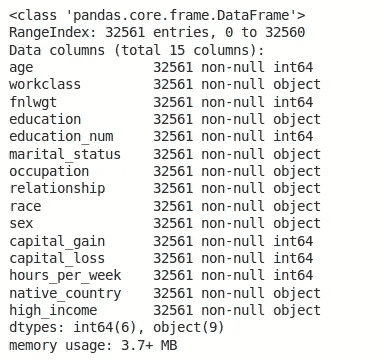

正如我们所看到的，表上总共有 32561 个条目，其中 9 个是类别特征的强候选项，6 个是数值特征的强候选项。在目前的工作中，我们将对分类特征进行标签编码，以保持列数较少，还因为除了“native_country”之外，没有任何具有高基数的特征，该特征具有高基数，并且将被设计为二元变量:美国或外国。此外，在数字特性中，我们将应用 sklearn 的 *MinMaxScaler* 来减少数据集那些列的方差。

预处理数据的下一步是选择在模型中使用的最佳特征。如上所述，为了实现这一点，我们将使用 *SelectKBest* 函数，它在我们的管道中接收两个参数:称为 chi2 的度量，它是两个变量之间的关联值，以及要选择的特性的数量，即被选择的“K”个最佳特性。这就结束了我们管道的预处理步骤。

我们管道的最后一部分是定义将要使用的预测器，在本例中是 *XGBClassifier* 。在目前的工作中，我们将使用 *XGBClassifier* 创建 3 个管道，该管道具有一个名为“tree_method”的参数，该参数定义了将在模型训练中使用的资源的数量和类型。因此，我们将在此参数上使用默认的“自动”、“gpu_hist”和“gpu_exact”值，比较计时结果以及测试数据的平均 AUC 分数。

管道如下:

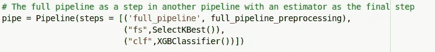

用于时序分析的基本管道。

第一步“full_pipeline”是分类预处理和数值预处理之间管道联合的结果(使用 *FeatureUnion* 方法)，如下图所示:

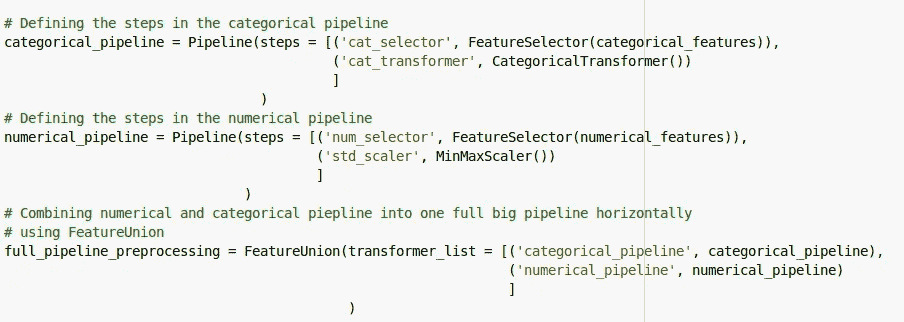

预处理整个管道。

在这个管道中，有两个类是为了方便这一步而编写的:一个是 *FeatureSelector* ，它只选择数据集的指定特性，无论是分类的还是数字的；另一个是 *CategoricalTransformer* 类，它通过标签编码和特性工程“workclass”和“native_country”变量来转换分类列。

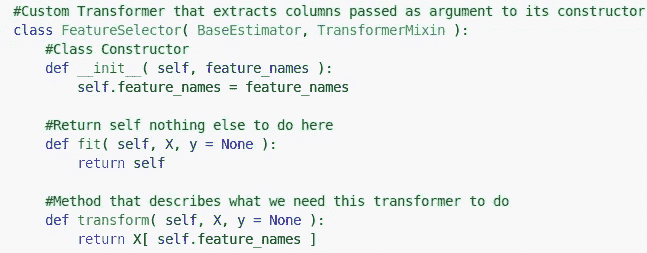

预处理管道上使用的 FeatureSelector 类。

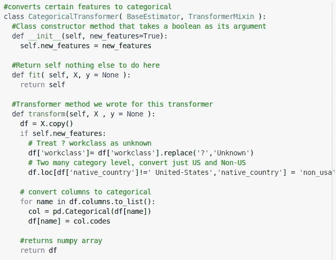

预处理管道上使用的 CategoricalTransformer。

最终，将有 3 个管道，一个用于 CPU 训练，另外两个用于 GPU 训练时间评估。

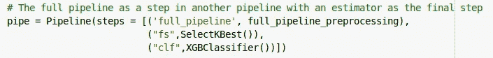

用于 CPU 时间评估的管道。

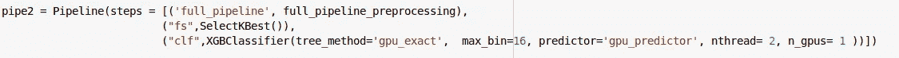

使用 tree_method="gpu_exact "进行 GPU 时间评估的流水线。

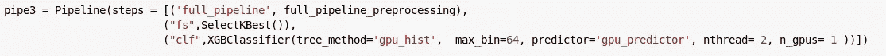

使用 tree_method="gpu_hist "进行 GPU 时间评估的流水线。

## 训练预测模型

构建了基本管道后，下一部分是构建一个训练方法，以找到更好地预测数据的模型。由于使用的是 XGBClassifier*XGBClassifier*，这是 sklearn 对 XGBoost 的改编，我们将在交叉验证中使用具有 5 个折叠的 *GridSearchCV* 方法。最后，三个测试中使用的搜索网格是相同的，可以在下图中看到。

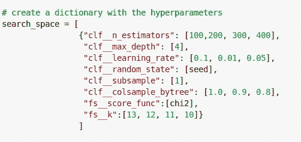

模型调整中使用的搜索空间。

此步骤中使用的 *GridSearchCV* 取决于我们使用 CPU 还是 GPU 的测试，通过将参数“n_jobs”定义为-1(使用 CPU 时)和 1(使用 GPU 时)来比较性能。

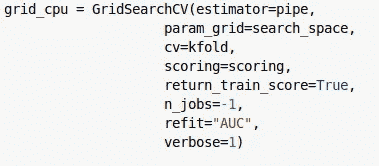

用于 CPU 计时分析的 GridSearchCV。

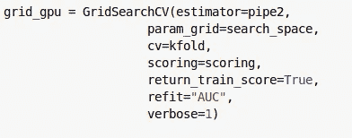

用于 GPU 时序分析的 GridSearchCV。

## 比较管道

在这一节中，我们将把执行时间和模型性能的结果与测试数据的 AUC 指标进行比较，并检查最佳模型的性能是否有差异。

我们要检查的第一个管道是“tree_method”参数设置为默认值并在 Google Colab 的 CPU 中并行化的管道，它是一个 2.3GHz 的英特尔至强双核处理器。训练时间可以在下图中看到。

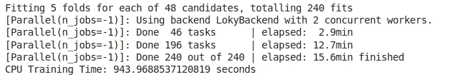

如我们所见，训练时间为 943.9 秒，在测试数据上，最佳性能模型的平均 AUC 分数为 0.925390。

在第二个管道中，我们将使用“gpu_hist”作为“tree_method”参数的值，以使用 XGBoost 的一种算法来训练模型，在这种情况下，它消耗的 Google Colab 的 GPU Tesla K80 的资源较少。由此产生的时间可以在下图中看到。

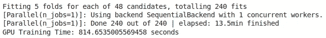

训练时间为 814.6 秒，测试数据的平均 AUC 得分为 0.924636。

最后，我们将在“tree_method”上使用“gpu_exact ”,尽管它已经停止使用，并检查对于这个特定的问题和数据集，它的性能是优于还是劣于“gpu_hist”方法。时间可以在下一张图中看到。

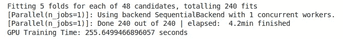

使用“gpu_exact”方法，我们获得了 255.6 秒的训练时间和 0.925151 的平均测试 AUC 分数，尽管我们使用了相同的参数和折叠数，但与以前的分数不同。这可能是由于 XGBoost 如何使用 GPU 方法对其树执行分割。

## 结论

正如我们所看到的，在两个 gpu 训练管道中，与 CPU 训练管道相比，训练时间显著减少，特别是在使用“gpu_exact”参数时，它比使用 CPU 的训练快 4 倍，而“gpu_hist”也比 CPU 训练执行得更好，尽管不如第一个 GPU 方法。

在我们讨论了所有这些之后，我们可以得出结论，在我们进行测试的这个问题上，使用 GPU 和 XGBoost 的分类器可以显著提高训练时间，特别是使用“gpu_exact”。虽然平均测试 AUC 在每个管道中得分不同，但最终结果彼此之间并没有明显的差异，因此我们可以假设，在训练 XGBoost 模型时，建议使用 Google Colab 的 GPU，因为它的得分与使用 CPU 一样高，但训练时间大大减少。