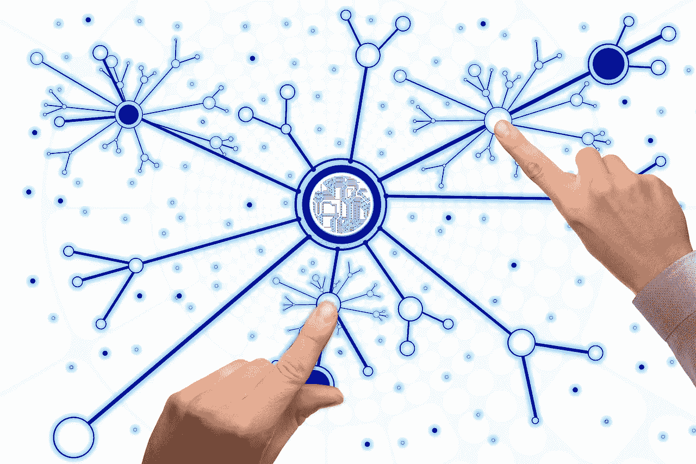
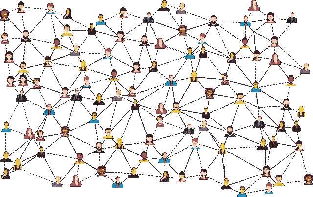
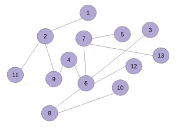
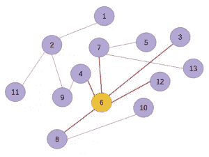
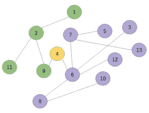
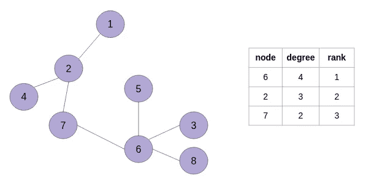
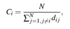

# 使用图表识别社交媒体影响者

> 原文：<https://medium.com/analytics-vidhya/using-graphs-to-identify-social-media-influencers-665e4f57ce3d?source=collection_archive---------10----------------------->

# 概观

*   了解如何使用图表来识别社交媒体影响者
*   我们将展示几种技术来识别这些社交媒体影响者，并为未来的用例绘制路线图

# 介绍

我被社交媒体的力量迷住了。一个看似默默无闻的人物突然拔地而起，拥有数千甚至数百万的追随者！社交媒体给普通人提供了一个与世界互动的巨大平台。

大多数企业(如果不是全部的话)都在使用社交媒体来营销他们的产品和服务。这包括运行付费广告，设计病毒式内容，或依靠其质量来获得在线追随者。

由此产生的一个更有趣的分支是利用社交媒体影响者来提升品牌知名度。在本文中，我将向您展示一些例子，说明如何利用这些社交媒体影响者来改变许多企业的游戏规则。

这让我思考——到底什么是社交媒体的影响者？我们如何正式定义它们？有没有办法利用我的图论知识来识别这些影响者？我们将在本文中回答所有这些问题以及更多问题！

请注意，我将交替使用术语“图形”和“网络”来表示社交网络。同样，术语“链接”、“连接”和“边缘”的意思是相同的。

# 目录

1.  谁是社交媒体的影响者？
2.  为什么识别影响者很重要？
3.  现实生活中的用例
4.  定位个人影响者
    —程度中心性
    —k-核心中心性
    —接近中心性
5.  识别多个影响因素
    —独立级联模型
    —线性阈值模型

# 谁是社交媒体的影响者？

当我们想到社交媒体上有影响力的人物时，脑海中会浮现出拥有数百万粉丝的人。巴拉克·奥巴马、唐纳德·特朗普、Lady Gaga、克里斯蒂亚诺·罗纳尔多等名人。挡住了世界上成千上万的人。

然而，事情开始发生变化。感谢 Twitter、YouTube、脸书、Reddit、Quora 等社交媒体平台的惊人崛起。，我们不需要成为名人就能成为社交媒体的影响者。如果你真的擅长某件事，并且人们因此而钦佩你，你就有资格成为社交媒体影响者。

例如，数据科学社区之外的人可能不认识下图中的人。但作为机器学习和计算机视觉领域的先驱，他是一个很大的影响者，他的名字是 Yann LeCun。

因此，社交媒体影响者是那些拥有忠实用户的个人，他们对自己的内容(如图片、博客、帖子、视频等)有很高的参与度。通常，这些有影响力的人被视为各自领域的专家，有很强的说服力，能够轻易说服他人。

# 为什么识别影响者很重要？

最近，发现社交媒体上的影响者变得越来越重要。随之而来的好处是惊人的。它对于病毒式营销、产品推广、行为采纳甚至分析流行病传播等任务都很有用。

对于一个小品牌来说，找到一个拥有成千上万忠实追随者的社交媒体影响者来推广他们的产品，比把广告预算花在广告牌或电视广告上要经济得多，也更有成效。

很容易找到一个受欢迎的非名人社交媒体用户，比如 YouTuber 上的 PewDiePie，或者 Instagram 上的顶级美食影响者杰米·奥利弗。但经常被忽略的事实是，有很多受众规模在 1000 到 10 万左右的社交媒体用户，在各自的领域取得了认可。即使他们的追随者不多，但他们可以集体影响大量人的行为和决策。

# 社交媒体影响者营销的真实案例

在这里，我列举了一些社交媒体影响者如何被广泛用于各种活动的最新例子。

*   潘婷与非裔美国人社交媒体影响者合作，推广他们的黄金系列系列:

*   可口可乐发起了一个 Instagram 影响力活动，有几个微影响者。他们设法创造了大约 8%的平均参与度:

*   一些有影响力的人也在利用他们的职位来提高对社会问题的认识。例如，迈克·谢尔巴科夫筹集了 52，800 美元为无家可归者建造房屋:

世界各地有很多类似的例子。我相信你在你的社交媒体圈子里也遇到过他们。

# 找到个人影响者

在社交网络中寻找有影响力的人最简单的方法是根据他们的影响力对他们进行排名。让我们更深入地了解一下这个“影响力”是什么，以及我们应该如何计算它。

让我们借助一张图表来理解它:

这个图有 13 个节点。假设每个节点代表一个个体，连接这些节点的边代表某种关系。这是一个社交网络的例子。

现在，哪个人对你来说很重要？

是节点 6 吗？它具有最大连接数(5)。它可以立即影响五个人:

或者是节点 4，因为到节点 9、2、1 和 11 的路由经过节点 4？如果这个节点消失了，那么它就把这个社交网络一分为二。因此，节点 4 可能会对图中的两个大集群产生影响，因为它的位置至关重要:

这两种方法都没有错。然而，在不同的设置下，其中一个可能会优于另一个。还有很多方法可以量化用户在社交网络中的重要性或影响力。

*如果你遇到“中心性”这个词，它本质上是一个图中节点重要性的度量。*

让我们看看一些常用的方法来衡量社交媒体用户的“影响力”。

## a)程度中心性

在图的上下文中，网络中节点的度是与它关联的边的数量。因此，我们可以使用该属性对社交网络的用户进行排名，从最有影响力的用户开始，排在最前面:

正如您在上面的示例网络中看到的，节点 6 是最有影响力的用户，其次是节点 2，然后是节点 7。

度中心性方法的优点是它易于实现并且高度可扩展，因为它需要可以忽略的计算资源。

不利的一面是，在现实世界的社交网络中，直接联系的数量可能不是一个可靠的指标。这种方法只考虑直接相连的近邻，而不是网络的整个结构。

## b)k-核心中心性

与度中心性方法不同，**k-core 中心性方法考虑了整个网络。**

在这种方法中，连接小于 **k** (一个阈值)的节点被从网络中移除。在移除这些节点之后，再次检查网络以查看是否存在具有少于 k 个连接的节点。如果是，那么它们也被删除。重复该过程，直到每个节点的度数等于或高于 **k** 。

剩余的节点被分配一个等于 k 的 k 核数。

k-core 方法的局限性在于，它最终会为许多节点分配相同的 k-core 编号。

## c)接近中心性

这种中心性度量考虑了网络中一个节点到所有其他节点的距离。我们可以通过下面的表达式来定义接近中心性:

*   其中 Ci 是节点 I 的接近中心性
*   n 是网络中节点的总数
*   dij 是节点 I 和节点 j 之间最短路径的长度

**接近中心性适用于那些目标是寻找或使用网络中最短路径的问题。**

除了上面讨论的那些，还有许多其他的中心性度量，例如**中间中心性**和**特征向量中心性**。如果你想更深入地研究这个话题，我鼓励你去看看它们。

# 找到多个影响者

在大规模的社交网络中，大量人群的集体行为会受到少数个人的影响。**让我们称这些个体为“超级传播者”**。超级扩频器的识别有助于控制整个网络或网络的大部分。

例如，在疾病传播的情况下，如果我们能够找到超级传播者，那么我们就有更大的机会控制疾病。这也有助于产品的病毒式营销——让超级传播者参与进来，让他们推广产品。

这个在网络中寻找超级传播者的问题正式称为**集体影响力最大化**。这似乎与识别个人影响者的问题相似，但这两个问题之间有很大的区别。

在集体影响力最大化中，我们在寻找那些可能不是最有影响力的用户，但他们集体对网络有很大的影响。

这不是一个简单的问题，它仍然是一个活跃的研究领域。在这里，让我们看看一些我们可以用来实现集体影响力最大化的方法。

## a)独立级联模型(ICM)

在独立级联模型中，预先为网络的每个边指定概率 *pi* 。一个节点以预定的概率独立地受到其相邻节点的影响。在此模型中，节点可以有两种状态—活动(受影响)和非活动状态(不受影响)。

假设我们正在跟踪在线社交网络中的信息流。所以在 ICM 下。我们的目标是确定能够产生最大影响的一组 k 个用户。ICM 中涉及的步骤如下:

*   在时间 t， ***k*** 节点有信息。换句话说，我们可以说这些节点被激活了。这些节点被称为种子节点
*   当任何节点 ***u*** 第一次被激活时，它有一次机会激活它的每个邻居 **v** 。成功取决于分配给连接 ***u*** 和 ***v*** 的边的概率 **puv** 。这发生在时间 **t+1**

## b)线性阈值模型(LTM)

在 LTM 下，一个节点的状态(是否受影响)由其邻居的状态共同决定。它与 ICM 的不同之处在于网络节点受影响的方式。网络中的每个节点被分配一个阈值 **θi** ，每个边被分配一个权重 **w (u，v)** 。类似于 ICM，k 个种子传播器最初具有信息。

在信息流中，只有入射到节点 *u* 上的边的权重之和大于或等于节点阈值 **θu** 时，节点 *u* 才会受到影响。

# 结束注释

这是关于如何使用图表识别社交媒体影响者的快速入门。正如我上面提到的，这是一个活跃的研究领域，我预计今年会有很多发展。

我在下面列出了一些参考资料，你可以用它们来更深入地研究这个主题。如果您有任何疑问或想分享您对本文的反馈，请随时联系我。

**随时联系我**[**【topmate.io/data_science】**](https://topmate.io/data_science)

# 参考

1.  利用网络设计最大限度地扩展级联(https://arxiv.org/pdf/1203.3514.pdf)
2.  通过社交网络最大限度地扩大影响力(https://www.cs.cornell.edu/home/kleinber/kdd03-inf.pdf)
3.  具有一级跃迁的级联过程中的有效集体影响最大化(https://arxiv.org/pdf/1606.02739.pdf)
4.  网络中心性:介绍(https://arxiv.org/pdf/1901.07901.pdf)
5.  Instagram 社交网络(https://arxiv.org/pdf/1901.05949.pdf)上品牌影响者匹配的机器学习技术
6.  使用关联规则学习发现社交媒体中有影响力的用户(https://arxiv.org/pdf/1604.08075.pdf)
7.  复杂网络中影响者识别的理论(https://arxiv.org/abs/1707.01594)
8.  社交媒体中的影响力和被动性(https://www . HPL . HP . com/research/SCL/papers/influence/influence . pdf)