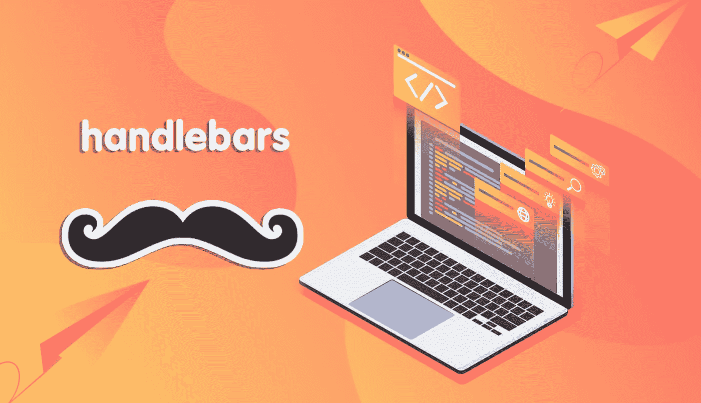
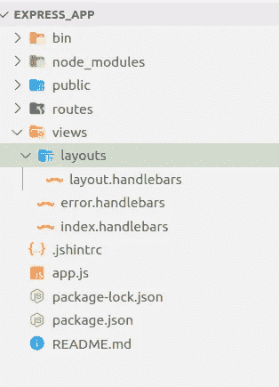
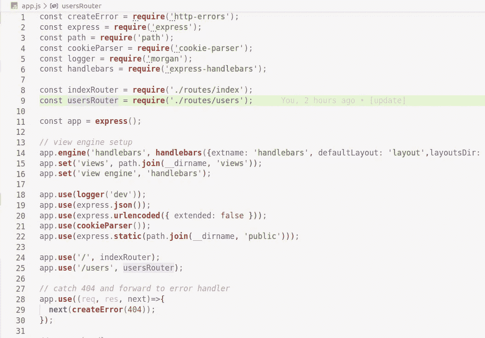
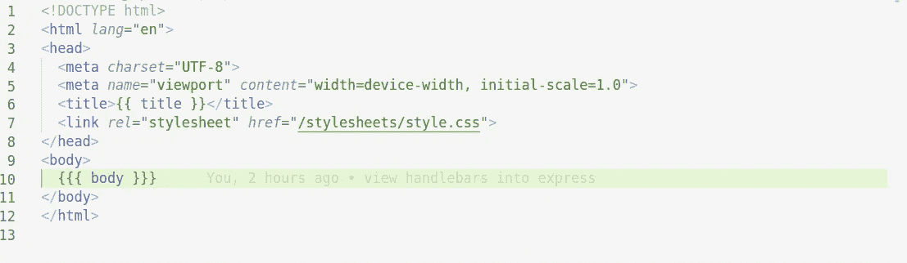
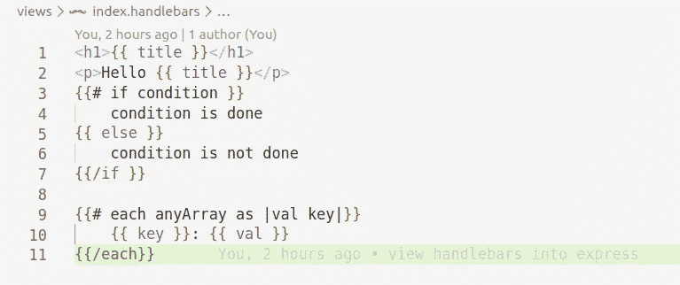
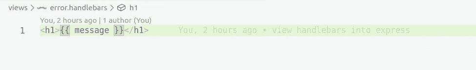

# 通过 Node.js 使用手柄

> 原文：<https://medium.com/analytics-vidhya/using-handlebars-with-node-js-35235f682f39?source=collection_archive---------5----------------------->



Handlebars 是一种简单的模板语言。

它使用模板和输入对象来生成 HTML 或其他文本格式。车把模板看起来像嵌入了车把表达式的常规文本。经过一番考虑，我选择了[](https://handlebarsjs.com/)**作为我的作品集的模板引擎。它小巧、功能强大，与 express 完美融合。**

```
<p>{{firstname}} {{lastname}}</p>
```

****网络模板**做了一些非常相似的事情。它使用一个**模板处理器**从信息源获取数据，通常是一个数据库和一个模板，一个内部带有某种参数的通用 HTML 文件。然后，处理器将数据和模板合并，生成一堆静态网页或动态生成 HTML。**

# **节点. js**

**[***node . js***](https://nodejs.org/en/)刚刚革新了 web 开发的世界。在其推出期间，震惊了全世界。今天，Node.js 被许多人认为是最酷的东西。Node.js 是一种不同的 web 开发方式。与编写应用程序并使用 web 服务器将代码传输到浏览器不同，应用程序和 web 服务器是一回事。**

# **热门竞争者**

**Node.js w/ express 支持很多 HTML 模板引擎。一些受欢迎的选择是:**

1.  **哈巴狗**
2.  **髭**
3.  **把手**
4.  **马尔科**
5.  **EJS**

# **装置**

**使用 npm 安装:**

```
$ npm install express-handlebars
```

# **使用**

**这个视图引擎使用了合理的默认值，利用了构建应用程序视图的“快速方式”。这使得在基本应用中使用变得很简单:**

# **基本用法**

****目录结构:****

****

**[https://github.com/JosueYenga/express_handlebars](https://github.com/JosueYenga/express_handlebars)**

****app.js:****

**创建一个超级简单的 Express 应用程序，它展示了使用这个包注册车把视图引擎的基本方法。**

****

****视图/布局/布局.把手:****

****

**让我们通过在命令提示符下键入以下命令来测试这一点:**

```
$ npm run start 
```

**如果一切正常，我们应该能够在控制台上看到“App listening port 3000”的消息，如果我们在浏览器中打开这个 URL“http://localhost:3000/”，我们应该能够看到一个漂亮闪亮的“Hello World！”在页面上。**

# **模板**

**在**视图/** 文件夹中，创建一个，索引*。手柄*和错误*。车把*有以下内容:**

********

# **摘要**

**在本文中，我们讨论了在 web 开发中使用模板。然后，我们放大使用 Node.js 和 Express，并引入 Handlebars.js. Handlebars.js 很酷，因为它允许您从布局中分离逻辑，您可以在服务器端(这是我们关注的地方)以及客户端使用它。此外，与其他模板处理器不同，您仍然可以在视图和布局中使用 HTML。**