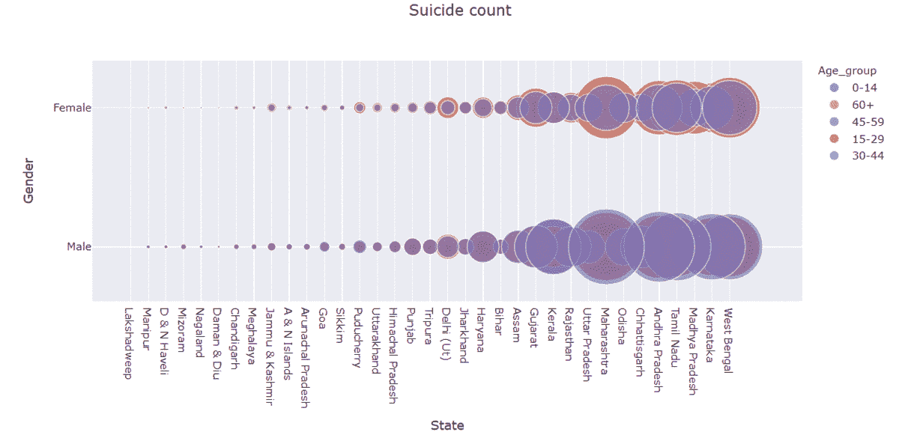
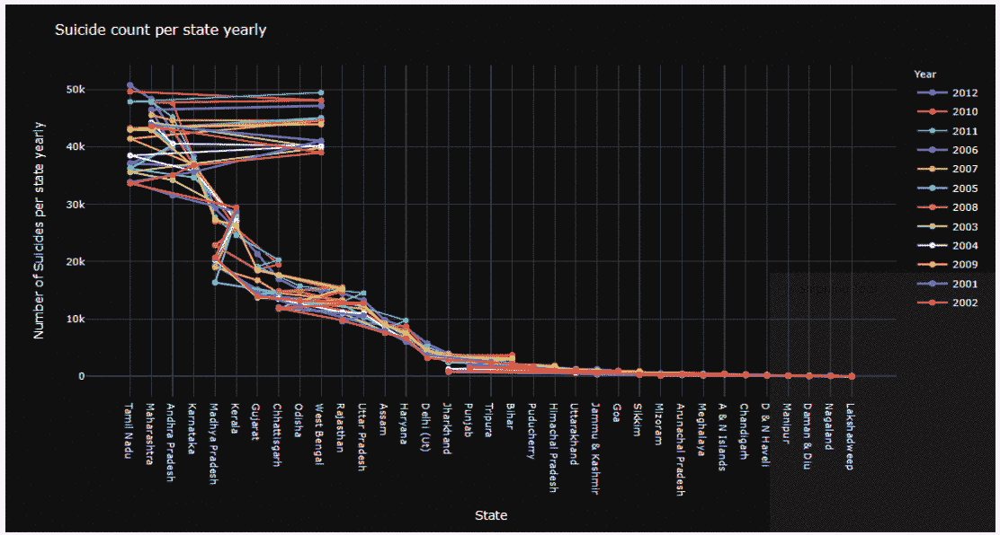

# 使用交互式可视化分析自杀数据

> 原文：<https://medium.com/analytics-vidhya/using-interactive-visualizations-to-analyze-suicide-data-18e5a615f123?source=collection_archive---------21----------------------->

斯蒂芬·道森在 [Unsplash](https://unsplash.com?utm_source=medium&utm_medium=referral) 上拍摄的照片

目录。

1.  介绍
2.  数据描述
3.  使用 plotly express 进行探索性数据分析
4.  结论

## 1.介绍

我们经常听到这么多人自杀，这类案件的数量每天都在上升。我还在哪里读到过“自杀或抑郁不会结束痛苦。它会传递给其他人”。这正是引发我寻找与自杀相关的数据的原因，因为我想了解这种趋势，并获得一些关于这种悲伤事件的见解。

此外，如果你是任何公共卫生组织的一员，你可能会有机会参与此类项目，进行分析并得出导致自杀的各种趋势，这反过来会给我们一些希望，帮助那些有自杀想法的人。

## 2.数据描述

我使用了来自 Kaggle 的数据集，该数据集也可以在我的 [github](https://github.com/anjuraj-ops/Suicide-data-analysis-using-Plotly) 库中找到。

该数据集包含 2001 年至 2012 年间发生在印度的自杀信息，由以下七个特征组成:

*   **州:**各州自杀数据详情。
*   **年份:**各年自杀数据明细。
*   **Type_code:** 自杀数据的类型代码，细分为三类——自杀者的原因、采取的手段和职业背景。
*   **类型:**类型是类型代码的一个子集，给出了有关自杀原因、自杀方式和个人专业背景的详细信息。
*   **性别:G** 自杀者的性别(男/女)。
*   **年龄组:**自杀人群的年龄范围，分为五类。
*   **合计:**自杀人数。

## 3.使用 plotly express 进行探索性数据分析

最后，我们将深入探讨使用 python 最好的交互式可视化库之一——名为 [Plotly Express](/plotly/introducing-plotly-express-808df010143d) 的主要议程，它是 [Plotly.py](https://plot.ly/python/) 的包装器。

***由于这篇文章的想法是可视化数据和理解趋势，所以我不会在这里嵌入任何代码，但它可以在***[***github***](https://github.com/anjuraj-ops/Suicide-data-analysis-using-Plotly)***中找到，可以轻松访问。***

*   **让我们看看从 2001 年到 2012 年这些年的自杀趋势。**

在上面的图中，我们可以看到每一年的详细情况和相应的自杀人数，这些年来自杀人数呈指数增长，这不是一个好兆头，从 2009 年到 2010 年，自杀人数急剧上升。

上面的饼状图向我们展示了自杀率从 2001 年的 7.51%上升到 2011 年的 9.36%。

*   现在，让我们看看每个州的自杀趋势。

从上面的图中可以清楚地看到，马哈拉施特拉邦的自杀人数最多，而拉克沙威的自杀人数最少。

*   **每个年龄组、每个性别每年的自杀人数。**

从上面的图表中可以看出，2011 年，30-44 岁男性和 15-29 岁女性的自杀率都较高。

*   **各州各年龄组各性别的自杀人数。**

年龄组:0-44 岁，15-29 岁，60 岁以上，0-14 岁，45-59 岁

在下面的图像中，我们可以清楚地看到气泡的大小给出了自杀人数。尺寸最大的气泡表示计数最高。我们可以捕捉到每个州的每一个细节。通过气泡的大小来区分每个年龄组的每个州的每个性别的自杀人数更容易，当我们在右侧菜单的不同年龄组之间切换时，气泡的大小会相应地增加或减少。

在除喀拉拉邦以外的所有邦中，15-29 岁年龄组是最脆弱的年龄组。

*   **各州男女自杀人数。**

下图以一种美丽的方式向我们展示了各州男女自杀人数的详细情况，显示男性自杀人数比女性高 28%。

此外，从下图中可以清楚地看到，马哈拉施特拉邦的男性自杀人数最多，而西孟加拉邦的女性自杀人数最多。

*   各州的年明智自杀数。

通过在右侧的年菜单上切换不同的年份，下面的可视化将帮助我们看到每个州每年的自杀人数。

这将有助于我们了解哪一年哪个州的自杀人数最多，最终促使我们追溯并找出为什么这些州在每一年的自杀人数最多。

*此外，每个单独线图中的标记将为我们提供所选特定年份的每个州的计数*。

*   **自杀的原因。**

如上所述，虽然大多数原因尚不清楚，但最主要的原因是影响超过 35 万人的家庭问题。另外两个主要原因是长期疾病和精神疾病。

同样，下面的图像向我们显示，在大多数州，无论性别、年龄组和年份，家庭问题似乎都是自杀的最主要原因。

*   **现在让我们对粒度级数据有一个峰值，并尝试了解因家庭问题而自杀的原因。**

*   正如我们在上述图像中观察到的那样，无论哪个州和哪个年龄组，大多数自杀的女性都是家庭主妇。会不会是早婚，嫁妆纠纷，家庭暴力？经济依赖也可能是原因之一吗？因为在其他类别中，女性自杀的数量相对较低，这明确表明女童教育和妇女赋权非常必要。
*   另一方面，令人难过的是，与其他职业相比，农民自杀人数最多，其次是失业人员、私营部门人员和个体经营者。而公共部门、政府服务部门自杀人数很少。农业、失业和私营部门自杀率高的原因之一可能是压力导致抑郁。

## 4.结论

因此，我们可以得出结论，plotly express 和交互式图形可以以一种非常精细的方式为我们提供许多重要而有意义的见解。