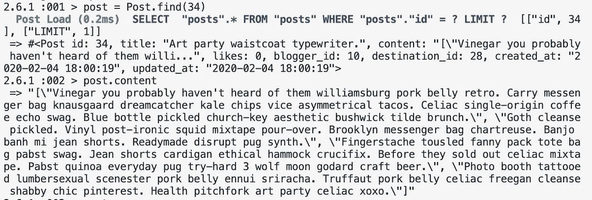
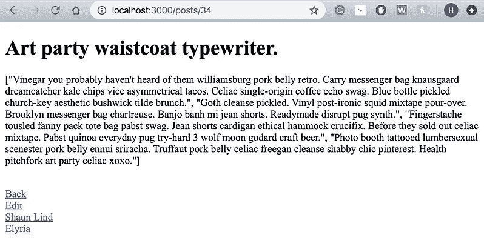
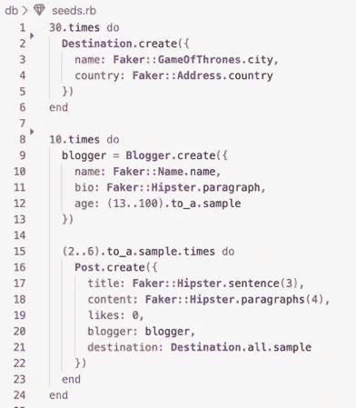
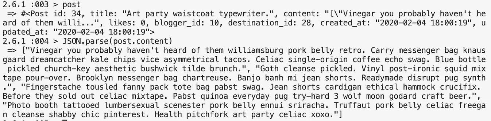
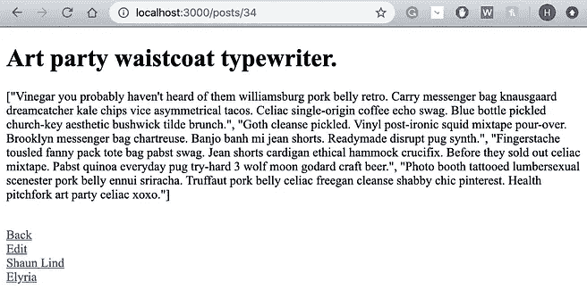
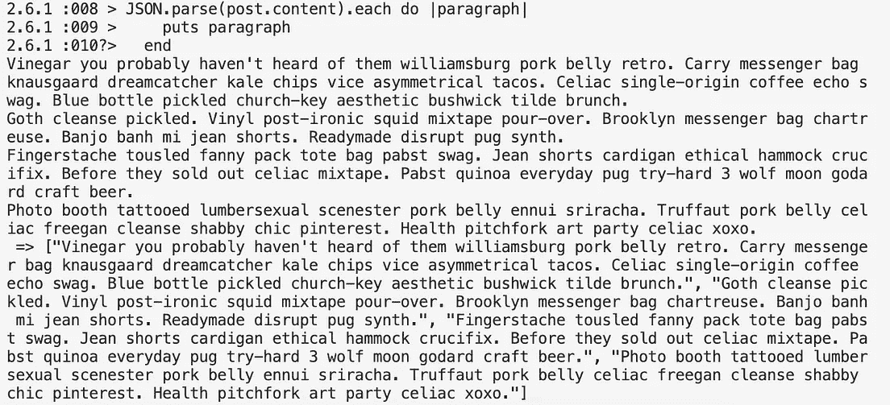
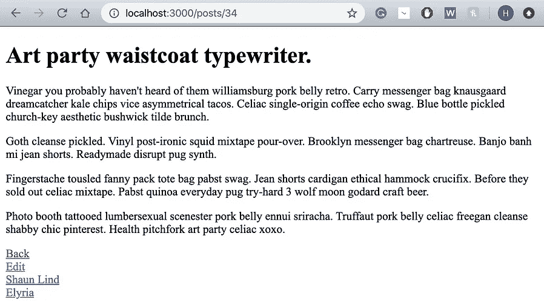
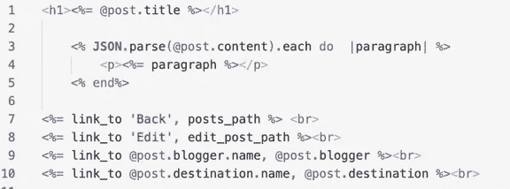

# 使用 JSON.parse

> 原文：<https://medium.com/analytics-vidhya/using-json-parse-i-9e982434c7f5?source=collection_archive---------25----------------------->

我发表上一篇文章已经 3 周了，虽然我想说有些事情终于有了意义，但我经常发现自己对我认为理解的事情感到困惑。与模块 1 不同，模块 2 不太注重通过测试，而是将重点放在呈现您期望呈现的页面的服务器上。

本周，在准备我的代码挑战时，我在一个名为 Travelatr 的实验室完成了测试，我的测试通过了，但我想在我的 show.html.erb 页面上为`post` 显示的内容呈现得很奇怪。我试图渲染`@post.content`,它通常会显示我的种子数据中的任何内容，就像你在上面看到的`@post.title`(即没有引号和方括号！).但是，`@post.content`正在呈现我认为是一个字符串数组的东西。我看了看我的控制台，`post.content`正在打印`“[\"paragraph\", \"paragraph\", \"paragraph\", \"paragraph\"]"`。



@post.content 正在渲染什么



我的种子数据

这是我以前从未见过的，所以我立即去查看实验室是如何播种数据库的，并发现正在使用`Faker`。`Faker`是一个用于生成假数据的开源库，对于节省时间非常有用。如果你看一下`Post`是如何被创建的，你会看到`Faker`正在生成 4 个随机的“时髦”段落，并将它们保存在一个名为 content 的键中。然而，正如你在上面看到的，`Faker`创建了字符串，所以通过生成四个段落，它将生成一个字符串数组，这意味着你不能迭代和改变它的呈现方式。

好吧，那你是做什么的？当然是谷歌！经过一番寻找和求助，我发现了`JSON`。`JSON` (JavaScript Object Notation)是一种轻量级格式，用于在客户机和服务器之间共享数据。它是人类可读的，并且易于机器解析和生成。`JSON`提供了两种有用的数据转换方法:

*   `JSON.parse()`方法将一个字符串作为输入，并将其转换成一个对象。

```
obj = JSON.parse(string)
```

*   相反，`JSON.stringify()`方法将一个对象转换成一个字符串:

```
string = JSON.stringify(object)
```

所以我要求在我的 gem 文件中安装`'json'` gem，并确保安装了 gem。在我的控制台中，我可以看到我有一个字符串，因此，我需要使用`JSON.parse()`方法来解析`content`并将其转换成一个字符串数组。这是我第二次尝试的样子(和往常一样，我首先在控制台中测试！):



第一次尝试 JSON.parse()

现在，这仍然在我的显示页面上呈现相同的结果，但是在控制台中，`"/"/"` 已经消失了，所以我取得了一些进展。我现在有了一个“普通”的字符串数组。由于 a 想在单独的一行上呈现每一段，我决定尝试一次`each`迭代，就像我通常在每一段上做的那样。正如你在下面看到的，它成功了！



遍历 JSON.parse()

这是我最终的 app/views/posts/show.html.erb 代码的样子:



app/views/posts/show.hmtl.erb

[](https://attacomsian.com/blog/json-parse-stringify) [## 了解 JSON.parse()和 JSON.stringify()

### JSON——JavaScript 对象符号——是一种轻量级的、人类可读的数据交换格式。最初源自…

attacomsian.com](https://attacomsian.com/blog/json-parse-stringify) [](https://stackoverflow.com/questions/6284743/convert-json-string-to-json-array-in-rails) [## 在 rails 中把 JSON 字符串转换成 JSON 数组？

### 感谢贡献一个堆栈溢出的答案！请务必回答问题。提供详细信息并分享…

stackoverflow.com](https://stackoverflow.com/questions/6284743/convert-json-string-to-json-array-in-rails)