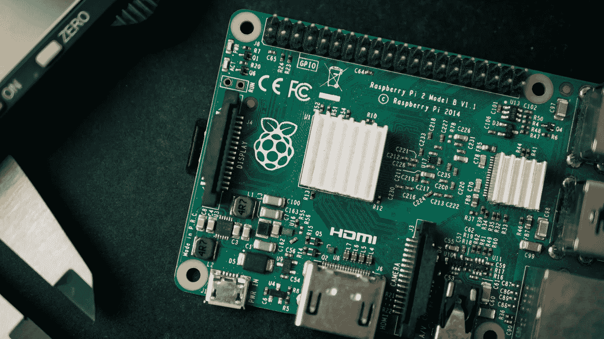
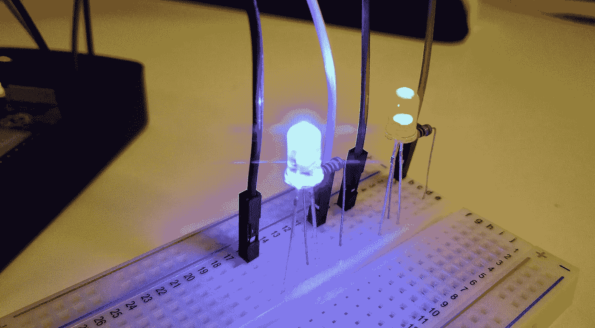
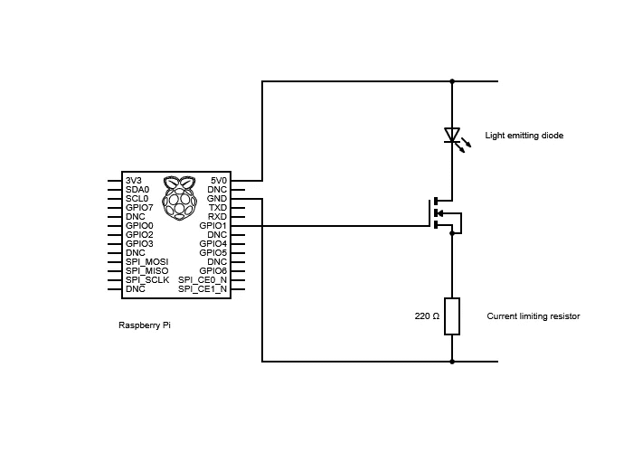
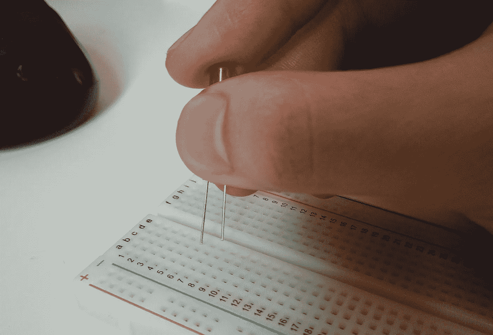
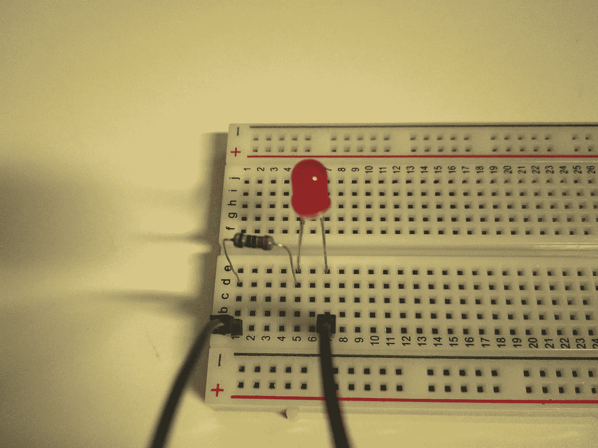
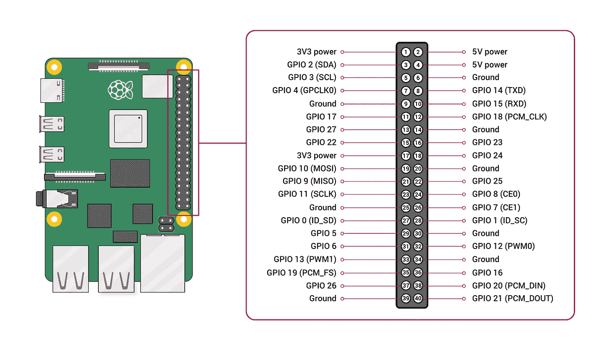
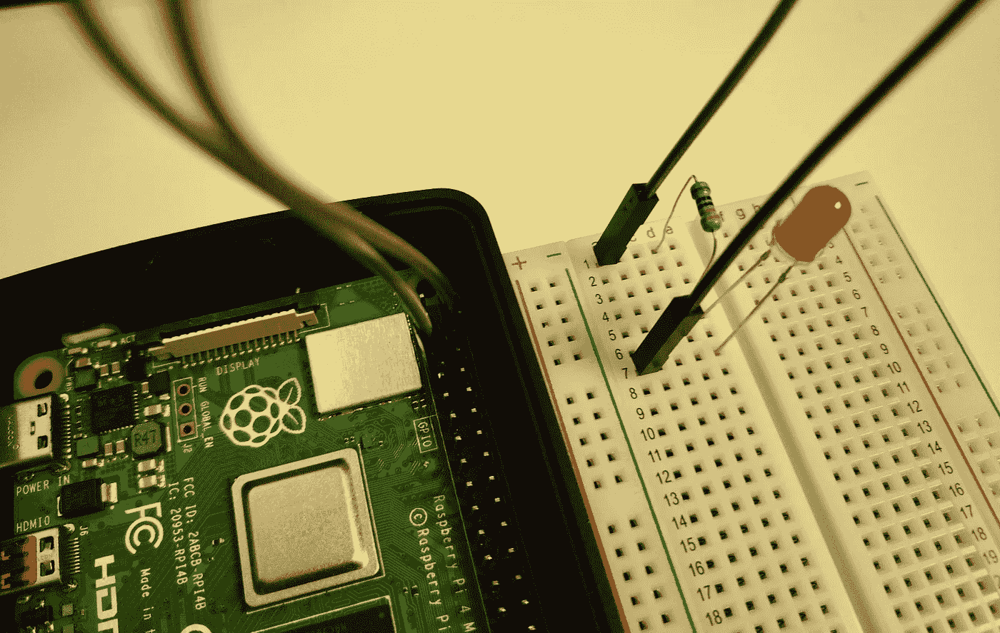
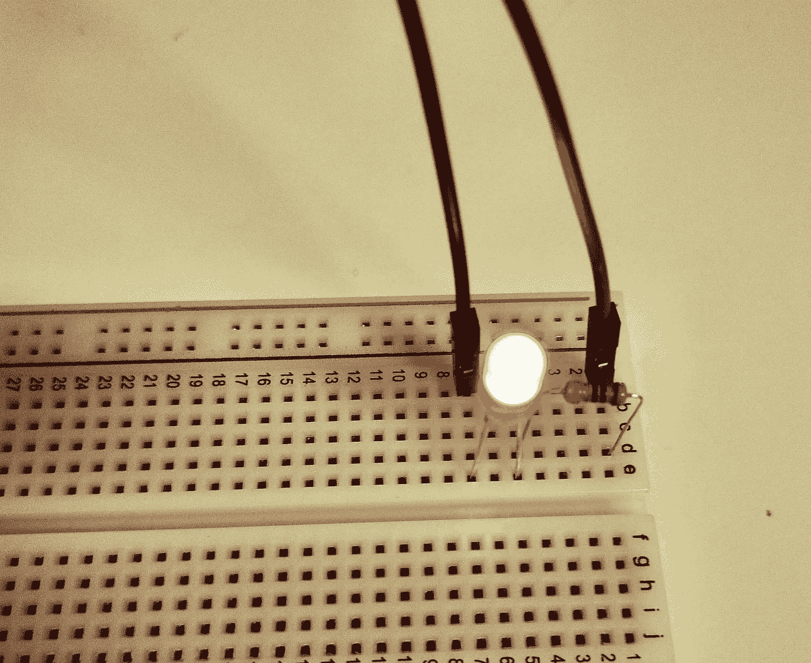
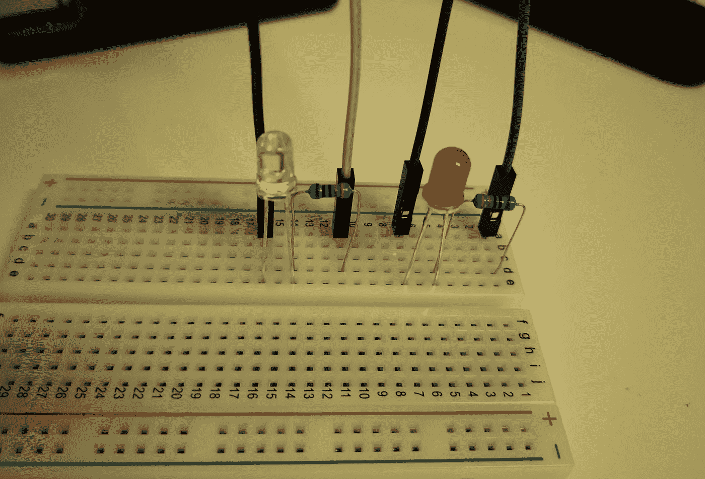

# 利用朱莉娅控制树莓皮上的发光二极管

> 原文：<https://medium.com/analytics-vidhya/using-julia-to-control-leds-on-a-raspberry-pi-b320be83e503?source=collection_archive---------6----------------------->



哈里森·布罗德本特在 [Unsplash](https://unsplash.com/s/photos/raspberry-pi?utm_source=unsplash&utm_medium=referral&utm_content=creditCopyText) 上的照片

你好。如果你正在读这篇文章，你可能想知道如何在树莓 Pi 上打开和关闭 led，不是大家都知道的常用 Python，而是 Julia。今天，我们将讨论如何通过板载 GPIO 控制物理对象。我们将首先做一个单个电路，一个 LED 闪烁，然后是两个电路，两个 LED 交替闪烁。



一个电路图，来自维基共享，CC BY-SA 下

# 第 1 章:安装 Julia 和 PiGPIO.jl

首先，拿起你的覆盆子酱。打开它并打开终端。一旦你在那里，键入以下内容:

```
sudo apt install julia
```

这应该会为您带来 1.0.3 版本，对于这种情况已经足够了。(我知道不是最新版本！)完成后，在终端中键入以下命令来启动 Julia 并安装我们今天将用来摆弄 led 的 PiGPIO 包！

```
julia
]add PiGPIO
```

一旦完成，点击删除按钮一次，离开 Pkg 模式。然后，键入以下命令退出 julia。

```
exit()
```

最后，键入以下命令，授予您管理权限，允许您控制 GPIO。

```
sudo pigpiod
```

然后，你就可以开始第二章了！

# 第 2 章:单回路

# 步骤 1:收集设备

恭喜你的树莓派安装好了！对于单回路，除了 Raspberry Pi 之外，您还需要以下设备:

*   1 个 LED
*   1 个 330ω电阻
*   1 块试验板
*   2 根公母跨接电缆

对于本实验，必须有一个约 330ω的电阻，因为我们需要限制通过电路的电流量。我们绝对不希望大电流破坏我们的电路和设备，不是吗？！

# 步骤 2:连接电路

现在，如果你仔细观察 LED，你可能会注意到它有两条腿，一条比另一条长。嗯，被称为“阳极”的长脚是正极，因此将连接到正电源，而被称为“阴极”的短脚将连接到地。

对于此电路，让正极朝向试验板顶部，负极朝向底部。现在，您可以插入 LED 灯，使灯腿位于不同的行上，较长(正极)的灯腿位于较短灯腿上方的一行上。



现在，将一个电阻放在一个位置，它的一个引脚与 LED 的顶部引脚在同一行，而它的另一个引脚位于上一行之上的任意一行。完成后，将两根跳线(阳端)插入与电阻器顶部引脚和 LED 底部引脚位于同一行的任何孔中。



现在，您可能想知道我们将跳线的另一端放在哪里？



该图显示了 CC BY-SA 下来自 raspberrypi.org 的 GPIO 端口

从上图可以看出，这里有很多 PGIO 端口。但是不要担心——我有你。此时，您的顶部跳线电缆应该是正极电缆，而您的底部电缆应该是组电缆。把你最上面的一个放在任何有“GPIO”的端口上。这里，我将使用端口 7 进行演示(其 GPIO 编号为 4)。至于底部电缆，你可以把它放在任何你喜欢的地方，只要上面写着“接地”就行。今天，我将为此使用端口 6。



现在您已经设置好了所有的组件，现在您可以进入第 3 部分了！

# 步骤 3:运行脚本

现在，打开文件管理器，并转到您想要存储文件的文件夹。然后，右击并选择选项`Create New...`，然后选择`Empty File`。命名为`led1.jl`，完成后点击`OK`。

然后，双击该文件将其打开，并将以下代码粘贴到其中。

```
using PiGPIO

pin = 4 #change this accordingly with your GPIO number
p=Pi()
set_mode(p, pin, PiGPIO.OUTPUT) #changed to OUTPUT mode so that we can control it
try 
    for i in 1:10 #how many times the loop is going to run
        PiGPIO.write(p, pin, PiGPIO.ON)
        sleep(0.5) #how long the LED is on each time
        PiGPIO.write(p, pin, PiGPIO.OFF)
        sleep(0.5) #how long the LED is off each time
    end
finally
    println("Cleaning up!")
    set_mode(p, pin, PiGPIO.INPUT) #changed it back to INPUT mode
end
```

务必记得用您选择的 GPIO 号更改 GPIO 号！完成后点击`Save`,现在你可以返回终端并键入以下内容。

```
julia <path to your file>/led1.jl
```

`julia /home/pi/Documents/led1.jl`

希望你会得到下面的结果！



现在你可以回到你的代码，改变你想要循环运行的次数或者每次循环的开/关时间，或者，如果你觉得勇敢，直接跳到第 3 章！

# 第 3 章:获取两条线路

恭喜你让电路运行起来！现在，让我们把它变得稍微复杂一点，最终目标是让两个 led 交替点亮。

# 步骤 1:收集设备(再次！)

这一次，你需要以下设备:

*   第 2 章以上的所有内容…
*   1 个额外的 LED(希望有不同的颜色！我今天将使用蓝色)
*   1 个额外的 330ω电阻
*   2 根额外的公母跨接电缆

# 步骤 2:连接电路

遵循第 1 章的相同说明，除了将 LED、电阻器和跳线电缆放置在完全不同的位置，同时保持与第 2 章相同的设置。请记住记下您的 GPIO 号，因为我们在编写脚本时会用到它！

这就是你的试验板现在应该的样子！



# 步骤 3:运行脚本

一旦您有了信心，现在就可以开始运行脚本了。该脚本本身与上一个非常相似，只是增加了一些内容。放心吧！

首先，打开文件管理器，并转到您想要存储文件的文件夹。然后，右击并选择选项`Create New...`，然后选择`Empty File`。命名为`led2.jl`，完成后点击`OK`。

然后，双击该文件将其打开，并将以下代码粘贴到其中。

```
using PiGPIO

pin1 = 4 #change these numbers accordingly with your GPIO numbers
pin2 = 17

p=Pi()

set_mode(p, pin1, PiGPIO.OUTPUT)
set_mode(p, pin2, PiGPIO.OUTPUT)

try 
    for i in 1:10 #how many times the loop is going to run
        PiGPIO.write(p, pin1, PiGPIO.ON)
        PiGPIO.write(p, pin2, PiGPIO.OFF)
        sleep(0.5) #the time pin1 is on and pin2 is off
        PiGPIO.write(p, pin1, PiGPIO.ON)
        PiGPIO.write(p, pin2, PiGPIO.OFF)
        sleep(0.5) #the time pin1 is off and pin2 is on
    end
finally
    println("Cleaning up!")
    set_mode(p, pin1, PiGPIO.INPUT)
    set_mode(p, pin2, PiGPIO.INPUT)
end
```

务必记得用您选择的 GPIO 号更改 GPIO 号！完成后点击`Save`,现在你可以返回终端并键入以下内容。

```
julia <path to your file>/led2.jl
```

例如`julia /home/pi/Documents/led2.jl`

希望你会得到下面的结果！(我的图像不是 gif，所以它不会显示他们交替闪烁，但你明白我的意思！)


现在你可以回到你的代码，改变你想要循环运行的次数或者每次循环的开/关时间，就像你在第二章所做的一样。再次祝贺你的 led 灯闪亮，感谢你的阅读！

【参考资料:
[https://www.raspberrypi.org/documentation/usage/gpio/](https://www.raspberrypi.org/documentation/usage/gpio/)
[https://www . instructables . com/id/Control-LED-Using-Raspberry-Pi-GPIO/](https://www.instructables.com/id/Control-LED-Using-Raspberry-Pi-GPIO/)
[https://github.com/JuliaBerry/PiGPIO.jl](https://github.com/JuliaBerry/PiGPIO.jl)