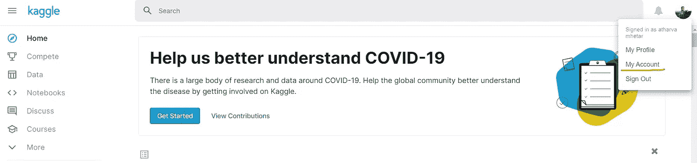
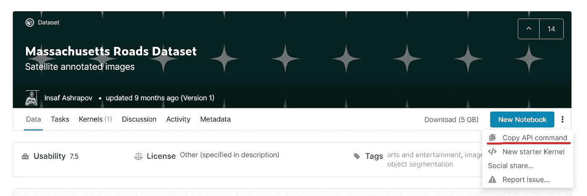

# 通过 Google Colab 使用 Kaggle 数据集

> 原文：<https://medium.com/analytics-vidhya/using-kaggle-datasets-with-google-colab-862feb079a04?source=collection_archive---------23----------------------->

我们都知道，谷歌一直在为我们的大多数问题提供最好的解决方案。一个这样的东西是谷歌 Colab 笔记本电脑。这些笔记本使用谷歌的云服务器，它们提供了一个 GPU 和 TPU 运行环境[所有这些都是免费的！感谢谷歌:))。所有的 ML，DL，AI 爱好者绝对应该尝试一下 Colab 笔记本。


# 我们开始吧

在深入研究之前，记得在 Kaggle 上注册。现在让我们开始吧。登录您的 Kaggle 帐户，在右上角您可以看到您的个人资料图标，进入下拉菜单中的**我的帐户**。



向下滚动到 API 部分可以看到一个**“创建新的 API 令牌”**选项。点击这里下载一个 **kaggle.json** 文件。如果你用文本编辑器打开这个文件，你会看到两个字段**“用户名”**和**“密钥”**。这是我们稍后将添加到 colab 笔记本中的文件。

# 转移到 Colab 笔记本

在**colab.research.google.com**开始一个新的笔记本。在菜单面板上，您将看到一个运行时选项，您可以在其中更改运行时类型，并决定是使用标准的、基于 GPU 的还是基于 TPU 的环境。默认情况下，colab 运行在标准环境中。

现在是时候安装 Kaggle 了。安装命令与 Jupyter 笔记本中使用的命令非常相似。运行以下命令:

```
!pip install kaggle
```

现在创建一个名为 kaggle 的文件夹，如下所示

```
!mkdir .kaggle
```

请注意。kaggle 将是一个隐藏的目录。要查看是否已成功创建，您可以使用**进行检查！ls -la** 命令。现在运行下面的代码。

```
import json
token = {"username":"**YOUR_USERNAME**","key":"**AUTHENTICATION_KEY**"}
with open('/content/.kaggle/kaggle.json','w') as file:
    json.dump(token,file)
```

token 中的用户名和密钥字段应该从我们之前下载的 kaggle.json 文件中复制。检查是否已经在我们的。kaggle 目录使用命令**！ls -la。kaggle/** 。接下来，我们需要在根目录下创建另一个目录。

```
!mkdir ~/.kaggle
```

接下来从。/content 目录下的 kaggle 文件夹。kaggle 文件夹，然后设置 path 变量。这可能看起来很乱，但它是一个非常简单的过程，如下所示。

```
!cp /content/.kaggle/kaggle.json ~/.kaggle/kaggle.json!kaggle config set -n path -v{/content}
```

在这个阶段之后，如果您从 colab notebooks 收到警告，它会建议您运行一个看起来像！ **chmod 600 /root/。kaggle/kaggle.json** 。现在你可以走了。

# Kaggle 数据集

现在，您可以使用以下命令轻松访问 kaggle 上的数据集列表

```
!kaggle datasets list -s massachusetts
```

如果只用**！kaggle datasets list** 命令将列出 kaggle 上所有可用的数据集。要搜索特定的数据集，您可以将 **-s** 标志与所需的搜索词一起添加到命令中，如上所示。例如，上面的命令将列出所有包含马萨诸塞州术语的数据集。

# **下载所需数据集**

登录 kaggle 帐户后，搜索所需的数据集并进入其页面。



点击右侧下拉菜单中的**复制 API 命令**选项。将此命令粘贴到 colab 笔记本的下一个单元格中。不要忘记使用**！**命令开始时的操作符。Add **-p/content** 告诉 colab 您希望下载数据集的确切路径。

```
!kaggle datasets download -d insaff/massachusetts-road-dataset -p/content
```

这就对了。现在，您获得了所需的数据和最佳的计算能力。利用手头的资源去尝试一些有趣的事情。

希望这篇文章对你有所帮助:)