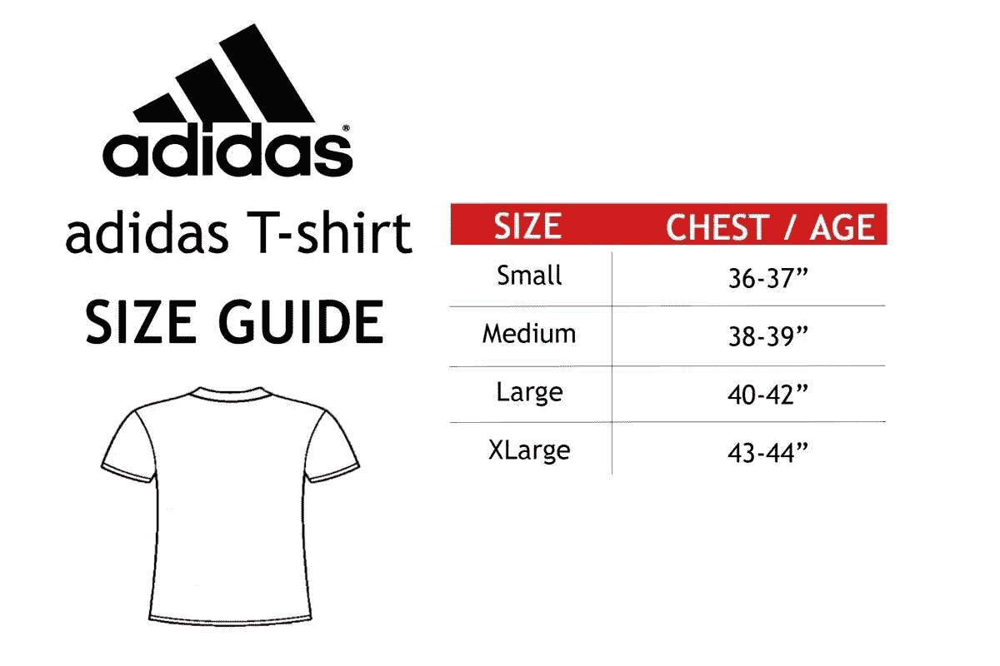
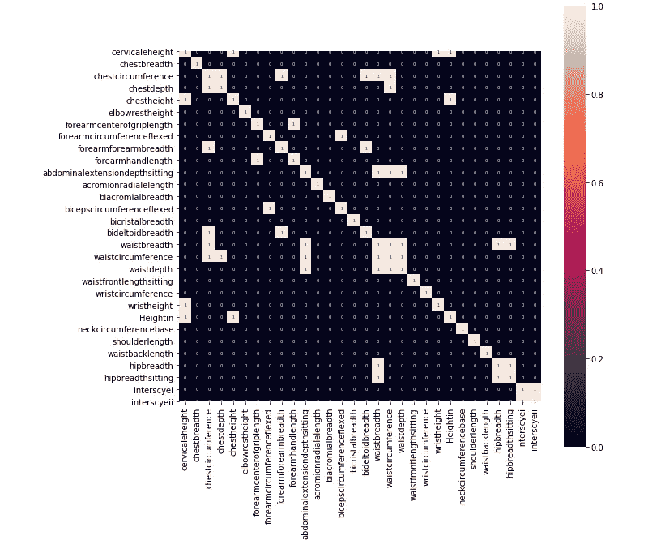
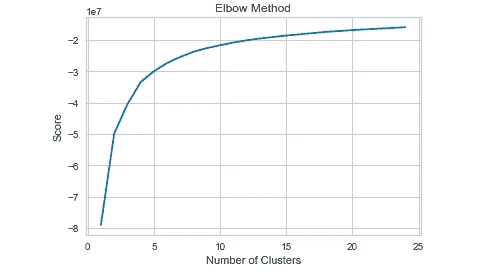
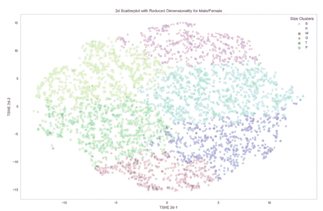
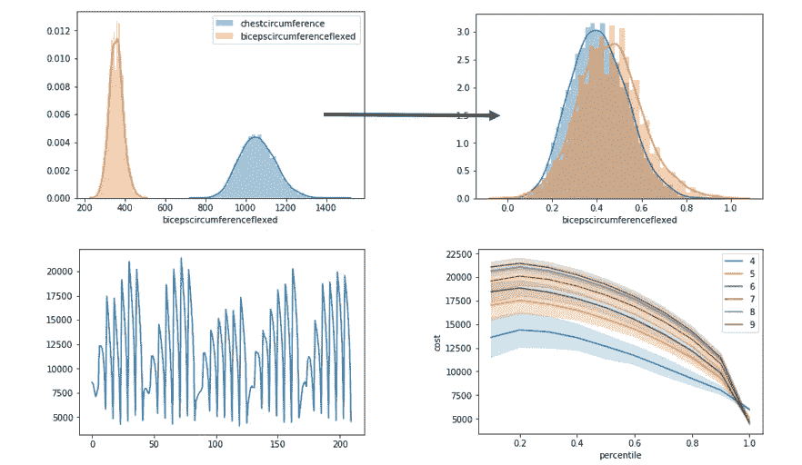
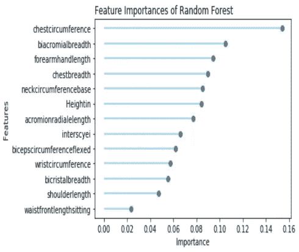
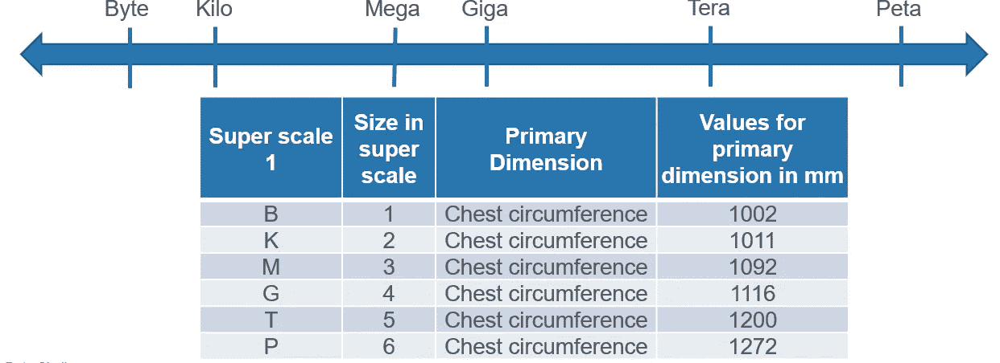
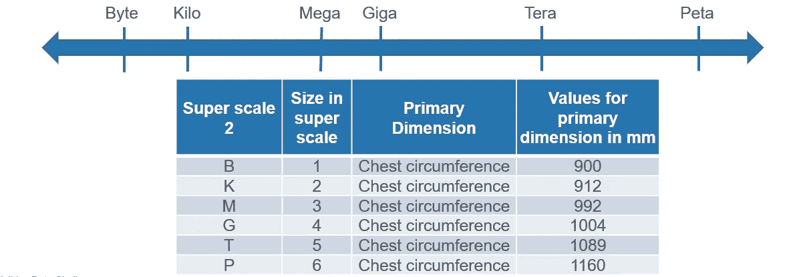

# 使用 Kmeans 聚类优化所有 t 恤尺寸的通用超级秤

> 原文：<https://medium.com/analytics-vidhya/using-kmeans-clustering-to-optimize-a-universal-super-scale-for-all-t-shirt-sizes-8df598b744e5?source=collection_archive---------9----------------------->

试图找到传统尺寸的替代品

你经常去商店买一件 t 恤，你很喜欢，但是商店里的“L”号不适合你。就在上周，你去附近的商店买了一个 L。服装尺寸是非常主观的，每个商店和每个国家都有自己的传统的小号、中号、大号和超大号的定义。印度的“L”可能与美国的“L”不同，这给普通消费者带来了问题。

这种分析提出了一种通用的超级秤，可以适用于所有国家的所有商店。你将会有一个适合你身体的尺码，这个尺码在任何地方都适用，无论是网上还是零售。问题来了，消费者如何知道哪一个是最适合他们的尺寸？对于零售店来说，用户可以在店里自己测量尺寸，得到完美的尺寸，但在网上环境中，目标是用尽可能少的信息为消费者提供快速准确的结果。为此，在分析结束时，只需定义一个需要测量的尺寸，消费者就可以得到他们的完美尺寸。

# 1.数据收集

用于此分析的数据集是 [ANSUR 2](http://mreed.umtri.umich.edu/mreed/downloads.html) 数据，这是一个公共数据集，来自 2012 年美国陆军人体测量调查。该数据集包含 2 个不同的文件——男性和女性。它包含了 4082 条男性记录和 1986 条女性记录，涉及 107 种不同的身体测量。

# 2.特征选择

从 107 个不同的特征中，通过人工检查元数据，选择了与胸部、腰部、肩部和手臂相关的 28 个测量值。在这些测量中，使用以下热图消除了高度相关的测量—

28 个特征的关联热图(阈值= 0.85)

为了最终的分析，特征的数量被缩小到 13 个。这些特征是—

1.  高度
2.  颈围基数
3.  肩长
4.  双肩峰宽度
5.  中间细胞
6.  肩峰径向长度
7.  前臂手长
8.  胸部宽度
9.  胸围
10.  二头肌圆周弯曲
11.  双嵴宽度
12.  腰部前长坐姿
13.  手腕周长

# 3.使聚集

这个问题是无监督机器学习的经典案例，Kmeans 算法用于在数据集中查找聚类。使用肘方法，集群的数量被固定为 6。

使用肘方法，群集被固定为 6 个

在确定了聚类数目之后，实现了 Kmeans 算法，并使用 t-SNE 在二维空间中可视化聚类

以二维方式可视化的集群

有六个不同的簇，因此有六个不同的大小范围。我们根据计算机的类比将这些大小分别命名为 B、K、M、G、T 和 P——字节、千字节、兆字节、千兆字节、太字节和千兆字节。分析的下一步是优化聚类，以从捕获聚类信息的聚类中找到准确的值，即如果必须创建一个标度，则聚类中的哪个值将放在标度上，即聚类中某个要素的平均值或该要素的中值。以下优化过程将提供答案—

# 4.最佳化

首先，对所有相关的度量进行标准化，并将每个记录分配给最接近和最大的拟合。成本函数由分配的适合度的测量值和人的测量值在所有变量上的差异来定义，并因尺码数量的增加而受到惩罚。在最后一张图中，使用不同拟合值(聚类分布的第 10-90 百分位)和聚类数的子样本进行了模拟。因此，它表明最佳的聚类数是 6，并且聚类中最重要特征的第 90 百分位值可用于绘制标度。

# 5.特征重要性

一旦聚类被分离并且最优值被确定，我们就试图找到代表整个聚类的最重要的特征。回到目标，在在线环境中，消费者需要提供尽可能少的信息，我们选择一个最重要的措施，这是从消费者的要求。在这个分析中，我们试图找到一个衡量标准。因此，在原始数据集中，通过添加表示它们所属的分类的列“label”来标记分类。将随机森林应用于数据集，以找到最重要的特征，并得到以下结果—

随机森林后的特征重要性

在这里，我们可以看到“胸围”是最重要的特征，其次是“肩宽”和“前臂长”。这符合直觉，对于一件合身的 t 恤来说，最重要的尺寸是胸部、肩膀和手臂的长度。我们选择“胸围”作为代表每个聚类的度量。

# 6.数学模型

因此，对于每个聚类，我们都有“胸围”值。如果

*X = [x1，x2，x3，x4，…，xn]* 表示聚类中“胸围”值的列表，

*Vindex = 0.9(N + 1)* 其中 N 是簇中元素的数量

因此，在超级标尺上的值，*V = X【Vindex】*

0.9 代表我们在优化部分找到的第 90 个百分点值。

# 7.结果

使用上述公式，从每个聚类中计算出超级标度的值，并为男性形成下表和标度——

男性通用超级秤

这里,“以毫米为单位的主要尺寸值”代表我们从每个聚类中找到的第 90 个百分位值，也以一维标度表示。并非所有的点都是平均分布的，这偏离了当前的小、中、大和 X-大模型。

使用相同的特征对女性进行了类似的分析，并形成了以下量表—

女性通用量表

在这里我们也看到了类似的规模形成。男性和女性有不同的身体尺寸，男性的尺寸也不同。

# 8.结论

结果部分显示，我们需要一个适合男性和女性体型的通用尺码。如果实现了这一点，消费者就可以更容易地去零售店和网上找到自己的尺码。这是全球唯一的尺码。

# 9.作者说明

感谢您阅读这篇文章。这是这个分析的 Github 库的链接—[https://github.com/sharad18/Adidas-Data-Challenge](https://github.com/sharad18/Adidas-Data-Challenge)