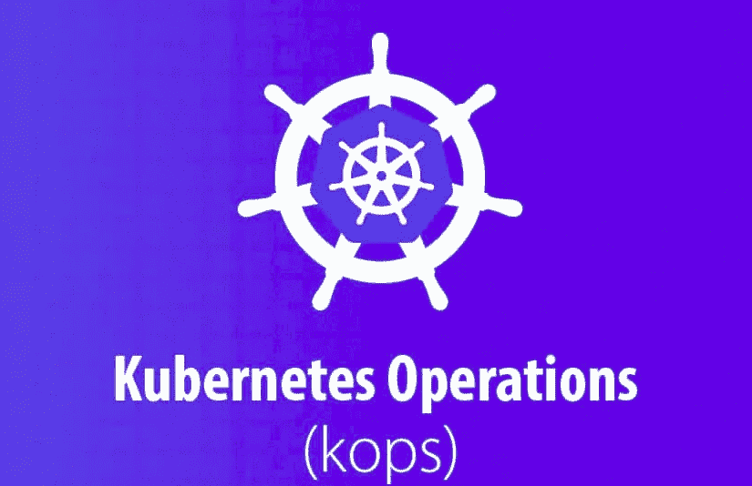
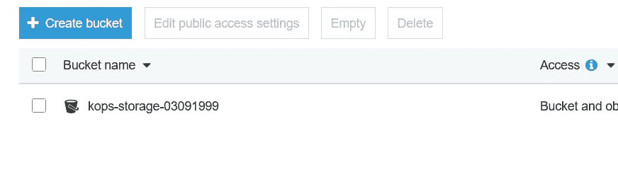
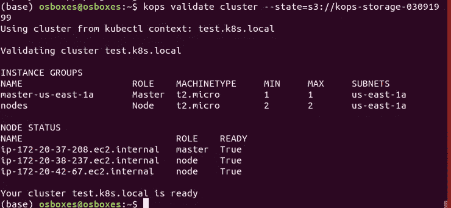
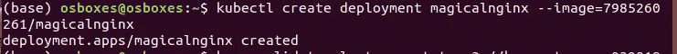
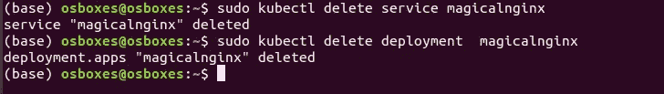

# 使用 Kops 建立 Kubernetes 集群

> 原文：<https://medium.com/analytics-vidhya/using-kops-to-setup-up-kubernetes-cluster-f83d83139f6a?source=collection_archive---------10----------------------->



# Kubernetes 和 Kops 概述

Kubernetes 是一个开源的容器编排平台。打包成 Docker 映像的应用程序可以在 Kubernetes 集群中轻松部署、扩展和管理。Kubernetes 的一些主要特征是:

*   自我修复
    失败的容器被重新启动，以确保应用程序的期望状态得到维护。如果集群中的一个节点失效，那么容器将在另一个节点上重新调度。不响应应用程序定义的健康检查的容器被终止，从而被重新调度。
*   水平缩放
    容器的数量可以根据 CPU 的使用情况自动缩放，或者使用命令手动缩放。
*   服务发现和负载平衡
    可以使用 DNS 名称将多个容器组合在一起进行发现。该服务可以通过集成到云提供商提供的本地 LB 来实现负载平衡。
*   应用程序升级和回滚
    应用程序可以升级到新版本，而不会影响现有版本。如果出现问题，Kubernetes 会回滚更改。

Kops 是 Kubernetes Operations 的缩写，是一套在云中安装、操作和删除 Kubernetes 集群的工具。也可以将旧版本的 Kubernetes 滚动升级到新版本。它还管理集群附加组件。创建集群后，通常的 [kubectl CLI](https://kubernetes.io/docs/user-guide/kubectl-overview/) 可以用来管理集群中的资源。

**在之前的** [**帖子**](/@sarthak3398/using-minikube-for-local-deplyment-of-single-node-kubernetes-cluster-25bb576d532b) **中，我使用 Minikube 在本地部署单节点 Kubernetes 集群，在这篇帖子中，我将在 AWS 上部署 N 节点集群。**

链接:[https://medium . com/@ sarthak 3398/using-minikube-for-local-deplyment-of-single-node-kubernetes-cluster-25bb 576d 532 b](/@sarthak3398/using-minikube-for-local-deplyment-of-single-node-kubernetes-cluster-25bb576d532b)

## 先决条件:

*   AWS-cli 设置
*   S3 水桶
*   必要的库

我附上了一个 [pdf](https://docs.google.com/document/d/1TkBfQaEfK9nlK0rvnq_X70BDzidSPeN__K8n6zzj-QE/edit?usp=sharing) ，我在其中添加了安装 docker、kubectl 和 kops 的所有命令。只有完成这一步后才能前进。

# AWS-cli 设置

1.  在 AWS 上创建一个帐户。
2.  转到**身份&访问管理** (IAM)，创建一个用户并生成一个访问密钥以在您的机器上配置 AWS。您需要向该 IAM 用户授予 AdministratorAccess 权限。
3.  打开命令行并配置 AWS

```
aws configure
```

4.提供您刚刚生成的**访问密钥**和**秘密**，以及您将要部署集群的区域。AWS 建议用户选择地理上靠近他们的地区，以减少延迟和成本。

对于那些正在使用 **AWS 教育初学者帐户。**进入 AWS 教育- >登录- > AWS 账户- > AWS 教育入门账户- >账户详情


```
gedit ~/.aws/credentials
```

删除凭证文件的内容，并将以下内容粘贴到凭证文件上


5.转到 **S3(简单存储服务)桶**，这是一个公共云存储资源，创建一个桶。



## **现在让我们使用 KOPS 在 AWS 上创建一个集群**

Kops CLI 可用于创建高可用性集群，其中多个主节点分布在多个可用性区域中。工人也可以分布在多个区域。在集群创建过程中，后台发生的一些任务包括:

*   设置 EC2 实例
*   设置 AWS 资源，如网络、自动扩展组、IAM 用户和安全组
*   安装 Kubernetes。

如您所见，没有实例正在运行


6.创建 AWS Kubernetes 集群

```
kops create cluster --yes --state=s3://kops-storage-03091999 --zones=us-east-1a --node-count=2 --node-size=t2.micro --master-size=t2.micro --name=test.k8s.local
```


当您运行该命令时，您将看到两个从节点和一个主节点开始旋转。您可以通过转到 AWS 服务中的 EC2 实例部分来验证它


7.您可以验证 Kubernetes 集群

```
kops validate cluster 
kops validate cluster -o json ##show output in json format
kops validate cluster -o yaml ##show output in yaml format
```



8.现在我们开始在 Kubernetes 集群上进行部署。我们正在 docker hub 上公开部署一个 [docker 镜像](https://hub.docker.com/repository/docker/7985260261/magicalnginx)

```
sudo kubectl create deployment <Deployment_Name> --image=<Image_Name>kubectl create deployment magicalnginx --image=anshuldevops/ magicalnginx
```



9.使用获取运行部署的信息

```
kubectl get deployments
```


10.kubectl 描述部署 magicalnginx


11.现在，我们将通过负载平衡器在互联网上公开 NGINX 容器。这个命令也有助于负载平衡。

```
 kubectl create service loadbalancer magicalnginx --tcp=80:80
```


现在，当您转到 AWS 服务中的 EC2 实例部分时，您将看到负载平衡器 1。这样，您的负载平衡器就启动了


12.要运行服务，请使用

```
kubectl get svc
```

该命令将给出可访问您的应用程序的 IP 和端口。转到浏览器，键入 IP 地址和端口号

Kubectl 命令:

*   要列出部署: **sudo kubectl 获取部署**
*   删除服务: **sudo kubectl 删除服务 magicalnginx**
*   删除一个特定的部署:**sudo ku bectl delete deployment magicalnginx**

