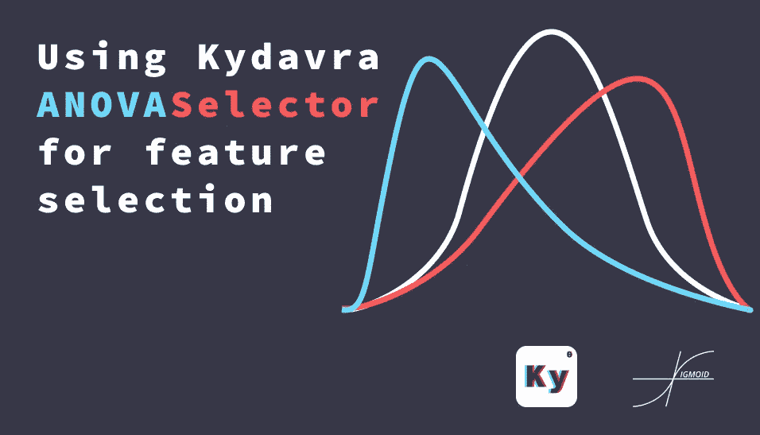

# 使用 Kydavra ANOVASelector 进行特征选择

> 原文：<https://medium.com/analytics-vidhya/using-kydavra-anovaselector-for-feature-selection-2db836318840?source=collection_archive---------13----------------------->

## 分类和回归一步到位。



由“Sigmoid”公共协会创建的图像。

很多时候，我们可以把分类看作是寻找两组之间差异的问题。在机器学习之前，统计学家做了很多。大多数情况下，他们使用均值、方差和标准差等指标。然而，这是一个费时的过程，很多小组都无法完成。还有著名的统计学家[](https://en.wikipedia.org/wiki/Ronald_Fisher)****罗纳德·艾尔默·费希尔爵士，他提出了一种叫做方差分析(ANOVA)的方法。然而，我们 Sigmoid 认为简单的事情可以更简单，所以我们增加了 ANOVASelector kydavra。****

## ****使用来自 Kydavra 库的 ANOVASelector。****

****对于那些主要是为了解决他们的问题的人，有命令和代码:
所以要安装 kydavra 只需在命令行中写下以下内容:****

```
**pip install kydavra**
```

****在你清理完数据后，意味着数值插补，外层消除和其他，你可以应用选择器。然而 ANOVASelector 可以支持分类和回归任务，因此将有 2 个不同的路径。ANOVASelector 也有两个论点:****

*   ******significance _ level**(*default*=*0.05*):用于使用 p 值选择特征的显著性水平。****
*   ******分类** ( *默认* = *真*):如果设置为真，ANOVASelector 适用于分类，如果设置为假，则成为回归选择器。****

## ****对于分类:****

```
**from kydavra import ANOVASelectoranova = ANOVASelector()selected_cols = anova.select(df, 'target')**
```

****如果我们将在[皮马印第安人糖尿病数据库](https://www.kaggle.com/uciml/pima-indians-diabetes-database)上测试 ANOVASelector 的结果，那么我们也将删除“皮肤厚度”列，并且，我们将在一些卡盘上获得更多的准确性。****

```
**before - [0.75539568 0.75362319 0.74637681 0.84057971 0.78985507]
after - [0.75539568 0.73188406 0.78985507 0.81884058 0.80434783]**
```

## ****对于回归:****

```
**from kydavra import ANOVASelectoranova = ANOVASelector(classification = False)selected_cols = anova.select(df, 'target')**
```

****如果我们在巴西房屋租赁数据集上测试 ANOVASelector 的结果，我们看不到算法的性能有任何提高。然而，它删除了“动物”一栏。此外，它减少了一点模型的 MSE。****

```
**before - 1.079789470573728
after - 1.0682555357780834**
```

# ****那么它是如何工作的呢？****

****基本上在这个选择器的引擎盖下使用的是在 ANOVA 测试中发现的 p 值。如果你想了解更多关于方差分析的信息，我强烈推荐这篇文章。****

****我在关于 Kydavra PValueSelector 的[文章里也解释过 p 值，强烈推荐你去看看。](/towards-artificial-intelligence/find-features-that-really-explains-your-data-with-kydavra-pvalueselector-dbb5a1eda783)****

********

****如果你尝试过 kydavra，我们邀请你填写这张[表格](https://vpapaluta.typeform.com/to/g1EXxlSf)，分享你的印象。****

****由乙状结肠❤制成。****

****有用的链接:****

*   ****[https://towards data science . com/ANOVA-analysis-of-variance-explained-b48 fee 6380 af](https://towardsdatascience.com/anova-analysis-of-variance-explained-b48fee6380af)****
*   ****[https://medium . com/forward-artificial-intelligence/find-features-that-really-explain-your-data with-kyd avra-pvalueselector-dbb 5a 1 EDA 783](/towards-artificial-intelligence/find-features-that-really-explains-your-data-with-kydavra-pvalueselector-dbb5a1eda783)****
*   ****[https://en.wikipedia.org/wiki/Analysis_of_variance](https://en.wikipedia.org/wiki/Analysis_of_variance)****