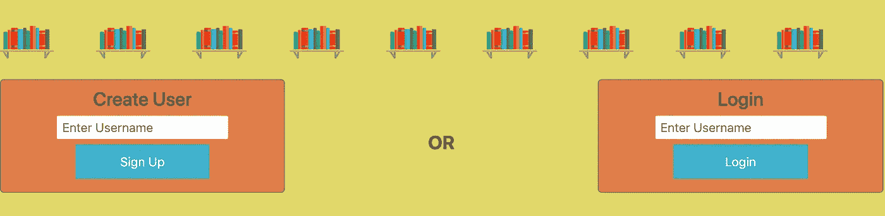
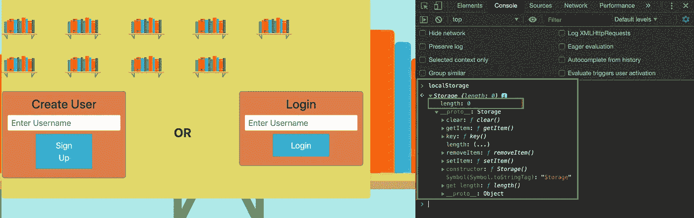
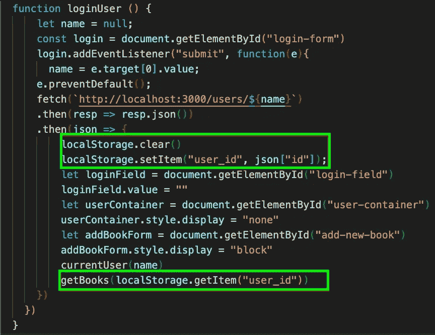
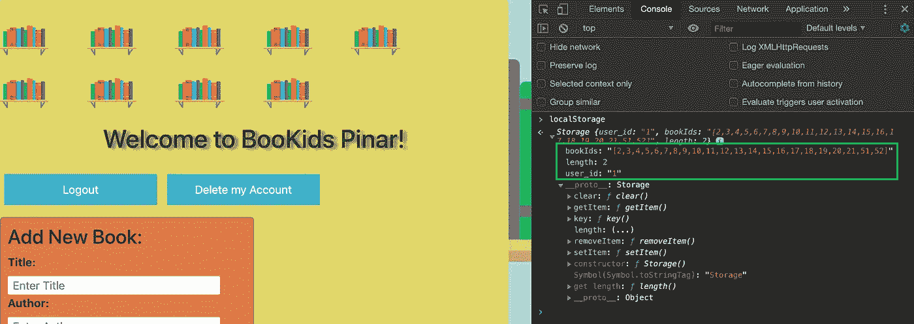
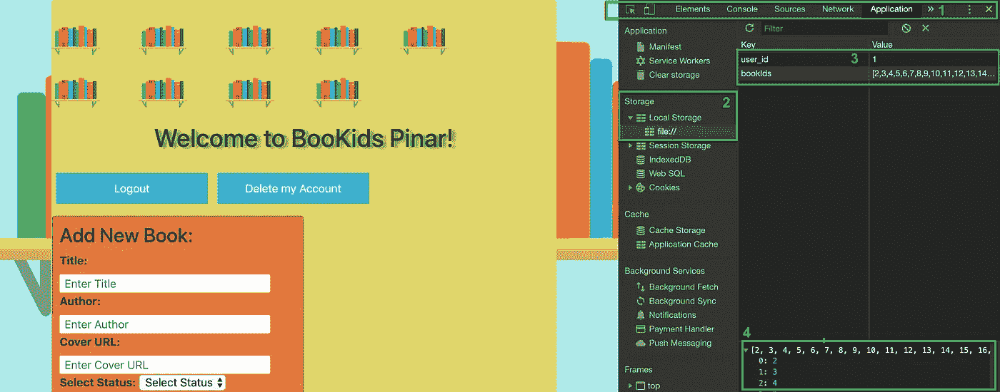
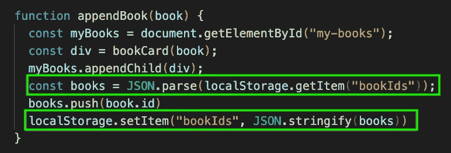
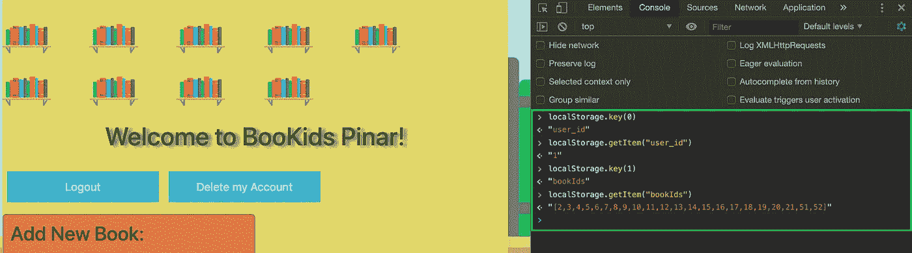

# 在 JavaScript 中使用本地存储

> 原文：<https://medium.com/analytics-vidhya/using-local-storage-in-javascript-5cced3fd888d?source=collection_archive---------15----------------------->

我们被要求开发一个单页应用程序(SPA)作为我们在新兵训练营的第三个项目。在这个项目中，我们被告知不要构建用户认证，因为我们还没有学习使用 JavaScript 进行认证。会话存储和本地存储是在用户浏览器中本地存储数据的两种主要方法，由于密码的限制，我决定使用本地存储。

我的应用程序有一个用户模型，我实现了“注册”和“登录”功能，只有用户名字段，没有密码字段。我的设计看起来是这样的:

请注意，它不要求用户输入密码。

`localStorage` object 是一种在 web 浏览器中本地存储信息的键/值对的方法。它允许我们存储没有过期的数据，而会话存储只存储一个会话的数据。这意味着即使在用户刷新页面或关闭浏览器后，数据仍然存在。

在我的应用程序中，我使用了`localStorage`来存储用户和书籍的 id。让我们在 JavaScript 控制台中键入`localStorage`,在任何用户登录之前检查我们当前在本地存储中有什么:

键入`localStorage`或“console.log(localStorage)”将显示控制台中存储对象的详细信息。

如您所见，存储项目的数量(`length`)为“0”，如果您展开“`proto`”，您可以很容易地找到该存储对象中提供的方法:

1.  setItem(键，值)
2.  getItem(键)
3.  removeItem(键)
4.  清除()
5.  关键字(索引)

我在项目中使用了下面列出的三种方法来创建、读取和删除用户 id 和图书 id:

如果我们在控制台中再次测试`localStorage`，我们可以在用户登录后找到分配的键和值:

注意，存储对象的长度从零变为二；user_id 和 bookId。

访问`localStorage`的另一种方法是打开**开发者工具**，点击**应用**选项卡，然后在**存储**部分展开**本地存储**以查看浏览器的本地存储内容:

开发者工具->应用->存储->本地存储

可用方法:

1.  `localStorage.setItem(“key”, “value”)`:需要两个参数；键和值对，用于存储与键关联的值。数据必须以普通的字符串形式存储，这意味着我们需要将对象字符串化，然后将其存储在`localStorage`中:

JSON.stringify()将数据数组转换为字符串，JSON.parse()将`localStorage`内容转换回对象。

2.`localStorage.getItem(“key”)`:当我们传入 key 时，它允许我们访问存储在`localStorage`中的数据(值)，这是唯一需要的参数。

3.`localStorage.removeItem(“key”)`:该方法在接收到一个密钥时，从存储器中删除该密钥及其值。

4.`localStorage.clear()`:您不需要传递任何参数，这个方法会删除所有内容，并清空本地存储中的整个键/值对。

5.`localStorage.key(“index”)`:检索给定位置的按键名称。

您可以使用提供的方法轻松访问存储的键和值。

只读的`localStorage`是一个 web 存储对象，它允许我们在浏览器中将键/值对存储为字符串。存储的数据不会过期，并且在具有相同来源的所有选项卡和窗口之间共享。对数据保护和存储容量的限制、同步以及只允许存储字符串数据可以被列为使用`localStorage`的一些限制。虽然有一些限制，但它提供了我的应用程序跟踪用户和图书 id 所需的一切。我希望您现在可以轻松地将本地存储集成到您的应用程序中。

请随意访问 [W3Schools](https://www.w3schools.com/jsref/prop_win_localstorage.asp) 、 [MDN](https://developer.mozilla.org/en-US/docs/Web/API/Window/localStorage) 、 [Javascript.info](https://javascript.info/localstorage) 和 [dcode](https://www.youtube.com/watch?v=k8yJCeuP6I8) 来了解关于这个主题的更多信息。