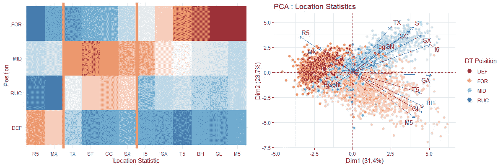
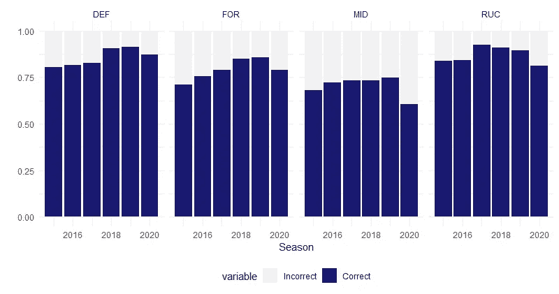
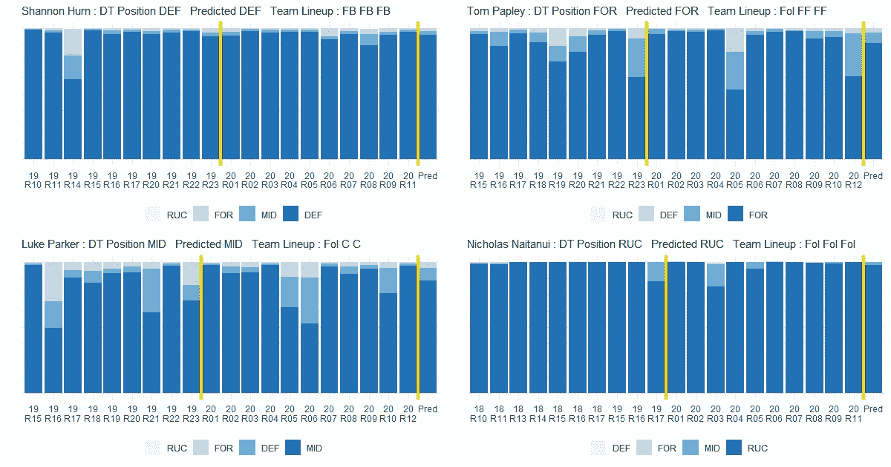
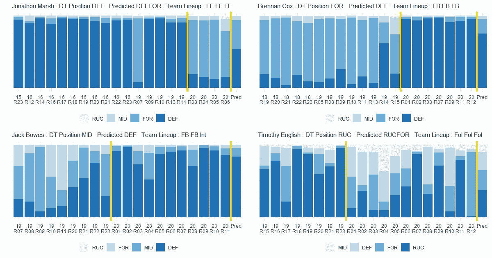
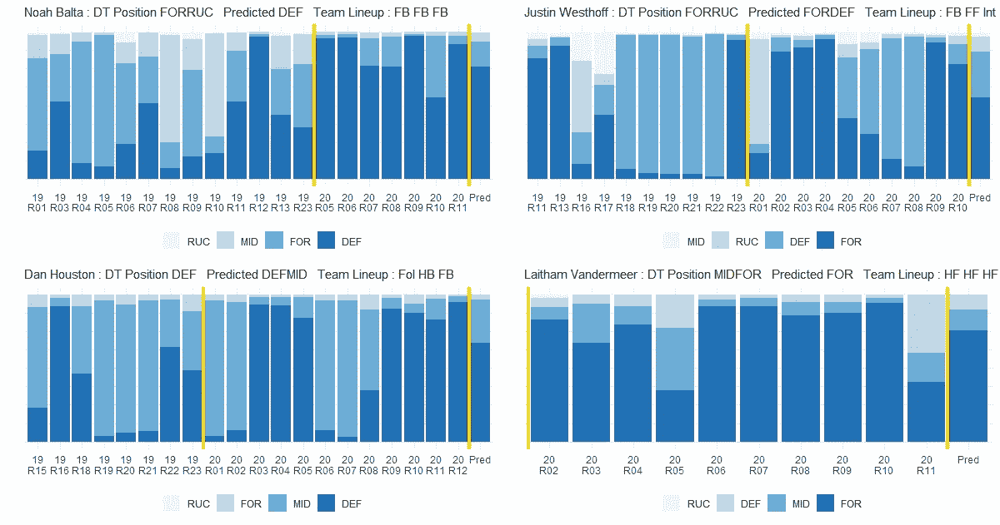
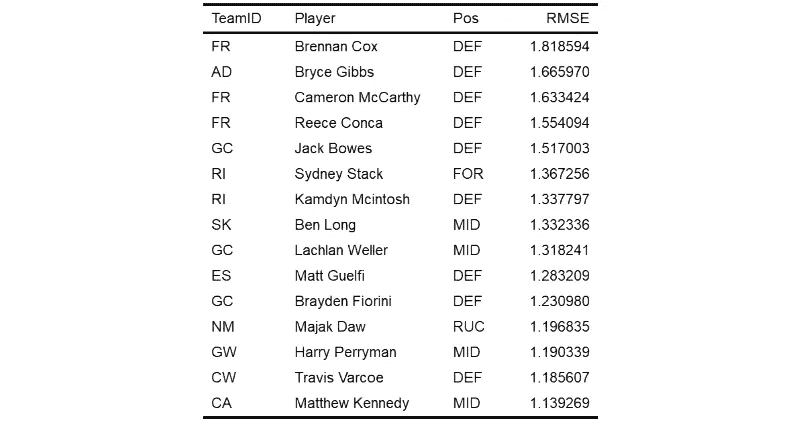
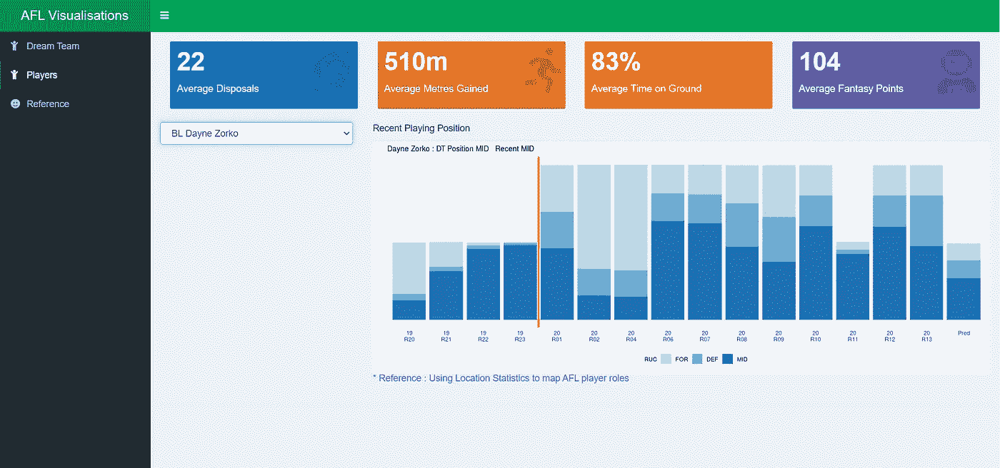

# 使用位置统计来映射 AFL 玩家角色

> 原文：<https://medium.com/analytics-vidhya/using-location-statistics-to-identify-afl-player-positions-cf6d50572c96?source=collection_archive---------18----------------------->

## 沃利在哪里…讲述玩家角色故事的统计数据

[NatalieTracy](https://www.flickr.com/photos/40201951@N00)创作的获得 [CC BY-SA 2.0](https://creativecommons.org/licenses/by-sa/2.0/?ref=ccsearch&atype=rich) 授权

先前研究的一个偶然发现是，在缺少视频镜头和/或球动作的实际 x-y 坐标的情况下，一些球员统计数据包含足够的信息来定义球员位置。

 [## 分类 AFL 球队统计

### 使用聚类分析识别 AFL 团队统计中有意义的结构

medium.com](/analytics-vidhya/classifying-afl-team-stats-cd163f3c42e8) 

我们的起点是下面的图表，它显示了按球员位置分组的每个变量的相对频率。左边的图表是一个痛苦的手动排序统计数据的过程——它确实清楚地显示了场上的平均位置——防守 50，中场 50，前锋 50——这反过来又很好地对应了球员的位置。

按位置信息统计细分玩家位置:手动过程与 PCA

右边的主成分图更好地说明了我们的理论，位置信息统计是区分玩家位置的可行方法。穿过颜色簇的轴可以解释为场上的不同位置，即红色=防守 50，米色=前锋 50，蓝色=中场。

在接下来的分析中，我们使用位置统计数据作为场上相对位置的代理，通过稳健的机器学习算法来反解整个赛季的球员位置。

玩家的角色是不固定的，虽然他们可能会扮演一个主导角色，但也有玩家可能会转移到另一个领域，在短时间内扮演另一个角色。我们将使用我们的数据子集来确定角色的类型，而不是比较该角色中玩家表现的质量。这样做可以让我们识别 AFL 幻想球员位置标签和实际球员动作之间的不匹配——希望在球员选择方面获得优势。

作为这一分析的一部分，我们开发了一个简单的应用程序，允许用户探索每个玩家的模型结果(在“玩家”标签中)。

## 数据质量

对于本文，我们使用 Footywire 的 [AFL fantasy](https://www.footywire.com/afl/footy/dream_team_round?year=2019&round=1&p=MI&s=S) 或梦之队(DT)比赛所定义的球员位置作为事实的来源。难就难在这里:**他们只在赛季末绝对正确**。为什么？

*   在 DT 中，有四个关键位置——后卫、前锋、中场和前锋。大多数玩家只属于这些类别中的一种。
*   大约 15%的玩家是双位玩家，这意味着他们被指定了多个角色。这个称号是由[冠军数据](https://www.championdata.com/home)决定的——我们的理解是它使用了最近 50 场比赛的球员统计数据。双位置球员在每个赛季开始时公布，之后每 6 场比赛公布一次。
*   对来自 [Footywire](https://www.footywire.com/afl/footy/dream_team_breakevens) 的数据的初步分析没有反映出在单个赛季 s 中任何球员从单个位置升级到双个位置——这意味着该赛季最后一场比赛的位置被追溯应用到该赛季所有过去的比赛——因此，为了查看这些变化，我们需要依靠[书面文章](https://dreamteamtalk.com/2019/10/04/lachie-whitfield-to-be-a-mid-fwd-and-other-2020-afl-fantasy-player-positions/),这并不理想。

双位置球员在 DT 中有额外的价值，因为他们在团队建设方面提供了灵活性。因此，识别在赛季中有更高机会被宣布为 DPP 的球员的能力是这一分析的最初动机。

## **数据和方法**

2015-2020 赛季的球员位置和位置统计数据是从 Footywire 刮来的，其中包括总共 48，000 个球员比赛组合。

该模型在 2015-2019 赛季的单人球员位置上进行了训练，并在 2020 年的单人球员位置集上进行了验证。最终分析应用于整个玩家数据集中的数据。我们确定的提供现场位置信息的变量有:

*   前锋 50 分:进球(GL)，后卫(BH)，内线 50 分(I5)，内线 50 分(T5)，内线 50 分(M5)，进球助攻(GA)
*   防守 50:篮板 50(R5)
*   中场:中锋解围(CC)，不包括进球的得分(SX)
*   不在向前 50:铲球不在 50 内(TX)，标记不在 50 内(MX)-两者都计算为总数与 50 内统计之间的差异。

此外，我们还包括玩家信息，如经验(游戏数的对数)和身高，以改善模型结果。

考虑到 2020 年的短格式比赛，我们已经通过 1.25 的乘数调整了赛季统计数据，以便它们可以在相同的规模上标准化。

从数据集，我们建立了几个多类分类模型——[随机森林](https://en.wikipedia.org/wiki/Random_forest)、[梯度推进](https://en.wikipedia.org/wiki/Gradient_boosting)和[KNN](https://en.wikipedia.org/wiki/K-nearest_neighbors_algorithm)——并将预测汇总成最终模型。在 2020 年最后一组看不见的数据中，模型根据 DT 球员位置数据对 77%的观察值进行了准确分类。

## **结果和观察结果**

为了充分评价和理解模型预测，我们将结果分为三类:( 1)单位置玩家准确预测;( 2)单位置玩家不一致预测;( 3)双位置玩家预测。

该模型计算给定玩家的每个角色类型的投票数，其中每个投票可以被解释为执行每个玩家角色的时间百分比(因此映射到场上的特定位置)。在结果中，该模型最高对应于后卫的所列 DT 球员位置，最低对应于中场。

模型性能与冠军数据(DT)方法的一致性

每个玩家的图表简明地显示了以下信息:

*   主导角色是每个角色最深的颜色块——防守、前锋、中场和前锋。
*   在 0.70 的阈值下，过去 10 场比赛的平均玩家角色被确定为图表中最右边的观察值。请注意，虽然 DT 方法使用 50 场比赛的平均值，但我们试图通过使用更少的比赛来更符合当前情况。
*   为了对我们的结果质量进行基准测试，我们还考虑了最近比赛的实际[球队阵容](http://www.fanfooty.com.au/game/teamsheets.php)。

**单位球员准确预测**该模型准确预测单位球员，其中 DT 位置和实际球队阵容之间存在共识。这些球员通常在多个赛季中保持一致的比赛位置。

结果:一致预测单位置球员

**单位置玩家预测不一致**在下图中，我们确定了模型对单位置玩家与 DT 方法有不同共识的玩家。

结果:预测不一致的单个预测玩家

*   我们注意到 DT 方法在识别赛季间转换位置的球员方面的滞后。这是因为 DT 方法使用了 50 场比赛的平均值——比两个赛季还长。
*   单个回合的模型评估提供了一个更丰富的玩家角色随赛季发展的流动性视图——允许我们可视化玩家广度。

**双位玩家**与预测不一致的单位玩家类似，我们可以观察到 DPP 的 DT 方法中的滞后。

结果:双位置球员

结合实际团队阵容数据检查模型结果，让我们对模型预测和结果解释充满信心。

## **模型应用**

分析的应用之一是考虑 DT 位置和模型预测之间的差异。下表显示了迄今为止 2020 赛季的顶级球员差异。

DT 位置和模型预测之间的差异

## **反思和后续步骤**

该模型已经产生了有希望的结果，即能够基于包含一些位置信息的场上统计数据来识别球员位置。

模型的不准确性来自于比赛中几乎没有触球的球员——因为模型预测是基于变量之间的实际和相对相互作用，而相对较少的比赛观察可以产生不寻常的预测——这最有可能适用于受伤的球员、新秀或连续表现不佳的球员。

作为这种分析的一部分，我们开发了一个简单的应用程序，允许用户探索每个球员的模型结果。

[https://denisewong1.shinyapps.io/AFLapp/](https://denisewong1.shinyapps.io/AFLapp/)

## **参考文献**

1.Footywire AFL 奇幻玩家排名([链接](https://www.footywire.com/afl/footy/dream_team_round?year=2019&round=1&p=MI&s=S))

2.双位置玩家([链接](https://www.afl.com.au/news/74828/last-shout-final-round-of-dual-position-players-revealed))和([链接](https://www.afl.com.au/news/130934/new-dual-position-players-revealed-fading-hawk-given-new-lease-of-life))

3.主成分分析([环节](http://www.sthda.com/english/articles/31-principal-component-methods-in-r-practical-guide/112-pca-principal-component-analysis-essentials/))

4.AFL 球员赛季价格和位置([链接](https://dreamteamtalk.com/category/preseason/2019-prices/))和([链接](https://dreamteamtalk.com/category/preseason/2020-prices/))

5.通过 Arc 使用公共数据对球员位置进行分类([链接](https://thearcfooty.com/2016/10/15/classifying-players-positions-using-public-data/))

6.根据 MatterOfStats ( [link](http://www.matterofstats.com/mafl-stats-journal/2018/11/20/classifying-recent-afl-players-by-position) )的位置对最近的 AFL 球员进行分类