# 使用逻辑回归预测一个物业是否可以出售

> 原文：<https://medium.com/analytics-vidhya/using-logistic-regression-to-predict-whether-a-property-can-be-sold-b06c43154930?source=collection_archive---------3----------------------->

## 我的房子可以卖吗？

佩德罗·拉斯特拉在 [Unsplash](https://unsplash.com?utm_source=medium&utm_medium=referral) 上的照片

**Logistic 回归**是我在数据科学学的最早的学科。当我们遇到一个因变量(Y)为二元的类别变量时，logistic 回归是一种适合进行回归分析的方法。逻辑回归是一种预测性分析，用于描述数据并解释因变量、二元变量和一个或多个自变量之间的关系。

**什么时候可以用 logistic 回归？** 例如:毒品、酒精、失业、婚姻破裂、长期健康问题和身体残疾是否会增加自杀率？(是对否)？

在这篇文章中，我将解释如何使用逻辑回归来预测房子是否可以出售。在开始之前，我们将通过数据科学生命周期来了解应该发生什么。

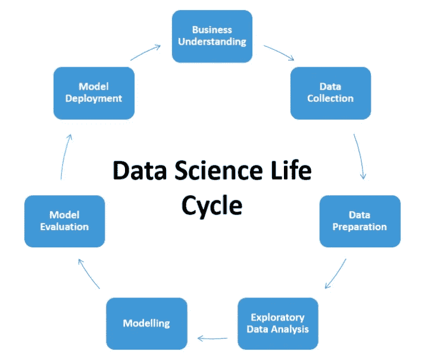

照片由 Srinivas Rao 在 Quora 上提供

**用数据科学生命周期解决业务问题的步骤:**
1。商业理解
2。数据收集
3。数据准备
4。探索性数据分析
5。造型
6。车型评测
7。模型部署

# **#1 ~业务理解**

任何项目，无论大小，都需要对业务的了解，这是有效解决业务问题的基础。

我想解决的问题是什么？

在这个阶段，我需要从业务角度定义问题、项目目标和解决方案。这是用数据科学方法解决问题的第一步。在这篇文章中，我是一家房地产公司的经理。我需要找出这些楼盘的销售潜力，而这些销售潜力基本上都是以往房产交易的数据。所以，我想预测一下房产会不会卖出去。

因此，这是一个**主管学习** ~我会用**分类**的方法。

# **#2 ~数据采集**

数据是整个机器学习最关键的部分。所以我需要考虑以下几点:

*   我有数据吗？
*   数据从哪里来？
*   我们信任数据源吗？
*   我有领域知识吗？

这些数据来自于我的在线课程

# #3 ~数据准备& #4 ~探索性数据分析

现在，我们将尝试将房屋数据集加载到 jupyter 笔记本中。

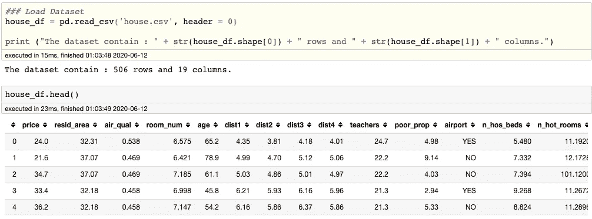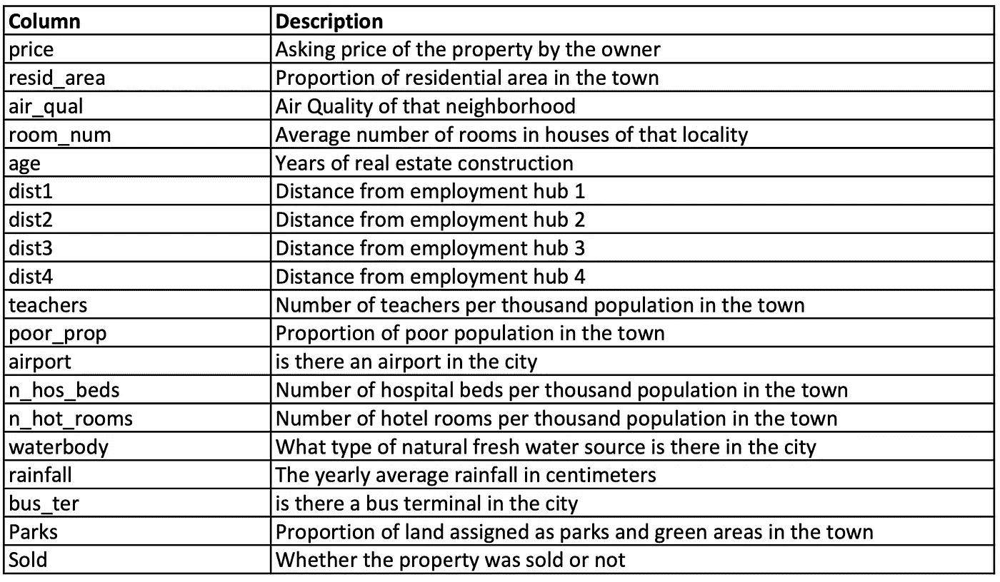

现在，让我们来看看数据集。数据集包含 506 行和 19 列。因变量是**已售**和公园价格是自变量。有三个分类变量，即机场、水体和公共汽车，其余为数值变量。在下图中，我们可以看到 **n_hos_beds** 中有缺失值。在运行逻辑回归或任何其他类型的机器之前，我们需要处理这些缺失值。

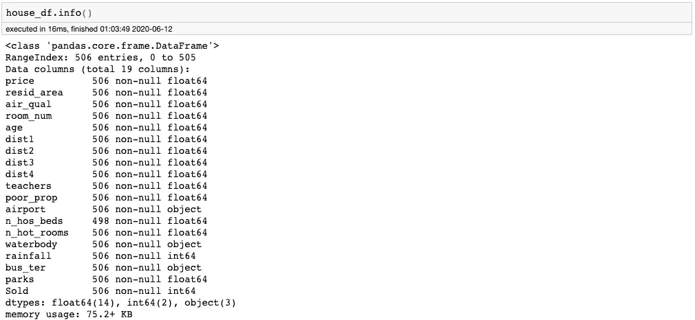

我们可以看到，所有的数字变量都列在顶部，我们有计数、均值、标准差、最小值、最大值、25%和 50%以及 75%等值。

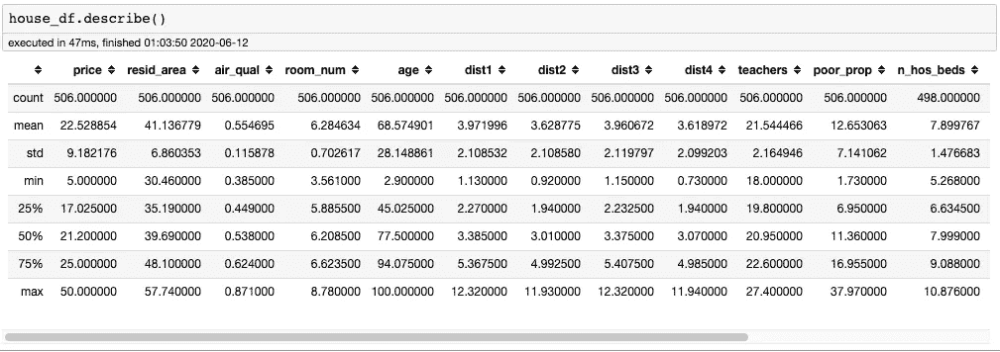

现在，我们将检查这些变量的值是否是我们想要的。缺失值和带有异常值的变量表示不遵循变量模式的值，这将极大地影响模型的准确性。通过使用箱线图和联合图，我们看到在 **n_hot_rooms** 和**rain**列上有一个异常值。

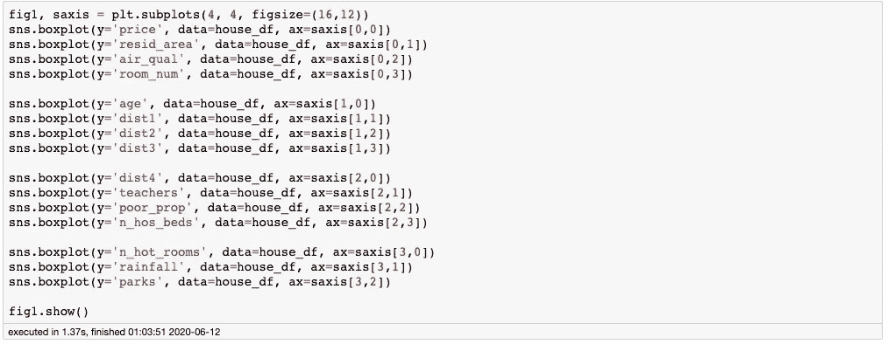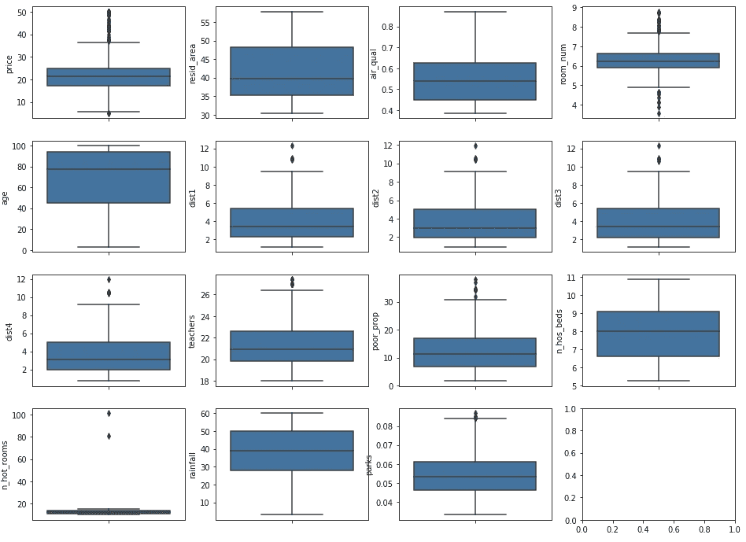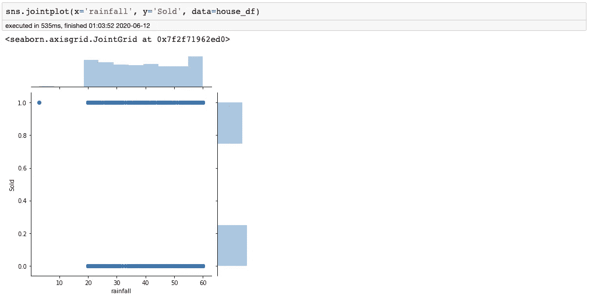

现在我们从数字数据中得到了三个观察结果。首先， **n_hos_beds** 变量中存在缺失值，第二个问题是 **n_hot_room** 变量**高端的异常值。**第三个问题是**降雨量**变量下端的一个异常值。现在让我们看看分类变量。我们将绘制所有分类变量的计数栏。

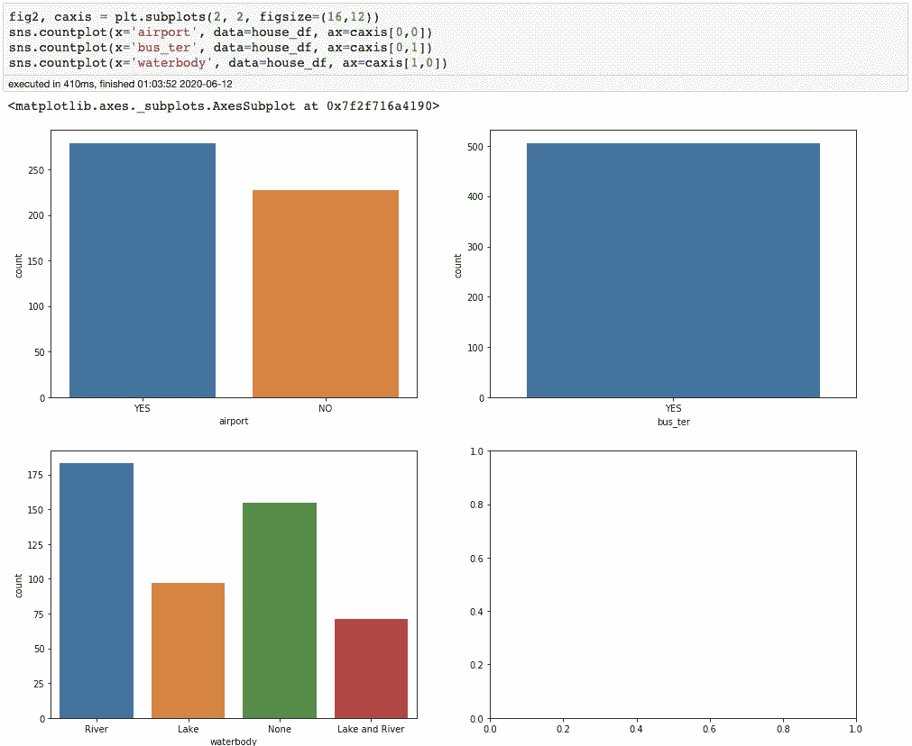

在分类变量中，您可以看到 **bus_ter** 变量只有一个值，yes。所以在某种意义上这不是一个变量。这是一个常数。因此，我们可以从我们的数据中删除这个变量，因为它不提供任何额外的信息或对结果有任何影响。

现在我们可以开始处理有问题的数据了。第一个是 **n_hos_beds** 变量的缺失值。缺失值的处理一般分为删除缺失值或填充缺失值。由于缺失值数量较少，我们将通过**平均**值来填充缺失值。

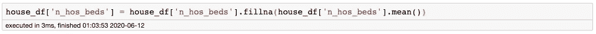

接下来要处理的是 **n_hot_room** 变量的上限异常值和**雨量**变量的下限异常值。我们将使用上限和下限方法，用 3* P99 和 0.3*P1 估算异常值。

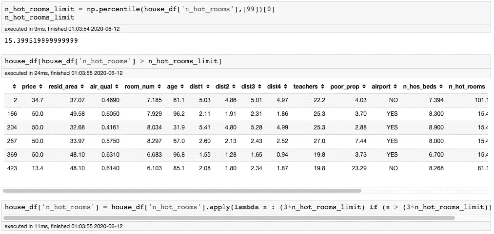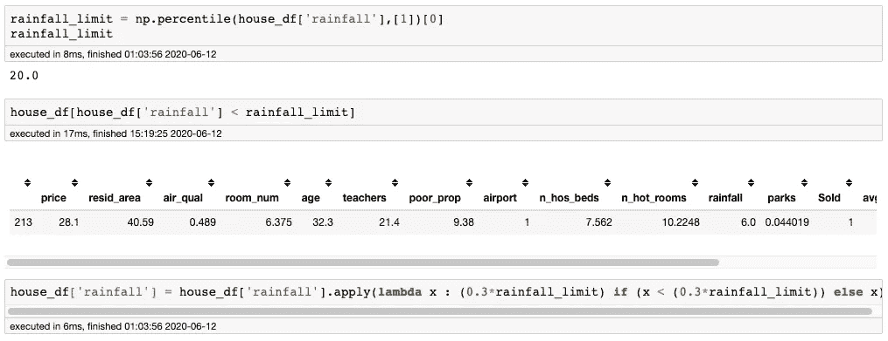

最后，我们将执行一个数据转换，我们将首先删除 **bus_ter** 变量，因为所有的 **bus_ter** 变量都是 YES，它不提供任何额外的信息或对结果有任何影响。然后我们将创建 **avg-dist** 变量，使用 **dist1** 、 **dist2** 、 **dist3** 和 **dist4** 变量获得到就业中心的平均距离。之后，我们将使用 Scikit-learn LabelEncoder 来转换 **airport** 变量，并使用一键编码器来转换 **waterbody** 变量。最后，我们将放弃水体变量。

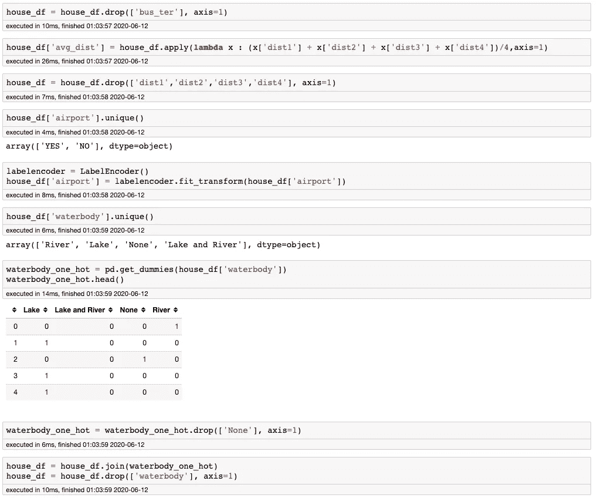

# # 5～建模

标准化训练数据和测试数据非常重要，因为如果元素的比例相同，大多数机器学习模型会收敛得更快。进行标准化会将特征的平均值集中在 0 到 1 之间。数据将服从正态分布。为了计算这些特征的平均值和标准偏差，并将上述公式应用于每个观察值/数值，将使用 sklearn 的标准标度:

在训练我们的模型之前要做的最后一件事是分割数据集。我将这些数据随机分为 80/20 的训练集和测试集。我们需要这样做，以便我们可以通过预测测试集数据(看不见的数据)来估计我们的模型的预测结果。

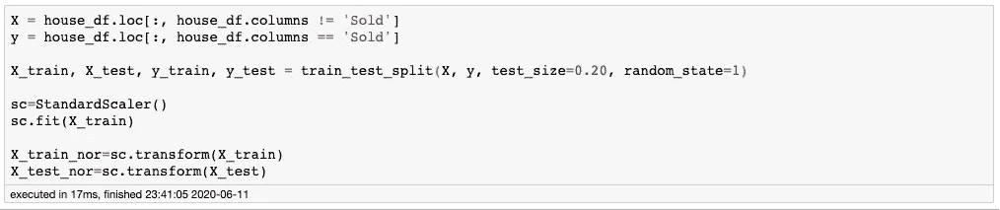

我们已经训练了一个模型，并检查系数和截距。

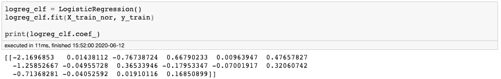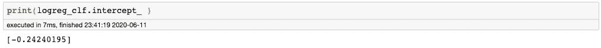

# # 6～模型评估

在这一步，我们将评估机器学习模型的性能和准确性。分类问题常用的指标叫做混淆矩阵。混淆矩阵是分类问题的常用指标。它派生出许多不同的指标，并标记出一些更重要的派生指标。根据预测，我们可以得出结论，对于 66.6%的测试数据，预测一个房产是否可以出售是准确的。

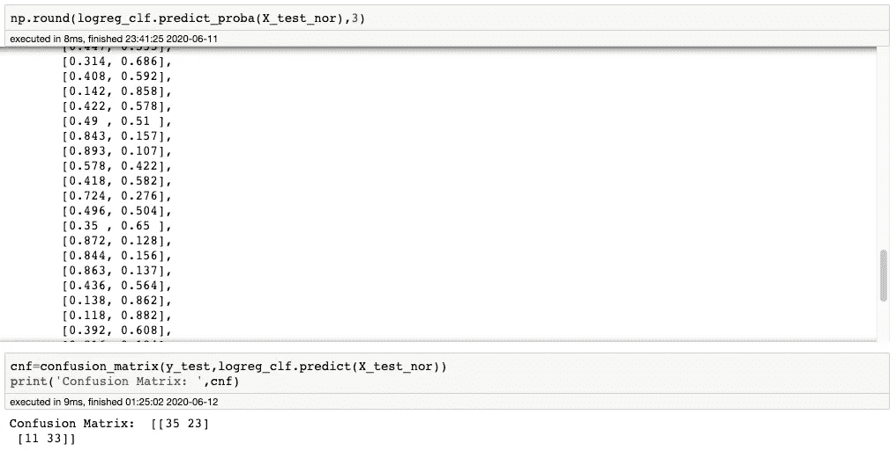

# #7 ~模型部署

这是一个相对简单的项目，通常我们还需要迭代和函数选择或与其他算法进行比较。通过收集实现模型的结果，您还需要接收关于模型的性能及其对实现环境的影响的反馈。通过分析这些信息，数据科学家可以改进模型，提高其准确性，从而提高其实用性。一旦开发出令人满意的模型，就会在生产环境中实施。

感谢阅读！如果你喜欢这篇文章，请通过鼓掌来感谢你的支持(👏🏼)按钮，或者通过共享这篇文章让其他人可以找到它。

希望你对数据科学生命周期有一个基本的了解。如何在每个阶段进行思考，以帮助指导您完成一个成功的数据科学项目的方法。最后，我希望你能学会如何使用逻辑回归技术。您还可以在 [GitHub](https://github.com/kindersham/100DaysDS/tree/master/House_Prediction) 资源库中找到完整的项目。