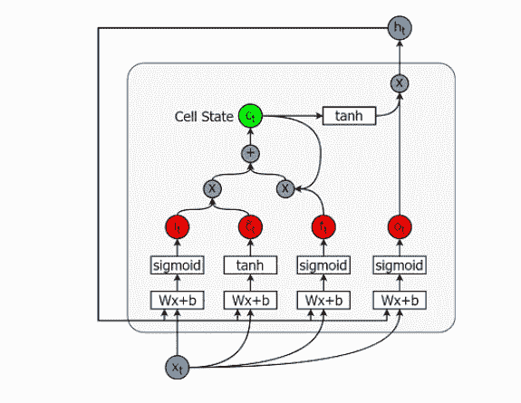

# 利用 LSTM 实施行业轮动交易策略第一部分

> 原文：<https://medium.com/analytics-vidhya/using-lstm-to-implement-a-sector-rotation-trading-strategy-part-i-5481e2b00a71?source=collection_archive---------10----------------------->

在熨斗数据科学学院的最后一个项目中，我想使用时间序列分析来预测股票数据。然而，在做了一些研究后，普遍的共识似乎是，传统的时间序列模型，如 ARIMA，往往产生极不准确的结果，不太适合处理股票数据。ARIMA 模型更适合处理显示平稳性和季节性的数据。轨道列车乘客量数据就是一个很好的例子，在过去十年中，乘客量呈稳步上升趋势，每年夏季下降，秋季上升。另一方面，股票数据不是平稳的或季节性的。

这最终导致我实现了一个 **LSTM(长短期记忆)**网络来进行这个特殊分析。LSTM 网络是一种递归神经网络，通常用于语音、手写和图像识别等领域，但也能够产生强大的时间序列模型。它通过使用时间反向传播(BPTT)来训练，通过使用导数链规则来更新网络权重以最小化误差。除此之外，它主要处理消失梯度问题，这是递归神经网络中经常出现的问题，其中越来越小的梯度导致权重永远不变。

# 那么这到底是怎么回事呢？

LSTM 网络极其复杂，但我将在 [Christopher Olah 的博客](http://colah.github.io/posts/2015-08-Understanding-LSTMs/?source=post_page-----37e2f46f1714----------------------)的帮助下，尽我所能尝试解释它，查看它以深入了解 LSTMs 的内部工作和所有机器学习的事情。

展开的香草递归神经网络

**关于 RNNs 的一个快速注释…**

递归网络非常擅长学习序列数据，它们有三个主要组成部分，输入数据、隐藏层和输出层，分别表示为上面的 *x* ，A 和 *h* 。当您继续遍历 RNN 时，它不仅会接收下一条输入数据，还会接收前一时间步的隐藏层，从而在遍历整个序列时继续从过去的数据点中学习。然而，正如我上面提到的，它们经常受到消失梯度问题的困扰，这就是 LSTMs 的用武之地。这真的是最简单的方法来解释它，而不进入微积分和线性代数的幕后进行。

LSTMs 有五个基本组成部分，可以处理和模拟短期和长期数据。

1.  **细胞状态** ( *ct* )—代表存储短期和长期记忆的内部记忆。
2.  **隐藏状态**(*ht*)——本质上这个状态决定了是提取短时记忆、长时记忆还是两者都以细胞状态存储。
3.  **输入门** ( *it* )—该门决定有多少信息从当前输入流入单元状态。
4.  **忘记门** ( *ft* )—该门决定有多少信息从当前输入和前一个单元流入单元状态。
5.  **输出门** ( *ot* )—决定有多少信息从当前单元格状态流入隐藏状态。这就是为什么如果需要的话，LSTM 可以只选择短期记忆、长期记忆或者两种类型的记忆。

[https://www . data camp . com/community/tutorials/lstm-python-stock-market？source=post_page](https://www.datacamp.com/community/tutorials/lstm-python-stock-market?source=post_page---------------------------)

每个门都有自己的一系列矩阵运算和权重，这些运算和权重会不断更新，并允许网络随着时间的推移进行学习。单元状态随着时间的推移存储所有的记忆，而隐藏状态可以被认为是存储当前或工作记忆的地方。那么这个细胞网络是如何知道要记住什么和忘记什么的呢？简而言之，这是通过梯度下降的使用。梯度下降很容易成为它自己的博客主题，但简言之，它是一种优化算法，用于通过迭代地向最陡下降方向移动来最小化函数，其中成本是均方误差。关于 LSTMs，梯度下降用于更新我们的模型的权重。关于梯度下降的更多信息，请查看这篇文章。

主要的一点是 LSTMs 和神经网络通常是在人脑的基础上松散地建模的。每当我们得到一条新信息时，我们不会抛弃一切，开始从头开始思考。你读到的每一个单词或获得的每一条知识都是基于你对之前事物的理解。这有意义吗？至少我是这样认为的。

在这个博客系列的下一部分，我将真正开始进入这个项目的实质。我将谈论从雅虎财经中提取标准普尔 500 九个行业的股票数据，什么是行业轮换策略，我如何使用 LSTM 网络来实现它，以及为什么将股票数据用于机器学习有时会被认为是一个有争议的话题。在开始之前，我想至少提供对 LSTMs 的一个粗略的理解。