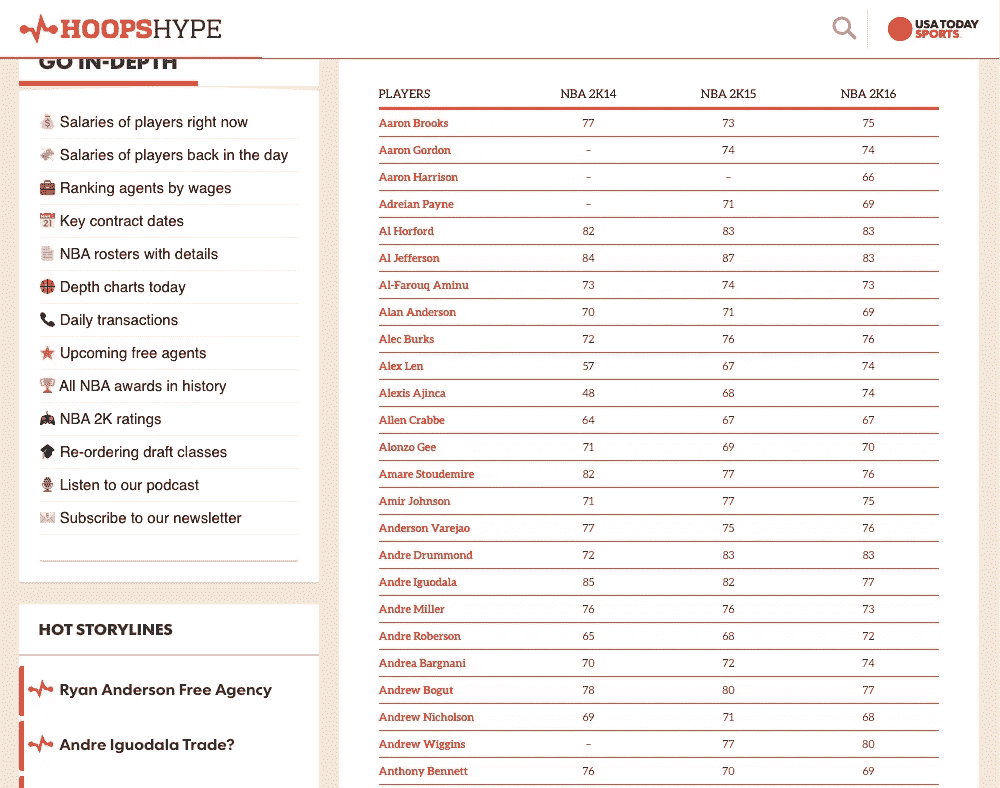
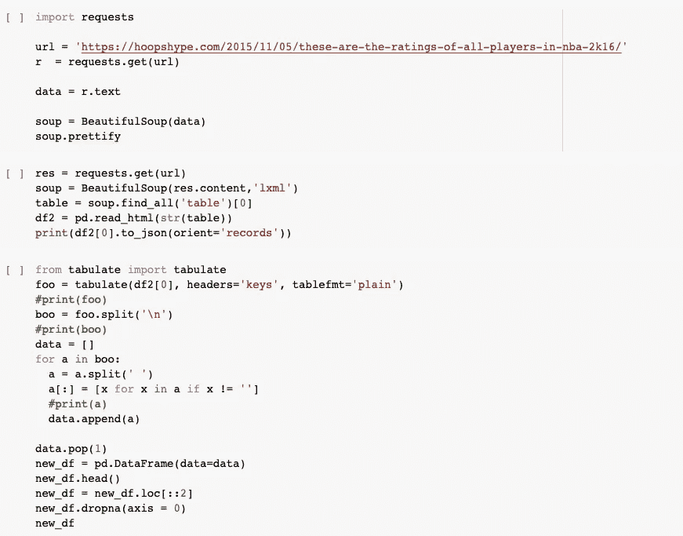
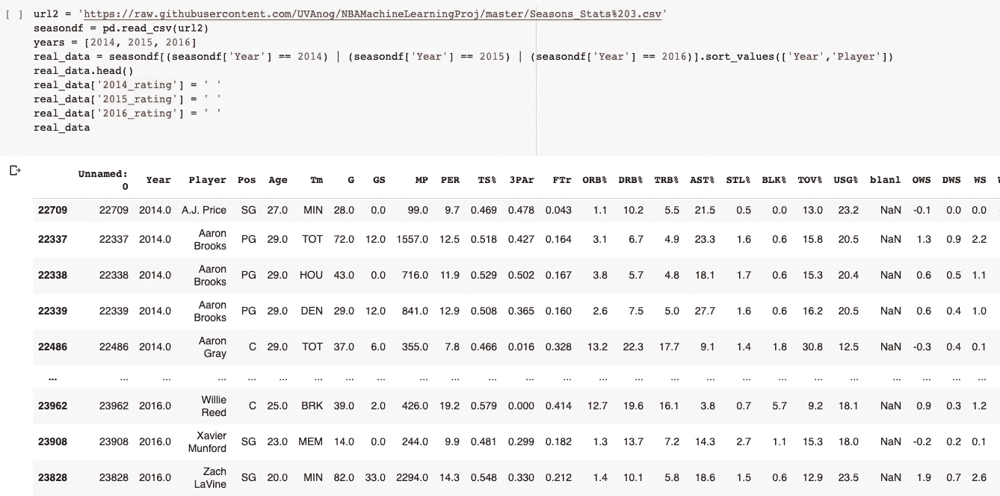
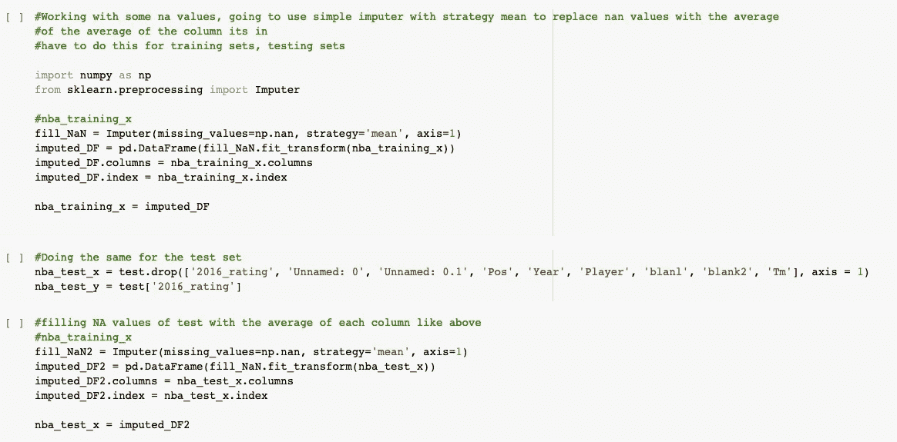
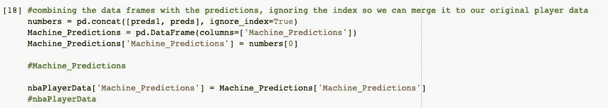
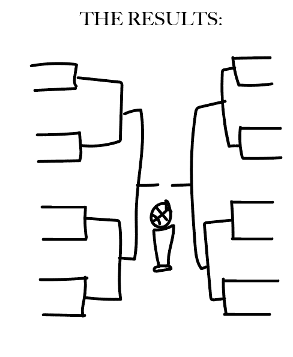
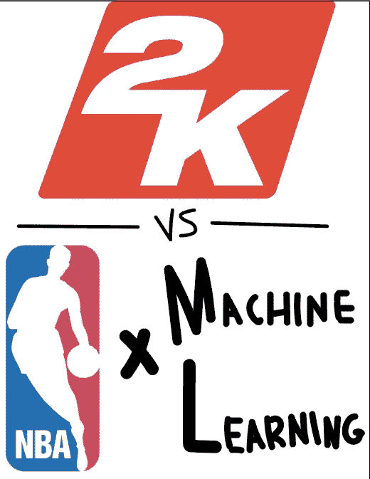

# 利用机器学习和 NBA 2k 数据预测 2016 年 NBA 季后赛

> 原文：<https://medium.com/analytics-vidhya/using-machine-learning-to-beat-nba-2k-in-predicting-the-2016-nba-playoffs-e901137776a?source=collection_archive---------16----------------------->

## [现实世界中的数据科学](https://towardsdatascience.com/data-science-in-the-real-world/home)

## 我第一个发表的 ML 项目

首先，我想在我的第一篇文章中介绍一下我自己。

你好！我叫诺兰·哈里斯，是弗吉尼亚大学计算机科学和统计学专业的本科生。这是我第一个真正的 ML 和 web 抓取项目，我对它的结果非常满意。请对我的代码、方法等提供反馈。因为我总是希望学习新的东西(尤其是因为我刚刚接触到这个)！

# 问题是:

## 使用 2014 年至 2016 年的 2k 评级来帮助机器学习模型产生自己的球员评级，我们能让这两者相互竞争，比简单地使用 2k 评级更准确地预测 2016 年 NBA 季后赛吗？

## 第一步:使用 BeautifulSoup 对 NBA 2k 数据进行 web 抓取。

一个 2k 大小的干净文件实际上是不存在的。所以，我自己做了。

[https://hoopshype . com/2015/11/05/这些是 nba-2k16 中所有球员的收视率/](https://hoopshype.com/2015/11/05/these-are-the-ratings-of-all-players-in-nba-2k16/)

从这个站点开始，我用 BeautifulSoup 和下面的代码把它变成了熊猫里的一个数据框。

从我的谷歌实验室笔记本上。在这一部分，我的好朋友 Ari Klau 给了我很多帮助。

如您所见，我们做了大量的工作，只是为了将它转换成一个我可以使用和操作的数据框。下一步是找到并处理一系列真实的 NBA 数据。幸运的是，这很容易找到，而且几乎不需要清理。

来自 https://www.kaggle.com/drgilermo/nba-players-stats[的超棒的 CSV 在我的 Google Colab 笔记本上。](https://www.kaggle.com/drgilermo/nba-players-stats)

在让 2014 年到 2016 年的球员匹配我刚刚收集的 2k 数据时，只需要做一点清理，我从这些数据中添加了空列来放置 2k 值。下一步是有趣的部分——建立模型。我的模型目标是按照惯例分成测试集和训练集，但是我没有试图预测准确性的值。这意味着这并不是我预测的 2016 年球员价值观与 NBA 2k16 球员价值观相匹配的目标。

在构建模型之前，在分割的集合中还有一些工作要做。2k 值和真实值之间有大量缺失值。原因包括一个玩家还没有进入联盟，或者在某些情况下没有 2k 级别。

从我的谷歌实验室笔记本上。

## 用简单的估算器填充缺失值

使用一个简单的估算器，我用这些列的平均值填充了这些列中缺少的值。我只是用所有原始值创建了一个新的数据框，缺失的值现在被填充，并将现有的数据框设置为新的数据框。在我进行预测的数据框架中缺少 2k16 评级的情况下，我使用逻辑回归来计算新的“2016 值”，即我将与 2k16 值进行竞争的值。

## 这些预测:

从我的谷歌实验室笔记本上

在从两组预测中创建一个 DF 并合并它们之后，我创建了一个所有团队的字典，包括 2k 评分和机器预测。从那时起，使用同样的计算整体团队价值的方法，简单地说就是考虑轮换的前 10 名球员价值的总和，我手动计算每个团队的价值。

我画得很快

NBA 2k 模型:11/16 支球队预测正确。

分裂:7/8 西部球队 4/8 东部球队

我的模型:12/16 队预测正确。

分裂:西部和东部球队各占 6/8

我也画了这个

我真的很喜欢做这个项目，并让自己接触到使用机器学习和网络抓取来提出和回答问题的想法。我认为还有很大的改进空间，关于预测的不同有很多原因。我喜欢反馈，批评，评论，所以请随时给我发电子邮件！你可以在下面的链接中找到我的 github 上的完整代码，还有我的！我希望你喜欢，我期待在未来发布更多！

电子邮件:nph2tx@virginia.edu

GitHub 链接:

https://github.com/UVAnog/NBAMachineLearningProj