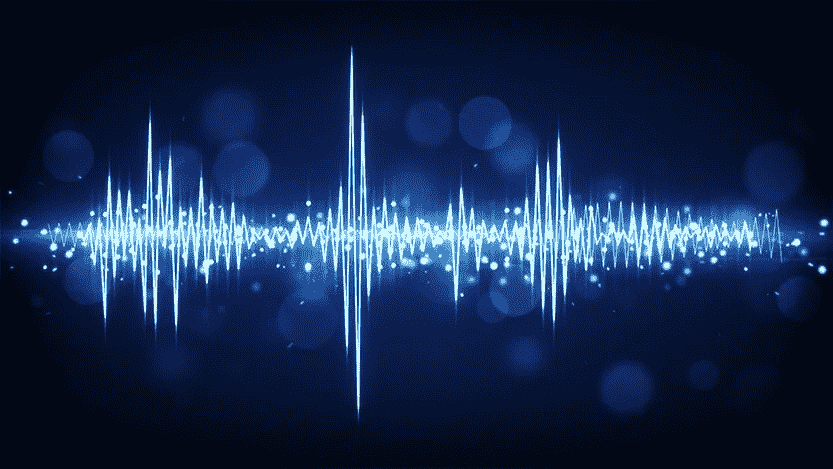
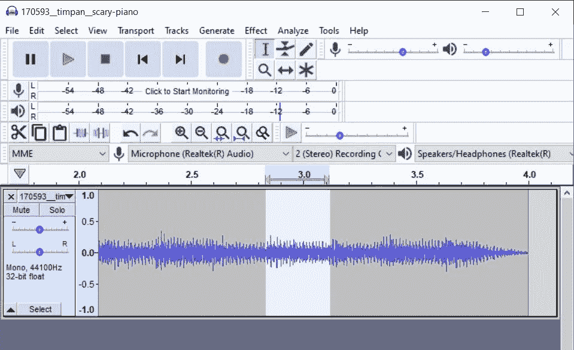
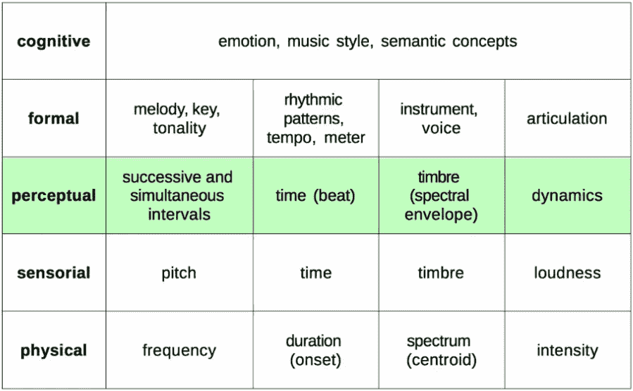
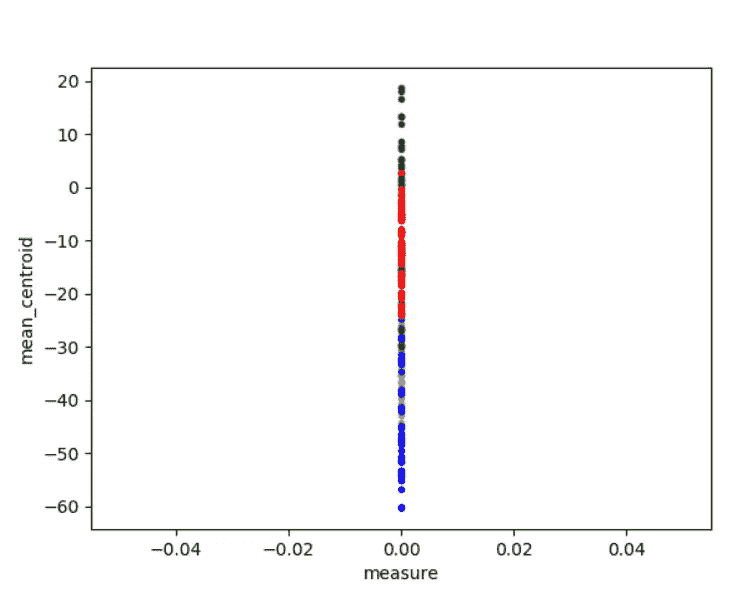
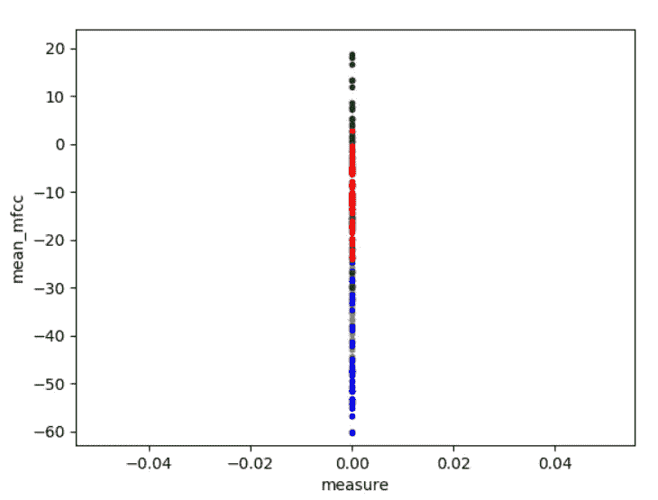
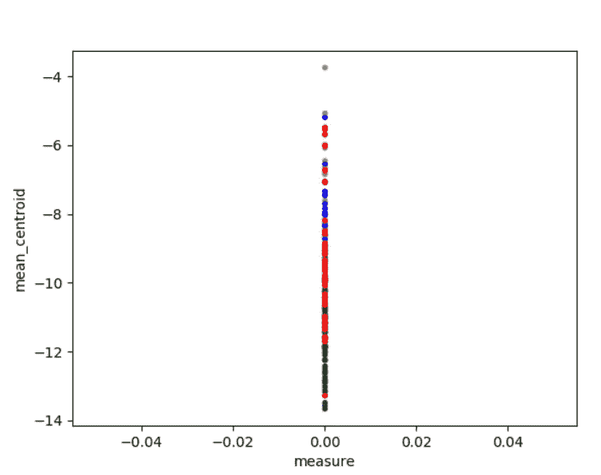
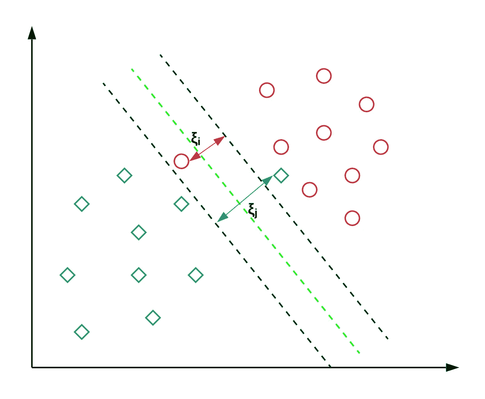
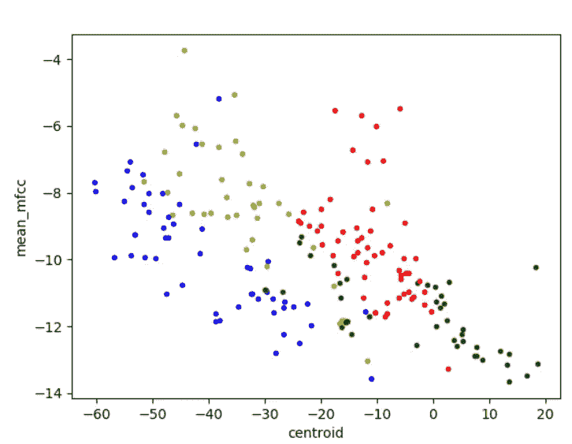

# 使用机器学习对乐器声音进行分类

> 原文：<https://medium.com/analytics-vidhya/using-machine-learning-to-classify-instrument-sounds-21c48a91c290?source=collection_archive---------11----------------------->



今天，我们已经有了识别随机音乐片段和识别声音/专辑/来源的应用程序。在这篇博客中，我们将尝试理解这些应用程序是如何工作的，并创建我们自己的项目。

我已经分享了我的作品和代码。如果你有兴趣做这个工作，我会建议不要盲目复制，因为我已经把代码放在 snips 中，它们不在我的系统中。此外，这段代码是两年前用 python 2x 编写，因此要相应地工作。

如果你渴望学习，这将是一个很好的指导。

## **数据收集**

我可以通过网站-【www.freesound.org】*获得我的训练音*

*下载小提琴、小号、钢琴和长笛的歌曲，然后用 audacity 剪辑它们。这里下载[](http://www.audacityteam.org/download)**。***

**如果你没有时间创建自己的数据，请使用我的 [*作品*](https://www.kaggle.com/omrastogi/instrument-classification) 。**

****

**剪切音频以创建多个样本**

**要在 python 中打开音频文件，需要使用以下代码。**

```
**import wave
import struct
import scipy.io.wavfile as wav
import numpy as npdef get_audio(file):
    audio_file = wave.open(file)
    length = audio_file.getnframes()
    signal = np.zeros(length)
    for i in range (0,length):
        data = audio_file.readframes(1)
        data = struct.unpack("<h", data)
        signal[i] = int(data[0])
    rate = audio_file.getframerate()
    signal = np.divide(signal, float(2**15))
    return signal, rate**
```

## **特征抽出**

**声音有数百种频谱和时间特征，如频率、振幅、质心等。然而，我们将在理解的感知层面上使用一些特定的特征。使用的功能有:**

1.  ****信号的 Mel 倒谱频率系数(MFCC)**是一小组特征(通常约 10-20)，它们简明地描述了频谱包络的整体形状。常用来形容音色。**
2.  ****对数滤波器组**是一个带通滤波器阵列，将输入信号分成多个分量，每个分量携带原始信号的单个频率子带。**
3.  ****频谱子带质心(SSC)** 是表征频谱的一种度量，它表示频谱的质心所在的位置。**

****

**对于 windows，我使用了库[*python _ speech _ features*](https://python-speech-features.readthedocs.io/en/latest/)，它提供了有限但足够的特性。**

```
**from python_speech_features import mfcc
from python_speech_features import logfbank
from python_speech_features import sscimport numpy as np
import matplotlib.pyplot as plt**
```

**在实现这些模块时，应该记住，这些模块提供 2d 阵列，理解这些输出可能是困难的。所以人们应该彻底了解这些特性，否则它们会迷失在数字和数组海洋中。如果你没有太多时间只阅读关于[*【MFCC】*](http://practicalcryptography.com/miscellaneous/machine-learning/guide-mel-frequency-cepstral-coefficients-mfccs/)和会有抽象的想法。**

**如果你有兴趣深入研究，在 **Coursera** on [*音频信号处理*](https://www.coursera.org/learn/audio-signal-processing/lecture/GCK1G/sound-and-music-description) 上有一门很棒的课程。**

```
**def featuresplot(sig,rate,typo):#Extrating the feature
    m = mfcc(sig,rate)
    fbank_feat = logfbank(sig,rate)
    s= ssc(sig,rate) mlst = []
    slst = [] for i in range(0, len(m)):
        l = m[0:4]
        mlst.append(m[i][2])
        slst.append(s[i][4]) m=[]
    s=[] m.append(np.mean(mlst))
    s.append(np.mean(slst)) clst=[]
    for i in range(0, len(fbank_feat)):
        l = m[0:4]
        clst.append(np.mean(fbank_feat[i])) c=[]
    c.append(np.mean(clst))
    plt.plot(m,c, typo)
    return  s[0],m[0],c[0]**
```

****

****PLOT1:质心****

****

****图 2: Ssc[4]****

**在这段代码中，我调用了一些方法来给我一些特性。我存储了某一列的平均值。对于 mfcc，我使用了第三列，对于 ssc，我使用了第五列。**

**你可以看到这些功能是如何为不同的乐器分割声音的。然而没有一个特征能够完全区分所有的仪器。**

**因此，我们使用所有三个特征来训练我们的模型。**

**不同颜色代表不同的仪器:**

1.  **黄色代表小提琴**
2.  **蓝色代表钢琴**
3.  **绿色代表小号**
4.  **红色代表长笛**

****

****图 3:质心****

****培训数据****

**获得特征后，我们需要创建我们的训练数据。**

**这段代码将通过调用 *get_audio()* 打开每个音频文件，并使用 *featuresplot()* 提取特征。变量 typo 用于建议图中点的颜色。**

**最后，每个特征存储在 *dataset.pkl* 中**

```
**import pickledef create_dataset():
    dataset= []
    print ("Extracting Dataset")
    print ("\nviolin:"),
    for i in range(1,40):
        print (i),
        file ='Violin/sample_'+str(i)+'.wav'
        sig, rate = get_audio(file)
        typo = '.y'
        s,m,c,k = featuresplot(sig, rate, typo)
        dataset.append(['violin',s,m,c,k]) print ("\ntrumpet:"),
    for i in range(1,53):
        print (i),
        file = 'Trumpet/sample_'+str(i)+'.wav'
        sig, rate = get_audio(file)
        typo = '.b'
        s,m,c,k = featuresplot(sig, rate, typo)
        dataset.append(['trumpet',s,m,c,k]) print ("\npiano:"),
    for i in range(1,46):
        print (i),
        file = 'Piano/sample_'+str(i)+'.wav'
        sig, rate = get_audio(file)
        typo = '.g'
        s,m,c,k = featuresplot(sig, rate, typo)
        dataset.append(['piano',s,m,c,k]) print ("\nflute:"),
    for i in range(1,58):
        print (i),
        file = 'Flute/sample_'+str(i)+'.wav'
        sig, rate = get_audio(file)
        typo = '.r'
        s,m,c,k = featuresplot(sig, rate, typo)
        dataset.append(['flute',s,m,c,k])
    print ("\nTraining Completed") with open ('sample_data.pkl','wb') as pickle_file:
        pickle.dump(dataset, pickle_file)**
```

**输出: *dataset.pkl***

```
***Extracting Dataset
violin: 1 2 3 4 5 6 7 8 9 10 11 12 13 14 15 16 17 18 19 20 21 22 23 24 25 26 27 28 29 30 31 32 33 34 35 36 37 38 39* *trumpet: 1 2 3 4 5 6 7 8 9 10 11 12 13 14 15 16 17 18 19 20 21 22 23 24 25 26 27 28 29 30 31 32 33 34 35 36 37 38 39 40 41 42 43 44 45 46 47 48 49 50 51 52* *piano: 1 2 3 4 5 6 7 8 9 10 11 12 13 14 15 16 17 18 19 20 21 22 23 24 25 26 27 28 29 30 31 32 33 34 35 36 37 38 39 40 41 42 43 44 45

flute: 1 2 3 4 5 6 7 8 9 10 11 12 13 14 15 16 17 18 19 20 21 22 23 24 25 26 27 28 29 30 31 32 33 34 35 36 37 38 39 40 41 42 43 44 45 46 47 48 49 50 51 52 53 54 55 56 57***
```

## ****型号****

****

****支持向量机****

**首先我们需要从 sklearn 导入必要的模块来训练支持向量机模型。**

```
**import pandas as pd
from sklearn import svm
from sklearn.model_selection import train_test_split
from sklearn.preprocessing import LabelEncoder
from sklearn.metrics import confusion_matrix**
```

**这里我们使用标签编码器将乐器名称编码成数字。然后我们分割数据集来训练和测试数据。**

**对于 SVM 模型，线性核最适合 C = 3.0 的情况。以获得大约 90%的准确率。**

```
**def train_model()
    with open ('sample_data.pkl','rb') as pickle_file:
        dataset = pickle._Unpickler(pickle_file) dataset = np.array(dataset)
    le = LabelEncoder()
    data = pd.DataFrame(dataset)
    X, Y = data.iloc[:,1:], dataset[:,0]
    Y = le.fit_transform(Y) X_train, X_test, y_train, y_test = train_test_split(X, Y,      test_size=0.2, random_state = 42) clf = svm.SVC(kernel = 'linear', C = 3.0)
    clf.fit(X_train, y_train) acc = clf.score(X_test, y_test)
    y_predict = clf.predict(X_test) print (str(acc*100)+"% accuracy")
    print (confusion_matrix(y_test, y_predict)) return clf**
```

**输出:**

```
**Accuracy: 89.74358974358975% Confusion Matrix:
[[13  0  0  0]
 [ 0  8  0  0]
 [ 0  1  7  2]
 [ 1  0  0  7]]**
```

****

**质心与 mfcc 的关系**

## **现在该怎么办**

**如果你这样想，这个模型的准确性就低了。您可以通过增加模型的数据集来处理它。我认为有了足够的数据，它可以达到 95%的准确率。**

**另外，如果你是一个 linux 用户，你可以使用 Librosa 这样的库来获得更多的特性，这将通过流形来改进这个模型。**