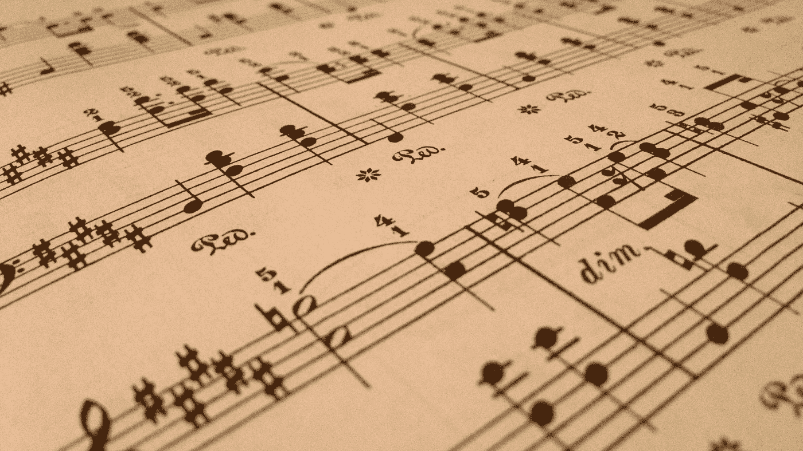

# 利用机器学习创作音乐！

> 原文：<https://medium.com/analytics-vidhya/using-machine-learning-to-create-music-6581f1048e24?source=collection_archive---------16----------------------->

是的，你没看错！机器学习可以做音乐。本文将向您展示如何在 Keras 中使用神经网络模型生成简单的钢琴作品。我要感谢 sigur ur skúLi 的指导，因为它被证明是撰写本文的一个很好的参考和理解来源。

# **基本思路**