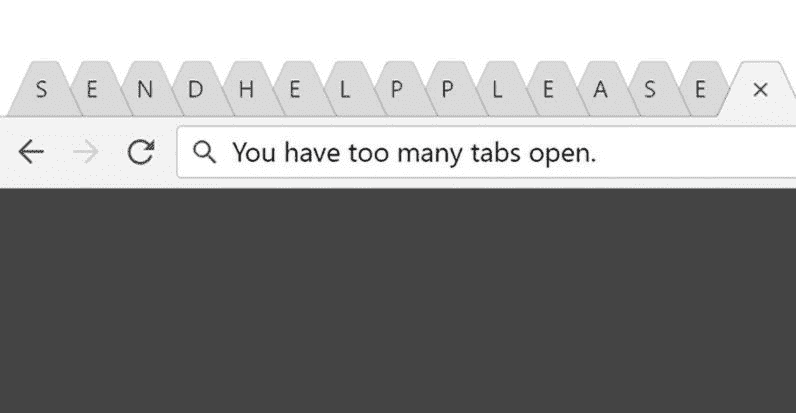
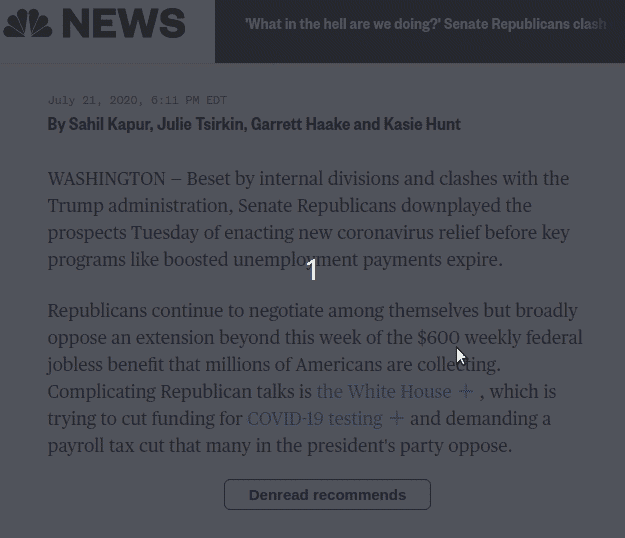
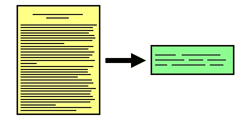
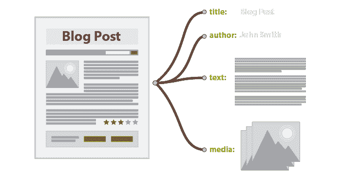
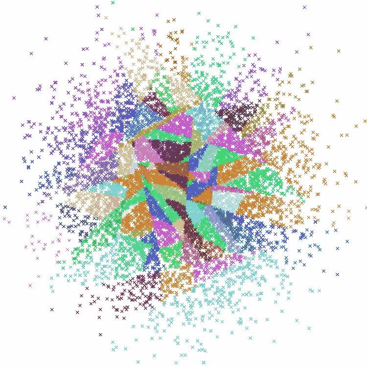

# 使用机器学习为你的信息寻找来源

> 原文：<https://medium.com/analytics-vidhya/using-machine-learning-to-find-sources-for-your-information-3355f6829467?source=collection_archive---------25----------------------->

做网络研究的过程可能会很乏味。你有没有发现自己在阅读一个段落，高亮显示一些文本，搜索，在新的标签页中打开所有的搜索结果，试图阅读所有的结果，并把它们与原文联系起来？

如果有一种方法可以自动读取所有这些标签会怎么样？

这就是为什么我开发了 Google Chrome 扩展 [Denread](http://denread.com) ，它允许用户点击 nbcnews.com 上的一个段落来查看该信息和其他建议内容的潜在来源。

前两个超链接旁边有“+”按钮，会弹出文章的摘要句子。下面是 Denread 的建议，它们是本段的建议信息来源。

这一过程的运作方式与你自己通过谷歌搜索找到这些信息的方式极其相似。目前，该扩展仅支持 nbcnews.com，但将来会有更多。我正在展示付费版的 Denread。用户可以付费获得更多网站的建议，或者在可下载的 notes 应用程序中自己写作，或者两者兼而有之。我加入了一家初创企业孵化器——纽约鹿角 2020 群组 2，它在 2020 年 5 月至 7 月期间举办了一个为期 10 周的项目，并与那里的创业社区建立了联系。我继续与潜在客户交谈，寻找应用程序。

# 您对使用 Denread 感兴趣吗？

Denread 是[免费安装在 chrome 扩展商店](https://chrome.google.com/webstore/detail/denread/lkhppoidmdmbhlogngdbinkmmhhamdik?hl=en-US)。我为每天做大量网络研究的人设计了这个产品。人们经常在谷歌上搜索他们的资源，或者浏览冗长的文档。我的目标客户是记者、法律专家和技术研究人员。如果你属于这些类别之一，或者你有兴趣询问付费版本，请给我发电子邮件至 raymond.y.xu@gmail.com。

# 想知道它是怎么工作的吗？

我正试图使网络研究过程自动化。因此，以下每一项都需要自动化:挑选谷歌可搜索的短语，下载这些文档，提取它们的段落，将这些段落特征与我们的原始文档进行比较，并输出最佳匹配。

# 第一步:挑选可搜索的短语

长文本被转换成更小的、可搜索的短语。

为了开始浏览一些文档以查看它们是否有相关信息，我们需要在某个地方找到那些文档。一个简单的方法是模仿人类从段落中寻找可搜索短语并在搜索引擎上查找的过程。该项目的所有部分都将在 python 3。对于这个关键短语提取，我将使用库 [rake_nltk](https://github.com/csurfer/rake-nltk) 。

*输入:“对于 Python 用户，有一个简单易用的关键词提取库叫做 RAKE，代表快速自动关键词提取。算法本身在 Michael W. Berry 的文本挖掘应用和理论一书中有描述(免费 PDF)。这里，我们遵循现有的 Python 实现。还有一个修改版本，使用自然语言处理工具包 NLTK 进行一些计算。对于本教程，我已经将原始的 RAKE 存储库分叉并扩展到 RAKE-tutorial 中，以使用额外的参数并评估其性能。”*

在这个输入段落被输入到短语提取器之后，这是输出:

*输出:[(29.83333333333333332，'使用名为 rake 的关键词提取库')，(25.0，'自然语言处理工具包 nltk ')，(18.0，'快速自动关键词提取')，(10.5，'使用附加参数')，(9.3333333333333334，'原始 rake 库')，(9.0，'文本挖掘应用')，(9.0，'免费 pdf)。')、(8.5，'现有 python 实现')、…]*

其中每个短语结果既有短语文本又有分数(分数越高，短语越能代表段落)。

# 第二步:从谷歌上找到的文章中提取文本

好了，我们有了我们的谷歌短语。但是遗憾的是，Google 搜索 API 并不是免费的(事实上非常昂贵并且不可扩展，[每 1k 查询 5 美元，直到 10k 查询](https://developers.google.com/custom-search/v1/overview))。但是有一个很棒的抓取库叫做 [se-scraper](https://github.com/NikolaiT/se-scraper) ，它可以帮你抓取结果，并把它们转换成 JSON 格式以便于使用。另一个伟大的图书馆叫做 [newspaper3k](https://newspaper.readthedocs.io/en/latest/) 从在线新闻文章中提取段落。这些段落然后被存储用于比较步骤。

# 第三步:这是机器学习部分:为段落寻找特征，并匹配相似的特征

近似最近邻是一种快速找到哪个特征向量最接近查询的算法。照片来自 Spotify 的 aroy(近似最近邻居哦耶)Github [资源库](https://github.com/spotify/annoy)。这是他们向用户提供歌曲推荐的技术之一。

受 Onebar 的另一篇[媒体博客文章的启发，我使用通用句子编码器(USE)将每一段文字转换成一个向量。这是一个为多项任务(如下一句预测)优化的网络，因此嵌入相对通用，可以对句子意义进行编码，并可以比较许多不同主题的主题。在所有段落被索引到向量中之后，](https://blog.onebar.io/building-a-semantic-search-engine-using-open-source-components-e15af5ed7885) [hnswlib](https://github.com/nmslib/hnswlib) 近似最近邻算法找到哪个段落在特征方面最接近原始段落。然后对所有的 pargarphss 进行排序，找出与原始文本意义最接近的 pargarph。

以下是如何使用 Univresal 句子编码器来比较几个句子。

# 步骤 4:显示找到的内容

现在我们已经有了一个很好的列表，列出了哪些段落是最好的建议，我们需要以某种方式向用户展示它们。我认为向用户展示这一信息的最便捷方式是使用 chrome 扩展，这样用户就可以点击一个段落，立即在下拉菜单中看到他们的建议。

Denread 是 chrome 的扩展版本！

# 步骤 5:设置 Google Cloud 实例来托管这个服务

每当 nbcnews.com 上出现一篇文章，Denread 就会立即接收并开始计算建议。为了让这个过程一直运行，我把它托管在谷歌云平台(GCP)上，以保证正常运行时间和响应度。

# 就是这样！

如果你有兴趣改善你的网络研究过程，请联系我们。我希望把这个产品改进成能改变我们查找信息方式的东西。