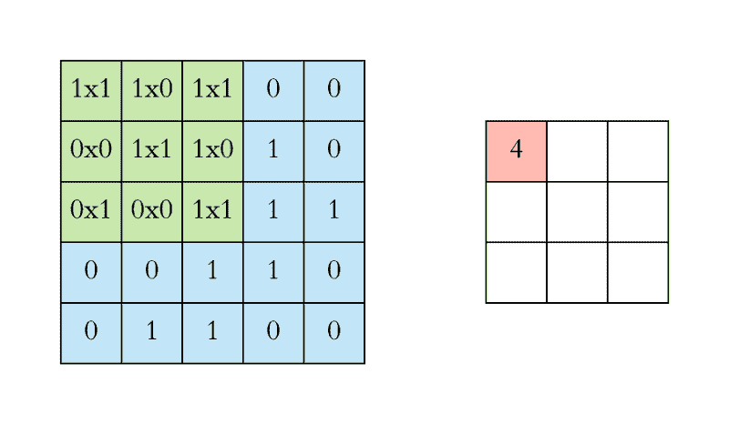
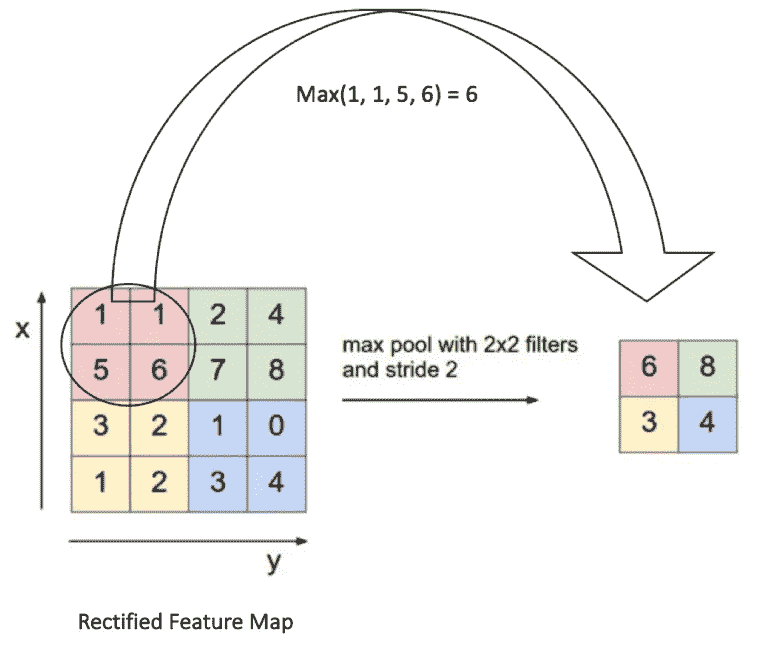

# 使用机器学习识别语音频谱图中的重音

> 原文：<https://medium.com/analytics-vidhya/using-machine-learning-to-identify-accents-in-spectrograms-of-speech-5db91c191b6b?source=collection_archive---------7----------------------->

## ML 竞赛中的一个 TF Keras 卷积模型。第一部分。

## 描述

语音识别软件使我们的设备能够响应我们的语音。我们在手机、汽车和家用电器中都可以看到它。但是对于有口音的人来说——甚至是同一国家不同地区的方言和慢吞吞的声音——人工智能说话者可能看起来非常不同:注意力不集中，反应迟钝，甚至孤立。研究人员发现，与母语为英语的人相比，智能说话者在解析非母语人士的语音时会多犯大约 30%的错误。其他研究表明，语音识别软件通常对男性来说比女性更适用于 T2。

算法偏差通常源于它们被训练的数据集。改善非母语人士使用语音识别软件的体验的方法之一是在一组不同的语音样本上训练算法。现有语音样本的口音检测有助于生成这些训练数据集，这是缩小“口音差距”和消除语音识别软件偏见的重要一步。

## 关于数据

[声谱图](https://en.wikipedia.org/wiki/Spectrogram)是声音随时间变化的各种频率的直观表示。x 轴代表时间(以秒为单位)，y 轴代表频率(以赫兹为单位)。颜色表示特定时间特定频率的振幅(即声音有多大)。

这些频谱图是从 [Mozilla Common Voice 数据集](https://voice.mozilla.org/en/datasets)中的音频样本生成的。每个语音剪辑以 22，050 Hz 采样，并包含来自以下三个国家之一的口音:加拿大、印度和英国。有关光谱图的更多信息，请参见[主页](https://datasciencecapstone.org/competitions/16/identifying-accents-speech/page/49/)。

## 用于图像分类的卷积神经网络

卷积神经网络( **ConvNets** 或**CNN**)是一种神经网络，一种深度学习模型，已经在许多分类图像能力和领域(如图像识别、对象检测、图像分割)中证明了很好的结果。他们正在为机器人和自动驾驶汽车的视觉提供动力。

> CNN 与普通的 NN(多层感知器)非常相似，但它们“明确假设输入是图像，这允许我们将某些属性编码到架构中。这使得转发功能更有效地实现，并极大地减少了网络中的参数数量”。[2]

常规神经网络不能很好地与图像缩放，接收 32×32×3 图像的神经元将具有 3072 个权重。具有更大尺寸的图像的多层网络可以产生数百万或数十亿个参数，因此它在计算上非常昂贵，并且会导致过拟合。*“在一个 ConvNet 中，一个层中的神经元只会连接到它之前的层的一小部分区域，而不是以完全连接的方式连接所有的神经元。在 ConvNet 架构结束时，我们将把整个图像简化为一个单一的类得分向量。”*【2】视觉识别的卷积神经网络 CS231 Standford。

一个简单的 ConvNet 是一系列层，ConvNet 的每一层都通过一个可微函数将一个激活量转换为另一个激活量。我们使用三种主要类型的层来构建 ConvNet 架构:**卷积层**、**池层**和**全连接层**(与常规神经网络中看到的完全一样)。我们将堆叠这些层，形成一个完整的 ConvNet **架构。详细解释见参考文献[2]。**

在下一张图中，我们可以观察到 CNN 的三个基本层，摘自[一篇解释清楚的博文](https://adeshpande3.github.io/A-Beginner%27s-Guide-To-Understanding-Convolutional-Neural-Networks/):

CNN 图层图。来源:[https://adeshpande 3 . github . io/A-初学者% 27s-理解指南-卷积神经网络/](https://adeshpande3.github.io/A-Beginner%27s-Guide-To-Understanding-Convolutional-Neural-Networks/)

## ConvNet 中的层

标准 ConvNet 中有四种主要操作:

1.  盘旋
2.  非线性(ReLU)
3.  混合或二次抽样
4.  分类(全连接层)

> “这种架构基于最早的卷积神经网络之一 LeNet，它有助于推动深度学习领域。[Yann le Cun 的这项开创性工作自 1988 年以来经过多次成功迭代后被命名为 LeNet5](http://yann.lecun.com/exdb/publis/pdf/lecun-01a.pdf) 。[5]卷积神经网络的直观解释

**卷积层**:一个输入图像是像素的矩阵，HxWxC，H 代表高度，W 代表宽度，C 代表通道。灰度图像只有一个通道，而 RGB 或彩色图像有三个通道:红色、绿色和蓝色。在 Conv 图层中，仅考虑输入图像中的一小部分区域，计算权重的点积并生成单个值。这种称为卷积的操作通过在输入数据的那个小方块上学习图像特征来保持图像中像素之间的空间关系。

权重或 CONV 层的参数由一组可学习的过滤器或内核或*特征检测器*组成。**内核**从左上角到右下角滑过整个图像，计算过滤器的权重和内核覆盖的图像像素之间的点积(称为*感受域*)。下一步是将滤波器向右移动 1 个单位，然后再向右移动 1 个单位，当 stride 等于 1 时，依此类推。对于一个 32×32×3 的图像和 12 个 5x5x3 的内核以及 1 的步距，输出将是一个 28×28×12 的向量，称为“特征图”或“激活图”。对于 HxWxC 图像，HkxWkxC 和 stride s 的 K 个内核，输出将是 H-Hk+s x W-Wk+s x K，我们正在考虑*零填充*。

注意，3×3 矩阵在每一步中只“看到”输入图像的一部分。

一个过滤器(红色轮廓)滑过输入图像(卷积运算)产生一个特征图。另一个过滤器(带有绿色轮廓)在同一图像上的卷积给出了不同的特征图，如图所示。重要的是要注意，卷积运算捕获原始图像中的局部依赖性。还要注意这两个不同的过滤器是如何从相同的原始图像生成不同的特征图的。

但是，过滤器的值是什么呢？它们是参数或权重，在训练阶段自行学习。

*   激活层的 RELU 层:在每一个卷积操作之后，使用了一个叫做*激活*的附加操作。ReLU 代表整流线性单元，是一种非线性操作。其输出由下式给出:

它将应用逐元素激活函数，例如在零处的 max(0，x)阈值，因此用零替换特征图中的所有负像素值。它为我们的模型提供了强制性的非线性，因为我们希望我们的 ConvNet 学习的真实世界数据通常是非线性的。此操作不会改变输出的大小。

应用 RELU 函数。来源[8]

> **池层**:“该层周期性地包含在 Conv 层之间，以减少参数的数量、模型的空间大小和计算成本。这就是它被称为子采样或下采样的原因。最重要的是，它将有助于防止或控制过度拟合。池层对输入的每个深度切片进行独立操作，并在空间上调整其大小，通常使用最大值或 AVG 运算。它从定义的窗口内的矫正特征图中获取最大元素(MAX)或平均值(AVG)。最常见的窗口形式是跨度为 2 的 2x2 池层。在我们例子中，28×28×12 的输入产生 14×14×12 的输出”。*关于这个环节的完整解释【2】用于视觉识别的卷积神经网络:*[*http://cs231n.github.io/convolutional-networks/*](http://cs231n.github.io/convolutional-networks/)

在下一张图中，我们可以观察到 2x2 池图层在要素地图中的应用。

*“除了减少特征维度和参数数量之外，合并层使得网络对于输入图像中的小变换、旋转、缩放、扭曲和平移不变。这有助于检测图像中的物体，无论它们位于何处。来源【ujjwalkarn 对卷积神经网络的直观解释。*

每个过滤器将低级特征的局部补丁组成高级表示。这就是为什么 CNN 在计算机视觉方面如此强大。

> **全连接层**:“在分类图像问题中，这一层基本上接受一个输入，无论它之前的 conv 或 ReLU 或 pool 层的输出是什么，并输出一个 N 维向量，其中 N 是程序必须从中选择的类的数量。卷积层和池层的输出代表输入图像的高级特征。全连接图层的目的是使用这些特征根据训练数据集将输入图像分类到不同的类中。”。*参见[3]理解卷积神经网络的初学者指南* [*的扩展解释 https://adeshpande 3 . github . io/A-初学者% 27s-理解卷积神经网络指南/*](https://adeshpande3.github.io/A-Beginner%27s-Guide-To-Understanding-Convolutional-Neural-Networks/)

完全连接的图层通过学习先前图层中特征地图的非线性组合来提高 Conv 图层的预测能力。

## CNN 背后的直觉

一般来说，理解 CNN 如何工作的一种方式是，每个卷积层都比前一层检测到更复杂的特征。在第一层中，ConvNet 可以学习从原始像素中检测不同位置的边缘，然后在第二层中使用这些边缘来检测简单的形状，如拐角，然后使用这些形状来确定更高级别的特征，如更高层中的面部形状。

从卷积深度信念网络中学习特征。来源[9]

例如，我们可以通过在两个相邻像素上取值 1 和 1 来检测边缘，而在其他地方取值 0。也就是说，我们减去两个相邻的像素。当并排的像素相似时，我们得到的值大约为零。然而，在边缘上，相邻像素在垂直于边缘的方向上非常不同。然后，每一层应用不同的过滤器，通常是成百上千个，就像上面显示的那样，并组合它们的结果

[http://colah . github . io/posts/2014-07-Understanding-Convolutions/](http://colah.github.io/posts/2014-07-Understanding-Convolutions/)

CNN 的一个重要理由是他们速度快。非常快。卷积是计算机图形的核心部分，在 GPU 的硬件层面上实现。

## 关于挑战

我们的目标是从语音样本的频谱图中预测说话者的口音。有三种口音的身份，来自加拿大，印度和英国的人。我们将使用 CNN 模型来预测给定光谱图的重音。

***我们将在第二部分继续。描述和开发一个用 Keras 框架构建的 CNN，然后它将在 Azure ML 服务中接受训练。***

## 参考资料:

[1]问题及比赛描述:[https://datasciencecapstone . org/competitions/16/identifying-accents-speech/page/49/](https://datasciencecapstone.org/competitions/16/identifying-accents-speech/page/49/)

[2]用于视觉识别的卷积神经网络:[http://cs231n.github.io/convolutional-networks/](http://cs231n.github.io/convolutional-networks/)

[3]理解卷积神经网络的初学者指南[https://adeshpande 3 . github . io/A-初学者% 27s-理解卷积神经网络指南/](https://adeshpande3.github.io/A-Beginner%27s-Guide-To-Understanding-Convolutional-Neural-Networks/)

[4]了解用于 NLP 的卷积神经网络[http://www . wild ml . com/2015/11/Understanding-convolutionary-Neural-Networks-for-NLP/](http://www.wildml.com/2015/11/understanding-convolutional-neural-networks-for-nlp/)

[5]ujwalkarn 对卷积神经网络的直观解释，[https://ujwalkarn . me/2016/08/11/Intuitive-explain-conv nets/](https://ujjwalkarn.me/2016/08/11/intuitive-explanation-convnets/)

[6]基于梯度的学习应用于文档识别。Yann Lecun、León Bottou、Yoshua Bengio 和 Patrick Haffner。【http://yann.lecun.com/exdb/publis/pdf/lecun-01a.pdf 

[7]https://cs.nyu.edu/~fergus/tutorials/deep_learning_cvpr12/视觉 CVPR 深度学习方法 2012 教程

[8][http://mlss . tuebingen . mpg . de/2015/slides/Fergus/Fergus _ 1 . pdf](http://mlss.tuebingen.mpg.de/2015/slides/fergus/Fergus_1.pdf)

[9]用于分层表示的可扩展无监督学习的卷积深度信念网络[http://web . eecs . umich . edu/~ hong lak/icml 09-convolialdeepbeliefnetworks . pdf](http://web.eecs.umich.edu/~honglak/icml09-ConvolutionalDeepBeliefNetworks.pdf)

[10]了解卷积[http://colah . github . io/posts/2014-07-了解卷积/](http://colah.github.io/posts/2014-07-Understanding-Convolutions/)

[6][https://www . pyimagesearch . com/2018/11/26/instance-segmentation-with-opencv/](https://www.pyimagesearch.com/2018/11/26/instance-segmentation-with-opencv/)