# 使用机器学习识别语音频谱图中的重音。第二部分

> 原文：<https://medium.com/analytics-vidhya/using-machine-learning-to-identify-accents-in-spectrograms-of-speech-part-2-cc0150b81b83?source=collection_archive---------16----------------------->

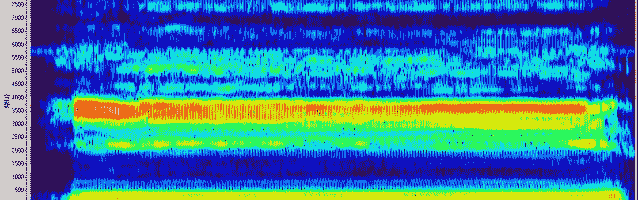

在这个 ML 模型的开发中，我们将使用一个基于微软 Azure 的非常强大的平台/工具，Azure 机器学习服务。它是一个基于云的框架，用于设计、培训、部署和管理机器学习模型。它提供了一个工具包，您可以在其中管理和监督机器学习模型开发的所有步骤。

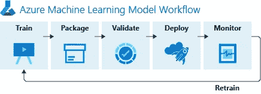

> 获得对用于机器学习模型训练和推理的[开源工具和框架](https://azure.microsoft.com/en-us/overview/ai-platform/dev-resources/)的内置支持。使用熟悉的框架，如 PyTorch、TensorFlow 和 scikit-learn，或者开放的互操作 ONNX 格式。选择最符合您需求的开发工具，包括流行的 ide、Jupyter 笔记本和 CLIs，或者 Python 和 r 等语言。使用 ONNX 运行时来优化和加速跨云和边缘设备的推理。

我们对微软提供的非常强大的 Python 非常感兴趣，数据科学家和人工智能开发人员通过 [Azure 机器学习服务](https://docs.microsoft.com/azure/machine-learning/service/overview-what-is-azure-ml)构建并运行机器学习工作流。你可以在任何 Python 环境中与服务进行交互，包括 Jupyter 笔记本、 [Visual Studio Code](https://docs.microsoft.com/azure/machine-learning/service/how-to-vscode-tools) ，或者你最喜欢的 Python IDE。

我们可以使用我们最喜欢的 IDE 在本地编写代码，调用 SDK API 来管理(创建、修改或删除)过程中涉及的所有对象(工作区、实验、运行或培训)，而无需与 Azure Portal 进行手动交互。然后，在训练期间，我们可以在 Azure Portal 中可视化模型中定义的损失和指标，帮助我们在单个点或容器中监督和分组所有信息。

但是让我们向您展示如何去做，大部分代码都是从微软文档的教程中提取的，所以入门非常容易。

代码可以在这个 Github 库中访问。

首先，加载库或 SDK

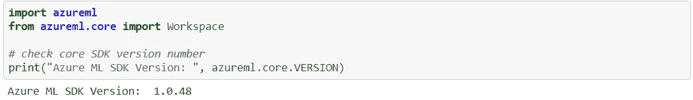

## 创建 Azure 机器学习工作区并进行实验

然后，我们需要获得或创建一个机器学习工作区，它将是我们所有模型或训练的“容器”。因此，假设它对应于一个项目:

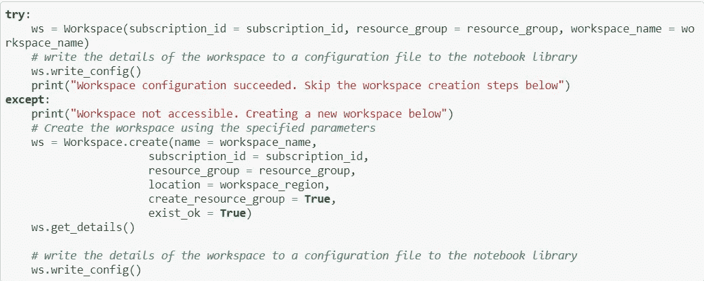

变量 *subscription_id* 、 *resource_group* 和 *workspace_name* 必须设置为我们的 Azure 配置或首选项。现在，ws 是我们的主要对象，所有的操作都将在这里执行。

下一步，创建一个实验。实验是一个容器，它将保存我们的训练、他们的度量、他们的输出……然后我们可以分析和比较我们在模型中不同架构或参数上的结果。这将是我们在训练和评估一个 ml 模型期间的日记。我们将创建一个文件夹来存放培训脚本。脚本运行将被记录在 Azure 的实验下。

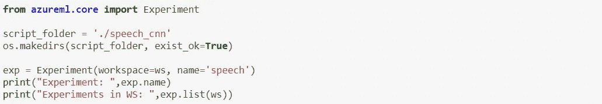

## 创建和定义计算资源

然后，为了运行我们的实验，我们需要一些计算能力，也就是所谓的*计算资源。*在本节中，我们将获得用于训练模型的计算资源。我们将搜索现有的计算资源，如果它不存在，我们将创建它。我们可以使用预先创建的虚拟机，如 Azure Data Science 虚拟机，或者我们可以创建一个新的计算资源来指示类型和计算能力。我们不必担心停止或删除资源，它们会自动停止，我们只需为我们的消耗时间付费。

如果有必要，我们可以在一个虚拟机集群上执行我们的模型。要创建集群，您需要指定一个计算配置，该配置指定要使用的机器类型和可伸缩性行为。然后，为集群选择一个在工作空间中唯一的名称，该名称可用于以后对集群进行寻址。有许多类型的计算资源:“V2 DS12 标准”，“V2 D4 标准”，有一定数量的 RAM 和 GPU 或 CPU 等。

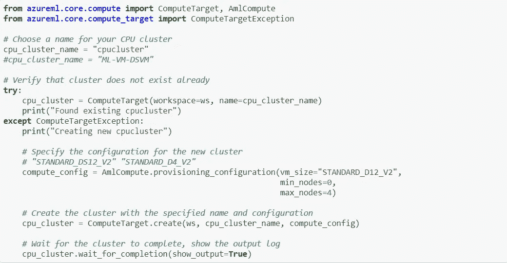

## 数据存储，数据存放在其中

现在，我们需要存储我们的训练数据，供我们的实验使用。我们有不同的选择，我们可以将它本地存储在 vm 中或 Azure 中的共享数据存储中。输入数据策略取决于许多因素，我们不会在本文中讨论(更多信息？).

数据存储是一个可以存储数据的地方，然后实验(其中的运行对象)可以通过将数据装载或复制到计算目标来访问数据。数据存储可以由 Azure Blob 存储或 Azure 文件共享提供支持(未来将支持 ADLS)。对于简单的数据处理，如果数据不在 Blob 存储或文件共享中，每个工作区都提供一个可以使用的默认数据存储。我们将使用默认数据存储。

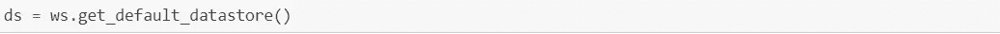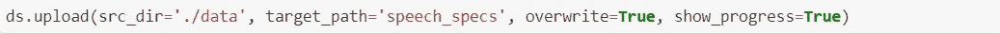

在这个阶段，一切准备就绪，可以开始我们的模型训练了。在此之前，我们需要设置一些参数，设置之前创建的计算资源，将所有要运行的代码或脚本复制到一个文件夹中。脚本文件夹应该包含 azure 作业训练模型所需的所有文件，包含要运行的代码的 python 文件将在 estimator 对象的参数中定义。这个。py 文件将运行训练过程的所有步骤:读取数据、分割数据、创建模型、设置参数、编译和拟合模型以及评估损失和度量。此文件夹将被复制到将执行培训作业的计算资源中。

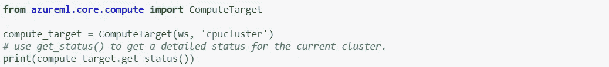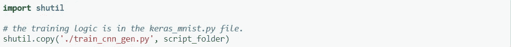

## 创建张量流估计器

接下来，我们构造一个 azure ml . train . dnn . tensor flow estimator 对象，使用计算目标，并将数据存储的挂载点作为参数传递给训练代码。TensorFlow 估算器提供了一种在计算目标上启动 TensorFlow 训练作业的简单方法。它会自动提供一个安装了 TensorFlow 的 docker 映像。在本例中，我们添加了 keras 包(显然是针对 Keras 框架的),以及 matplotlib 包，用于绘制“损失与准确性”图表，并将其记录在运行历史中。

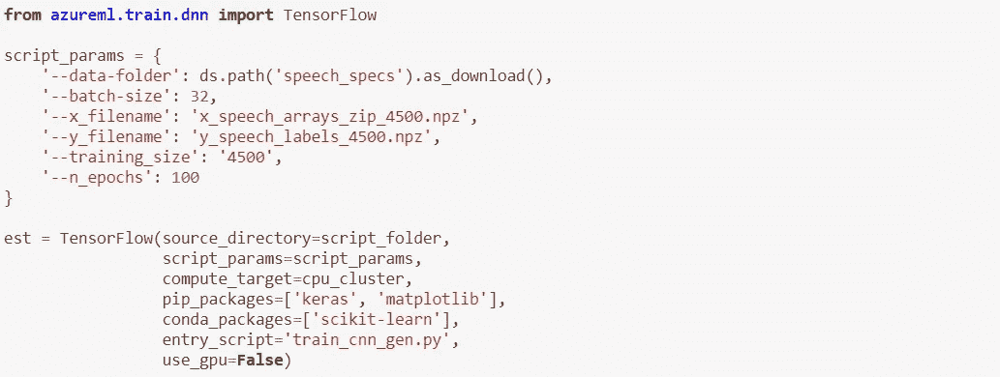

最后，我们可以将评估器提交给 Azure ML 实验来开始执行。现在，所有资源都将启动，因此第一次需要几分钟(5-10 分钟)来开始培训。

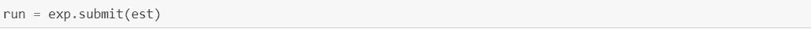

运行执行时，将经历以下阶段:

*准备*:创建一个与 TensorFlow estimator 指定的 Python 环境相匹配的 docker 映像，并将它上传到工作区的 Azure 容器注册中心。对于每个 Python 环境，这一步只发生一次——容器将被缓存以供后续运行。创建和上传图像大约需要 5 分钟。在作业准备过程中，日志会流式传输到运行历史记录中，并且可以通过查看日志来监控映像创建的进度。

*扩展*:如果计算需要扩展(即计算集群需要比当前可用节点更多的节点来执行运行)，集群将尝试扩展以提供所需数量的可用节点。缩放通常需要大约 5 分钟。

*运行*:脚本文件夹中的所有脚本都被上传到计算目标，数据存储被挂载/复制，entry_script 被执行。当作业运行时，stdout 和。/logs 文件夹传输到运行历史记录中，可以通过查看来监控运行进度。

*后处理*:把。将运行的/outputs 文件夹复制到运行历史记录中

有多种方法可以检查正在运行的作业的进度。我们可以使用 Jupyter 笔记本小部件:

在。py 文件我们对模型的参数进行编码，拆分并准备数据数据，设计神经网络，执行训练并绘制度量标准。让我们谈谈与 azure ML 对象相关的部分。

我们需要设置一些参数，并使用 python 解析器对象解析和检索这些参数:

然后，我们加载数据，将其分为训练集和评估集，创建一个 Keras CNN，其中 3 个卷积层采用批处理标准化和 RELU 激活，2 个密集层采用 RELU 激活。最后，我们包括一个具有 softmax 激活函数的密集层，其输出大小等于要预测的类的数量。我们应用一些数据扩充来防止过度拟合，拟合和评估模型。您可以在中观察并获得所有细节。py 文件包含在文件夹*中的* [中的*演讲 _cnn 资源库*中的](https://github.com/edumunozsala/spectrograms_speech_classification)。

但是我们感兴趣的是在实验中记录我们的模型结果，所以我们可以稍后在 Azure 中分析它们。我们可以使用回调函数来做到这一点:

[https://gist . github . com/b20e 847706 CD 13932d 092 f 0 cfbfe 569 f . git](https://gist.github.com/b20e847706cd13932d092f0cfbfe569f.git)

在每个时期结束时，存储所获得的损失和精度值，然后我们可以使用它们在训练和验证数据集的训练期间绘制损失函数和精度。这张图片可以保存到工作区的实验中，稍后我们可以在 Azure 中看到它。我们还可以在实验中将模型保存为 json 格式，这样我们就可以在想要重现结果或进行推断的任何时候加载它。

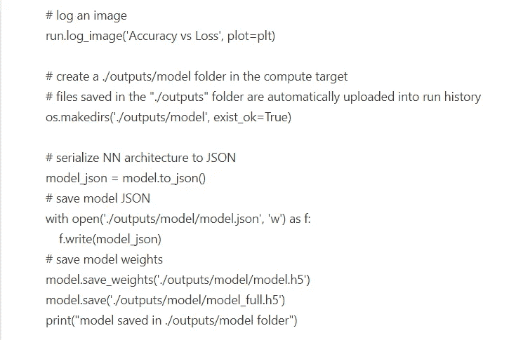

这就是全部，现在我们有一个训练好的模型和结果存储在我们的 Azure 帐户中，从我们的 Azure ML 工作区的实验中，我们可以观察结果、图表和输出模型。

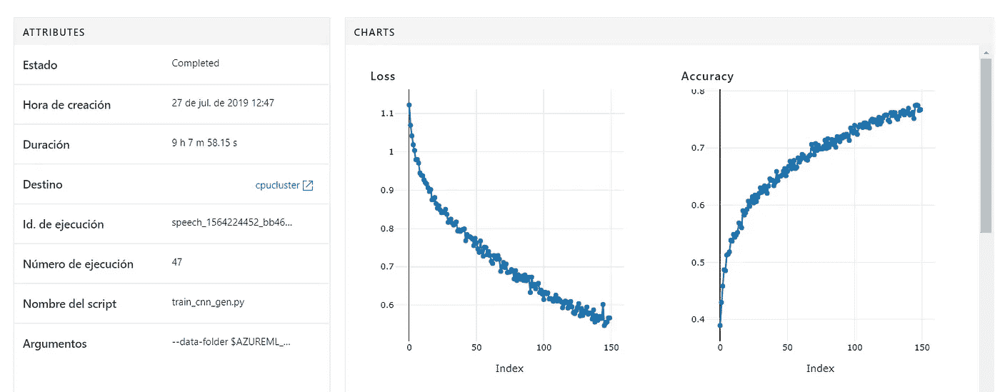

训练过程中丧失功能和准确性

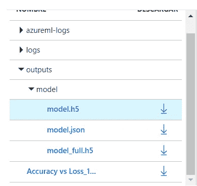

模型 h5 和 json 文件，现在我们可以下载到任何我们想使用的地方

这只是一个关于如何在 Azure 机器学习服务中训练 ML 模型的简单例子，随着发布的许多新功能，它的发展非常流畅。

[Github 库](https://github.com/edumunozsala/spectrograms_speech_classification)。

 [## SDK de Azure 机器学习 para Python

### 人工智能领域的数据科学和开发人员

docs.microsoft.com](https://docs.microsoft.com/es-es/python/api/overview/azure/ml/intro?view=azure-ml-py)