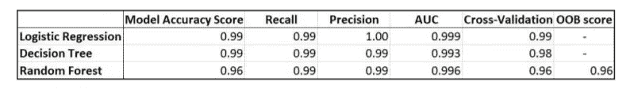

# 使用机器学习预测客户流失

> 原文：<https://medium.com/analytics-vidhya/using-machine-learning-to-predict-customer-churn-e352c126ce90?source=collection_archive---------25----------------------->


可视化流失

这篇文章将对我参与的一个项目提供一个高级的、初学者友好的概述，该项目涉及使用机器学习技术来预测电信公司的哪些客户可能会流失(即不续订公司服务)。流失是包括电信在内的各种行业的公司面临的一个主要问题。通过预测可能流失的客户，公司可以接触这些客户以留住他们。这个项目的代码可以在 Github 这里看到:[https://github.com/ConorMoloney96/Churn_Prediction](https://github.com/ConorMoloney96/Churn_Prediction)

这个项目使用的 3 个模型是逻辑回归、决策树和随机森林。每种方法都有优点和缺点，这将在本文后面探讨。客户流失预测问题本质上是一个二元分类问题，因为输出值可能属于两个类别中的一个(客户流失或未流失)。

用于评估模型的技术之一是 k-fold 交叉验证。该技术包括将训练设置分成 k 个折叠/部分。然后，k-1 个折叠用于训练，而剩余的折叠用于评估模型。这被重复 k 次，每个折叠被用作评估器一次。然后可以计算分数的平均值。交叉验证允许在不依赖测试数据的情况下容易地识别过度拟合。

逻辑回归是线性回归的一种变体，用于预测离散类，而不是由线性回归模型做出的连续数值预测。

```
lr = sklearn.linear_model.LogisticRegression(solver='lbfgs', max_iter = 1000)
#Reshape data into 2D array
X_train = X_train.to_numpy()
X_train = X_train.reshape(-1,25)
lr.fit(X_train, y_train)
print(lr.score(X_train, y_train))

scores = cross_val_score(lr, X_train, y_train, cv = 10)
print("Cross validation score: %0.4f" % scores.mean())
```

我还应用了决策树，一种使用树状结构来模拟决策及其潜在后果的模型。决策树相对容易理解和可视化，并且非常省时，这使得它们的应用高度可伸缩。然而，过度拟合是决策树的一个大问题，可以通过修剪技术或指定最大树深度来解决

```
 lr = sklearn.tree.DecisionTreeClassifier()
    #Reshape data into 2D array
    X_train = X_train.to_numpy()
    X_train = X_train.reshape(-1,25)
    print(X_train.shape)
    lr.fit(X_train, y_train)
    visualize_tree(lr, df)
    #Accuracy = accurate predictions/total predictions
    print(lr.score(X_train, y_train))
    test_model(lr)
    scores = cross_val_score(lr, X_train, y_train, cv = 10)
    print("Cross validation score: %0.4f" % scores.mean())
```

最后，我们使用随机森林，这是一种元估计器，在数据子集上训练多个决策树，并对结果进行平均，以提高预测准确性并减少过度拟合。随机森林还允许简单地计算特征重要性，指示每个特征预测流失的程度。我们发现，到目前为止，客户过去六个月的总收入具有最高的预测能力，收入越高，客户流失的可能性越大。客户上个月的收入是下一个最重要的特征。确定最相关的影响因素并仅使用这些因素来训练预测客户流失的模型，可以提高模型的准确性，同时减少训练时间。

```
rf = sklearn.ensemble.RandomForestClassifier(n_estimators=100,    n_jobs=-1, oob_score=True, bootstrap=True, random_state=24)
    X_train = X.to_numpy()
    #reshape input data into 26 columns for the 26 remaining features
    X_train = X_train.reshape(-1,25)
    rf.fit(X_train, y)
    importances = rf.feature_importances_
    for name, importance in zip(df.columns, importances):
        print(name, " = ", importance)

    #Create a dataframe to visualize importances
    feat_importances = pd.Series(importances, index = df.columns)
    feat_importances.nlargest(4).plot(kind='barh')

    print("Accuracy on training data: ")
    print(rf.score(X_train, y))
    print("Out of bag score: ")
    print(rf.oob_score_)
    scores = cross_val_score(rf, X_train, y, cv = 10)
    print("Cross validation score: %0.4f" % scores.mean())
```

最后比较了三种预测模型的性能。我们使用了几个指标来进行比较，如下表所示。从下表中可以看出，所有 3 个模型在预测客户流失以及满足其他指标方面都很成功。由于所有 3 个模型的预测能力大致相似，我建议使用决策树，因为它最容易向业务用户(以及客户、监管机构和其他利益相关方)解释。



型号对照表