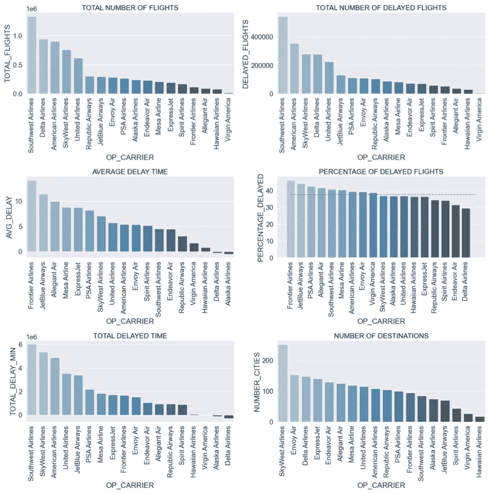
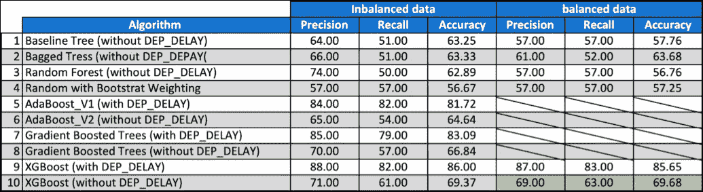
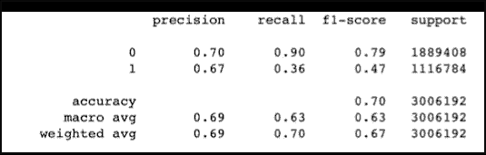
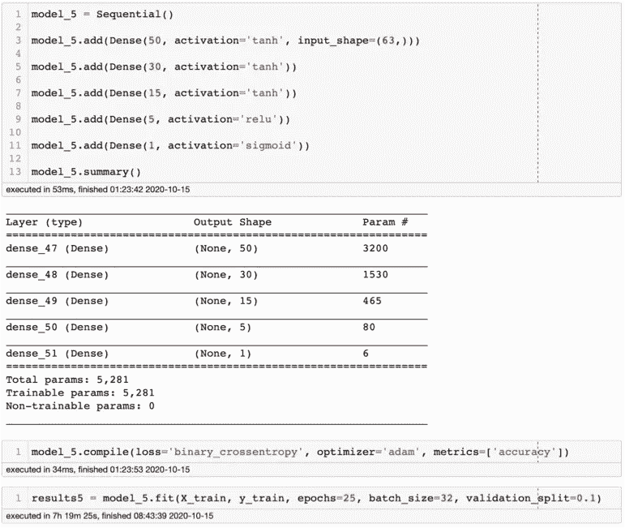
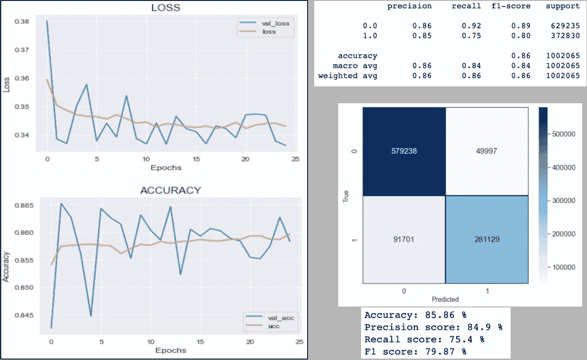
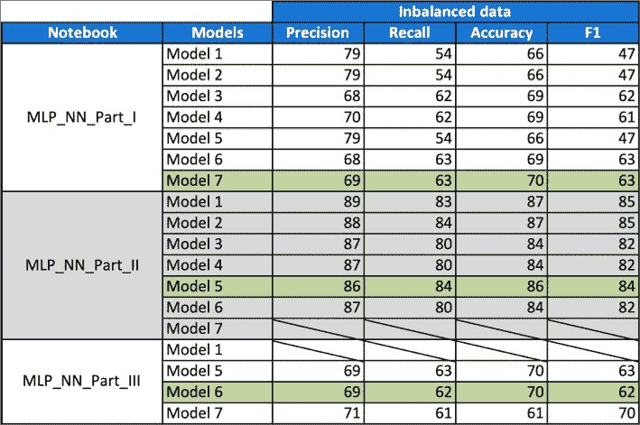

# 使用机器学习预测航班延误

> 原文：<https://medium.com/analytics-vidhya/using-machine-learning-to-predict-flight-delays-e8a50b0bb64c?source=collection_archive---------2----------------------->

由于航空业正在经历的相关财务损失，航班延误已经成为全世界航空运输的一个非常重要的主题。根据美国运输统计局(BTS)的数据，2018 年期间，超过 20%的美国航班延误，造成了相当于 410 亿美元的严重经济影响。

这些延误不仅给航空公司带来不便，也给乘客带来不便。结果是旅行时间的增加，这增加了与食物和住宿相关的费用，并最终导致乘客的压力。航空公司是额外成本的受害者，这些额外成本与他们的机组人员、飞机重新定位、试图减少飞行时间时的燃料消耗以及许多其他因素有关，这些因素一起损害了他们的声誉，并经常导致乘客需求的损失。

这些延误的原因各不相同，从空中拥堵到天气状况、机械问题、乘客登机困难，以及航空公司无法满足其运力需求。

那么作为乘客可以做些什么来避免航班延误呢？有没有可能在你的航班出现在登机牌上之前就知道它是否会被延迟？还是在你进入飞机之前？这些问题的答案是也许。通过使用机器学习(ML)算法，你可以尝试预测你的航班是否会在许多方面延误。当然，所有这些不同的算法都会有缺陷和一定程度的准确性，这将与它们被馈送的数据相关联。

在这个项目中，我观察了不同的 ML 技术/算法，试图在航班在出发公告栏上宣布之前预测它是否会延误。因此，我的目标不是尽可能获得最高的准确性，因为如果我想这样做，通过添加一系列特征/类别会使模型在预测能力方面有所偏差，这是非常容易的。例如“出发延误”和“到达延误”。想想吧。如果你登机时已经知道飞机会晚点，那么你的航班很可能会晚点到达。如果你已经知道飞机会晚点，同样的情况也会发生。因此，这些信息被视为探索性数据分析(EDA)的一部分，但被从主模型中取出。为了说明我的观点，我运行了两次模型，第二次只添加了其中一个增加算法预测能力的特征，结果我得到了 15%的平均增长。现在想象一下，如果我添加了所有的特性，这将会增加多少。然而，当登机通知已经公布或者你已经坐在飞机上准备起飞的时候，知道你将晚点到达你的目的地有什么用呢？

正如你所看到的，这个项目是使用 2018 年的数据完成的，并且仅限于美国国内航班。它没有考虑到新冠肺炎的影响，因为它更多的是一个练习，看看这是否可以做到，以及有多准确。

**数据收集**

我使用的数据来自 [Kaggle](https://www.kaggle.com/yuanyuwendymu/airline-delay-and-cancellation-data-2009-2018) ，它由 2009 年至 2018 年的多年数据集组成，按年份划分，因此每年一个文件。每个文件平均包含 28 个类别，有几百万行。由于每个文件的大小，我选择只处理对应于 2018 年的文件，该文件包含超过 720 万行。关于每个类别的详细解释，你可以去 [Kaggle](https://www.kaggle.com/yuanyuwendymu/airline-delay-and-cancellation-data-2009-2018) 或者去我的 [GitHub](https://github.com/JaHerbas/Predicting_Flight_Delays) 。

正如我上面提到的，我将只考虑那些你在飞机起飞前知道的类别。这样的话，我的预测是在出发公告板宣布延误之前，很明显，是在你登机之前。为了让你对我放弃的一些类别有个概念，下面是它们的列表:

*   滑行出去
*   车轮关闭
*   轮子打开
*   出租车进来
*   到达延迟
*   实际经过时间

所有这些都将有助于模型提高预测能力，从而提高准确性。现在，我将添加到 biassed 我的模型并证明我的观点的类别将是“起飞延误”(上面没有列出)，这是完全可以预测的，如果您的飞机晚点起飞，它很可能会晚点到达目的地，但请记住，航空公司试图通过减少他们的飞行时间来解决这些延误，在某些情况下，如图 1 所示，他们成功了，飞机最终准时到达，甚至更早。

图一。航空公司的“起飞延误”(浅蓝色)和“到达延误”(斜线覆盖的区域)之间的比较

**数据预处理/清理**

数据预处理和清理分两个阶段进行，第一阶段专门处理清理，第二阶段专注于特征工程。

在这一点上，我必须暂停一下，决定项目中延迟航班的定义是什么，因为这将决定我是否可以删除任何其他列和/或行。因此，一个航班要被认为是延误的，只需要满足一个标准:

*【迟到目的地】*

很简单，这意味着即使航班从起飞开始有延误，但仍然按时到达，也不会被视为延误。取消的航班也是如此，从理论上讲，它永远不会到达目的地。

这也意味着这将是一个二元分类问题，其中“0”表示航班准时到达，“1”表示航班将会延误。这将我们带到下一个问题，数据集是平衡的吗？图 2 显示了该数据集的不平衡程度，其比例几乎为 2:1，因此在评估模型性能时需要考虑到这一点，因为精度是不够的，因此我还会考虑精度和召回率。

图二。数据分布显示高度不平衡的类别有利于准时到达

**探索性数据分析(EDA)**

对于 EDA 来说，这是一个相当丰富的数据集，因为有 28 个功能有可能被用于设计更多功能。也就是说，我将只分享一些基本的次要情节(图 3)，让你了解已经完成的工作，如果你想了解更多，请随时访问我的 [GitHub](https://github.com/JaHerbas/Predicting_Flight_Delays) 。

图 3。支线剧情显示了一些基本的 EDA 完成。右中图的红色虚线代表航班延误的平均百分比。

图 3 的子图显示了与特定航空公司相关的一些趋势/模式。例如，让我们把重点放在德尔塔航空公司。这家航空公司在“航班数量”(左上)和“延误航班数量”(右上)方面都是前 5 名。听起来不太乐观，是吗？但如果我们进一步观察“平均延误时间”(中左)和“航班延误百分比”(中右)，就可以清楚地看到他们是如何扭转局面的。显然，更多的航班意味着你很可能会有更多的延误航班，然而，这个比例可能会低于其他航班较少的航空公司。就“总延迟时间”(左下)而言，它是最后一名，这是非常积极的，而且他们也是旅行目的地数量最多的前五名(右下)。我不住在美国，我真的不知道这些航空公司的任何事情，但是通过看这些图表，在我看来，就延误而言，这是一家处理得最好的航空公司。这是您将在 EDA 两个文档中找到的信息类型，请记住，我只使用了 2018 年的数据，显然可能会有异常值，因此为了获得更准确的结论，我建议查看所有 10 年的历史数据集。

**造型**

现在，数据已经被清理并通过了彻底的 EDA 过程，是时候开始建模了，这将是如上所述的二进制分类。

对于这一步，我将我的模型分为两组，ML 和深度神经网络。现在，我知道严格来说，神经网络是一种 ML 模型，通常是一种监督学习，所以我这样做只是出于实用性的原因，因为我将如何使用和评估它们。

**建模——机器学习(ML)**

对于 ML，工作流程非常简单，首先定义目标，即 FLIGHT_STATUS，然后将其与 DEP_DELAY(仅适用于第一组模型)一起从数据帧中删除，以定义 X(特性)。完成后，我将测试集和训练集的数据分别拆分为 25%和 75%,并使用典型的 random _ State 42。同样，所有的代码都可以通过模型测试[分离出来。接下来是这些步骤:](https://github.com/JaHerbas/Predicting_Flight_Delays)

*   构建一棵普通的树作为基线
*   创造了袋装树
*   运行了一个没有类权重的随机森林(运行了一个功能重要性图作为 QC 工具)
*   具有 Bootstrat 类权重的随机森林
*   在有和没有 DEP 延迟的情况下运行 AdaBoost
*   具有和不具有 DEP _ 延迟的 RAN 梯度增强树
*   在有和没有 DEP 延迟的情况下运行 XGBoost

每个模型都经过了性能评估，但正如你将看到的那样，当 DEP _ 延迟(出发延迟)被删除时，最高准确率并没有达到 70%，如果不删除 DEP _ 延迟，最高准确率达到 86%，因此仅高出 16%，只有一个特征表明晚点到达。现在，您可以看到，如果我添加其余的这些预测功能，精度可以提高多少，肯定会提高到 90%以上。

图 4 总结了使用和不使用平衡数据、使用和不使用 DEP 延迟功能时评估的模型。当你添加一个真正的预测功能，如 DEP _ 延迟(出发延迟)时，性能的提高是非常明显的。我用绿色突出显示了优于其他模型的 XGBoost，正如您所见，它没有使用任何可能使模型偏向预测延迟的功能。

图 4。ML 模型评估摘要

在图 5 中可以看到被选为最佳性能的 XGBoost 模型的分类报告。该模型最终的准确率为 70%,但对于类别 1 来说，召回率和准确率都非常低。让我们继续做测试，看看是否可以用深度神经网络来改善。

图 5。来自具有最佳性能的模型的 XGBoost 分类报告

**建模—深度神经网络**

对于神经网络模型，我需要确保数据集满足三个条件，它们是:

1.  数据必须是纯数字的
2.  数据不能包含缺失值
3.  数据必须标准化

第 1 点和第 2 点是在数据清理和预处理过程中处理的，第 3 点是在每个建模记事本的开头，使用了下面代码中描述的标准缩放器:

由于需要大量的测试和数据集的大小，MLP 深度神经网络更加困难和耗时，通过将研究限制在前 20 个目的地城市，数据集从+700 万行减少到+400 万行。最后，测试了近 50 种不同的模型架构，并记录在各自的笔记本中，最好的一个是图 6 (Model_5)中的一个，其中包含模型摘要、编译器特征以及仅在 25 个时期内完成的拟合。不幸的是，到目前为止，我的计算机还不能运行 50 个时期，这是我试图达到收敛的目标之一，因为有轻微的迹象表明，正如图 17 的精度和损失图所示，这将发生在更多的时期。

图 6。MLP 深度神经网络模型 5 架构

图 7。模型 5 性能总结，包括损失和准确性图(左)、分类报告(右上)和混淆矩阵，后面是计算的其他指标(右下)。

深度神经网络成功地将准确率提高了 15%以上，同时召回率和准确率也有了显著提高。总的来说，所有测试的模型都有简单的架构，架构之间有很小的差异，通过查看图 7 中的精度和损耗图，我们可以推断出我选择的最佳模型仍然不太合适，因此指标肯定可以改进。有关所有模型性能的总结，请参见图 8。在这里，你会注意到，与其他车型相比，MLP NN Part II 车型的所有指标都有所提高。这样做的原因是因为进行了特征选择，并且证明了一年中的月份会引起噪声，因此它们都被丢弃了。

图 8。深度神经网络汇总表

这证明，有了可用的数据，就有可能生成一个模型来帮助预测航班是否会延误，准确率为 86%，召回率为 84%，准确率为 86%，这一点都不差，特别是在航班出现在出发公告板之前。这怎么可能呢？这是可能的，因为我基本上分析了一年中航空公司的表现，我观察了延误(不管原因)与始发地和目的地城市之间的关系，我观察了经过的时间以及与其他每个特征的关系，我还分离了城市，并观察了每日、每周和每月的模式，以更好地了解这些航班可能延误的时间，以及 28 个类别之间的许多其他关系。现在，我有了更多的时间，可以通过查看一天中的时间来获得更多的细节，这将转化为更好的指标。因此，这可能是我的前进方向，同时查看所有 10 年的数据集，在不久的将来，你可能会在另一个博客中看到。

再次感谢那些坚持到现在的人，我希望你喜欢这个博客。此外，如有任何问题、意见或反馈，请随时通过我的 [Linkedin](https://www.linkedin.com/in/jaherbas-geophysicist/) 联系我。