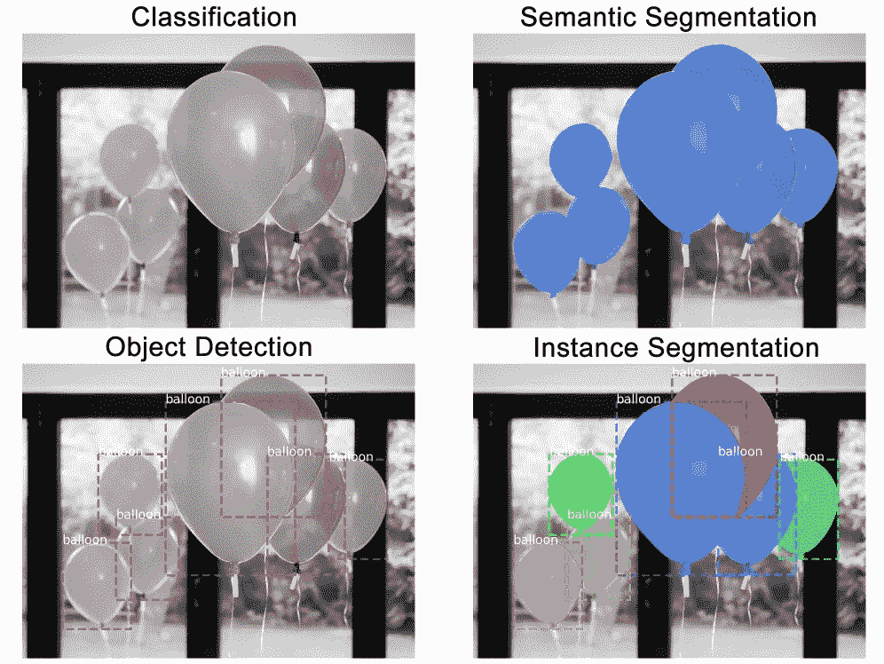
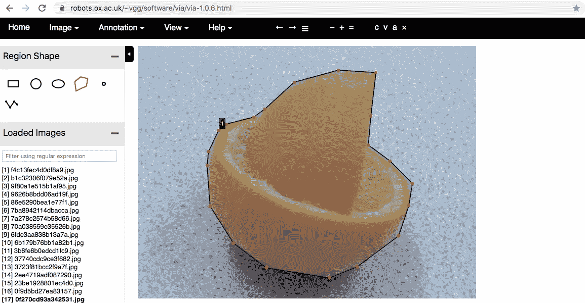
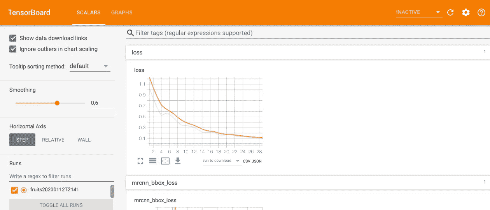
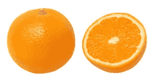
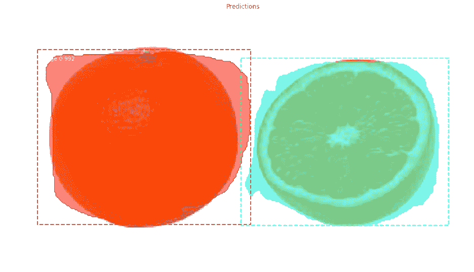
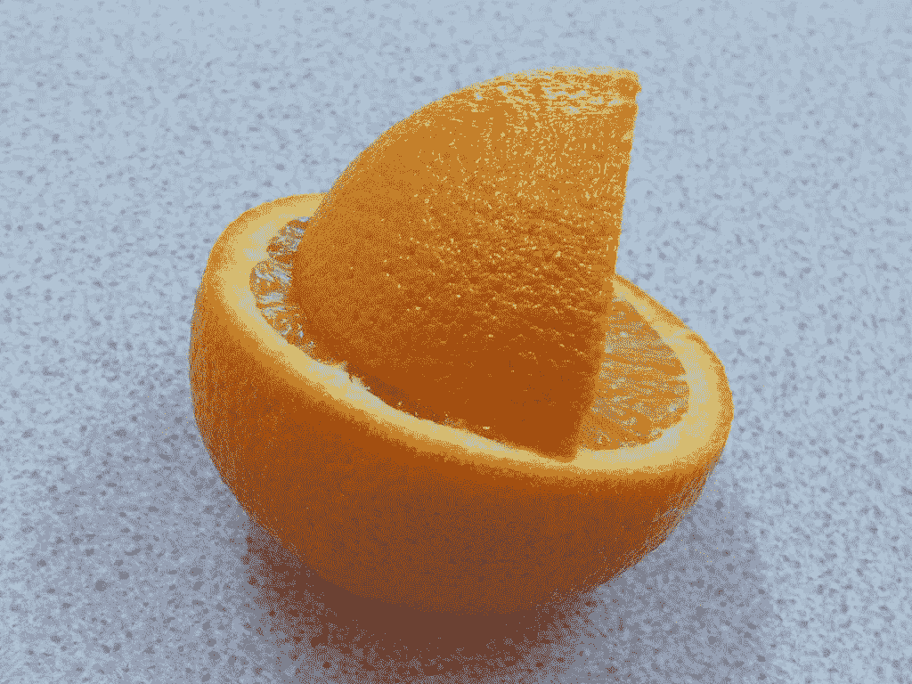
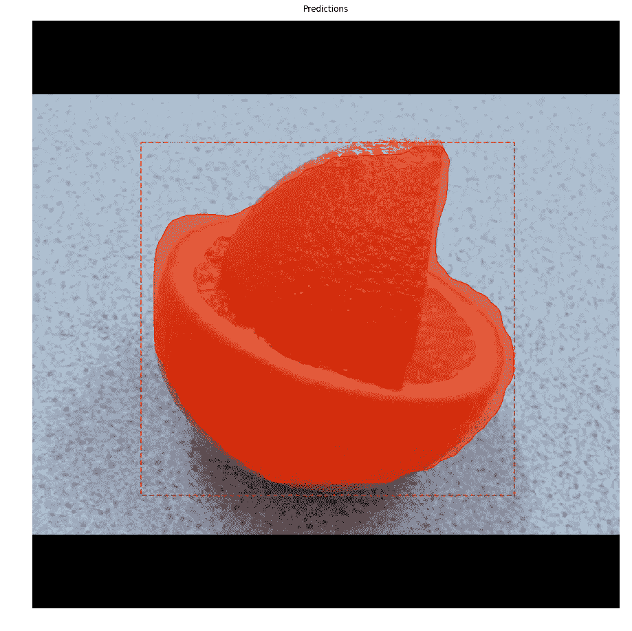

# 使用 MaskRCNN 预测自定义数据集中的热带水果

> 原文：<https://medium.com/analytics-vidhya/using-maskrcnn-to-predict-tropical-fruits-in-custom-dataset-4f079d05fbe1?source=collection_archive---------9----------------------->


在自定义数据集上使用 Mask_RCNN 预测水果的应用程序，这是一个如何为自定义数据集创建对象检测应用程序的简单教程，作为一个示例，我们在这种情况下只使用热带水果的数据集(橙子和菠萝)。

github 中的源代码:[https://github . com/bernardcaldas/object-detection-custom-maskrcnn](https://github.com/bernardcaldas/object-detection-custom-maskrcnn)

# 计算机视觉

近年来，我们可以在生活中看到很多应用，包括自动驾驶汽车、面部检测应用、教育、军事、金融等。


# 实例分割

实例分割识别对象、检测和描绘图像中出现的每个感兴趣的不同对象是一项任务。



跟随 Waleed Abdulla 的帖子，解释 R-CNN 是一种最常用的图像分割和检测对象的算法。

[](https://engineering.matterport.com/splash-of-color-instance-segmentation-with-mask-r-cnn-and-tensorflow-7c761e238b46) [## 色彩的飞溅:使用掩膜 R-CNN 和张量流的实例分割

### 通过构建彩色飞溅滤镜来解释

engineering.matterport.com](https://engineering.matterport.com/splash-of-color-instance-segmentation-with-mask-r-cnn-and-tensorflow-7c761e238b46) 

# 为自定义数据集创建对象分段

对于这个任务，这是一个非常好的工具，可以从名为 [OIDv4_ToolKit](https://github.com/EscVM/OIDv4_ToolKit) 的 google images 下载图像，在克隆了 repo 并安装了所需的包之后，我们可以通过下面的命令行下载图像。

```
python3 main.py downloader --classes Pineapple Orange --type_csv validation
```

# 1.注释图像

使用工具 VIA，我们可以注释数据集中的图像，如下图所示

VIA 工具链接:[https://www . robots . ox . AC . uk/~ vgg/software/VIA/VIA-1 . 0 . 6 . html](https://www.robots.ox.ac.uk/~vgg/software/via/via-1.0.6.html)



注释完所有图像后，我们需要生成一个 json 文件，其中包含项目中使用的所有坐标，作为标准的“via_region_data.json”。

# 2.设置环境

让我们从 matterport mask rcnn 克隆 repo 并安装所需的软件包

[](https://github.com/matterport/Mask_RCNN) [## matterport/Mask_RCNN

### 这是 Mask R-CNN 在 Python 3、Keras 和 TensorFlow 上的实现。该模型生成边界框和…

github.com](https://github.com/matterport/Mask_RCNN) 

*   安装依赖项

```
pip3 install -r requirements.txt
```

*   从存储库根目录运行安装程序

```
python3 setup.py install
```

从目录“samples/balloon”中复制一份，并使用您的项目名称重命名，在本例中为“samples/tropical”

在此结构中创建一个“train”和“val”文件夹，并移动之前用 json 文件注释的文件，请考虑在您的结构中拆分 80%的 train 和 20%的 validations 文件。

结构项目

-热带
|
|
ballonn.py

*   火车文件夹
    |
    file1.png
    file2.png
    。
    。
    via _ region _ data . JSON
    |
    |
    -val 文件夹
    |
    file1.png
    file2.png
    。
    。
    via_region_data.json

# 3.设置代码

让我们在“samples/tropica/balloon . py”中设置代码，首先从自定义数据集中重命名该文件，在本例中为“samples/tropica/fruits.py”。

在现在的 fruits.py 文件中，让我们做一些如下的改变。

#气球配置到水果配置

#气球数据集到水果数据集

# 4.使用迁移学习训练模型

使用下面的代码之一，我们将使用 COCO 模型或 imagenet 的权重来训练模型。

本次培训的重量将保存在每个时期的日志文件夹中，我们可以使用 tensorboard 查看我们模型的结果和指标，请键入:

# tensor board—logdir = path/to/logs

在本地端口 6006 上运行时，结果将与此类似



现在，我们有了模型训练 lets run，文件夹中名为 inspect_balloon_model.ipynb 的笔记本，并配置以查看结果；

函数来预测单个文件；

结果；



原始文件



预测图像



原始文件



预测图像

# 结果

该模型需要一些改进来修复，该模型仅用 76 幅图像进行训练，也许我们可以设置更多的时期和更多的图像来获得良好的结果，并使用 tensorboard 来查看训练损失和验证损失

“mrcnn/config.py”我们可以设置一些设置来改进我们的模型。

```
class Config(object):
    """Base configuration class. For custom configurations, create a
    sub-class that inherits from this one and override properties
    that need to be changed.
    """
    # Name the configurations. For example, 'COCO', 'Experiment 3', ...etc.
    # Useful if your code needs to do things differently depending on which
    # experiment is running.
    NAME = None  # Override in sub-classes# NUMBER OF GPUs to use. When using only a CPU, this needs to be set to 1.
    GPU_COUNT = 1# Number of images to train with on each GPU. A 12GB GPU can typically
    # handle 2 images of 1024x1024px.
    # Adjust based on your GPU memory and image sizes. Use the highest
    # number that your GPU can handle for best performance.
    IMAGES_PER_GPU = 2# Number of training steps per epoch
    # This doesn't need to match the size of the training set. Tensorboard
    # updates are saved at the end of each epoch, so setting this to a
    # smaller number means getting more frequent TensorBoard updates.
    # Validation stats are also calculated at each epoch end and they
    # might take a while, so don't set this too small to avoid spending
    # a lot of time on validation stats.
    STEPS_PER_EPOCH = 1000# Number of validation steps to run at the end of every training epoch.
    # A bigger number improves accuracy of validation stats, but slows
    # down the training.
    VALIDATION_STEPS = 50# Backbone network architecture
    # Supported values are: resnet50, resnet101.
    # You can also provide a callable that should have the signature
    # of model.resnet_graph. If you do so, you need to supply a callable
    # to COMPUTE_BACKBONE_SHAPE as well
    BACKBONE = "resnet101"# Only useful if you supply a callable to BACKBONE. Should compute
    # the shape of each layer of the FPN Pyramid.
    # See model.compute_backbone_shapes
    COMPUTE_BACKBONE_SHAPE = None# The strides of each layer of the FPN Pyramid. These values
    # are based on a Resnet101 backbone.
    BACKBONE_STRIDES = [4, 8, 16, 32, 64]# Size of the fully-connected layers in the classification graph
    FPN_CLASSIF_FC_LAYERS_SIZE = 1024# Size of the top-down layers used to build the feature pyramid
    TOP_DOWN_PYRAMID_SIZE = 256# Number of classification classes (including background)
    NUM_CLASSES = 1  # Override in sub-classes# Length of square anchor side in pixels
    RPN_ANCHOR_SCALES = (32, 64, 128, 256, 512)# Ratios of anchors at each cell (width/height)
    # A value of 1 represents a square anchor, and 0.5 is a wide anchor
    RPN_ANCHOR_RATIOS = [0.5, 1, 2]# Anchor stride
    # If 1 then anchors are created for each cell in the backbone feature map.
    # If 2, then anchors are created for every other cell, and so on.
    RPN_ANCHOR_STRIDE = 1# Non-max suppression threshold to filter RPN proposals.
    # You can increase this during training to generate more propsals.
    RPN_NMS_THRESHOLD = 0.7# How many anchors per image to use for RPN training
    RPN_TRAIN_ANCHORS_PER_IMAGE = 256
```

# 结论

在这篇文章中，我只是展示了如何使用这个 repo 来检测自定义数据集中的一些对象，请随意使用这个工具，如果你想说点什么，请跟我联系。

贝尔纳多·阿卡尔达斯

推特；【https://twitter.com/bernardocalda10 号

Github 项目

[https://github . com/bernardcaldas/object-detection-custom-maskrcnn/tree/master/tropical](https://github.com/bernardcaldas/object-detection-custom-maskrcnn/tree/master/tropical)