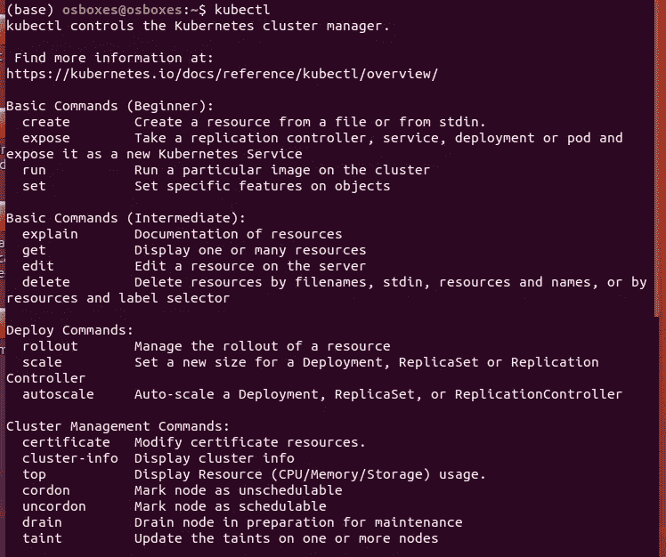

# 使用 Minikube 进行单节点 Kubernetes 集群的本地部署

> 原文：<https://medium.com/analytics-vidhya/using-minikube-for-local-deplyment-of-single-node-kubernetes-cluster-25bb576d532b?source=collection_archive---------13----------------------->


Kubernetes 是一个开源的容器编排平台，它自动化了许多涉及部署、管理和扩展容器化应用程序的手动过程。也被称为 k8s。

Kubernetes 最初是由谷歌开发和设计的，并于 2014 年开源。

Kubernetes 的优势:

*   跨多个主机编排容器。
*   控制和自动化应用程序部署和更新。
*   装载和添加存储以运行应用程序。
*   规模化容器化应用及其资源。
*   管理服务，保证部署的应用程序始终以您希望的方式运行。
*   通过自动放置、自动重启、自动复制和自动扩展，对您的应用进行运行状况检查和自我修复。

Kubernetes 比 Swarm 复杂得多，需要更多的工作来部署。对于开发工作和较小的容器集群，Docker Swarm 提供了一个更简单的选择。

## Kubernetes 建筑:Kubernetes 如何工作


## **主组件:**

## API 服务器

Kubernetes 是一个 API 服务器，它使用 API 提供集群上的所有操作。这基本上是一个切入点。

## 控制器管理器

该组件负责管理集群状态和执行任务的大多数收集器。

## 调度程序

这是 Kubernetes master 的关键组件之一。它是 master 中的一项服务，负责分配工作负载。它负责跟踪集群节点上工作负载的利用率。

## 工作节点组件:

*   **Kubelet:** Kubelet 确保节点中的所有容器都在运行并处于健康状态。它还负责主节点和工作节点之间的通信。
*   **容器:**容器是最低级别的微服务，放置在 pod 内部，需要外部 IP 地址查看外部进程。
*   Kube 代理:它充当网络代理和负载平衡器。它将请求转发到集群中隔离网络上的正确 pod。

所以让我们从安装开始。在这个 [**pdf**](https://docs.google.com/document/d/1-iC93GhUz1LvYAgjgDS6F3g01V0Vk2q4omTP_OifBkI/edit?usp=sharing) 中我已经添加了安装 docker、kubectl 和 minikube 的所有命令。

## 对于那些在虚拟机上工作的人:

VirtualBox VM 上的 minikube 有一个问题:minikube 使用 VirtualBox 虚拟机管理程序进行虚拟化，因此需要主机上的 VT-X 支持。然而，VirtualBox 不支持 VT-X/AMD-v。这可以通过在主机上使用 vm-driver=none 选项和 Docker 来解决，并且至少分配 2 个 cpu 核心。


我们需要安装 conntrack 作为先决条件，使用

```
sudo apt-get install conntrack
```


Minikube 是开发面向 Kubernetes 的应用程序不可或缺的工具。

要启动 minikube 使用

```
sudo minikube start --vm-driver=none
```


## 对于非虚拟机用户:

```
minikube start
```

1.  您可以输入 **kubectl** ，如果您将看到所有可用的命令，这意味着“kubectl”正在工作。



2.验证 Minikube 正在运行。

```
sudo kubectl get node
```


3.现在我们开始在 Kubernetes 集群上进行部署。我们正在 docker hub 上部署一张 [docker 图片](https://hub.docker.com/repository/docker/7985260261/magicalnginx)


```
sudo kubectl create deployment <Deployment_Name> --image=<Image_Name>
```


4.获取正在运行的部署的信息

```
sudo kubectl get deployments
```


5.获取正在运行的部署的完整描述

```
sudo kubectl describe deployments magicalnginx
```


6.让 NGINX 容器可以通过互联网访问。

```
kubectl create service nodeport <deployment_name> --tcp=80:80
```

7.运行以下命令以获取公开服务的 URL

```
sudo kubectl get svc
```


8.使用 curl 命令查看网页内容


9.Kubectl 命令:

*   要列出部署: **sudo kubectl get 部署**
*   删除服务:**sudo ku bectl delete service magicalnginx**
*   删除一个特定的部署:**sudo ku bectl delete deployment magicalnginx**


*   删除本地 Minikube 集群

```
sudo minikube delete
```

在下一篇[帖子](/@sarthak3398/using-kops-to-setup-up-kubernetes-cluster-f83d83139f6a)中，我将

## **使用 Kops 在 AWS 上设置 Kubernetes 集群**

链接:[https://medium . com/@ sarthak 3398/using-kops-to-setup-kubernetes-cluster-f83d 83139 f6a](/@sarthak3398/using-kops-to-setup-up-kubernetes-cluster-f83d83139f6a)