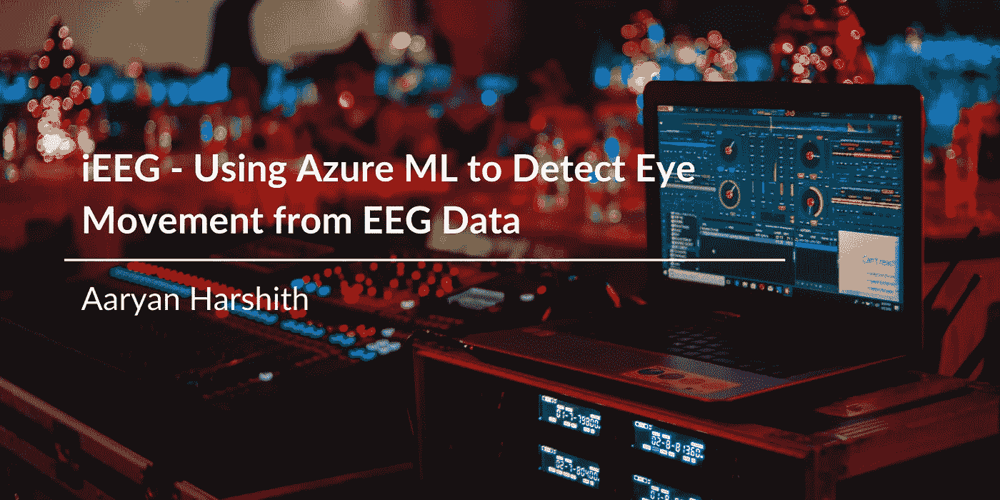
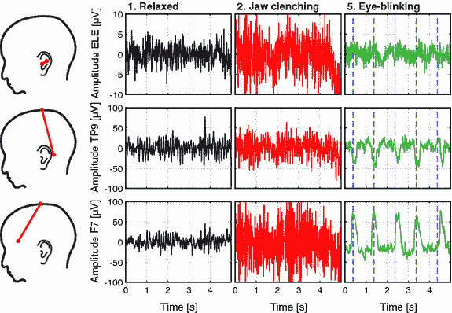
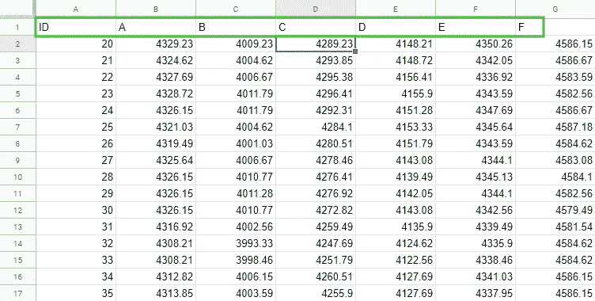
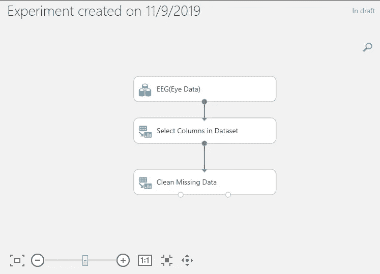
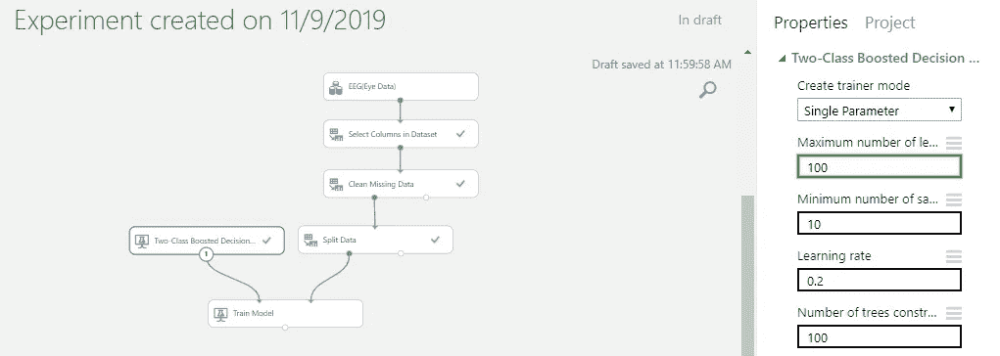
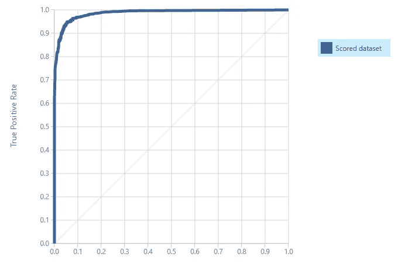
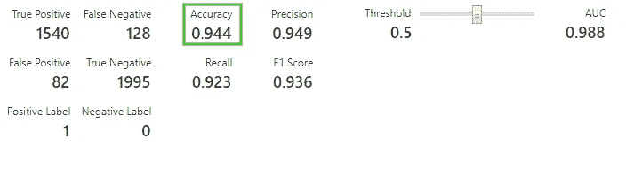

# iEEG——如何使用 Azure ML 和 EEG 数据检测眼球运动

> 原文：<https://medium.com/analytics-vidhya/using-ml-to-detect-blinks-54f55e1b86ac?source=collection_archive---------5----------------------->

想象你的朋友正站在街区的对面。你看到他在用口型说话，你试着去理解它们。

在汽车呼啸而过、成百上千的人匆匆忙忙去上班的市中心，你会更容易听到他的演讲，还是在一条偏僻的小巷里听他的演讲更自然？

目前，这种比较描述了科学家在试图处理来自**脑电图(EEG)** 数据的大脑信号时面临的确切挑战。

对于像脑电图这样敏感的设备来说，最轻微的抽搐可能会产生和核爆炸一样的效果，让你无法处理有价值的信息。这些信号“爆炸”被称为**伪像**，它们可能来自最自然的身体反应，比如你的心跳、出汗，甚至眨眼。就背景而言，仅仅眨眼就可能导致比周围区域明显 10 倍的尖峰信号。

在**脑机接口(BCIs)** 领域，检测并消除这些人为因素可能是从你大脑产生的每个信号中提取价值的最后一道屏障。在这篇文章中，我将介绍一个基于机器学习的眨眼伪影检测系统的开发——所有这些都是在没有一行代码的情况下构建的。

# 艺术品，艺术品，到处都是

与普遍的看法和一些高中老师的看法相反，伪像并不总是表现为数据中的尖峰。根据定义:

> **伪像是不必要的信号偏差，会阻碍数据得到充分处理。**

在脑电图读数中，像咬紧牙齿这样的动作，在下面的例子中，会比眨眼更明显。

显示各种人为因素对电极读数的影响的 EEG 信号图

观察了上面的图片后，你可能会发现一件艺术品并不像它所描述的那样。一个信号不是由大小来定义的，而是由它对更有价值的数据的**阻碍**而被认为是一个伪像。

当来自人工制品的噪音破坏了你的读数时，使用脑电图读数提取某人的想法和意图几乎是不可能的。想象一下，科学家不得不筛选成千上万的数据点来手动移除伪影——这是研究人员今天在创建真正智能的 BCI 时面临的主要障碍。截至目前，数据分析师使用复杂、硬编码的转换公式来标准化 EEG 数据。

但是，如果我们能够找到一种简单的**、**健壮的**和更为**精确的**方法来检测工件——而不删除有价值的数据，会怎么样呢？**

# 检测伪像

在一个自动化为王的世界里，似乎工件移除是一个需要通过机器学习来解决的问题！

计算机可以比地球上任何其他生物更快地学习信息和识别数据模式，这使它们成为这种困境的理想解决方案。

在我们开始建立模型之前，我们需要数据，我们需要大量的数据。虽然脑电图数据在几乎任何大规模的大学数据库中都可以广泛获得，但该项目利用了来自加州大学欧文分校(UCI)机器学习知识库的数据。要了解如何构建这个模型，您可以继续阅读，或者观看我下面的深入视频解释👇

Azure 中工件移除项目的深入视频教程和解释

知识库包含数以千计的高质量数据集，用于机器学习实验，我们需要的数据集被称为[脑电图眼部状态数据集](https://archive.ics.uci.edu/ml/datasets/EEG+Eye+State)。该数据集包含来自 Emotiv 14 通道神经耳机的 117 秒脑电图测量结果，并有超过 **14，000 列**的数据要分析——其中“1”表示眼睛闭着，“0”表示眼睛睁着。

将数据集下载为. CSV 文件后，为它的列指定标题——尽管这不是必需的，但最好给变量命名。

创建列名来命名变量的示例—如绿色框所示，我将患者编号命名为 ID，将电极读数命名为字母表中的字母

既然我们的变量已经命名，我们就可以开始构建机器学习模型了。对于这个项目，我使用了微软的 Azure 机器学习工作室，因为管道是拖放式的，不需要任何代码。

创建空白实验并将编辑好的 CSV 文件作为数据集上传后，您现在可以将我们的数据用作**模块**。在这个模型的整个开发过程中，我们将在工作空间中添加和连接一系列块。

现在你已经将数据集上传到 Azure，这个过程中最难的部分已经完成。下一步是**排除数据集的 ID 列**并用 NaN 替换零值——同样，尽管数据集不包含任何零值，但这是另一个要采用的最佳实践。

在列选择设置中，选择所有列，然后排除 ID 列。将“清除缺失值”块附加到它，并保留默认设置。

删除 ID 列并清除零值后，您的工作区应该如下所示。

我们的下一步行动是**将我们的数据**分成训练集和测试集，以及选择适当的机器学习模型。将一个“分割数据”块拖到你的工作空间中，并将“分割行数”设置为 0.75。

将“火车模型”块拖到环境中，并将“分割数据”块的节点 1 连接到“火车模型”块的节点 2。将该块的“标签列”设置更改为保存数据集实际值(零和一状态)的变量名。

经过几十次测试，试图找到能够为该数据集提供最佳结果的模型，**两级提升决策树**模型以最高标准运行，因此这就是我们将使用的模型。在“两级提升树”模型中，将一棵树上的最大叶子数设置为 100，并将该块连接到“训练模型”块。

选择型号后您的环境应该是什么样子的示意图。最大叶子数设置为 100，其余值保留默认值。

为了看看这个模型的表现有多惊人，我们需要找到一种方法让**给**打分，然后**评估**它。为此，只需使用“评分模型”和“评估模型”模块。将“训练模型”模块连接到“得分模型”模块的节点一，最后，将“得分模型”模块连接到“评估模型”模块。

就是这样！您已经创建了自己的机器学习模型来标准化脑电图数据— **而没有一行代码**。要查看我们的模型执行情况，请运行您的实验，然后单击“评估”块上的“可视化”来查看您的结果。

该模型表现出色，准确率达到 94%——这一准确率在去除伪像方面是闻所未闻的

决策树模型达到了惊人的准确率 **94.4%** ，这意味着它已经超过了已经研究了**几十年**的公式。你创建了这个模型，完全是你自己的——免费的，而且精确度更高！

既然可以从 EEG 数据中去除伪像，我们就离实现 BCIs 的全部潜力更近了一步——在未来，每个人都可以只用他们的思想来改变世界。

感谢您的阅读！