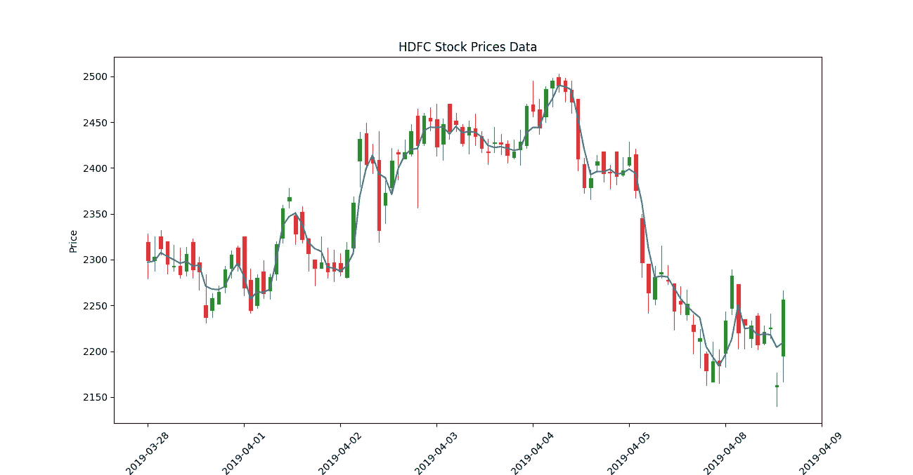
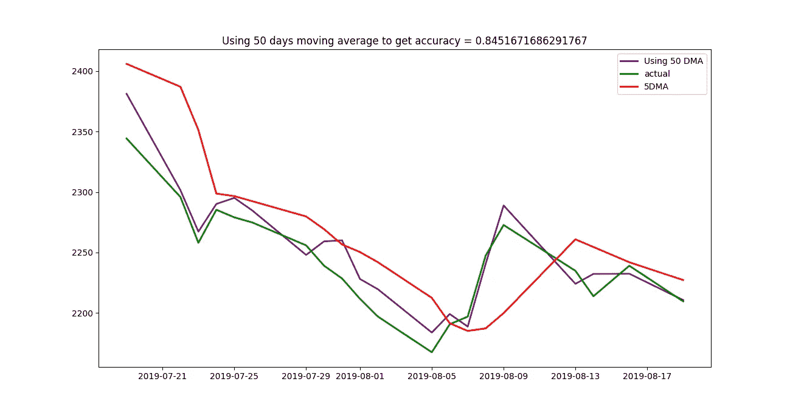

# 使用移动平均线预测股票价格

> 原文：<https://medium.com/analytics-vidhya/using-moving-averages-to-predict-stock-prices-168420338cd0?source=collection_archive---------8----------------------->

# 目标

目标是根据开盘价、最高价、最低价、收盘价、成交量、5DMA(5DMA 是 5 天移动平均线)、10DMA、20DMA、50DMA 来预测 HDFC 银行的第二天开盘价。还进行了比较研究，以检查哪个移动平均值有助于更好的准确性。

# 数据

数据包含日期、开盘价、最高价、最低价、收盘价、成交量、5 天移动平均线、10 天移动平均线、20 天移动平均线、50 天移动平均线和第二天开盘价。分析时不包括日期。
第二天的开盘价被用作标签，所有剩余的属性被用作特征。

数据摘要(示例中仅包含 10 行)

从雅虎财经收集的数据。
不同的移动平均线和第二天开盘是通过程序计算的。以上表格存储在[这个](https://github.com/omkarsk98/StockPricesAnalysis/blob/v3.1/DataSource/hdfc.csv) csv 文件中。

# (英)可视化(= visualization)

使用日本蜡烛棒图和一个额外的线图绘制 5 天移动平均线，进行可视化。在一张图中很难理解整个情节。展示了 2015 年以来的全部数据。它绘制了 OHLC 和 5DMA。为简单起见，最近 100 天的数据绘制如下，其中包括 OHLC 价格和 5DMA。绿色表示积极的一天，红色表示消极的一天。

OHLC 和 5DMA 最近 100 天

# 密码

我们定义了一个辅助函数，默认情况下它不会对数据进行归一化，而是使用最多 4 位小数的数据。开、高、低、闭、音量、5DMA、10DMA、20DMA 和 50DMA 用作特征。这些被进一步分割，仅包括特定的移动平均线。标签只包括股票的第二天开盘价。如果 normalise 设置为 true，则各个列将被列平均值所除，以便将大部分数据转换为一位数。就乘法和除法而言，一位数的值更容易计算，因此计算时间减少了。这些列平均值也由该函数返回，因此它们可以乘以一位数数据，以便可视化。

开发线性回归模型

开发了四个线性回归模型。这些型号同时包括各种移动平均值，即一个型号使用 5DMA 作为特征，下一个型号使用 10DMA 作为特征，依此类推。每个模型预测股票第二天的开盘价。结果如下所述。

# 结果

以 5DMA 为特征的线性回归模型表现最好，准确率为 88%。下面是结果的可视化。

使用 5DMA 的线性回归结果。其结果是 88%的准确率。

使用 5 DMA、10DMA、20DMA 和 50DMA 计算的其他精度如下

不同的线性回归模型结果

上表显示了在考虑更高的移动平均线后准确度如何下降。

其他移动平均线的图形如下。

使用 10 毫安时线性回归的结果

使用 20DMA 的线性回归结果

使用 50 毫安的线性回归结果

所有结果的集合图如下。

所有结果的比较分析

# 结论

当用作预测第二天开盘价的特征时，较小的移动平均线有助于提高准确性。由于较高的移动平均值被视为特征，线性回归模型的准确性下降。

同一项目的参考资料可以在我的 [github repo](https://github.com/omkarsk98/StockPricesAnalysis/tree/v3.1) 上找到。