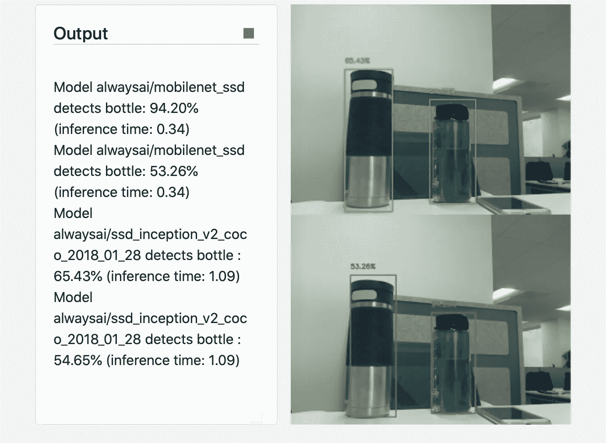

# 使用多个对象检测模型

> 原文：<https://medium.com/analytics-vidhya/using-multiple-object-detection-models-e310c70e3a99?source=collection_archive---------15----------------------->

## 在 always AI 中使用多个对象检测模型的快速指南

在本文中，我将演示如何轻松地修改 alwaysAI 提供的现有应用程序，以同时使用两个对象检测模型，并在并排的框架中显示输出。



预期输出的示例:在这种情况下，两个检测模型都识别出两个瓶子，您可以在顶部图像框中看到第一个检测模型的绿色输出，在底部图像框中看到第二个检测模型的红色输出。

在我们开始之前，您需要:

1.  一个 [alwaysAI 账号](https://alwaysai.co/auth?register=true&utm_campaign=Open%20Beta&utm_source=medium&utm_content=multiple-object-detectors)(免费！)
2.  在您的机器上设置 alwaysAI
3.  像[这样的文本编辑器 sublime](https://www.sublimetext.com/) 或者像 [PyCharm](https://www.jetbrains.com/pycharm/) 这样的 IDE，两者都提供免费版本，或者任何你喜欢的代码

请参见 alwaysAI [博客](https://learn.alwaysai.co/?&utm_campaign=Open%20Beta&utm_source=medium&utm_content=multiple-object-detectors)了解更多关于[计算机视觉](https://learn.alwaysai.co/computer-vision-101?&utm_campaign=Open%20Beta&utm_source=medium&utm_content=multiple-object-detectors)、[开发模型](https://learn.alwaysai.co/blog/computer-vision-application-lifecycles-explained-0?&utm_campaign=Open%20Beta&utm_source=medium&utm_content=multiple-object-detectors)、如何[改变模型](https://learn.alwaysai.co/blog/change-computer-vision-models-alwaysai-platform-0?&utm_campaign=Open%20Beta&utm_source=medium&utm_content=multiple-object-detectors)等的背景知识。

为什么同时使用多个对象检测模型？

需要澄清的是，我指的不是[整合](https://towardsdatascience.com/two-is-better-than-one-ensembling-models-611ee4fa9bd8)，即整合多个[性能较低的模型以产生一个更健壮的模型](https://towardsdatascience.com/a-guide-to-ensemble-learning-d3686c9bed9a)，而是同时结合两个具有不同输出的模型。这在以下情况下会很有用

*   需要检测一组不同的对象，但是在组合时只能找到覆盖整个期望组的模型，
*   想要确定哪个模型最适合检测特定的对象类型，
*   想要在不同的相机深度或角度检测一种对象类型，而单个模型可能无法训练成这样
*   等等…

尤其是在构建原型的时候，这种类型的模型组合可以节省很多时间。

本教程的所有代码都可以在 [GitHub](https://github.com/alwaysai/multiple-object-detectors) 上获得。

我们开始吧！

当你有了你的免费账户并建立了你的开发者环境后，你需要下载入门应用；在继续本教程的其余部分之前，使用此链接完成[。](https://www.alwaysai.co/docs/reference/starter_applications.html?&utm_campaign=Open%20Beta&utm_source=medium&utm_content=multiple-object-detectors)

下载 starter 应用程序后，您可以开始修改现有的 starter 应用程序，以使用两种对象检测模型。针对本教程修改的应用程序是“对象检测器”应用程序，因此 cd 进入 starter apps 文件夹和“realtime_object_detector”文件夹。

```
cd ./alwaysai-starter-apps/realtime_object_detector
```

“realtime_object_detector”入门应用程序中默认使用的对象检测模型是“alwaysai/mobilenet_ssd”。我们准备增加第二个模型，‘alwaysai/SSD _ inception _ v2 _ coco _ 2018 _ 01 _ 28’。原始模型“alwaysai/mobilenet_ssd”识别 20 个对象类别，包括人类、动物、一些家具、自行车、火车、平原、盆栽植物等..新模型“alwaysai/SSD _ inception _ v2 _ coco _ 2018 _ 01 _ 28”识别了“alwaysai/mobilenet_ssd”所识别的许多对象，但不是全部，例如，它不是在飞机上训练的。通过使用相似的库，我们还可以看出一个库是否比另一个库更擅长检测某些类型的对象。然而，您可以使用一个检测人脸的模型(“alwaysai/mobilenet_ssd_face”)和另一个检测手的模型(“alwaysai/hand_detection”)作为不同的用例，或者通过浏览[模型目录](https://alwaysai.co/model-catalog/models?&utm_campaign=Open%20Beta&utm_source=medium&utm_content=multiple-object-detectors)找到可能更适合您的特定应用的其他模型。

由于我们向应用程序添加了一个新模型，因此我们需要通过在命令行中键入以下内容来将该模型添加到我们的应用程序环境中:

```
aai app models add alwaysai/ssd_inception_v2_coco_2018_01_28
```

*注意:您可以通过遵循“* [*改变计算机视觉模型*](https://www.alwaysai.co/docs/application_development/changing_the_model.html?&utm_campaign=Open%20Beta&utm_source=medium&utm_content=multiple-object-detectors) *”文档来改变任何模型。*

既然您已经将您的模型添加到您的应用程序环境中，那么您可以开始修改 starter 应用程序代码了。我们将通过以下步骤来实现这一点:

1.  为所有正在使用的模型初始化检测对象。原始应用程序中的代码在第 16–18 行。这段代码初始化一个新的对象检测器并加载引擎。不是简单地复制这段代码来创建第二个不可扩展的对象，一个更好的解决方案是跟踪您想要在一个数组中使用的所有模型，并在一个循环中对所有模型执行相同的启动过程。

*   在 main 中，创建一个列表来存储您的所有模型；在完成的代码中，我称这个列表为“模型”。这比简单地复制原始代码更具可扩展性。
*   我们将把' alwaysai/mobilenet_ssd '作为'模型'中的第一个元素，把' alwaysai/SSD _ inception _ v2 _ coco _ 2018 _ 01 _ 28 '作为'模型'中的第二个元素。您的代码现在应该如下所示:

```
models = ["alwaysai/mobilenet_ssd","alwaysai/ssd_inception_v2_coco_2018_01_28"]
```

2.为您使用的每个模型存储颜色。*注意:存储每个型号的颜色是可选的，但这将使不同型号的检测更容易识别。如果您忽略了这一点，那么新代码中还有一行也应该忽略。如果您不想让每个型号都有唯一的颜色，请跳到步骤 3。*

*   初始化一个名为“颜色”的列表
*   为每个元素添加两个[(B，G，R)]格式的条目。您的代码现在应该包含以下几行:

```
colors = [[(66, 68, 179)], [(50, 227, 62)]]
```

3.初始化和维护所有模型的检测对象，其中每个检测器对象都相当于 starter 应用程序代码中的“obj_detect”。

*   因为我们使用多个模型，所以我们需要多个检测器。创建检测器列表。将以下代码行添加到您的应用程序中:

```
detectors = []
```

*   现在使用 for 循环遍历模型，如下所示:

```
for model in models:
```

*   在循环中，为每个模型初始化一个新的对象检测器:

```
obj_detect = edgeiq.ObjectDetection(model)obj_detect.load(engine=edgeiq.Engine.DNN)
```

*注意:这与最初的 starter 应用程序的代码几乎相同，但现在我们不是使用“alwaysai/mobilenet_ssd ”,而是使用“model”从列表中取出下一个模型。*

*   现在，将新创建的检测器对象追加到您在上一步中创建的列表中，以便我们可以跟踪所有的检测器对象:

```
detectors.append(obj_detect)
```

*   打印出对象检测器的详细信息:您可以将原始代码中第 20–23 行的原始代码复制到您的循环中来完成这项工作。

现在，型号列表的索引 I 将对应于颜色列表的索引 I，以及新代码中检测器列表的索引 I。

重述:原始代码:

```
def main():
    obj_detect = edgeiq.ObjectDetection(
            "alwaysai/mobilenet_ssd")
    obj_detect.load(engine=edgeiq.Engine.DNN)print("Loaded model:\n{}\n".format(obj_detect.model_id))
    print("Engine: {}".format(obj_detect.engine))
    print("Accelerator: {}\n".format(obj_detect.accelerator))
    print("Labels:\n{}\n".format(obj_detect.labels))fps = edgeiq.FPS()
```

新代码:

```
def main():# if you would like to test an additional model, add one to the list below:
    models = ["alwaysai/mobilenet_ssd", "alwaysai/ssd_inception_v2_coco_2018_01_28"]# if you've added a model, add a new color in as a list of tuples in BGR format
    # to make visualization easier (e.g. [(B, G, R)]).
    colors = [[(66, 68, 179)], [(50, 227, 62)]]detectors = []# load all the models (creates a new object detector for each model)
    for model in models:# start up a first object detection model
        obj_detect = edgeiq.ObjectDetection(model)
        obj_detect.load(engine=edgeiq.Engine.DNN)# track the generated object detection items by storing them in detectors
        detectors.append(obj_detect)# print the details of each model to the console
        print("Model:\n{}\n".format(obj_detect.model_id))
        print("Engine: {}".format(obj_detect.engine))
        print("Accelerator: {}\n".format(obj_detect.accelerator))
        print("Labels:\n{}\n".format(obj_detect.labels))fps = edgeiq.FPS()
```

有了现在的代码，我们可以将一个模型添加到“模型”列表中，每个模型都将完成相同的初始化过程。“探测器”列表将存储物体探测器。*注意:颜色列表是 BGR 格式的(不是 RGB！)*

现在，在“while 循环”中添加一个“for 循环”,循环遍历检测器中的每个检测器。这将涉及以下步骤:

5.为每个模型生成一个新的图像(参见下面的代码)

*   将第 38 行中的变量“帧”改为“对象 _ 帧”
*   将同一行中对“markup_image”的调用的“colors”属性更改为，使用 colors[i]作为值。这将覆盖现有的颜色选项，使给定模型的所有颜色都相同。*注意:如果你不想这样做，或者你没有创建一个‘颜色’列表，省略这个改变。否则，您的代码应该如下所示:*

```
object_frame = edgeiq.markup_image(
                        frame, results.predictions, show_labels=False, colors=colors[i])
```

6.在此之下，创建一个 if/else 语句，用检测到的第一个模型覆盖输入提要。这并不是绝对必要的，如果没有这个步骤，图像上总是会出现没有检测帧的普通视频流。

*   我们将创建一个新的框架，并将其命名为“display_frame”。
*   如果我们在第一次迭代中，i == 0，设置‘display _ frame’为‘object _ frame’；否则，将两个帧连接在一起。添加以下代码:

```
# for the first frame, overwrite the input feed
if i == 0:
    display_frame = object_frame
else:
    # append newly marked-up frame to the previous frame
    display_frame = numpy.concatenate((object_frame, display_frame))
```

7.重新格式化输出图像的文本。

*   删除第 41–45 行，它将模型和推理时间附加到屏幕上。这是一个以上的模型太忙了。
*   现在，将模型和推理时间添加到最内层 for 循环中每个预测的文本中，该循环将预测文本追加到每个图像中。您的代码应该如下所示:

```
# append each prediction
for prediction in results.predictions:
    text.append("Model {} detects {}: {:2.2f}% (inference time: {:1.2f})".format(detectors[i].model_id,prediction.label, prediction.confidence * 100, results.duration))
```

这将更容易知道哪个模型在输出屏幕上做出哪个预测。

最终的 while 循环代码将如下所示:

```
# loop detection
while True:
    frame = video_stream.read()
    text = [""]

    # gather data from the all the detectors 
    for i in range(0, len(detectors)):
        results = detectors[i].detect_objects(frame, confidence_level=.5)
        object_frame = edgeiq.markup_image(frame, results.predictions, show_labels=False, colors=colors[i]) # for the first frame, overwrite the input feed
    if i == 0:
        display_frame = object_frame
    else:
        # otherwise, append newly marked-up frame to previous frame
        display_frame = numpy.concatenate((object_frame, display_frame)) # append each prediction
    for prediction in results.predictions:
        text.append("Model {} detects {}: {:2.2f}% (inference time: {:1.2f})".format(detectors[i].model_id,prediction.label, prediction.confidence * 100, results.duration)) # send the image frame and the predictions for both 
    # prediction models to the output stream
    streamer.send_data(display_frame, text) fps.update() if streamer.check_exit():
        break
```

就是这样！现在，您可以构建并启动您的应用程序来查看它的运行情况。您可能需要先配置应用程序，尤其是在您更改了边缘设备或从头开始创建新文件夹的情况下。使用以下命令并在出现提示时输入所需的配置输入:

```
aai app configure
```

现在，要查看您的应用程序的运行情况，首先通过在命令行中键入以下内容来构建应用程序:

```
aai app deploy
```

构建完成后，使用以下命令启动应用程序:

```
aai app start
```

现在打开任何一个浏览器到“localhost:5000 ”,您应该会看到文章开头所示的输出！