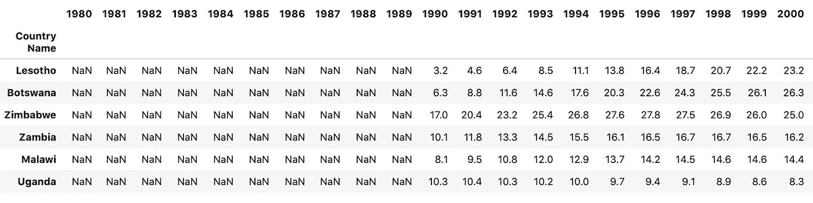
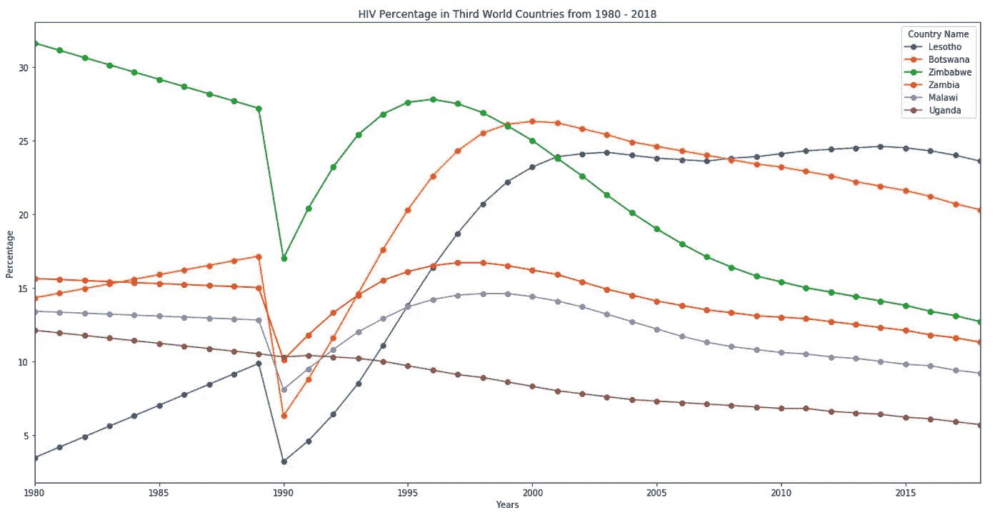

# 使用多变量特征实现来预测第三世界国家的 HIV 感染率

> 原文：<https://medium.com/analytics-vidhya/using-multivariate-feature-implementation-to-predict-hiv-rates-in-third-world-countries-f7c21380973b?source=collection_archive---------12----------------------->

Bret Kavanaugh 在 [Unsplash](https://unsplash.com?utm_source=medium&utm_medium=referral) 上拍摄的照片

在我的模块 2 作业中，我找到了世界银行关于世界发展指标的数据集([https://data catalog . world bank . org/dataset/world-development-indicators](https://datacatalog.worldbank.org/dataset/world-development-indicators))。这个数据集非常庞大，从 1960 年到 2018 年，有数百个国家的数百个指标，有超过 40 万行数据。我注意到许多指标涉及艾滋病毒感染率，并决定分析第三世界国家从 1980 年至 2018 年感染艾滋病毒的人数百分比。

在做了一些研究并发现哪些国家拥有可靠的数据后，我将分析范围缩小到莱索托、博茨瓦纳、津巴布韦、赞比亚、马拉维和乌干达。这些国家的死亡率都是世界上最高的。

加载并查看数据

清理数据帧

运行之前的代码后数据框的外观

我的下一个任务是进一步缩小数据范围，只列出我想要的国家和人口中的 HIV 百分比。

按国家创建费率数据框

费率数据框架

我注意到的第一件事是，没有 1990 年之前的数据，为了进行更完整的分析，我需要找到一种方法来估计这些数字。在 20 世纪 80 年代，全世界的艾滋病毒感染率非常高，我可以假设这些国家的感染率也会很高。

我决定绘制出我目前掌握的数据，以便更好地理解我正在处理的数据。

创建图形的代码

图表

我采取的填补这些缺失数据的策略来自于一篇发布到 canvas([https://scikit-learn.org/stable/modules/impute.html](https://scikit-learn.org/stable/modules/impute.html))上的阅读材料。多变量特征插补将每个具有缺失值的特征(百分比)建模为其他特征的函数，并使用该估计值进行插补。这是我第一次体验机器学习，虽然我知道我在这个过程中犯了一些错误，但我真的很享受更好地理解如何使用机器学习算法的过程。

sklearn 的迭代估算模块的工作原理是，它使用一个多维数组 ex: [1，2] [3，4] [5，NaN]，然后传递另一个具有 NaN 值的数组，并对该值进行估计。

第一步是将每个国家的数据转换成这样的数组结构[year，percent][year，percent]，并让算法根据年份和以前的百分比预测百分比。

为算法创建数组

一旦我有了数组，现在是时候把它们传递给迭代输入算法了。

预测百分比

然后，我需要用计算出的估计值更新我的数据框

更新数据框

更新数据帧的头部

现在我已经有了更新的数据，是时候用新数据重新创建这个图了。

更新图

很明显，这个算法不是很准确。我预料到了这一点，因为我对 sklearn 和机器学习算法还比较陌生。但该算法产生的数字证实了一个事实，即 20 世纪 80 年代的艾滋病毒感染率合理地高于今天的标准。第三世界的艾滋病毒感染率似乎在下降，这可以归功于全球医疗保健支出和医疗设施的增加。