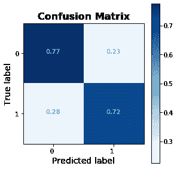
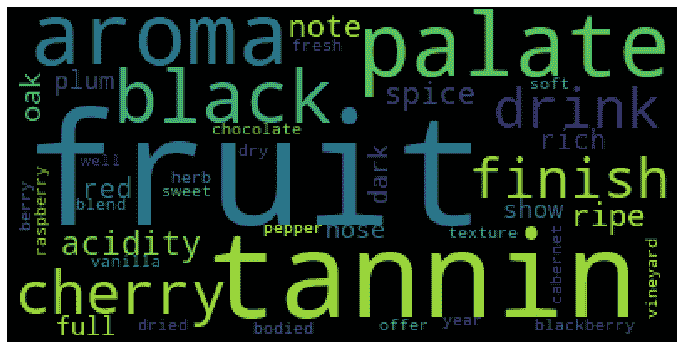
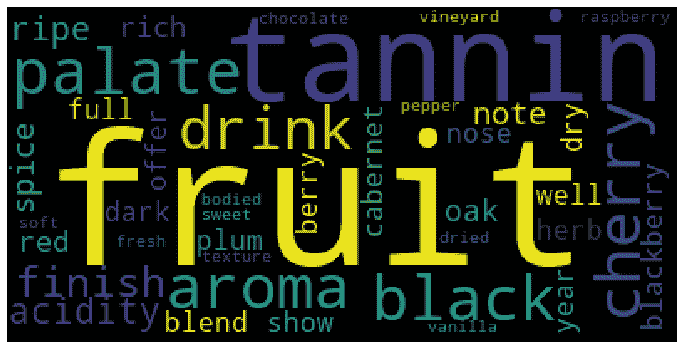

# 利用神经网络和自然语言处理对葡萄酒价格进行分类

> 原文：<https://medium.com/analytics-vidhya/using-neural-networks-natural-language-processing-to-classify-prices-of-wine-6b3e37be169d?source=collection_archive---------20----------------------->

分类和单词发现项目


[https://media3.giphy.com/media/3zfox4LvqnIas/giphy.gi](https://media3.giphy.com/media/3zfox4LvqnIas/giphy.gif)

葡萄酒——一种已经在全球流行了几千年的饮料，在冠状病毒关闭期间一直是许多人最好的朋友。作为一种复杂的液体，葡萄酒具有许多特性，如风味、香气、酸度、颜色等。尽管我很愿意认为自己是一名高级葡萄酒师，但我肯定不是，因为专业的侍酒师(也就是品酒师)是靠品尝葡萄酒并描述它们来赚钱的。唉，我是业余的。

我记得去年我在加州索诺玛县参加一场婚礼，我听到一个喝得烂醉如泥的人惊叫，声音比他们想象的要大得多，“老兄！！这酒**尝起来**好贵！”一个稍微有点嗡嗡声的我在想，“葡萄酒*品酒*贵吗？这是什么意思？”因此，不到一年后，凭借我刚刚开发出来的非常酷的数据科学技能，我决定继续探索，看看在描述廉价和昂贵的葡萄酒时是否真的存在差异，不仅仅是在味道上，而是考虑到葡萄酒的所有美妙特性。

## 第 1 部分—数据

这个数据集来自 Kaggle，可以在这里找到。它包含了各种各样的葡萄酒，以及专业侍酒师对它们各自的酒评。数据集包括国家、地区和所用葡萄的种类等特征，这只是其中的几个例子。由于我将在这次旅程中使用自然语言处理，对我有重要意义的列只有 description 和 price。

## 第 2 部分—数据预处理

对于任何以前使用过 NLP 的人来说，或者如果这是你第一次阅读它，数据清理和预处理过程是一个完全不同的动物*相比，比如说，像决策树这样的集成方法的清理。有一些常见的步骤——调查您的数据类型、检查并求解空值、缩放(如果需要的话)数据、移除异常值(如果需要的话)以及检查类不平衡——我不会详细讨论，除了一个方面，即我的价格问题。关于上面提到的其余步骤的更多详细信息，请随意探索我的 [Github](https://github.com/CoachCooz/WIne-Deep-NLP-Project) 。*

有趣的是，price 中有大量的空值，这是一个大问题，因为该列的一个变体将成为我的目标变量。因此，我有三个选择:用均值、中值或众数填充空值。平均值(~$35.36)不是一个整数，而所有可用的值都是，所以我没有这样做。然后，它介于中位数(25 美元)和众数(20 美元)之间。尽管我很想提供一个高层次的理由来解释我为什么做出这个决定，但事实并非如此——我只是凭直觉行事。我的直觉告诉我要走中间路线。主要是因为在使用*时，中值代表 50%的描述性统计。describe()* ，我只是相信使用最常见的数字不一定能提供填充空值的最佳策略。

## 第 3 部分—文本预处理

现在，我们来看野兽。如果我要描述的事情看起来很复杂，那是因为它确实很复杂。所以，如果你第一次没有完全理解，不要难过。如果你愿意，可以重读一遍，然后*练习*。这才是真正的学习方式！

当我解释这个的时候，我将包含我项目中的代码。整个功能都会显示出来，然后我会单独突出显示具体的部分。不要忘记导入您的包！

所以，我的函数是这样的:

```
import numpy as np
np.random.seed(0)
from nltk import word_tokenize
from nltk import FreqDist
from nltk.corpus import stopwords
import stringdef **clean_description**(corpus): """This function will be used to clean up df['description'] so that it can be used for modeling and visualization.

    Parameters:

    corpus - body of text that needs to be cleaned."""

    #Creates an extensive stopwords list
    stopwords_list = stopwords.words('english') additional_punc = ['“','”','...','``',"''",'’',"'s", ' ', "n't",'wine','flavor', 'flavors'] stopwords_list+=string.punctuation
    stopwords_list.extend(additional_punc)

    #Tokenizes the words in the corpus
    tokens = word_tokenize(corpus)

    #Uses list comprehension to create the list of clean words clean_words = [word.lower() **for** word **in** tokens **if** word.lower() **not in** stopwords_list] return clean_words
```

本质上，该功能中有三个步骤:

*   创建一个**停用词表**
*   将你的单词集合(又名一个**语料库**)中的单词进行分词
*   使用**列表理解**创建“干净的”(处理过的)单词列表

停用词是无用的。这是描述他们的最佳方式。a、the、them、it、that——所有这些词都很常见，但是对您正在分析的文本没有提供任何*值*。那些，连同标点符号(逗号，句号，等等。)需要移除。幸运的是，最上面的模块 *nltk.corpus* 有一个多种语言的停用词包，所以你不必自己去找它们！但是，请注意带有变量 *additional_punc* 的行。在我经历这个过程的时候，我意识到有些单词非常常见，但是没有包括在停用词列表中。因此，我不得不创建自己的*额外*停用词列表来添加到停用词列表中，这是通过使用*来完成的。*扩展()方法。所有这一切的代码如下:

```
stopwords_list = stopwords.words('english')additional_punc = ['“','”','...','``',"''",'’',"'s", ' ', "n't",'wine','flavor', 'flavors']stopwords_list+=string.punctuation
stopwords_list.extend(additional_punc)
```

接下来，是标记化。正如[tutorialspoint.com](https://www.tutorialspoint.com/python_data_science/python_word_tokenization.htm#:~:text=Word%20tokenization%20is%20the%20process,for%20a%20particular%20sentiment%20etc.)很好地描述的那样，单词标记化是“……将大量文本样本拆分成单词的过程。这是自然语言处理任务中的一项要求，其中每个单词都需要被捕获并进行进一步分析，如针对特定情感对它们进行分类和计数等。”因为停用词是函数的第一步，所以它们不会被标记化。是啊！当您使用 NLTK 时，这样做的代码非常简单:

```
tokens = word_tokenize(corpus)
```

然而，出现了一个问题。我们选个词吧……既然说的是酒，那就用‘香气’吧。Aromas 和 aromas 是同一个词，对吗？前者只是大写而已。对我们来说，这是真的，但对机器来说，*它会把‘香气’和‘香气’看成两个不同的词*。因此，它将分别标记它们*，这将*减少单词*的值。当你处理大量数据时——在这个例子中有将近 130，000 个独立的评论——这个问题肯定会出现。幸运的是，有一个超级简单的方法，就是把每个单词都变成小写字母！*

```
*clean_words = [word.lower() **for** word **in** tokens **if** word.lower() **not in** stopwords_list]return clean_words*
```

*翻译一下上面的内容:对于令牌中的每个单词，如果它不在 stopwords_list 中，则将其小写。然后，将这些单词保存到变量“clean_words”中。回到上面的例子，每次机器看到单词“aromas”时，它都会将它小写，这意味着每个“Aromas”实例都将被视为同一个单词！*

*对于这部分过程的最后一部分，也是我建议做的事情，我在我的数据帧中创建了一个名为“干净描述”的新变量，来收集所有这些处理过的信息。这将是神经网络施展魔法的列，也就是我的 X 变量:*

```
*df['clean description'] = df['description'].apply(clean_description)*
```

## *第 4 部分—建模*

*现在我们开始有趣的事情——使用神经网络。所以，如果你现在迷失了，你完全有可能会变得更加迷失。神经网络非常复杂，非常密集。我将包括专业资源和定义，以帮助解释这一过程中发生的一切，以确保一切尽可能清楚。所以我们先从下面的问题开始:神经网络到底是什么？*

*神经网络由人工神经元组成，其工作方式类似于我们大脑中的神经元。大脑中的神经元需要刺激，也称为兴奋，达到一定的阈值才能激发，这被称为收缩。这个过程被称为“兴奋-收缩耦合”。如果没有达到这个阈值，那么神经元不会做任何事情——它遵循所谓的“全有或全无原则”。神经元要么激活，要么保持不动——它永远不会为了好玩而激活。*

*神经网络也是这样工作的。所用神经元的数量和类型完全取决于使用者——这本身就是一个挑战。刺激是你的特征，也就是之前创建的干净单词列表。网络将分析你提供的文本，你的神经元越“活跃”，意味着某个单词或短语在你的目标变量的某个分类中高度常见。卡佩什？没有吗？嗯，没关系。查看[这篇文章](https://www.freecodecamp.org/news/neural-networks-for-dummies-a-quick-intro-to-this-fascinating-field-795b1705104a/)中关于神经网络的另一个解释。*

*所以，将所有这些转回到我的项目，让我们从我的目标变量开始。我的目标(又名我的 y 变量)被称为“价格类别”。有两种可能的分类——便宜的和贵的。重要的是，我注意到我的便宜和昂贵的分界点是根据数据的分布任意选择的*。所以，如果有侍酒师正在读这篇文章，我为没有足够的团队或我的截止点……$ 25 道歉。所以，25 美元及以下就代表便宜，26 美元及以上就代表贵。如前所述,“干净描述”列将是网络分析的内容。我把它保存为一个新变量‘total _ vocabulary’，然后把它保存为我的 X 变量。**

*在这之后，从这里开始的过程或多或少类似于我的帖子上关于[从 NFL 比赛数据中分类触地得分的机器学习建模过程](/@acusio13/how-to-use-machine-learning-to-predict-touchdowns-12c3fa4cf3d8):执行训练测试分割，建立你的模型，创建预测，以及创建结果和/或可视化。我想指出的一点是，当使用像神经网络这样的高级工具时，显示有意义的结果可能会很有挑战性。不要害怕上网寻求帮助。没有我在熨斗学校的出色的老师詹姆斯·欧文，谁知道我要花多长时间才能弄明白。*

***注** 为了不想让人脑洞大开，我不打算细说我是怎么建立我的模型的。如果有人感兴趣，请随时查看我的 Github repo 项目，如果你想了解更多信息，请给我发消息。如果我被同样的问题问够了，我可以写一篇关于它的博客！*

## *第 5 部分—结果*

**

*我的困惑矩阵*

*以上，你会看到我的困惑矩阵。左上代表正确分类的廉价瓶(77%)，右下代表正确分类的昂贵瓶(72%)。总体而言，测试准确率为 75%。这些成绩都挺不错的！我相信随着进一步的实验，这些结果可以得到改善。*

**

*廉价酒的词云*

*上面的单词云显示了与廉价葡萄酒相关的最常见的单词。这个词越大，在葡萄酒评论中使用的频率就越高。然而，描述它们时最独特的六个单词是:*

*   *新鲜的*
*   *贝里*
*   *脆的*
*   *干燥的*
*   *苹果*
*   *水果*

**

*昂贵葡萄酒的词云*

*这个单词云显示了用来描述昂贵葡萄酒的最常见的单词。描述昂贵葡萄酒时最独特的六个词是:*

*   *橡树*
*   *有钱的*
*   *黑莓*
*   *原种解百纳*
*   *黑暗*
*   *混合*

*我说的独特到底是什么意思？嗯，我们可以在两个云中看到某些词在两个类别中都是通用的，比如水果、单宁和味觉。我所做的是为每一个分类创建一个*词频*，它本质上是对每一组中最常见的单词的计数。我将它设置为显示每个列表中最常见的 20 个单词，并仔细阅读每个列表，以查看哪些单词是它们各自列表中特有的。所以，这些不仅仅是最常见的词——它们是按照侍酒师使用频率的顺序排列的！*

## *第 6 部分—建议*

*我可能只是为了好玩才做这个项目，但我想提升这些精彩的结果，并为这些信息提供一些潜在的用例。*

## *营销*

*知道便宜和昂贵的葡萄酒有独特的词汇可能是*营销的巨大优势。如果你是一个生产廉价葡萄酒的葡萄园，你可以使用与昂贵葡萄酒相关的词语来提升你的产品，使其看起来更加精致，或者瞄准具有更高葡萄酒标准的人群。**

*另一方面，如果你是一个昂贵的酿酒商，如果你想增加销量或试图进入一个新的人口统计，你可以使用与较便宜的葡萄酒相关的词语，让你的产品感觉更具包容性，而不是排他性。这种想法肯定会遭到嘲笑，因为没有人想贬低他们的产品——这完全有道理。然而，我认为，你不是在贬低你的产品，而是在提升*这个词的价值。如果人们喜欢新鲜的葡萄酒，你成功地宣传你有最新鲜的葡萄酒，而现在，突然之间，侍酒师开始用新鲜这个词来形容你昂贵的葡萄酒，你成功地增加了新鲜这个词对消费者的意义。不要只做游戏里的玩家；改变游戏！**

## *葡萄酒创作*

*在较小的程度上，我认为这些结果可以用于葡萄酒的创作。我声明一下，我从未酿造过葡萄酒，也不完全清楚过程是怎样的，所以这可能只是盲人摸象。但是，在事实并非如此的情况下，像浆果、酥脆、橡木和浓郁这样的词会有巨大的价值。如果你在销售中苦苦挣扎，你可以通过从这两个类别中选取一些方面，利用这种分析来给人们他们想要的东西。也就是说，你可以创造出一种清爽、浓郁的葡萄酒，带有在橡木桶中陈酿的浆果味道和香气。嘣！一个产品的想法刚刚产生。*

## *结论*

*如果你已经做到了这一步，你就是一个战士，我赞扬你仍然保持理智…希望如此。神经网络和自然语言处理是令人难以置信的强大、密集的技术，允许进行令人难以置信的、有洞察力的数据分析和建议。非常感谢你阅读这篇文章，我希望你喜欢！*

**

*[https://media4.giphy.com/media/E3L5goMMSoAAo/200.gif](https://media4.giphy.com/media/E3L5goMMSoAAo/200.gif)*

*这个项目的 Github 回购可以在[这里](https://github.com/CoachCooz/WIne-Deep-NLP-Project)找到*