# 使用神经网络检测糖尿病

> 原文：<https://medium.com/analytics-vidhya/using-neural-networks-to-detect-diabetes-d01976f0e966?source=collection_archive---------19----------------------->

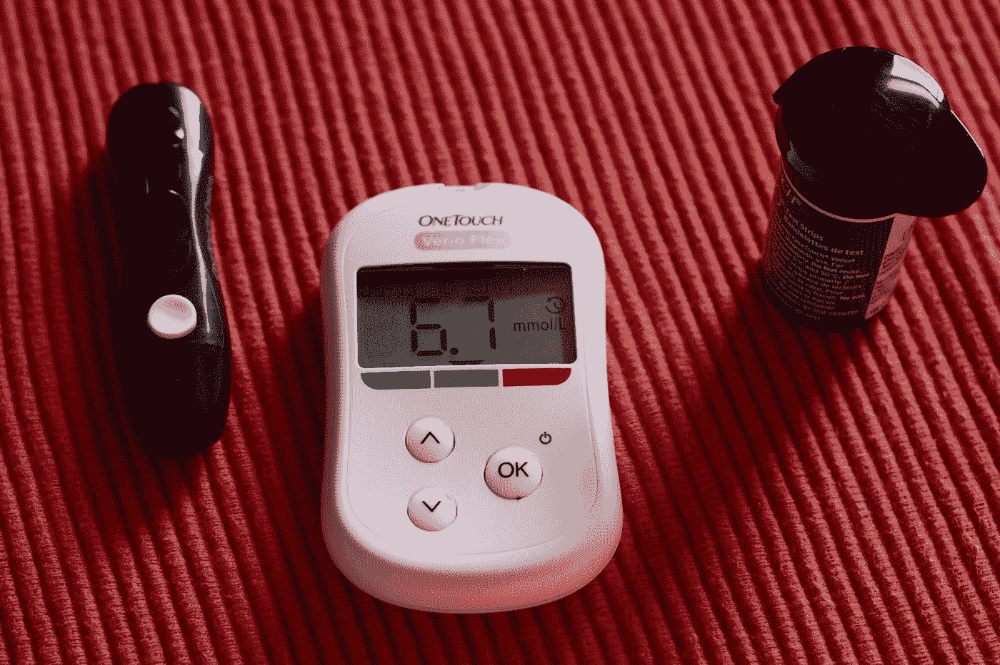

[凯特](https://unsplash.com/@kateredfern?utm_source=medium&utm_medium=referral)在 [Unsplash](https://unsplash.com?utm_source=medium&utm_medium=referral) 上的照片

**简介:** 正如我们所知，神经网络是计算机科学史上发现的最
高级形式的计算模型。那么是什么让它与其他计算模型如此不同呢？

由于它能够检测数据中未被发现的模式，只需要很少的特征工程，并且能够作出最可能的决定，它被认为是现代数据爱好者的武器。

在制作机器学习模型时，任何制作模型的人主要关心的是以这样一种方式使数据适合模型，即当应用于外部数据时，它以最小的误差幅度给我们最好的准确性。

因此，为了展示神经网络的实现，我们将使用 Keras 库，因为它具有用户友好的特性。我们今天要用的数据集来自 Kaggle。

> **让我们开始:** 每当我们制作机器学习模型时，我们总是遵循这些步骤:
> 1 .设置目标
> 1 .获取数据
> 2 .探索并可视化数据
> 3 .从数据中消除不一致
> 4 .初始化型号
> 5。在模型
> 6 上训练我们的数据。测试模型的准确性，如果(准确性低于预期)
> 那么我们对模型和数据进行一些更改，然后重新评估模型。

## 目的:确定患者是否患有糖尿病

获取数据:[https://www . ka ggle . com/UC IML/pima-Indians-diabetes-database/](https://www.kaggle.com/uciml/pima-indians-diabetes-database/)
我们使用 pandas 将数据加载到 jupyter 笔记本中，看到数据的头部。

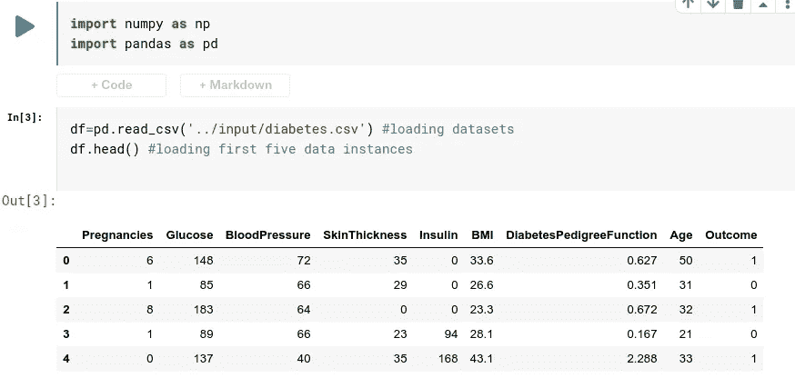

从上面的数据探索中，我们可以得到以下关于属性的信息。

**怀孕**:怀孕次数
**血糖**:口服葡萄糖耐量试验 2 小时血糖浓度
**血压**:舒张压(毫米汞柱)
**皮肤厚度**:三头肌皮褶厚度(毫米)
**胰岛素** : 2 小时血清胰岛素(μU/ml)
**【身体质量指数**:体重指数(体重，单位为千克
**糖尿病谱系功能**:糖尿病谱系功能
**年龄**:年龄(年)
**结果**:类变量(0 或 1)【二进制输出】

这里输出是输出变量，而其余的是自变量。1 代表糖尿病，0 代表无糖尿病。

**探索数据集:**

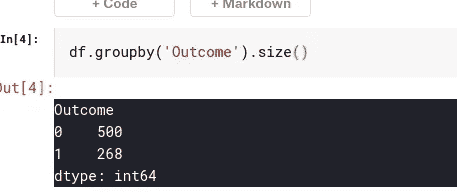

> **观察**:我们可以看到几乎 65 %的患者没有糖尿病，
> 其余 35 %是糖尿病患者。

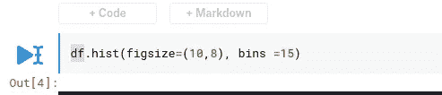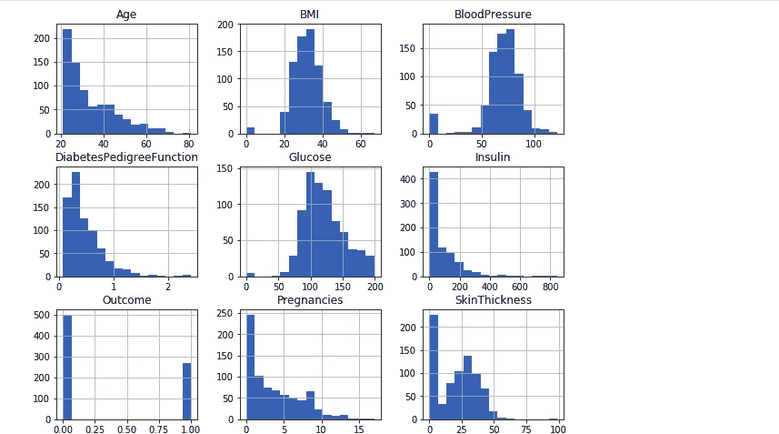

数据集中所有变量的直方图

***从上面的直方图可以得出很多真知灼见:*** 1。大多数患者的年龄分布在 20–30 岁之间
2。几乎所有患者的身体质量指数分布都在 20–40 之间
3。大多数患者的血糖水平分布在 100–150 之间
4 数据包含某些特征的异常值，我们将了解是否需要进一步的工程设计。因此，使用上述直方图可以得出更多的结论

# 准备训练数据集:

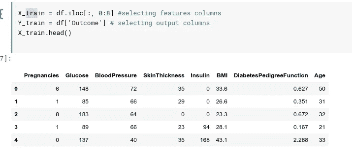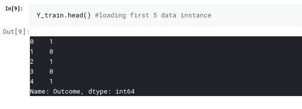

这里，我们选择了输入要素和输出属性，并将其输入到网络中。根据这些特征，我们的网络将为我们做出预测。

# 模型准备:

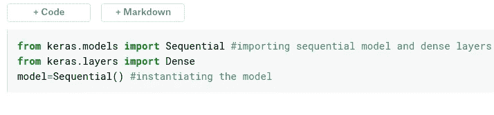

这里，我们引入了顺序模型，它将定义我们的网络架构，即层的堆栈。我们这里使用的层的类型是密集类型，这是一个完全连接的层。最后，我们实例化我们的模型

# 定义网络架构:

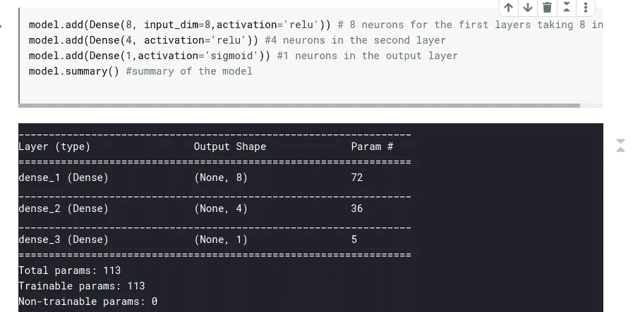

因此，我们在网络中增加了 3 层。第一层由 8 个神经元(随机选择)组成，输入维数是 8，因为在我们的数据集中输入特征的数量是 8，并且激活函数是 relu，因为计算开销小于 sigmoid。在第二层中，总共使用了 4 个具有 relu 激活功能的神经元
。在最后一层中，仅使用了一个神经元，因为我们的输出仅给出一个二进制结果。

**参数计算:
输入数*神经元数+偏差(每个神经元 1 个)** 第一层:8*8+8=72
第二层 4*8+4=36
第三层:1*4+1=5
合计=113

**导入优化器优化损失函数**

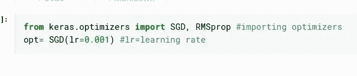

这里我们引入了不同的优化器来减少网络的误差，从而提高精度。我们给出了优化器的学习率。
在 SGD 中，学习率不衰减，而在 rmsprop 中，学习率在每个历元后衰减。

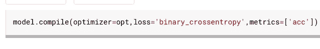

我们编译了我们的模型，给出了不同的参数，如损失和指标。
当我们的预测标签不大于两个时，使用二元交叉熵
度量参数帮助我们计算必要的测量值，同时训练我们的网络，如准确性和损失。

# 训练神经网络:

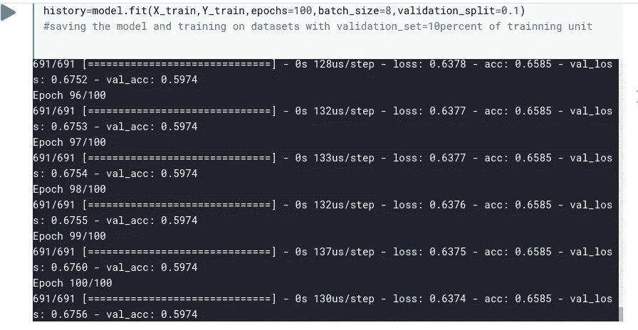

**观察**:我们可以看到，我们的训练准确率为 65%，验证准确率为 59%，可以说我们有一定的过拟合。

**剧情观察:**

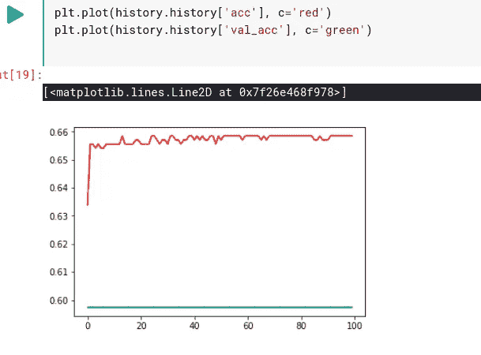

从上面的图中，我们可以说验证精度是恒定的，不随时间增加，训练精度也是如此。

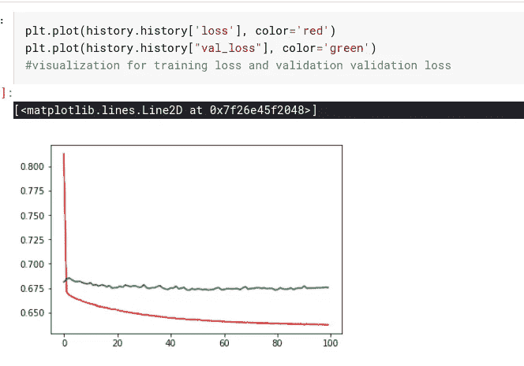

损失图对于训练数据是好的，但是由于过度拟合，对于验证不是很好。因此，我们可以通过对我们的模型进行一些改变来调整我们的模型，使其表现得更好，比如改变纪元的数量，使用不同的优化器，添加更多的层，并在每层中添加更多的神经元。

# 更新网络:

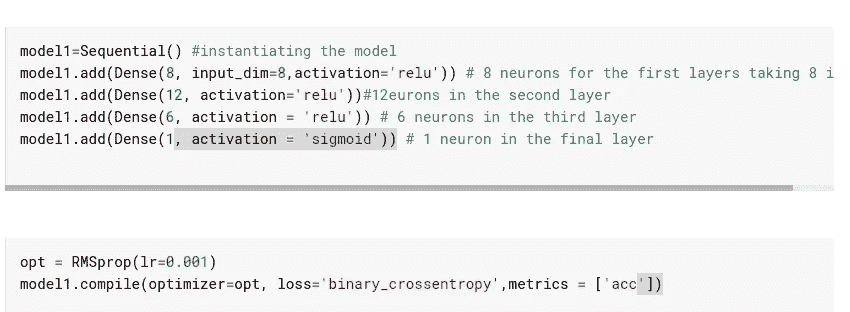

**更新**:这里我们增加了额外的层，增加了神经元的数量，使用了不同的优化器，将学习率降低到 0.001，增加了历元的数量。

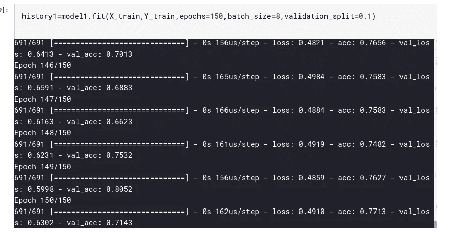

**观察**:训练和验证精度都很好，损失也是双方都可以承受的。让我们借助图表来形象化地描述损失和准确性

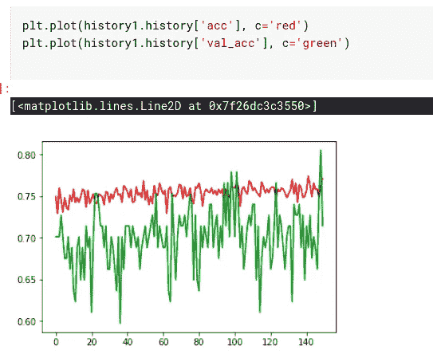

我们可以看到训练和验证准确性的峰值都在增加。这是一个不错的进步。

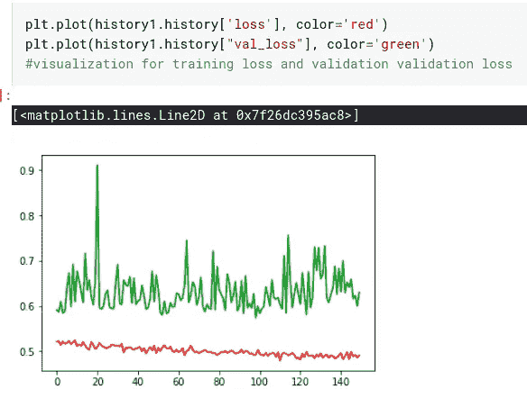

损失图不知何故比前一个好，但仍然需要大量的黑客下降。

# 结论:

正如我们可以看到的，在我们的旧模型中经过调整和改变后，我们得到了一个更好的模型，这证明了制作一个好的神经网络就是反复搜索
这样的参数，直到达到所需的精度水平和损失百分比。我鼓励每个人用他们的模型玩一段时间，因为你不能在第一次尝试中得到优化的模型。这是一系列的尝试和失败。

**P** 。 **S** :是我在学习机器学习的时候，导师给我的任务之一。它于 2019 年 1 月 5 日完成，我决定将其发布在媒体上。

**链接** **到******笔记本**:[https://www . ka ggle . com/sanjogch/prediction-using-neural-network-with-keras？scriptVersionId=24105218](https://www.kaggle.com/sanjogch/prediction-using-neural-network-with-keras?scriptVersionId=24105218)**

****找到**【https://www.linkedin.com/in/sanjog-g-c-173174186/】我 **上:****