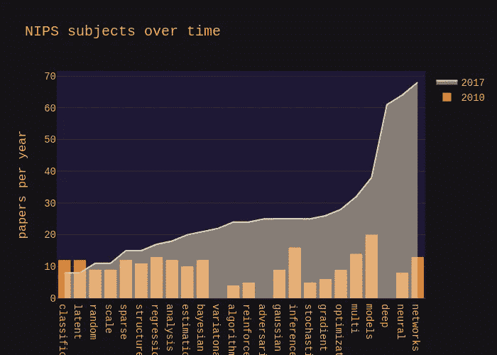
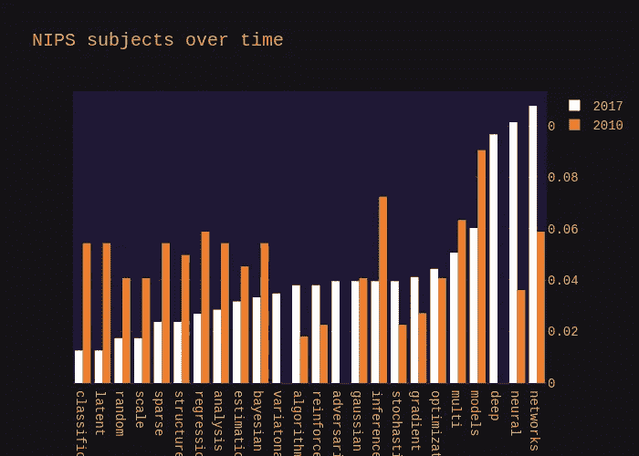
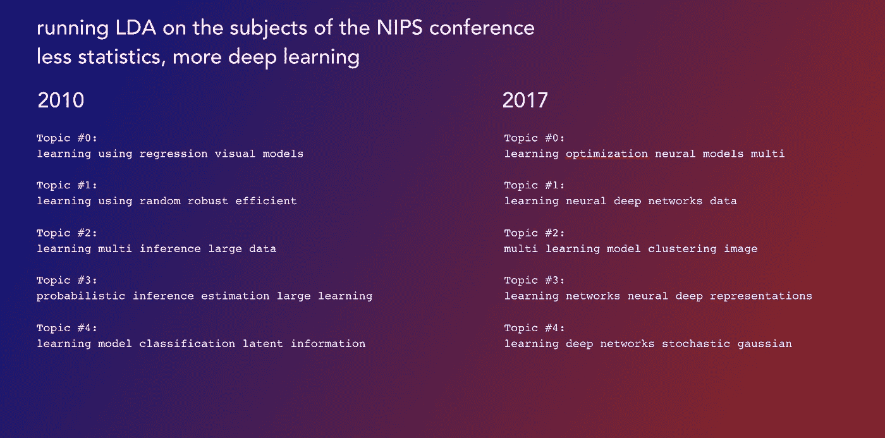

# 使用 NLP 和 LDA 绘制神经信息处理系统的进化会议

> 原文：<https://medium.com/analytics-vidhya/using-nlp-and-lda-to-map-the-evolution-of-the-neural-information-processing-systems-conference-9bf3d5927b4a?source=collection_archive---------36----------------------->

NLP 的有趣之处在于，你很少看到它与时间序列分析混合在一起。所以，在这篇文章中，我们研究了一段时间内话题的变化。我们在这里使用了本·哈默在神经信息处理系统会议上制作的数据集，在这里可以得到。套用他的话来说，NIPS 研讨会是世界上顶级的机器学习会议之一。它涵盖的主题从深度学习和计算机视觉到认知科学和强化学习。单独使用 sci-kit，我们如何确定受试者的进展？

数据集非常干净，我们只关注论文标题。这部电影始于 1989 年。完成于 2017 年，这是有完整记录的最近一年。我们在这里选择 2010 年和 2017 年来比较这些主题。[所有的代码都在我们 Kaggle 的内核](https://www.kaggle.com/danielroyblackdiam/kernel2805e7026d/edit)中。

第一个结论:论文爆炸！2017 年为 631 人，而 2010 年为 221 人。其次，简单的一袋字数统计显示，2017 年的一些关键词，2010 年甚至都没有涵盖，比如‘深度’[‘学习’]。

在这一点上，我们必须明确指出，我们显然删除了通常的停用词，但它们的数据科学对等词，如“数据”、“大”、“学习”和“模型”，这些词要么出现得非常频繁，要么没有带来大量信息。



这第一张图有被 2017 年最大量的出版物扭曲的问题。所以我们把每个科目标准化了，用它除以涵盖科目的总数。



结果现在非常清晰。2010 年流行的东西在 2017 年就不那么受欢迎了，2017 年接受治疗最多的受试者在 2010 年几乎没有接受治疗。“贝叶斯”、“分类”、“回归”等术语不再流行，而“神经”、“网络”、“深度”、“梯度”变得无处不在。

> *数据清楚地显示了机器学习领域如何从统计学转向纯算法的、基于样本的解决方案*

说明这一点的另一种方式是通过在主体的语料库上运行潜在的狄利克雷分配。LDA 总是提供稍微超现实主义的主题，但是却很好地展示了潜在的主题表面

```
*# Load the LDA model from sk-learn*
from sklearn.decomposition import LatentDirichletAllocation as LDA

*# Helper function*
def print_topics(model, count_vectorizer, n_top_words):
    words = count_vectorizer.get_feature_names()
    for topic_idx, topic **in** enumerate(model.components_):
        print("**\n**Topic #**%d**:" % topic_idx)
        print(" ".join([words[i]
                        for i **in** topic.argsort()[:-n_top_words - 1:-1]]))

*# Tweak the two parameters below (use int values below 15)*
number_topics = 5
number_words = 5

*# Create and fit the LDA model*
lda = LDA(n_components=number_topics)
lda.fit(count_data)

*# Print the topics found by the LDA model*
print("Topics found via LDA:")
print_topics(lda, count_vectorizer, number_words)
```

这一结果也很好地展示了潜在的现实。机器学习现在更少概率性，更多神经、深度、网络驱动。



作为一个领域，文本数据随时间变化的分析似乎是开放的。一边是时序库和工具(scikit，pandas)，另一边是纯 NLP: gensim，nltk 和 excellent spaCy。

值得称赞的是，这篇作品是由@ larshulstaert 在[数据营](https://www.datacamp.com?tap_a=5644-dce66f&tap_s=880795-41d646&utm_medium=affiliate&utm_source=danielroy1)上从*机器学习最热门的话题*中自由解读的——你也可以在[猜想](http://www.conjecto.co/)上找到它。

*原载于*[*https://www.linkedin.com*](https://www.linkedin.com/pulse/using-nlp-lda-map-evolution-neural-information-systems-roy-cfa/)*。*