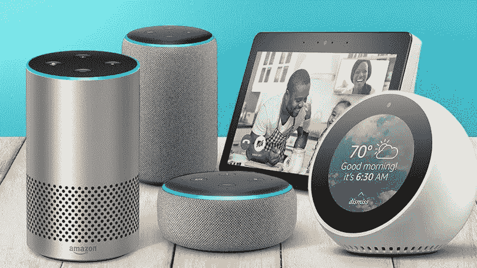
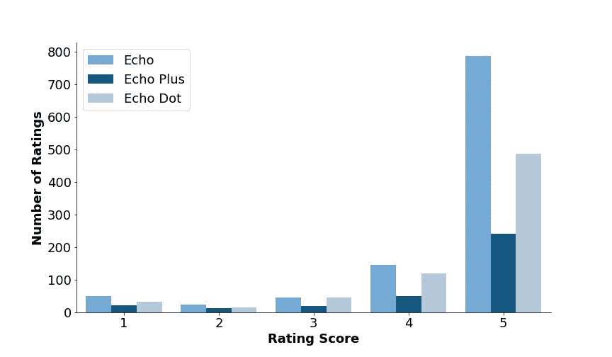
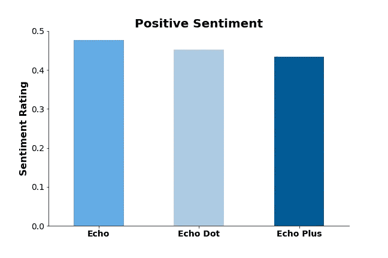
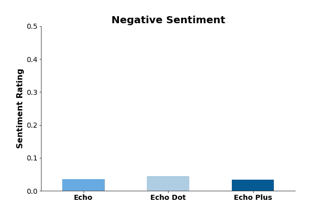
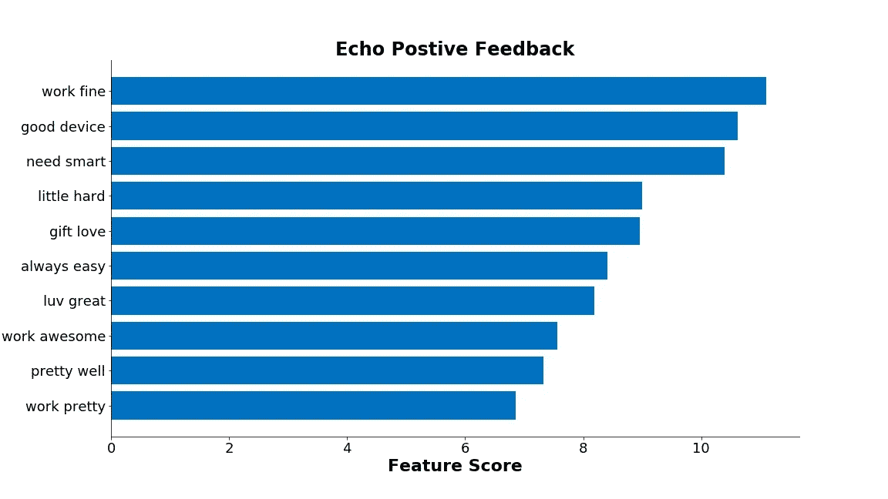
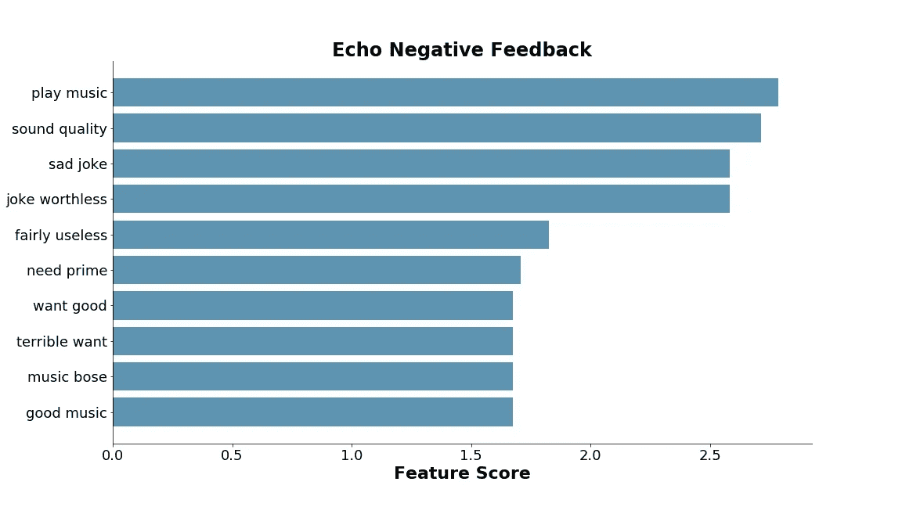

# 在 Amazon Echo 评论上使用 NLP

> 原文：<https://medium.com/analytics-vidhya/using-nlp-on-amazon-echo-reviews-efb5078bf0d3?source=collection_archive---------1----------------------->

## 情感分析和主题建模

图片来自谷歌

近年来，智能家居兴起，智能家居技术不断发展，智能家居技术是一种预测用户、做出响应并自动控制家居设施的系统。

亚马逊(Amazon)和谷歌(Google)等大型科技公司在这个前景广阔的市场投入了大量资金，各自开发并推出了自己的产品线。被宠坏的选择，消费者从哪里开始？通常是通过阅读其他用户的评论来决定投资哪种设备。

在这个项目中，我们将使用自然语言处理(NLP)技术专门查看三个亚马逊 Echo 上的评论，即 Echo Plus、Echo 和 Echo Dot。评论来自于 [Kaggle](https://www.kaggle.com/sid321axn/amazon-alexa-reviews) 上的数据集。

为了便于比较，Echo 的零售价从 50 美元到 150 美元不等，Echo Plus 的价格最高，Echo Dot 的价格最低。

对用户给出的评级(5 是最好的)的初步观察告诉我们两件事；1)正面评价比负面评价多。《回声》可能会成为畅销书。

为了找出评论的情绪是否与评级分数匹配，我使用 VADER (Valence Aware 字典和情绪推理器)进行了情绪分析，并取了平均正负分数。VADER，一个基于词汇和规则的情绪分析工具，专门针对社交媒体上表达的情绪。

评论的平均正面情感评级比负面高 10 倍，这表明评级得分是可靠的。

我想通过使用 LDA(潜在狄利克雷分配)进行主题建模，找出哪些特征是经常被评论的。使用迭代过程，LDA 将文档映射到主题的分布。单词在主题中的分布是在迭代过程中建立起来的。(这篇[文章](https://towardsdatascience.com/light-on-math-machine-learning-intuitive-guide-to-latent-dirichlet-allocation-437c81220158)深入解释了 LDA，如果你感兴趣的话)。

最常见的话题似乎是:用户评论他们有多爱它，易用性和音质。

使用计数矢量器(TFIDF)，我分析了用户对 Amazon Echo 的爱与恨，也就是有助于积极和消极情绪的单词。

虽然一些用户不喜欢声音质量，认为 Echo 不值得他们花钱，但许多用户认为该设备工作良好，易于使用。这些反馈对于亚马逊的开发团队来说是非常有建设性的，他们可以研究并考虑改进他们的设备以满足消费者的需求。

这个项目的所有代码可以在我的 [Github](https://github.com/kelseyheng/amazon_echo_reviews) 上找到。如果你愿意联系，可以通过 [LinkedIn](https://www.linkedin.com/in/kelseyhenghy/) 联系我。