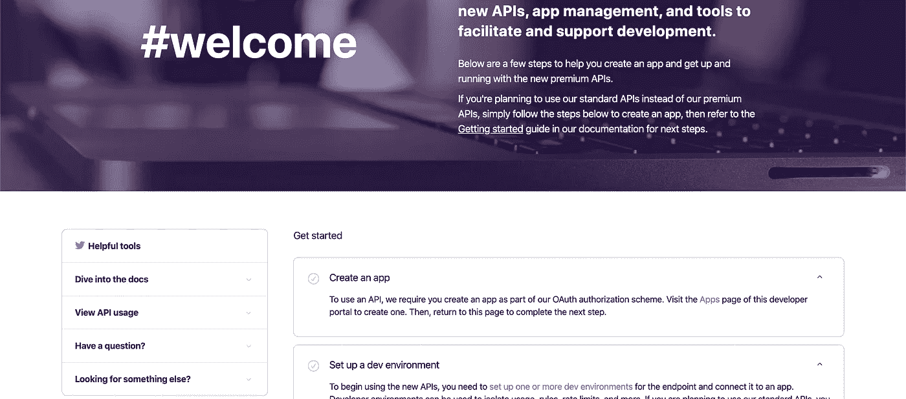
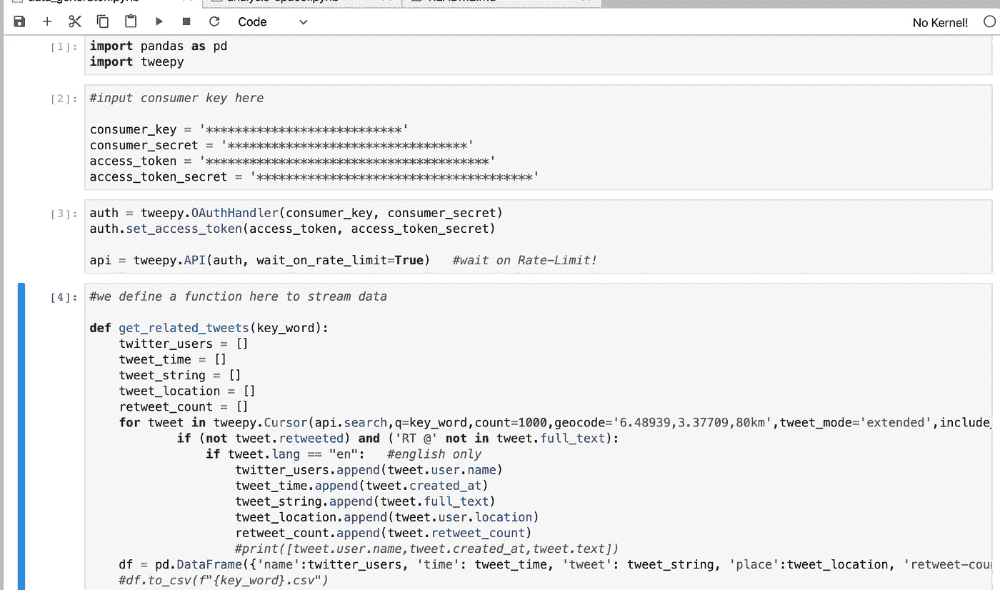
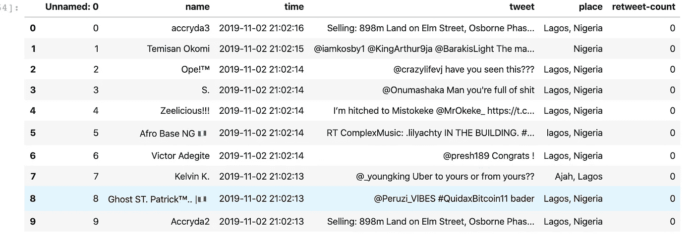
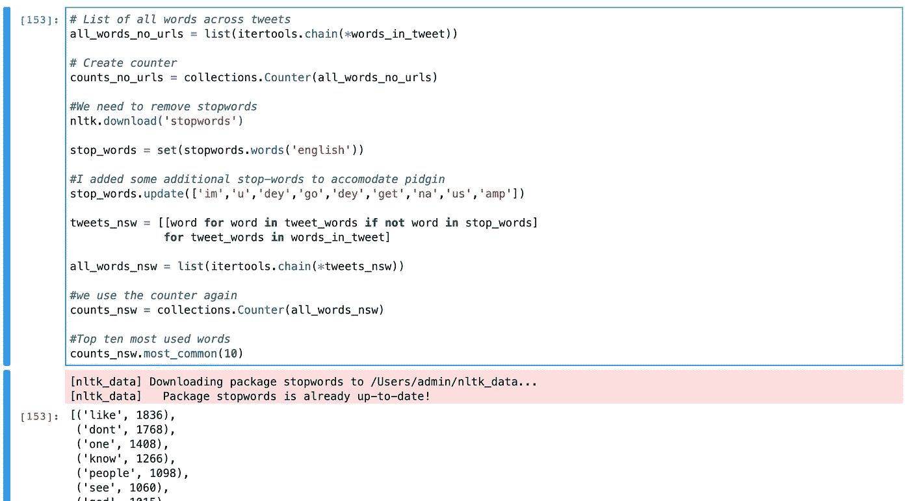
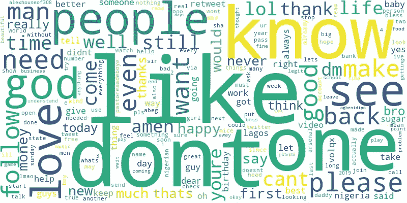
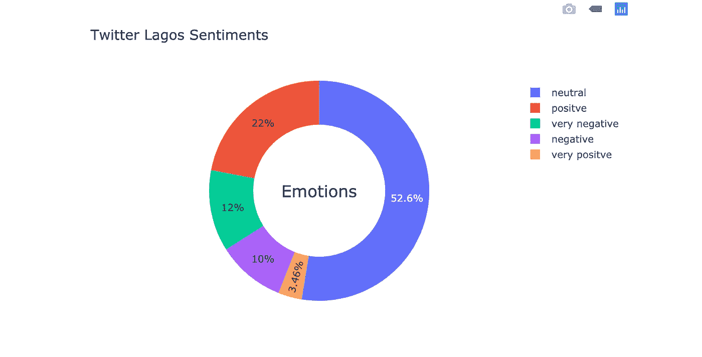
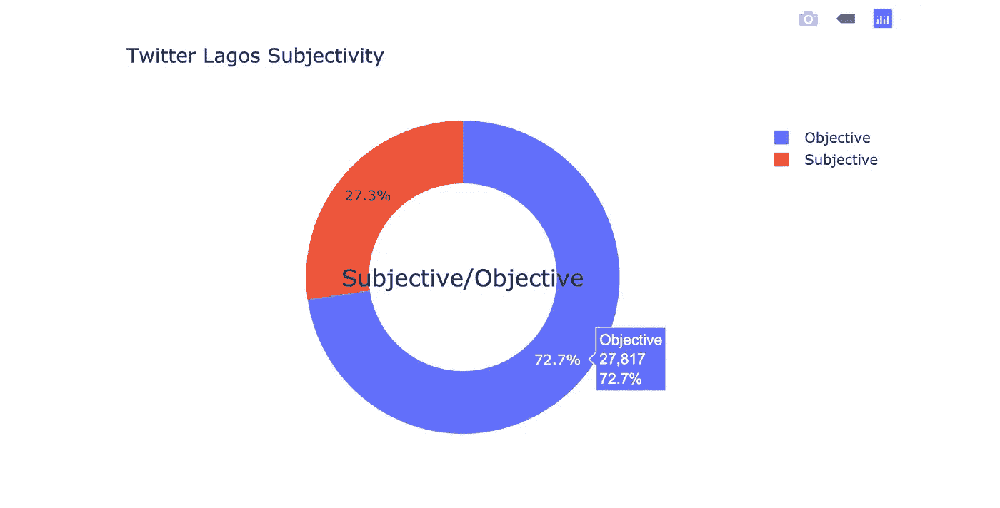
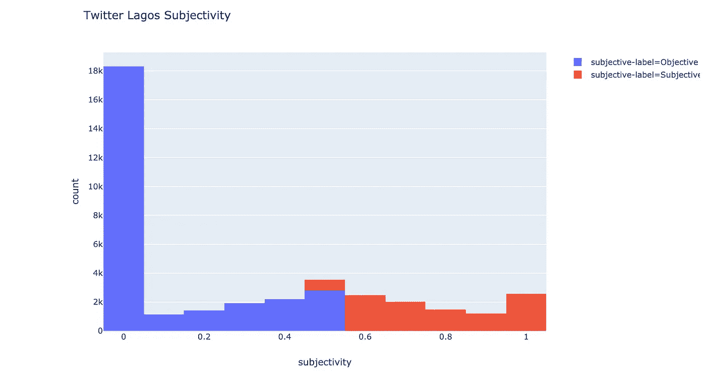

# 使用 NLP 来确定拉各斯的情绪

> 原文：<https://medium.com/analytics-vidhya/using-nlp-to-determine-the-sentiments-of-tweets-522f1cca381a?source=collection_archive---------12----------------------->

非洲人口最多的城市。尼日利亚拉各斯。

每个人都在谈论拉各斯是一个实现梦想和满足所有愿望的城市。这些想法导致前首都被洪水淹没，其 20 个地方政府区目前居住着 1600 多万人。

我使用自然语言处理工具对 twitter 上来自这座城市的推文进行了情感分析。在本文中，我将向您介绍我的过程。底部有 Github 上完整代码的链接。

没有数据就没有数据科学。首先，我们需要得到数据。为此，我们需要通过这个[链接](https://developer.twitter.com/en/account/get-started)开一个 twitter 开发者的账户。在创建帐户之前，您可能需要回答一些问题。这个[环节](https://docs.inboundnow.com/guide/create-twitter-application/)也说明了更多。

Twitter 开发者账户主页

帐户创建后，我们将使用我们的访问代码(我建议你永远不要在网上分享)在 twitter 上流式传输。为了我的工作，我在 4 天的时间里发布了大约 38，500 条推文。安装一个 tweepy 库可以让我们在 twitter 上流式传输。还要注意，API 搜索每 15 分钟只能访问 1000 条推文。另一个选择是使用 API-stream，它随机生成 10%的 tweets。在这里阅读更多。

数据生成程序

上图中的通配符返回所有推文，而地理编码确保我们只直接从拉各斯获取推文。

现在我们有了数据，我们下一步做一些分析。这里我们需要 TextBlob、newspaper3k 和 nltk 库来进行分析。

首先，我们需要清理推文。这包括删除网址，将推文转换成小写字母，并将推文拆分成单词。使用 nltk，我们可以创建一个计数器。我们也可以包括停用词。[停用词](https://en.wikipedia.org/wiki/Stop_words)是常用词，我们不感兴趣。在我的例子中，我添加了一些尼日利亚的洋泾浜语停用词，因为一些推文是洋泾浜语。

清理和字数统计

由此，我们还可以使用单词云库来生成单词云，以显示经常使用的单词。这是我由此生成的图像。

常用词的词云图像

现在，上面的图像揭示了在收集这些数据期间，像 ***、不、知道、一、爱、人*** 这些词被使用得更多。

我们可能还会使用 plotly 生成一个饼图来可视化推文的情感分析。这里我们使用 TextBlob 库。这将返回一个介于-1 和 1 之间的浮点数，表示消极对积极的严重程度。图表显示了很多中性情绪。消极或积极的衡量标准是由许多预先训练好的词汇决定的。因此，例如“我很难过”或“我很厌恶”可能是-0.2，“我非常难过和烦恼”可能是-0.6。基本上，该算法通读推文，并试图从使用的单词中确定作者的情绪。

显示情绪分析的饼图

我们还可以使用 Textblob 返回给我们这些推文的主观或客观程度。举个例子，我得到了这个。表明拉各斯人是非常客观的人。

Plotly 饼图显示拉各斯 Twitter 主观性的措施

我们也可以尝试 plotly 直方图来显示我们旁边的计数。

Plotly 直方图显示拉各斯 Twitter 主观性的衡量标准

虽然结果很有趣，但 Pidgin 停用词的不可用性有点令人头疼，因为这必须手动输入。我真的希望在 NLP 的发展中，更多的非洲语言会被考虑。github 上的完整代码链接是[这里](https://github.com/samsonafo/twitter-lagos)。

如果你喜欢这篇文章，你可以考虑给我买☕️.咖啡

Vielen dank😊