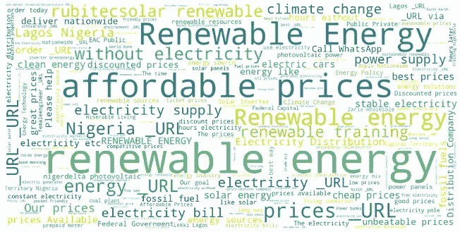

# 理解能源转换的社会障碍的自然语言处理和可视化

> 原文：<https://medium.com/analytics-vidhya/using-nlp-to-find-barriers-to-humanizing-energy-transition-a150b980221c?source=collection_archive---------15----------------------->

搭配云(思想、关注、情感):尼日利亚示例

## 美国、英国、尼日利亚和印度公民对能源转型和经济去碳化的想法、担忧和感受。

> 下面的文章描述了世界公民如何看待他们在能源转型中的角色。这包括相关的社会风险、机会和成本。

这些发现是世界能源委员会(WEC)为期两个月的人工智能项目的一部分。我和其他 30 名工程师一起解决了这个挑战，并获得了有意义的见解。

# 项目目标

该项目的目的是为政府寻找有益的方式，让人们参与加速能源转型和利用可持续能源。这个问题相当复杂，没有数据提供给我们。因此，我们应该创建自己的数据集，分析它，并为 WEC 提供见解。我们从一长串开放式问题开始，例如:

*   我们的输出应该是什么样的？
*   哪些搜索词对搜集数据有用？
*   哪些国家应被视为我们的主要关注点？
*   我们是否也应该考虑非英语语言并对其进行分析？
*   每个国家有多少数据就够了？
*   等等。

为了满足项目的最后期限，我们决定只使用英语，并提出良好的工作模式。

# 从社交媒体获取数据

我们搜集了以下资源: **Twitter、YouTube、脸书、Reddit，以及针对每个国家的著名报纸**。期望的洞察力应涵盖发达国家、发展中国家和欠发达国家，重点是发展中国家和欠发达国家**。**

> 本文讨论的结果是从*搜集的推文数据*和*美国、英国、印度、*和*尼日利亚*获得的，涵盖了发达国家、发展中国家和欠发达国家三个类别。

# 我们的方法:尝试不同的 NLP 技术

我们首先使用谷歌趋势，通过使用我们发现对特定国家很重要的几个特定关键词收集推文来收集数据。我添加了停用词、词干、删除了标签、标点、数字、提及，并用 _URL 替换了 URL。我使用 TF-IDF 矢量化来提取文章的特征。我将向您介绍解决该问题的各种步骤。

# **方法 1:情感分析(不满意)**

短推文数据的情感分析有其自身的挑战，我们在这个项目中面临的一些重要挑战是:

*   标签在不同的国家有不同的含义。#不会是加拿大人抱怨冬天的日落，也不会是尼日利亚人停电。
*   标签表明立场。例如，#可再生能源是亲绿色的，而#climatehoax 不是。因此，对#可再生能源的积极情绪可能不会真正告诉我们太多。
*   建立在#climatechange 和相关标签上的分类器模型对#climatemyth 这样的反绿标签根本不起作用。
*   一些反绿色的推文充满了快乐的表情符号，这使得情绪不可靠。
*   主要的推特国家都非常积极。事实上，全球气候变化相关推文的分布并不一致，一些国家的推文数量在数据集中比其他国家多得多(图 1) [1]。
*   对输出的解释。事实上，仅仅给每条推文贴上标签，我们无法洞察能源转型的障碍。因此，模型的可解释性非常重要。

考虑到所讨论的所有挑战，对推文的情感分析没有产生令人满意的结果(表 1 ),我们决定测试其他模型。

**图 1:** 每个国家与气候变化相关的推文数量[1]

**表 1:** 推文数据情感分析的分类器准确度(美国)

# **方法二:主题建模(不理想)**

主题建模是一种 NLP 技术，它提供了一种比较不同主题强度的方法，并告诉我们哪个主题与其他主题相比信息量更大。主题模型是无监督的模型，不需要数据标注。因为推文很短，所以很难区分不同的主题，也很难使用 LDA 等模型将它们与特定的主题对应起来。当应用于不太短且结构一致的文本时，主题模型往往会产生最好的结果。

## 使用半监督的方法

我们选择了半监督主题建模方法([CorEX](https://github.com/gregversteeg/corex_topic/blob/master/corextopic/example/corex_topic_example.ipynb))【2】。由于数据是非常高维的，我们应用了降维来去除噪声和解释数据。置换检验用于确定 PCA 所需的最佳主成分数[3，4]。从解释方差比图来看，累积解释方差线似乎不是完全线性的，但它非常接近于直线。

通过置换测试，我注意到置换矩阵的解释方差比的均值与非置换矩阵的解释方差比并没有真正的不同，这表明对相关主题模型的结果应用主成分分析是没有任何帮助的。

这意味着每个主成分对方差解释的贡献几乎相等，基于主成分分析降低维数没有多大意义。

## 确定 20 个重要主题

CorEx 的结果显示有大约 20 个重要的主题，它还显示了每个主题的重要单词。但是如何解读结果呢？

数据是非常高维的，降维没有任何帮助。例如，如果价格、电力、门票、燃料、天然气和怀疑主义是一个话题最重要的词汇，如何理解该国人民的关切？他们关心的是燃料价格吗？或者电价，或者门票价格？在每个主题中可能有许多不同的可能相关的词的组合，仅通过查看每个主题中的重要词，不可能找出数据背后的故事。

此外，带有主题模型的二元模型或三元模型也没有多大帮助，因为传达推文主要焦点的主要关键词可能并不总是一起出现。

# **方法 3:聚类(k 均值&分层)**

Kmeans 和层次聚类模型都产生了说明单独的清晰聚类的可比较的结果。因为这两个模型具有可比的性能，所以我们使用层次聚类来导出所有结果，这更好地显示了聚类的层次结构。如前所述，收集了四个不同国家的推文数据，并将该模型分别应用于每个国家的数据，以分析结果。总之，我们只显示印度的聚类结果。**但所有国家间的洞察都在文章末尾显示。**

## 分层聚类结果

从数据中找到清晰的聚类后，下一步是通过创建有意义的可视化和洞察力来解释数据。散点图、共现图、离差图、同处词云以及热门三元模型的组合产生了非常有用的数据洞察。

> 这里要指出的一个重要教训是，永远要依靠各种情节的组合来解释，而不是只有一个。每种类型的图都有助于我们将数据的一个方面可视化，将各种图结合在一起有助于从数据中创建一个全面清晰的画面。

# 使用分散文本的可视化

Scattertext 是一个优秀的探索性文本分析工具，允许使用交互式散点图来区分不同文档使用的术语。

创建了两种类型的图，这对解释结果非常有帮助。1)可视化单词嵌入投影。这已经通过使用特定关键字的单词关联进行了探索。关键词包括以下:【 ***】获取、可用性、可负担性、账单、价格*** 】。如果读者感兴趣，他们可以使用本研究中提供的代码尝试更多的关键字。2)在另一个图中，使用密集排序的特定于类别的频率来选择和绘制来自聚类推文的单字。我用密集等级中的这种差异作为评分函数。

所有的交互图都存储在一个 HTML 文件中，可以在 GitHub 存储库中找到。如果你点击互动版，可以浏览包含每个特定术语的推文列表。请注意，首先对数据进行层次聚类，然后将聚类后的 tweets 作为输入提供给 Scattertext。你可以通过深入研究这些情节来获得进一步的信息。用于创建这些结果的数据可在[这里](https://github.com/mkhoshle/AI-for-Energy/tree/master/pipedata-simon)找到，用于聚类和创建这些散点图的笔记本可在[这里](https://github.com/mkhoshle/AI-for-Energy)找到。

以下显示了各个国家所有图的交互版本:

***印:*** [簇 1 vs 2](https://mkhoshle.github.io/AI-for-Energy/ScattertextRankData12_India.html) ，[簇 1 vs 3](https://mkhoshle.github.io/AI-for-Energy/ScattertextRankData13_India.html) ，[字嵌入:价格](https://mkhoshle.github.io/AI-for-Energy/word_similarity_prices_India.html)，[字嵌入:账单](https://mkhoshle.github.io/AI-for-Energy/word_similarity_bills_India.html)

***尼:*** [簇 1 vs 2](https://mkhoshle.github.io/AI-for-Energy/ScattertextRankData12_Nigeria.html) ，[簇 1 vs 3](https://mkhoshle.github.io/AI-for-Energy/ScattertextRankData13_Nigeria.html) ，[字嵌入:价格](https://mkhoshle.github.io/AI-for-Energy/word_similarity_prices_Nigeria.html)，[字嵌入:接入](https://mkhoshle.github.io/AI-for-Energy/word_similarity_access_Nigeria.html)，[字嵌入:负担能力](https://mkhoshle.github.io/AI-for-Energy/word_similarity_affordability_Nigeria.html)，[字嵌入:可用性](https://mkhoshle.github.io/AI-for-Energy/word_similarity_availability_Nigeria.html)

***英国:*** [集群 1 vs 2](https://mkhoshle.github.io/AI-for-Energy/ScattertextRankData12_UK.html) ，[集群 1 vs 3](https://mkhoshle.github.io/AI-for-Energy/ScattertextRankData13_UK.html) ，[字嵌入:价格](https://mkhoshle.github.io/AI-for-Energy/word_similarity_prices_UK.html)，[字嵌入:账单](https://mkhoshle.github.io/AI-for-Energy/word_similarity_bills_UK.html)，[字嵌入:可用性](https://mkhoshle.github.io/AI-for-Energy/word_similarity_availability_UK.html)

***美国:*** [聚类 1 vs 2](https://mkhoshle.github.io/AI-for-Energy/ScattertextRankData12_USA.html) ，[聚类 1 vs 3](https://mkhoshle.github.io/AI-for-Energy/ScattertextRankData13_USA.html) ，[单词嵌入:价格](https://mkhoshle.github.io/AI-for-Energy/word_similarity_prices_USA.html)，[单词嵌入:账单](https://mkhoshle.github.io/AI-for-Energy/word_similarity_bills_USA.html)，[单词嵌入:可用性](https://mkhoshle.github.io/AI-for-Energy/word_similarity_availability_USA.html)，NLP 可视化

## 不同类别的排名和频率(印度)

**图 8。**一个示例散点图，根据群集 1 & 2 的密集频率等级显示术语的位置。分数是术语密集等级之间的差异。术语越蓝，它们对于聚类 1 的关联分数越高。术语越红，它们对于聚类 2 的关联分数越高。请看[集群 1 对 2](https://mkhoshle.github.io/AI-for-Energy/ScattertextRankData12_India.html) 的互动版本。

**图九。**一个示例散点图，根据群集 1 & 3 的密集频率等级显示术语的位置。分数是术语密集等级之间的差异。术语越蓝，它们对于聚类 1 的关联分数越高。术语越红，它们对于聚类 3 的关联分数越高。参见[集群 1 对 3](https://mkhoshle.github.io/AI-for-Energy/ScattertextRankData13_India.html) 了解该图的互动版本。

## 使用分散文本的单词嵌入投影图(印度)

**图 10。**示例散点图，使用 Spacy 的预训练嵌入向量显示词语与术语 ***价格*** 的关联。这用于查看与术语**和*价格关联最大的术语。*** 在右上角，我们看到最常见的联想词有*比如电价。如果你点击互动版本，可以浏览带有术语的推文列表。这个情节的互动版本见[文字嵌入:账单](https://mkhoshle.github.io/AI-for-Energy/word_similarity_bills_India.html)。*

**

***图 11。**示例散点图使用 Spacy 的预训练嵌入向量显示词语与术语 ***账单*** 的关联。这是用来查看与**条款和*条款关联最多的条款。*** 在右上角，我们看到了与术语 ***账单*** 最常见的关联词语，如电力、价格、能源、功率。如果你点击互动版本，可以浏览带有术语的推文列表。参见[文字嵌入:价格](https://mkhoshle.github.io/AI-for-Energy/word_similarity_prices_India.html)获得该情节的互动版本。*

# *见解(价格和能源转型问题)*

## ***印度***

*   *太阳能和风能并不一定意味着更便宜的价格，因为它并没有在德国造成这种情况。当德国全力发展可再生能源时，能源价格和碳排放量都上升了。*
*   *对于从政府所有的可再生能源中获取电力的人来说，电力价格**可能**下降，因为价格不会随着石油和天然气而变化。*
*   *可再生能源政策可以大幅降低电价，增强全球经济竞争力，减少化石燃料进口，从而减少污染。*
*   *对煤炭征税和让开放获取成为现实是让可再生能源变得负担得起的两个潜在行动领域。*
*   *让油价上涨，停止补贴。*
*   *许多人要求用更清洁的化石燃料代替化石燃料，如农民的麦茬。*
*   *削减**石油进口**鼓励**可再生能源。***
*   *很多关于**缺电、**缺电几小时或几天、停电、停电、停水的投诉。*
*   *化石**燃料**肮脏，**核电**危险。因此，我们需要让可再生能源发挥作用。*

## ***尼日利亚***

*   *人们抱怨没有持续不断的**电力、**和零商业友好政策。*
*   *加强该国电力的输送。*
*   *每当下雨**电力供应**被**切断**数日**缺电**每周末每日通宵**不稳定用电**。*
*   *没有**水**也没有**电。***
*   ***电力**部门是第三大石油消耗部门。*
*   *关于**支付** **电费**的诸多烦恼和麻烦。*
*   ***接入**到**电**并不适合所有人。*
*   ***获取**到**负担得起的**可持续的**可再生的**能源。*
*   *可再生能源、水和废物管理是尼日利亚与加纳的主要合作领域。*
*   *利用潮汐能或海上风能，这是一种清洁的可再生能源。*
*   *使用**太阳能**电力系统有很多积极的体验和低廉的价格。*

## ***英国***

*   *降低**电**和**气**的**价格**。*
*   ***稳定价格**供**电。***
*   *人们更喜欢天然气**比电力**更高的价格**。***
*   *需要思考**超越**电能来影响**能量转换。***
*   ***可再生能源**扰乱**电力市场**政客们提高**电价**来解决**气候紧急情况**问题是一个**糟糕的政策。***
*   *许多关于投资可再生能源的请求。*
*   *从**过渡到可再生能源**太慢**。***
*   ***关于用可再生能源取代核电站是否好的讨论很多。***
*   *****零碳经济**对英国是否有任何**经济利益**。***

## *****美国*****

*   *****减缓气候变化。*****
*   *****基于市场的**应对**气候变化的解决方案。*****
*   *****可再生能源基础设施**是**瘸腿**和**不靠谱**。***
*   *****可再生能源**提高**电价**和**以优惠的购买协议扭曲能源市场**。***
*   ***许多关于**油价**的投诉。***
*   ***国家安全的重点应该是可再生能源，投资于基础设施和就业项目。***
*   ***想出如何储存可再生能源并清除大气中多余的一氧化碳。***
*   ***可再生能源代表着重大的经济机遇。***

# ***通过离差图衡量单词的重要性***

***一个词的重要性可以通过它在语料库中的分布来衡量。词汇离差是一个词在语料库中各部分的同质性的度量。下面的图表记录了一个单词在不同国家(包括印度、尼日利亚、英国和美国)的整个语料库中出现的次数。***

***根据下面的散点图，获得电力是尼日利亚的一个重要问题，而其他三个国家的情况并非如此。我们怎么知道这个通路和电有关？答案是上一节展示的散点图。将这些图与分散图一起分析表明，问题在于电力接入。***

***在尼日利亚和印度，获得负担得起的可再生能源是一个大问题，而在英国和美国，负担得起的可再生能源不是问题。负担能力是尼日利亚人民的一个大问题，人们很难支付电费。***

***能源、电力、动力和可再生能源也是所有这些国家大多数讨论的主题。但是每个主题的哪些方面是每个国家所关心的？在我们解释散点图结果的前一节中给出了答案。***

******

*****图 12。**跨不同国家的各种关键字的词汇分散***

## *****不同国家的热门三元模型:*****

******

*****图十三。**印度二十大八卦***

***从 ***印度*** 的前 20 个三元模型中可以看出，最受关注的是**可再生能源、可再生能源部门、可再生能源容量、可再生能源来源、新的可再生能源和清洁可再生能源。**这些主要问题与上一节中从聚类中得出的见解非常吻合。***

******

*****图 14。**尼日利亚的前二十个三元模型***

***从尼日利亚*的前 20 个三元模型中可以看出，最受关注的问题是:**可再生能源、可再生能源培训、电力分配公司、可再生能源、可再生能源解决方案、太阳能可再生能源、可再生能源部门、可负担价格、电力供应、气候变化可再生能源、公私部门、可再生能源行业、可再生能源政策以及可再生能源的获取。**这些主要问题与上一节中从聚类中得出的见解非常吻合。****

********

******图 15。**英国排名前二十的八卦****

****从 ***英国*** 的前 20 个三元组可以看出，最受关注的是**免费可再生能源、可再生能源、使用可再生能源、新的可再生能源。**这些主要问题与上一节中从聚类中得出的见解非常吻合。****

********

******图十六。**美国排名前二十的三元模型****

****从 ***【美国】*** 的前 20 个三元组中可以看出，最受关注的是**清洁可再生能源、可再生能源、支持可再生能源、可再生燃料标准、向可再生能源过渡、太阳能可再生能源、新的可再生能源、使用可再生能源、对优质产品的需求以及可再生能源工作。**这些主要问题与上一节中从聚类中得出的见解非常吻合。****

# ****搭配词云与共现网络****

****以下图表显示了不同国家的推文中共现词的网络。在这里，我们将出现的前 25 个二元模型的网络可视化。词与词之间的联系证实了上一节对所有情况的理解。****

********

******图 17。**搭配云彩-印度****

********

******图 18。**同现网络-印度(前 25 个二元模型)****

********

******图 19。**搭配云彩-尼日利亚****

********

******图 20。**尼日利亚共现网络(前 25 个二元模型)****

********

******图 21。**搭配云-英国****

********

******图 22。**同现网络-英国(前 25 个二元模型)****

********

******图 23。**搭配云-美国****

********

******图 24。**美国共现网络(前 25 个二元模型)****

****这篇文章清楚地展示了 NLP 可视化从数据中提取洞察力的能力。进一步的见解可以在[这里](https://omdena.com/blog/energy-transition/)找到。****

## ******关于奥姆德纳******

****Omdena 是一个全球平台，变革者通过合作为现实世界的问题构建道德和包容性的人工智能解决方案。****

****了解更多关于协作人工智能的力量。****

## ****参考****

****[1] B. Dahal，S.A.P. Kumar，Z. Li，全球气候变化推文的话题建模与情感分析，社会网络分析与挖掘，2019 年 9:24，。****

****[2]加拉格尔、瑞安·j、凯尔·赖因、戴维·凯尔和格雷格·弗·斯蒂格。[锚定关联解释:利用最少领域知识的主题建模](https://www.transacl.org/ojs/index.php/tacl/article/view/1244)。计算语言学协会汇刊(TACL)，2017。****

****[http://www.win-vector.com/blog/2016/05/pcr_part3_pickk/](http://www.win-vector.com/blog/2016/05/pcr_part3_pickk/)。****

****[4][https://bio conductor . org/packages/devel/bioc/vignettes/cluster significance/inst/doc/cluster significance-vignette . html # score-permutation](https://bioconductor.org/packages/devel/bioc/vignettes/ClusterSignificance/inst/doc/ClusterSignificance-vignette.html#score-permutation)****