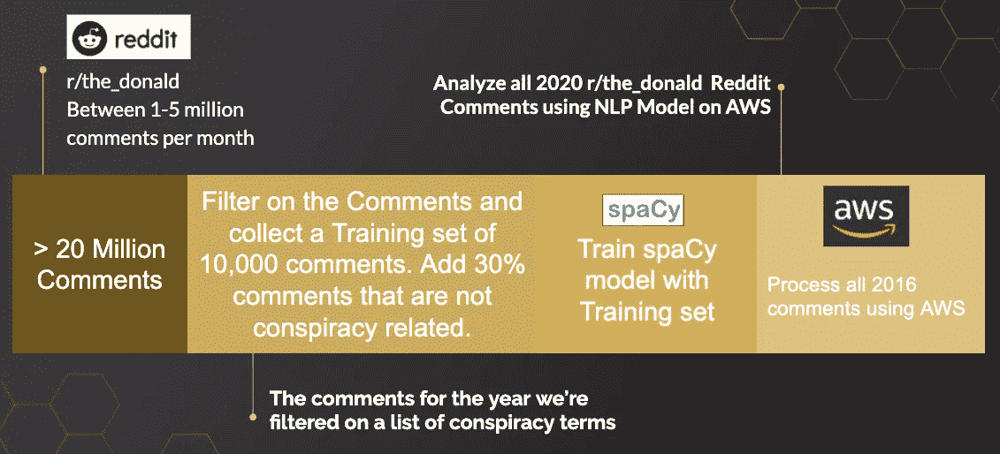
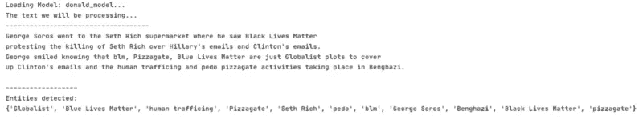
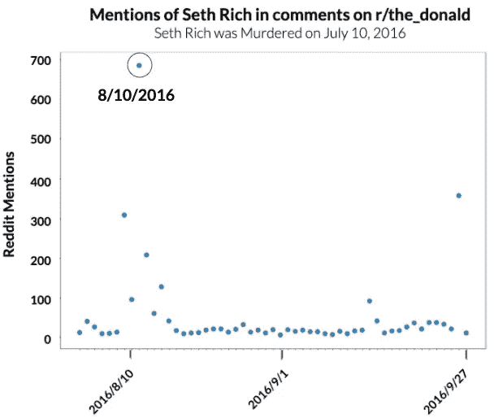

# 使用 NLP 追踪 2016 年大选期间 Reddit 上的阴谋

> 原文：<https://medium.com/analytics-vidhya/using-nlp-to-track-conspiracies-on-reddit-during-the-2016-election-61218ed56fb?source=collection_archive---------25----------------------->

注意:本文假设您了解自然语言处理

众所周知，在 2016 年美国总统选举期间，美国人充斥着阴谋。这种阴谋言论的一个来源是 r/the_donald 的 Reddit。在此期间，其他关于误传的研究已经完成，但我想更深入地挖掘一下。我决定使用 spaCy 来创建一个实体识别模型，以跟踪 2016 年大选前流行的四个最知名的阴谋。如果你想了解更多关于如何在 spaCy 中建立实体识别模型的细节，你可以阅读我写的关于这个主题的[帖子](/analytics-vidhya/using-spacy-and-prodigy-to-train-an-entity-recognition-model-692c0f264298?source=friends_link&sk=52aeb3e340ca8cf4d8e012d40d8fef53)。

**阴谋诡计:**

*   塞思·里奇谋杀案
*   披萨饼
*   希拉里·克林顿的电子邮件调查
*   blue lives matter/black lives matter(根据罗伯特·穆勒的调查，这是俄罗斯机器人为了在美国人口中制造不和而大力推动的)

该过程如下:

*   收集 2016 年对 r/the_donald 的所有评论
*   用这些数据训练一个空间模型来追踪我们的阴谋
*   使用该模型识别来自 r/the_donald 的评论，其中包含我们有兴趣跟踪的阴谋语言
*   分析阴谋趋势

图 1:数据处理

图 1 显示了该项目的整体数据流。在超过 2000 万条评论时，通过 spaCy 模型处理这些数据需要相当长的时间。亚马逊网络服务被用来加快处理速度。

图 2:正在使用的空间模型的演示

图 2 展示了使用该模型的演示。构建了一个字符串，其中包含许多我们要查找的术语。spaCy 在识别我们的术语方面做得很好。

总的来说，该模型表现很好，具有低偏差和低方差。这是因为该模型被训练了大量的例子。

图 3:在 r/the_donald 中 Seth Rich 相关术语的提及

被追踪的阴谋之一是塞斯·里奇的谋杀。关于这个故事的更多内容可以在[这里](https://www.nytimes.com/2017/05/17/us/seth-rich-dnc-wikileaks.html)找到。可以看到，与 Seth Rich 相关的术语在 2016 年 8 月 10 日达到峰值。在罗德·惠勒事件发生的两天前，一名为里奇家族工作的华盛顿私家侦探发表评论，暗示他有确凿的证据证明塞思·里奇在为维基解密工作。这被证明是一个谎言，但你可以在图表上看到，这个谎言把一个相对较小的阴谋变成了全国公认的事情。朱利安阿桑奇后来发表评论，暗示塞思里奇与他一起工作，这也被证明是一个谎言，但仍然推动了对唐纳德的评论。

这是美国 2016 年总统大选期间 Reddit 上追踪阴谋系列文章的第一篇。在接下来的文章中，我将讨论与其他阴谋相关的数据趋势，以及这些趋势如何与新闻相关联。