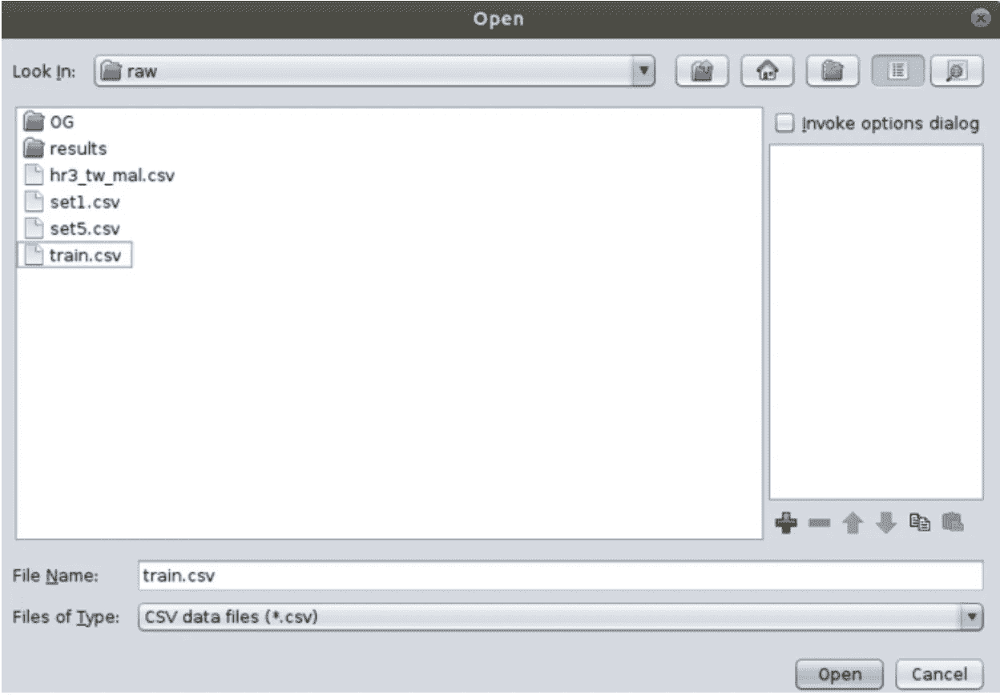

# 在 Weka 中使用 OneClassSVM

> 原文：<https://medium.com/analytics-vidhya/using-oneclasssvm-in-weka-3908d08aabf6?source=collection_archive---------3----------------------->

## 不那么简单的 GUI

# 什么是 Weka？

Weka 标志

Weka 是新西兰怀卡托大学开发的开源机器学习软件。Weka 提供了一个 GUI，从而使它成为一个很好的工具，可以使用不同的算法。

# SVM 一等舱是什么？

图片来自:[https://sci kit-learn . org/stable/auto _ examples/SVM/plot _ one class . html](https://scikit-learn.org/stable/auto_examples/svm/plot_oneclass.html)

一类 SVM 是一种用于分类问题的半监督机器学习算法。该算法的美妙之处在于，人们只需向它提供目标类，因此任何其他偏离目标类的数据点都将被归类为异常值。

# **在 Weka 中使用一级 SVM**

> **安装**

1.  打开工具>包管理器下的包管理器(Ctrl + U)
2.  选择“全部”并在搜索栏中搜索 LibSVM

3.单击“LibSVM”，然后单击“安装”

4.如果安装成功，应该可以在“已安装”部分看到它

> **配置数据集**

请务必注意，训练和测试数据集都需要“标签”列。“标签”列可以是单值(例如，所有行都标记为“1 ”,因为这只是 Weka 运行模型的一个要求。)

配置数据集的步骤:

1.  当一个人打开 Weka 浏览器时，他会看到如下所示的界面。

2.单击打开文件并打开训练数据集

3.现在，只需选择索引列，然后单击底部的“删除”按钮，即可将其删除。

4.Weka 中的一个 SVM 类不接受数值作为类，因此数据集的类(在这种情况下为“标签”列)必须转换为名义类。

5.要转换为标称类，请选择“标签”列>选择“过滤器”>“无监督”>“属性”>“数字命名”

6.更改属性，左键单击顶部的过滤器名称，然后选择“显示属性…”

7.将“attributeIndices”更改为类列的索引，在本例中，我的类列是最后一列，因此我在字段中键入“last”。

8.点击“应用”

> U **唱一班 SVM 并拿到成绩**

1.  选择分类器> weka >函数> LibSVM

2.选择“提供的测试集”并导航至测试数据集。然后设置类列。

3.编辑算法的配置，将 SVMType 更改为“一类 SVM(分类)”，并相应地更改“nu”值。

4.将结果输出到文件中。选择“更多选项...”>选择“输出预测”> CSV >输出文件(导航至所需目录并输入想要设置的输出文件的名称)

5.点击“开始”！

> **结果**

至于结果，Weka 会把离群值定义为“？”而内联器为“1”，换句话说，为“？”是一类 SVM 预测为异常的数据点。

# 结论

然而，如果你熟悉 python，我会推荐你使用 python scikit-learn 和 pandas，因为它会给你更多处理数据集的能力！不管怎样，希望你已经学到了一些东西！:)