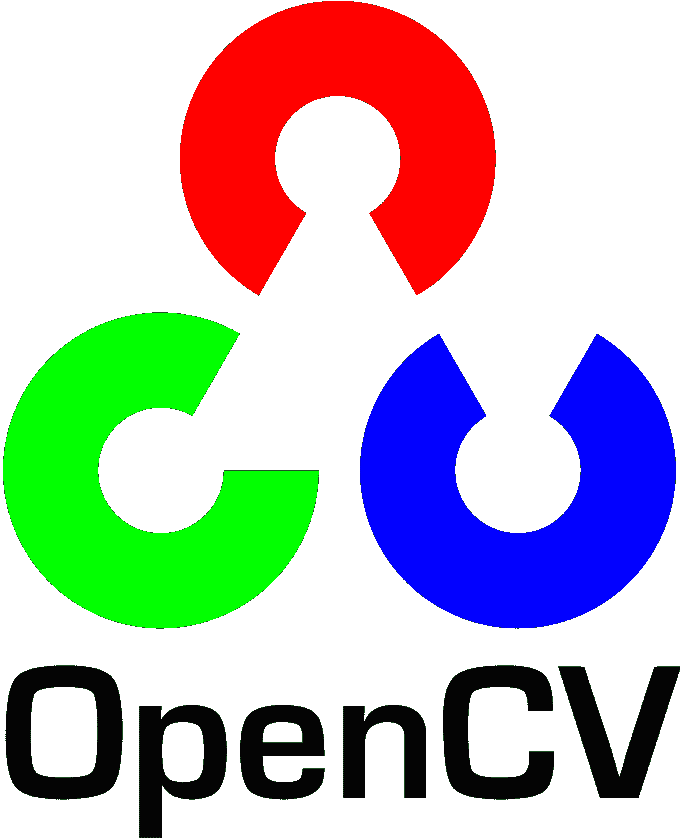

# 在浏览器环境中使用 OpenCV.js

> 原文：<https://medium.com/analytics-vidhya/using-opencv-js-in-browser-based-environment-ef67319eb06b?source=collection_archive---------5----------------------->



OpenCV 是一个功能强大的工具，可以快速操作和处理图像。为了在浏览器中引入 OpenCV 库，浏览器需要支持几乎所有浏览器都支持的 libc++库。

[Asm.js](https://caniuse.com/#search=asm.js) 是用浏览器在其原生环境中使用的 C++编写的。这里提供的 [**OpenCV.js 源码**](https://raw.githubusercontent.com/aswinvk28/open-cv-js-img-color/master/opencv.js) 已经使用 Emscripten (EMSDK)编译完成，它利用 Asm.js 和 libc++将 c++代码转换成 javascript 代码。Javascript 在单线程环境中运行，但是 Emscripten 有一个类似于 C++ (Openmp)中的任务的东西，叫做 Web Workers。借助最新浏览器版本支持的 [WebAssembly](https://developer.mozilla.org/en-US/docs/Web/JavaScript/Reference/Global_Objects/WebAssembly) 库，多线程成为可能。WebAssembly 常用于 WebGL，基准测试结果非常出色。

计算机视觉涉及模式识别、人工智能和机器学习。在客户机服务器模型中，服务器不需要拥有给定任务的完整序列图模型。在某些用例中，将序列图分成两个上下文是理想的:客户机和服务器上下文。

**依赖于客户端和服务器端的 OpenCV 项目**

下表来自 [**上的帖子，探讨任何机器学习问题**](http://blog.kaggle.com/2016/07/21/approaching-almost-any-machine-learning-problem-abhishek-thakur/) 。它将机器学习的阶段分为:

*   培训和验证分离，
*   数据转换
*   ML 模型选择器
*   ML 实体选择器
*   超参数选择器
*   特征抽出
*   通过优化产生输出

在训练模型时，可以将数据转换成多种方式。一个简单的方法是通过减去数据的平均值并除以标准偏差来标准化数据。客户端的 OpenCV 可以转换数据并提取特征，例如在人脸检测中可以提取人脸位置。


拍摄使用[https://aidemos.microsoft.com/face-recognition](https://aidemos.microsoft.com/face-recognition)，@礼貌[https://thispersondoesnotexist.com/](https://thispersondoesnotexist.com/)

OpenCV 有很多级联算法，比如 Viola Jones，HOG(历史导向梯度)。Viola Jones 是一种无监督算法，使用邻近像素提取特征。它对图像进行图像积分，类似于图像卷积，但有一个限制，即需要指定图像大小。Viola Jones 是一种无监督学习算法，而卷积神经网络使用监督学习技术，除非是使用 CNN 进行特征提取的情况。在 OpenCV 库中，它们通常被归类为哈尔级联。我相信我们需要更好的人工智能、机器学习和计算机视觉服务标准。引领我们走向更高性能模型的标准。

我对面向对象方法中的契约式设计有一种特殊的亲近感。这是一种技术。如果合同发起者有一定的责任，客户对其也有一定的义务。此外，如果客户有一定的责任，合同发起人对客户有一定的义务。它们记录在下表中:

OpenCV.js 最适合在客户端设置阈值，如下所示。客户端可以执行的其他任务有:

*   侵蚀
*   扩张
*   盘旋
*   拉普拉斯算子的（调和算子）
*   图像渐变
*   区域生长
*   图象分割法

使用区域生长和阈值化的图像分割尤其是一种粗糙的方法，并且需要我们向模型提供参数以便完成工作。所以这个域在客户端执行非常有用。


图像阈值结果

有许多利用并行计算的库，如 Emscripten to transpile JS code、 [**SIMD.js**](https://hacks.mozilla.org/2014/10/introducing-simd-js/) 、Asm.js。从开发人员的角度来看，他们通过本地化计算能力，使任务易于执行，甚至做得更多。

**在浏览器中设置 opencv . js**

```
<script type=”text/javascript”> 
    var DISABLE_EXCEPTION_CATCHING = 2;
</script>
```

**在浏览器环境中调用 OpenCV 方法**

```
let src = cv.imread(document.getElementById("img_tag_id"));
cv.cvtColor(src, src, cv.COLOR_RGBA2GRAY, 0);let marker = new cv.Mat(rows,cols,cv.CV_8UC1);try { 
  cv.adaptiveThreshold(src,marker,255,cv.ADAPTIVE_THRESH_GAUSSIAN_C,   cv.THRESH_BINARY,11,2);  
} 
catch(e) {    
  throw e;  
}
```

在编码时，确保你写的是同一个对象，因为这样可以减少内存消耗。这是 ECMAScript，可以在 Chrome 上运行，但不能在所有浏览器上运行。可以使用 [**Webpack**](https://webpack.js.org/) 将 ECMAScript 编译成原生 JS。

**数据格式和数据集**

> 一个简单的例子是“使用 Javascript 数组符号编写数组”

任何客户端算法使用的数据格式都必须符合数据集使用的格式。这可以封装数据转换例程、图像的形状和大小、一个图像将映射到的类等等。我喜欢微软的 CNTK BrainScript，因为它是一种基于文本的格式，对于从客户端捕获需求非常有用。一个简单的例子是“使用 Javascript 数组符号编写数组”。我相信 CNTK 的 BrainScript 文本阅读器是一种发明艺术，因为它们满足了任何算法想要的最佳需求。主要依赖客户端的机器学习框架必须使用 BrainScript 产生的数据格式。这种技术类似于 React 的技术，React 使用 JSX 风格的语法来捕获用户想要的几乎所有功能，并且几乎是本地实现。微软 Azure 使用基于图表的模型来自动化交付机器学习解决方案的过程，这很好，并为我们提供了设计一些 ML 任务的灵活性。

**功能工具**

Featuretools(基于 Python)包是一个创建数据属性之间关系的要素合成包。这有点类似于数据仓库，因为它可以生成事实表，甚至是星型模式。数据仓库标准说我们需要将日期分成时间、小时、天、月、年等维度。这对 featuretools 也非常重要，因为它们经常处理时态数据。对于合成和工作流自动化，时态数据是必需的。

**OpenCV 和特征工程**

这是 cascade**haarcascade _ smile . XML 的摘录**看看 cascade 文件中存储了什么元数据。它查看那些 Viola Jones 邻近像素并进行测量。

```
<opencv_storage>
<cascade type_id="opencv-cascade-classifier"><stageType>BOOST</stageType>
  <featureType>HAAR</featureType>
  <height>18</height>
  <width>36</width>
  <stageParams>
    <maxWeakCount>53</maxWeakCount></stageParams>
  <featureParams>
    <maxCatCount>0</maxCatCount></featureParams>
  <stageNum>20</stageNum>
  <stages>........ <_>
          <internalNodes>
            0 -1 105 -5.1861900836229324e-02</internalNodes>
          <leafValues>
            7.0431172847747803e-01 -2.2143700718879700e-01</leafValues></_>
        <_>
          <internalNodes>
            0 -1 106 -5.0341628491878510e-02</internalNodes>
          <leafValues>
            -4.6397829055786133e-01 2.8047460317611694e-01</leafValues></_>
```

# **结论**

我必须就这个主题写更多的东西，因为关于合成数据集和前端的主题让我兴奋。试着用 C++写一些线程模型，用 openmp 编译成 JS 代码。你可以在 Javascript 中看到接近原生的体验。在基于浏览器的环境中使用 ONNX.js 模型有很多机会。完成这项工作的一些工具有:- CoreMLTools(来自苹果)，ONNX.js(来自微软)，TensorFlow.js(来自谷歌)。在这些算法中，创建一个张量网格是非常困难的。通过客户端对矢量化数据的处理，有许多解决问题的用例成为可能，并降低了计算能力。