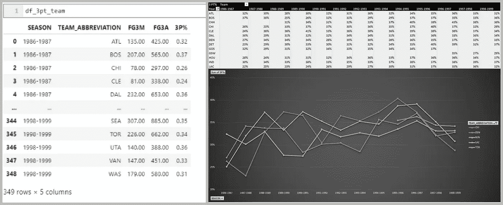
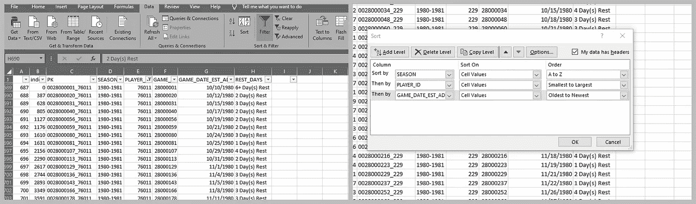

# 交互使用 Pandas 和 Excel

> 原文：<https://medium.com/analytics-vidhya/using-pandas-and-excel-interactively-1d7144e7170b?source=collection_archive---------6----------------------->

事情并不总是这么复杂

# **总结**

这是一个简短的教程，介绍如何使用 xlwings 库在 Python/Pandas 和 Excel 之间切换，只需一行代码，而无需每次都将文件从一个库导出到另一个库。(对于那些想看更详细的例子的人，可以滚动到底部，查看使用代码的完整例子的要点)。

下面的例子*用 Python 写了一行代码*，用 Excel 写了几分钟的数据透视表和数据透视图。

左:熊猫输出；右图:使用 xlwings 的 Excel 数据透视表。

# **安装**

通过 PIP 或 Anaconda 安装 xlwings 非常简单([https://docs.xlwings.org/en/stable/installation.html](https://docs.xlwings.org/en/stable/installation.html))。就是这样！

# **背景**

我一直在学习(并记录)我在学习熊猫方面的进步。当涉及到可用库、处理大数据等时，从 Excel Pandas 迁移提供了更多的灵活性。然而，当涉及到 UI 时，使用 Juypter 查看所有数据会令人沮丧……尤其是当你在争论数据的时候。

正如我在我的异步教程([https://medium.com/@tkpca/summary-74789e47d420](/@tkpca/summary-74789e47d420))中提到的，我一直在做一个宠物项目来提取和分析 NBA 数据。虽然我可以从 Kaggle 数据集中提取一些更清晰的数据，但现实生活中的数据是混乱的，而且，学习端到端工作流对我来说很重要，但会产生两个问题:

1)我在争论这些数据时会犯错误，特别是因为 NBA API 上没有正式的文档；和

2)不幸的是，NBA API 并不完美(主要针对旧数据)。例如，我发现在 1985 年之前的一些得分中，进攻和防守篮板都没有被正确记录。在这里看一下 https://stats.nba.com/game/0028400895/拉里·史密斯的数据。

# **言归正传**

现在你可以拿起你的数据框架，把它作为一个 Excel 文件，打开/分析/重复，然而，在许多情况下，这是矫枉过正，在我看来，太多的点击。

熊猫+ Excel 过滤器，排序和其他一切！

# **以下是基本步骤**

1)确保您已经导入了 xlwings 库；

> 设置 Excel 的实例。一般来说，我使用行“***”app = xw。App()*** 来加载 Excel 的一个实例(注意“xw”是导入 xlwings 时的 as)。

2)确保内存中有要推入的数据帧。

3)将数据框压入空白 Excel 工作簿中的单元格。

> ***xw。范围(' A1 ')。值=df。*** 。

# ***就是这样，大功告成！***

请记住，如果您有一个非常大的数据框架，这将是缓慢的(可能不是最好的想法)，但当您想要迭代一个更大的数据框架的片段或快速创建 Excel 图表时，这是非常好的。该库可以做更多的事情，包括用 Python 替换 VBA，但这是另一篇文章了。

[https://github.com/tkpca/Python-Scripts/tree/master/xlwings](https://github.com/tkpca/Python-Scripts/tree/master/xlwings)