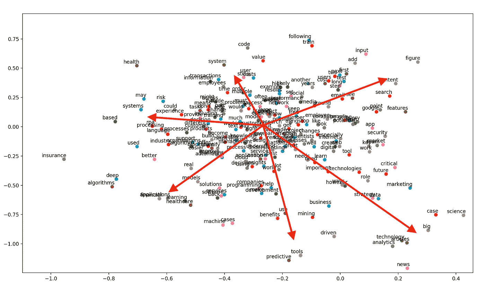
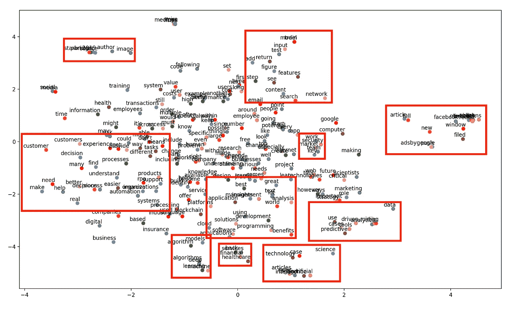

# 使用 PCA & T-SNE 挖掘下一步要写什么的想法

> 原文：<https://medium.com/analytics-vidhya/using-pca-t-sne-to-mine-ideas-for-what-to-write-next-ab6eb7537596?source=collection_archive---------33----------------------->

## 当谈论一个话题时，单词可视化是考虑使用关键词的上下文的有用工具。在这种情况下，主题是数据科学。


你所需要的只是方向和大小…照片来自 Unsplash 作者:[史蒂夫·哈维](https://unsplash.com/@trommelkopf)

您是否曾经发现自己处于这样一种情况:拥有大量文本数据，但您想要立即获得见解？

嗯，如果你在图书馆，就拿本书坐下来。这需要一段时间。

但是，如果你在互联网上，那么下载我的 [GitHub 库](https://github.com/joepstein/Simple-Word-Embeddings)，为你自己的用例修改它，看看一堆词向量的图形。

# 关于语言，数学能告诉你什么？

简单的回答:很多！

从语言学家的角度来看，这可以用[分布假设](https://en.wikipedia.org/wiki/Distributional_semantics)来总结(这是大多数 ML 语义学方法的关键)。

> **具有相似分布的语言项目具有相似的含义**

有了这个假设，我们可以进入共现模型的领域，比如 BoW，到更复杂的 ML 模型，比如 Word2Vec。但是，想法是一样的:看着目标单词，将其与周围的单词进行比较，记下某种度量，然后重复。

# 为我即将发表的文章寻找灵感

1.  找几个写数据科学博客的网站，从每个网站的许多文章中摘抄文字

*   [https://www.datasciencecentral.com](https://www.datasciencecentral.com/)，
*   [https://www.smartdatacollective.com](https://www.smartdatacollective.com)，
*   [https://starbridgepartners.com/data-science-report](https://starbridgepartners.com/data-science-report)

2.清理文本并通过 Doc2Vec 运行它

```
# Preparing text data for Word2Vec
def clean_sentence(sentence):sentence = RE_PUNCT.sub(" ", sentence).lower().split()
    return_sentence = sentence

    for word in sentence:
        if word in STOP_WORDS or len(word) < 3:
            return_sentence = list(filter((word).__ne__, return_sentence))
    return return_sentence
```

3.用主成分分析绘图，了解“[主成分](https://en.wikipedia.org/wiki/Principal_component_analysis)

这实际上看起来像什么？



我们可以在这个图表中看到，尽管我们已经将其分解为两个主要部分，但文本数据分布在其他几个主题中。

这就是线性矩阵分解的美妙之处。就像轮子上的辐条一样，我们可以清楚地看到思想有一些“方向”。

例如，最左边的“辐条”有像“风险”、“可能”和“经验”这样的词，旁边还有像“客户”、“产品”和“RPA”这样的词。

对我来说，这意味着数据科学博客关心的是以自动化的方式解决现实世界的问题，给用户最大的回报。

4.现在对于一些 T-SNE，因为谁不喜欢非线性矩阵分解？(…是的，我们首先使用 PCA 进行因子分解，但这没问题，也是行业标准)



在这张新的 T-SNE 图中，轮辐变成了簇状！(我觉得这太酷了 lol)。

再看左手边。我们仍然会看到“客户”、“产品”和“RPA”这样的词。现在，它们更明显地集中在“更好”、“决定”、“真实”和“帮助”等词附近。

# 这一切意味着什么？

我认为本文最好不要深入这些图表中可能获得的每一个细节，主要是因为这是一个主观练习。(等等，我以为数学应该是客观的？也许吧。)

这些可视化技术的要点不是让计算机仅仅输出答案，而是让你自己更容易完成这项工作。

# 那么，我从这些“辐条”和“集群”中解读了什么呢？

对于我们在本文中谈到的“辐条”和“集群”，我意识到大数据带来了重大责任。你不能简单地创造一些漂亮的东西，而是一些实用的东西。

改善你的“**客户**所做的“**决策**”的东西，以便用你的“**产品**”增强他们的“**体验**，最好是以一种“**自动化**”的方式。

我目前的工作是网站开发，UX 非常重要。如果 UX 很笨重，没人会关心后端。

那么什么是时尚的自动化 UX 呢？？？聊天机器人。是的，这是我的建议:我想在未来尽可能多地了解聊天机器人。

由于我个人创建的产品是一个网站，我现在看到每个人都在谈论他们产品的自动化体验，学习如何制作聊天机器人对我来说是一个清晰的解释。

请关注我即将推出的聊天机器人系列！我是从零开始的，所以我希望这能有所启发，因为我欢迎你在我的旅程中使用这项技术。

# 大家新年快乐:)