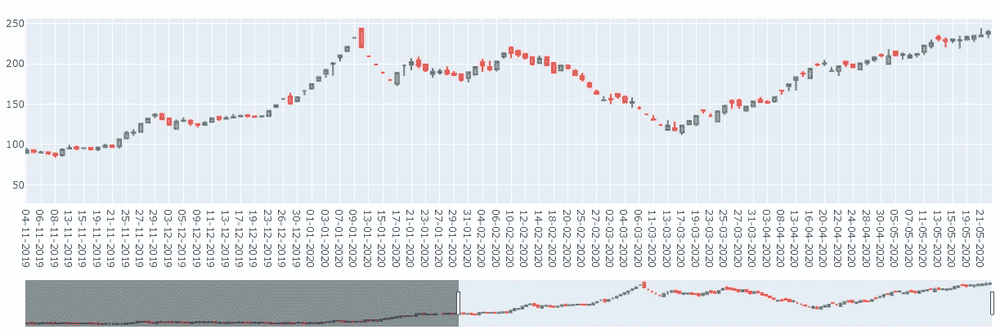

# 使用 Plotly 构建蜡烛图:用于股票市场分析。

> 原文：<https://medium.com/analytics-vidhya/using-plotly-for-building-candlestick-chart-for-the-stock-market-analysis-5305b48a5f75?source=collection_archive---------13----------------------->

理解股票市场运动的一个非常重要的图表。

用 Python 和 Plotly 创建的蜡烛图。

本文将清晰地指导您如何使用 Plotly 和 Python 创建特定股票或股票市场的蜡烛图，并显示移动平均线。

# **构建烛台图表**