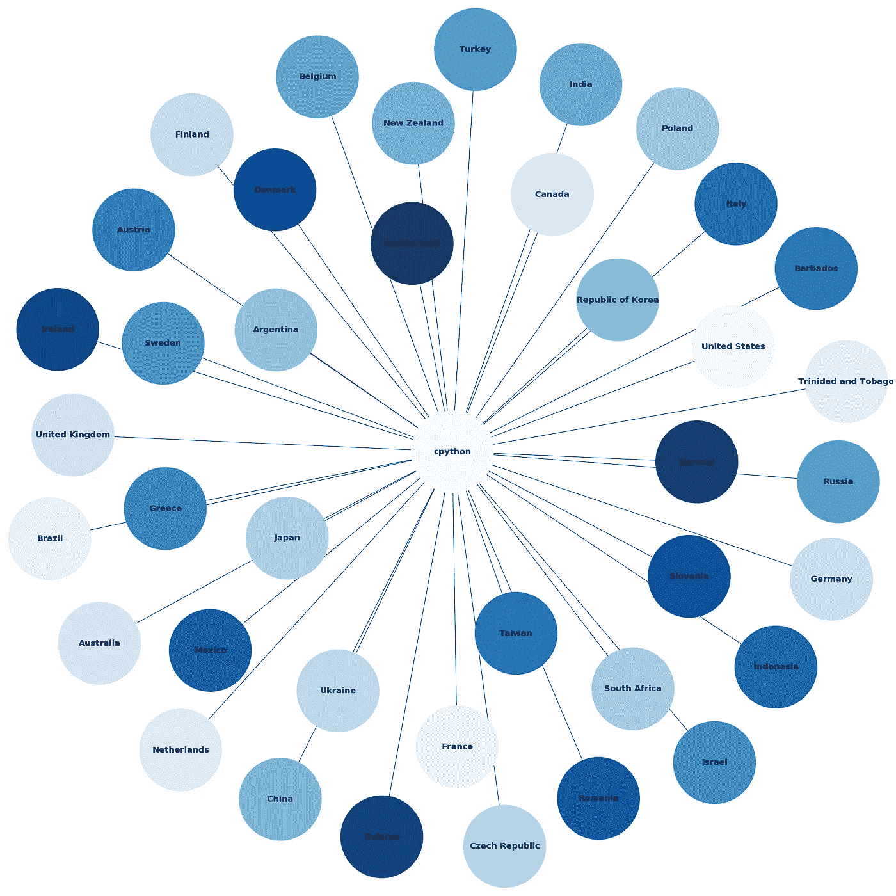
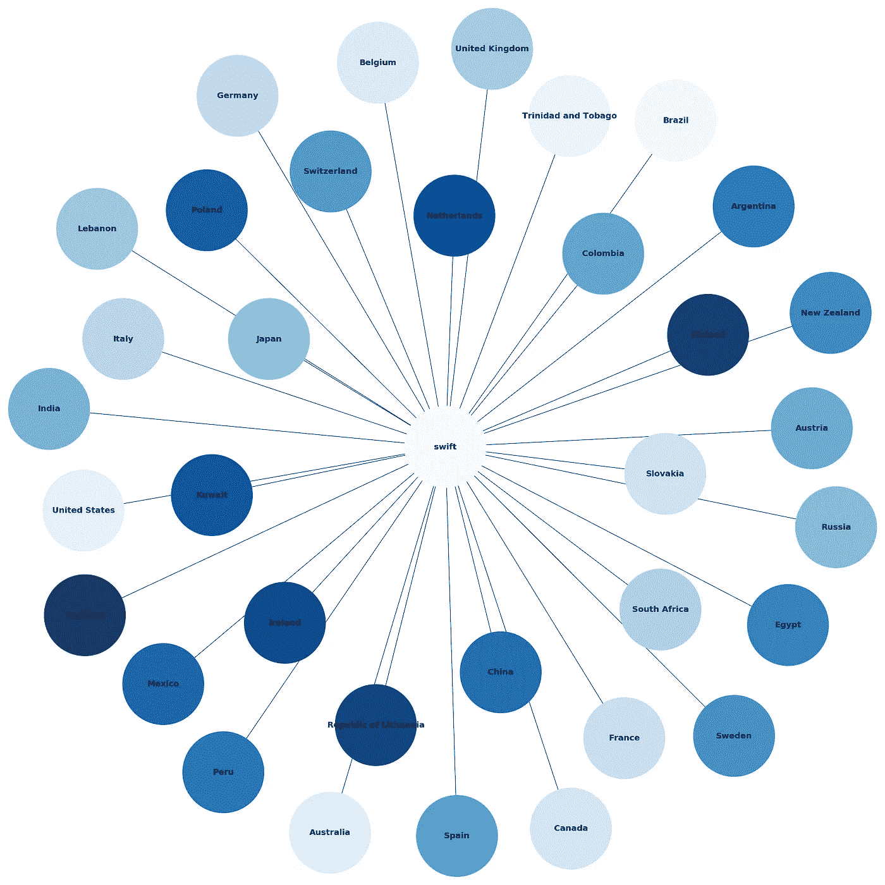
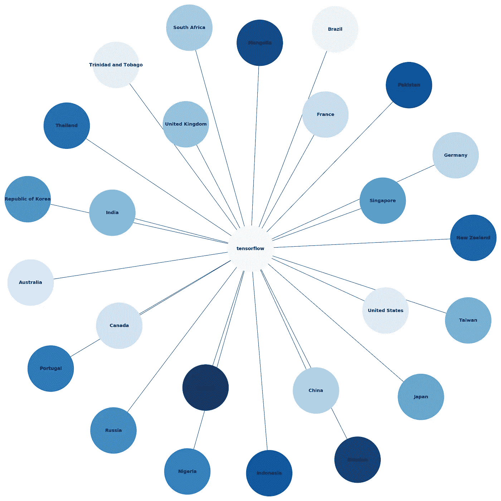
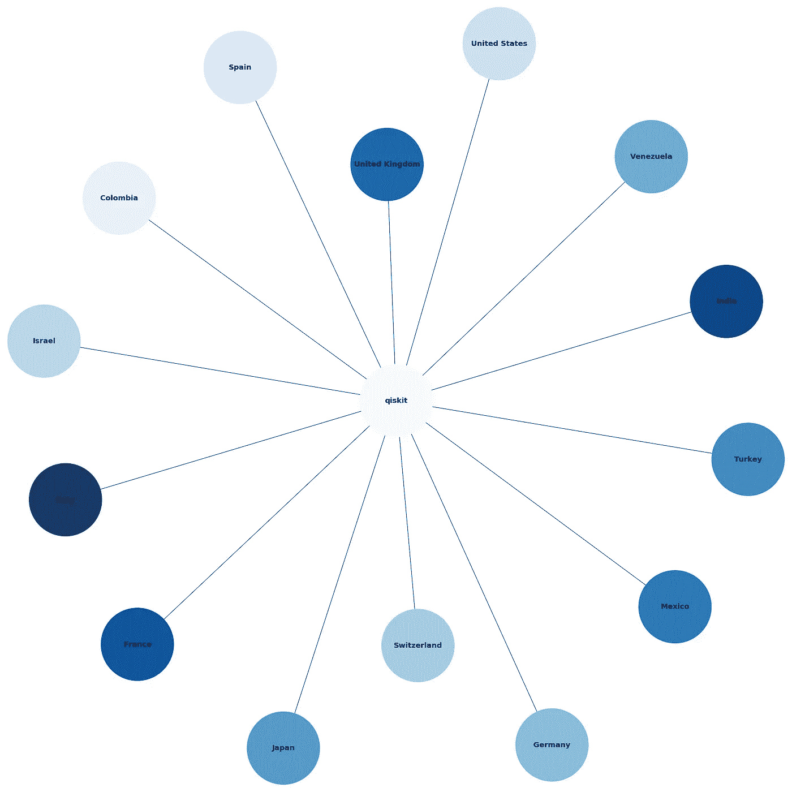

# 使用 PyGithub 查找哪些国家为主要项目做出了贡献

> 原文：<https://medium.com/analytics-vidhya/using-pygithub-to-find-which-countries-contribute-to-major-projects-92fb5598469d?source=collection_archive---------33----------------------->

目前大约有 4000 万用户和超过 1 亿个存储库。在这 1 亿个仓库中，有一些因其巨大的参与和来自像谷歌和脸书这样的大公司的支持而脱颖而出。

这种参与最有趣的一点是寻求分散解决问题的方式。也就是说，人们可以为项目提供帮助，即使那个人和项目来自不同的城市、州甚至不同的国家。知道了这一点，我想到了一个问题:哪些国家对一些项目的贡献最大？

分析的项目将是 [cpython](https://github.com/python/cpython) 、 [swift](https://github.com/apple/swift) 、tensorflow、Qiskit。所以，让我们来看代码！

首先，我们安装 GitHub 依赖项 *networkx* 和 pygithub python API:

```
! pip install pygithub 
! pip install networkx
```

导入必要的包:

之后，我们将创建以下函数:

在这个函数中，传递了两个参数- *name_repo* (存储库的名称)和 *graph* (一个 networkx 图)，用于在存储库上创建新的图。在第一部分中，添加了一个名为“qt_contr”的新属性，它将把项目贡献者的数量保持在一个不幸的小样本空间中——由于 API 的限制，只有 500 人。API 拒绝了许多大于此值的请求。

然后，我们为我的 Github 帐户使用一个[令牌](https://github.com/settings/tokens)连接 API。之后，我们读取一个 [JSON](https://gist.github.com/techwithshadab/872b996e23f85be1843f99dd12c16a84) 文件，该文件将包含世界各国及其各自的城市。如果贡献者的信息中只有城市，这个 JSON 将有助于识别国家。

完成之后，就该尝试访问 API，从存储库中获取信息，并将其放入“repo”变量中。然后，我们对存储库中的贡献者列表进行循环，并检查用户的信息中是否包含该国家，并且该国家没有创建任何节点，它将更多的贡献者添加到该国家的“qt_contr”属性中。在图中是一个新的国家的情况下，创建一个节点并放置“qt_contr ”,值为 1，在存储库和国家之间画一条边。

如果信息中只有城市，那么在每个国家的城市中再执行一次循环，以找到贡献者的城市属于哪个国家，并将“qt_contr”加 1 到每个找到的国家。

这样，只需要调用每个存储库的函数来生成一个. graphml 文件并绘制图表！

函数来绘制图形并生成。graphml 文件:

在上述函数的帮助下，我们生成了以下图表:

**1。Python**

```
plot_save("python/cpython")
```



**2。雨燕**

```
plot_save("apple/swift")
```



**3。张量流**

```
plot_save("tensorflow/tensorflow")
```



**4。Qiskit**

```
plot_save("Qiskit/qiskit")
```



有趣的是，正如所料，美国在捐款人数上领先，然而，令人惊讶的是，很少有人提到特立尼达和多巴哥。委内瑞拉北部的一个独立国家，与巴西相比，它的贡献相对较大！

你可以从这里下载笔记本- [顶级国家投稿(PyGithub)。ipynb](https://gist.github.com/techwithshadab/175e16ff7b1da9a31e98ceecb1620da8)

我发表的其他博客文章:

*   [谷歌云平台上的 ml flow](/faun/mlflow-on-google-cloud-platform-cd8c9b04a2d8)
*   [构建卷积神经网络:男👨vs 女性👩](https://towardsdatascience.com/building-a-convolutional-neural-network-male-vs-female-50347e2fa88b)
*   [使用 TensorFlow 建立你的第一个机器学习模型](https://towardsdatascience.com/build-your-first-machine-learning-model-using-tensorflow-d61b9b2b7d5e)
*   [优化 Jupyter 笔记本:提示、技巧和 nbextensions](https://towardsdatascience.com/optimizing-jupyter-notebook-tips-tricks-and-nbextensions-26d75d502663)
*   [不同机器学习算法的用例](/@shadab.hussain01/machine-learning-algorithms-use-cases-72646df1245f)
*   [通过 Visual Studio 开发基础程序激活免费访问 Datacamp、Pluralsight、LinkedIn Learning 等的步骤](https://www.c-sharpcorner.com/blogs/steps-to-activate-free-access-to-datacamp-pulralsight-linkedin-learning-etc-through-visual-studio-dev-essentials-program)
*   [我的 MozFest 经历和第一次演讲](/@shadab.hussain01/tweet-driven-mozfest-storytelling-mozfest-2018-170345534d08)

**疑问？评论？欢迎在评论区留言，也可以在** [**LinkedIn**](https://www.linkedin.com/in/shadabhussain96/) **上关注并联系我。** **如果你喜欢这个博客，可以** [**给我买杯咖啡**](https://www.buymeacoffee.com/shadab) **。**