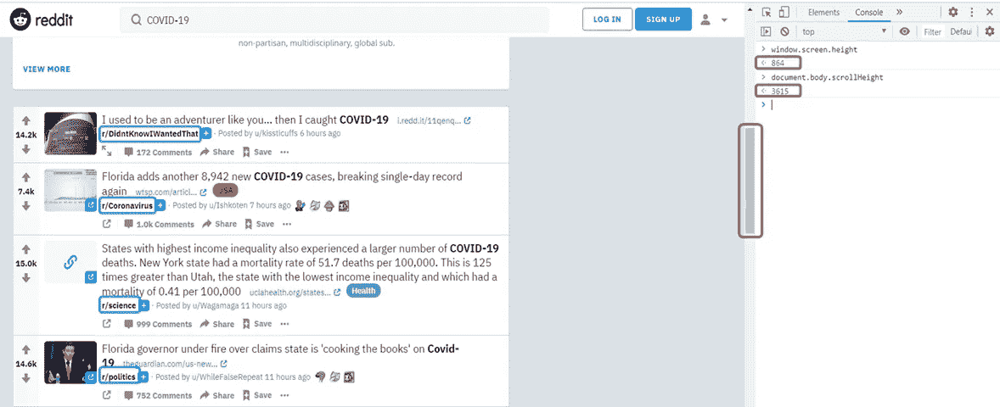
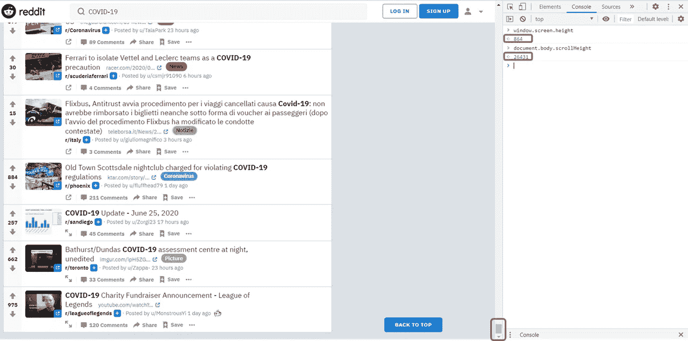
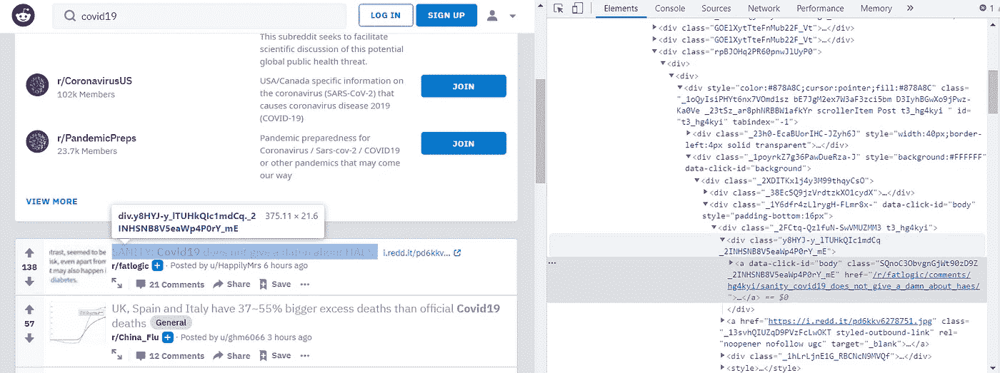
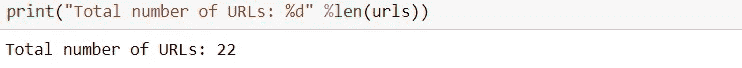
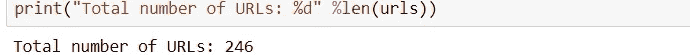

# 使用 Python 和 Selenium 抓取无限滚动网页

> 原文：<https://medium.com/analytics-vidhya/using-python-and-selenium-to-scrape-infinite-scroll-web-pages-825d12c24ec7?source=collection_archive---------1----------------------->

[来源](https://www.thehindu.com/sci-tech/technology/internet/how-the-infinite-scroll-creates-major-disruption-in-social-routines-and-mental-health/article30666353.ece)

网络抓取是一种重要的数据收集工具。虽然 Twitter 和 Reddit 等大型社交媒体支持使用现有 python 包快速提取数据的 API，但有时您可能会遇到使用 API 难以解决的任务。例如，Reddit API 允许您从 subreddit(Reddit 中的在线社区)中提取帖子和评论，但很难通过关键字搜索获得帖子和评论(在下一节中，您会更清楚地看到我的意思)。此外，并不是每个网页都有用于网络抓取的 API。在这些情况下，手动抓取网页成为最佳选择。然而，现在许多网页都采用了一种网页设计技术:无限滚动。当用户向下滚动到页面底部时，无限滚动网页自动扩展内容，以取代传统的分页。虽然它对用户来说非常方便，但它增加了 web 报废的难度。在这个故事中，我将展示我开发的用于自动滚动网页的 python 代码，并作为示例演示如何使用它来抓取 Reddit 中的 URL。

# Selenium for infinite scroll web 页面:问题是什么？

假设我想提取 Reddit 上关于新冠肺炎的帖子和评论进行情感分析。然后我去 Reddit.com 搜索“新冠肺炎”，结果页面如下:

Reddit.com 新冠肺炎的搜索结果(滚动前)

蓝色框中突出显示的文本是子编辑。注意，它们都是不同的。因此，如果我想通过 Reddit API 获取所有这些帖子，我必须首先从每个 subreddit 获取帖子，并编写额外的代码来过滤与新冠肺炎相关的帖子。这是一个非常复杂的过程，因此在这种情况下，手动刮擦是有利的。

红色框中突出显示的图标和数字是滚动条和[屏幕高度和滚动高度](https://javascript.info/size-and-scroll)。屏幕高度代表屏幕的整个高度，滚动高度代表网页的整个高度。滚动条显示我的当前屏幕相对于整个网页的位置，滚动条的长度显示屏幕高度相对于滚动高度的大小。在这种情况下，屏幕高度是 864，滚动高度是 3615。所以，滚动条比较长。

但是，当我向下滚动到网页的最底部时，滚动条会缩小，因为屏幕高度没有变化，但是滚动高度现在变成了 27452:

Reddit.com 新冠肺炎的搜索结果(滚动后)

这就是无限滚动:在初始阶段，页面上只有少量的帖子，我向下滚动后会有新的帖子出现。不幸的是，Selenium 总是以初始形式打开网页。因此，我们从这个网页中提取的 HTML 是不完整的，我们无法获得向下滚动后显示的帖子。

# 解决方案？模拟滚动！

那么，我们如何提取完整的 HTML 并从这个 Reddit 网页中获取所有帖子呢？好吧，我们要求硒滚动它！以下代码展示了如何在 Selenium 中实现自动滚动功能:

Selenium 可以在网页的控制台中执行 Javascript。因此，我首先获得屏幕高度(我的屏幕的总高度，小于滚动高度)。然后，我让 Selenium 一次滚动一个屏幕高度。运行几次循环后，Selenium 将滚动到一个足够低的位置，触发页面的扩展，新的帖子将开始加载。通常，网页需要一些时间来更新新的滚动高度和加载新的内容，所以我添加了一个暂停时间，让网页有足够的时间来完成更新。**如果暂停时间太短，新的滚动高度将不会更新，循环将很快中断。**然后记录更新后的滚动高度，当我们要求 Selenium 滚动到大于滚动高度的位置时(这意味着我们到达了末尾)，循环将会中断。

# 现在，我们来演示一下！

首先，我们需要检查页面并检查在哪里可以找到 URL:

检查页面以查找 URL

我们想要的 URL 就在一个 div 下的第一个 a 标签里，类为“y 8 hyj-y _ ltuhkqic 1 mdcq _ 2 inhsnb 8 V5 ea WP 4 p 0 ry _ mE”。看起来很简单！让我们尝试抓取没有自动滚动代码的 URL:

产生的 URL 数是 22。

现在，让我们实现自动滚动代码，看看我们可以获得多少个 URL:

结果 URL 的数量增加到 246 个！

# 就是这样！

我在许多不同的网站上测试过我的自动滚动代码，包括 Linkedin.com、Sephora.com(虽然不是为我自己)等等。它表现得相当好，除非我选择的暂停时间太小(正如我上面提到的)。如果你有兴趣看看我在 Sephora.com 上用我的代码做什么，就在这里:

https://github.com/KuanWeiBeCool

**如果你觉得这个故事有用，请为它鼓掌！这对我帮助很大！**