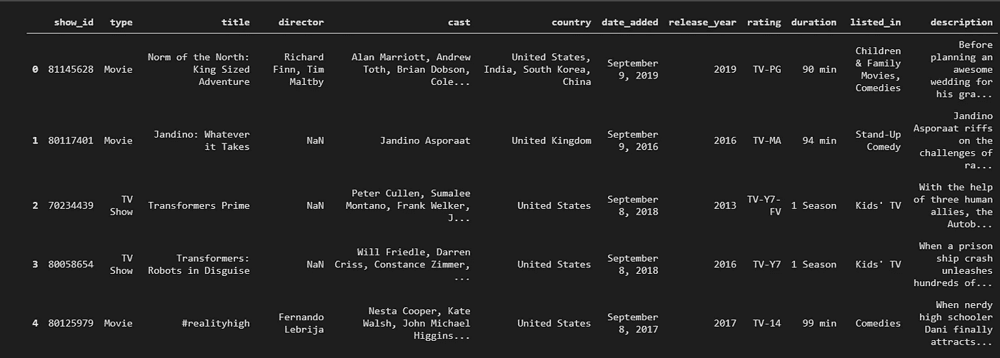

# 使用 Python 来自动化您枯燥乏味的 excel 任务！

> 原文：<https://medium.com/analytics-vidhya/using-python-to-automate-your-boring-and-tedious-excel-tasks-1fbbf2ce0de3?source=collection_archive---------19----------------------->

你是否厌倦了每天在工作中做繁琐重复的 excel 任务？如果是，那么这篇文章将帮助你度过难关，并为你节省一些时间。您将需要 python 的 pandas 库来自动化您的 excel 任务。


```
pip install pandas
```

Pandas 是一个用于数据分析和操作的多功能库。

## 案例 1:合并多个 CSV

我们将创建一个文件夹来存储所有的 CSV 文件，并合并这些文件。我们将使用 os 和 glob 模块来处理我们的文件结构。

**第一步:导入所有模块**

```
import os
import glob
import pandas as pd
```

**第二步:选择目标文件夹(保留要合并的文件)**

```
folder = input("Enter folder name :")
os.chdir(folder)
extension = 'csv'
#You can use xlsx as well
```

*   os.chdir(folder_name) ->将当前目录更改为目标文件夹

第三步:提取列表中的所有文件名，并将它们连接在一起

```
all_filenames = [i for i in glob.glob('*.{}'.format(extension))]
combined_csv = pd.concat([pd.read_csv(f, encoding="utf-8", keep_default_na=False) for f in all_filenames])
```

*   *glob.glob('*。)* - >通配符符号列出所有文件(本例中为 csv)
*   *PD . concat(*objs*)*->组合系列或 DataFrame 对象的序列或映射
*   *pd.read_csv(f)* - >读取 csv 文件的函数

**步骤 4:保存您的合并文件**

```
combined_csv.to_csv('Combined.csv',index=False, encoding='utf-8-sig')
```

*   PD . to _ csv(' filename . CSV ')-->将合并文件保存到 CSV 的函数

## 案例 excel 的排序和过滤功能

我们将使用熊猫数据框架来处理我们的数据。**数据帧**是一种二维数据结构，即数据以表格形式排列成行和列。

我使用的是 Kaggle 的网飞数据集，链接如下:

[](https://www.kaggle.com/shivamb/netflix-shows) [## 网飞电影和电视节目

### 网飞上的电影和电视节目列表

www.kaggle.com](https://www.kaggle.com/shivamb/netflix-shows) 

**第一步:读取文件并存储到数据帧**

```
df = pd.read_csv('netflix.csv')
df.head()
```



假设我们想根据 date_added 和 release_year 对数据集进行排序:我们将使用 pandas 库的 sort_value 函数。

**第二步:分拣**

```
df.sort_values(by=['date_added','release_year'],ascending=[True, False],inplace=True)
```

默认情况下，排序是按升序进行的，但是您可以相应地更改，如果您选择了将排序后的值存储到变量中的默认方式，那么默认情况下，就地值为 False。

**第三步:过滤**

现在让我们看看所有来自美国并在 2018 年及以后发布的电视节目，我们将应用三个过滤器:

*   “类型”栏中的电视节目过滤器
*   在 release_year 列中筛选年份
*   筛选“国家”列中的国家

```
df2 = df[(df['type'] == 'TV Show') & (df['release_year'] >= 2018) & (df['country'] =='United States')]
#Saving filtered data
df2.to_csv('Filtered.csv',index=False,encoding='utf-8-sig')
```

我希望你喜欢这篇文章。我很想听听你对这个话题的经验和反馈。