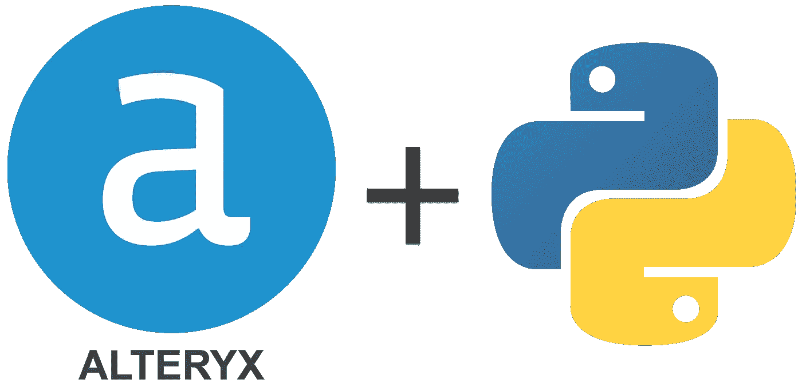
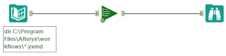
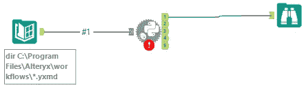

# 使用 Python 并行化您的 Alteryx 工作流

> 原文：<https://medium.com/analytics-vidhya/using-python-to-bring-parallelism-to-your-alteryx-workflows-8ec9857c4d47?source=collection_archive---------8----------------------->

让船员名单跑得更有效率…

Alteryx 是一个易于使用的工具，通常由分析专业人员用来执行报表开发和分析所需的管理和“最后一英里”ETL。

尽管 Alteryx 没有正式维护，但 CReW 宏是一种非常流行的管理工作流的方式，它是一个更大的数据工程工具和框架生态系统中的一个依赖项。

一种流行的模式是通过团队列表运行器宏来触发您的工作流。尽管 list runner 在紧急情况下很有用，但它有很多限制，包括:

1.  它按顺序运行工作流，有效地限制了 alteryx 部署的资源
2.  很难用附加功能来修改/定制
3.  它的嵌套结构使得新用户很难理解，对于技术知识较少的用户来说，这是一个黑匣子

有好消息；我们可以通过在 python 工具中实现几个 Python 库并使用[AlteryxEngineCmd.exe](https://help.alteryx.com/2019.4/Command_Line.htm)来解决所有这些问题。

# 履行

python list runner 最棒的地方在于，它可以即插即用地使用已经使用 list runner 的工作流。

典型的列表运行器使用模式

新 Python 热

让我们来看看 pythonic list runner 背后的代码:

[https://gist . github . com/jaun son/46cb 863 f 17907 BD 900 EC 126470 C3 a15 f](https://gist.github.com/Jaunson/46cb863f17907bd900ec126470c3a15f)

这个 IPYNB 非常简单，它利用*多进程*来打开 2 个(默认设置)并发 Python 解释器，这些解释器将使用*子进程*来执行带有[AlteryxEngineCmd.exe](https://help.alteryx.com/2019.4/Command_Line.htm)的工作流

这样做的附带好处是，这个过程实际上使 list runner 更加容错，因为使用*子过程*您可以设置默认超时(在脚本中设置为 2400 秒/ 40 分钟)。

虽然您可以通过简单地实现所描述的第二个工作流运行器来减少多达 50%的总运行时间，但是根据您的特定系统的资源，您可能能够获得更高的性能。

[1]:通过命令行运行 Alteryx 工作流(需要引擎 API 许可证)

 [## 通过命令行运行工作流

### 可以使用位于 Alteryx 程序文件根目录下的 AlteryxEngineCmd.exe 通过命令行运行工作流

help.alteryx.com](https://help.alteryx.com/2019.4/Command_Line.htm) 

[2]:多重处理 Python 中更好的多重处理

 [## uq foundation/多进程

### python 多重处理中更好的多重处理和多线程是多重处理的一个分支，是作为…

github.com](https://github.com/uqfoundation/multiprocess)