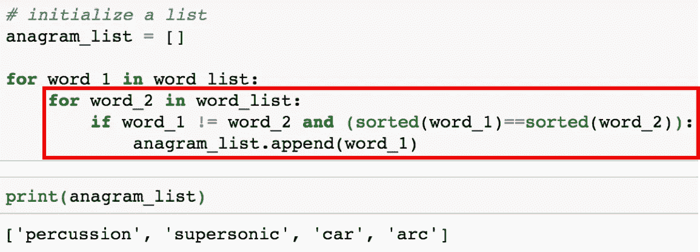

# 使用 Python 检测变位词

> 原文：<https://medium.com/analytics-vidhya/using-python-to-detect-anagrams-a002ddedb4cb?source=collection_archive---------0----------------------->


GIF 显示单词叩诊和超音速是彼此的变位词。原视频来源:[https://player.vimeo.com/video/233358575](https://player.vimeo.com/video/233358575)来自[https://vimeo.com/c4djed](https://vimeo.com/c4djed)

## 介绍

在上面的 GIF 中，单词超音速和打击乐器使用了完全相同的字母。这些单词互为变位词。例如，Car 和 Arc 是彼此的变位词，Leaf 和跳蚤也是。

在这篇博客中，我们将使用 python 构建一个简单的代码，它可以从给定的输入中识别变位词。

## 问题陈述

任务:编写一个程序，它接收一个单词列表，并输出列表中另一个单词的变位词列表。

在开始之前，重要的是要注意什么是变位词。变位词是通过重新排列不同单词或短语的字母形成的单词或短语，通常使用所有原始字母一次。

虽然有许多不同的方法来解决这个问题，这个博客给出了两种不同的方法来解决这个问题。

对于下面的两种方法，我们首先需要定义一个单词列表。

```
word_list = ["percussion", "supersonic", "car", "tree", "boy", "girl", "arc"]
```

# 方法 1: For 循环和排序

```
# initialize a list
anagram_list = []for word_1 in word_list: 
    for word_2 in word_list: 
        if word_1 != word_2 and (sorted(word_1)==sorted(word_2)):
            anagram_list.append(word_1)print(anagram_list)
```



如果您查看上面红色矩形中的内部 for 循环，代码`word_1 != word_2`会检查单词是否相同。内置函数`sorted`将每个单词从字符串转换成字符列表，如下例所示。既然`sorted('percussion') == sorted('supersonic')`是真的，它们就是彼此的变位词。


# 方法 2:字典

```
def freq(word):
    freq_dict = {}
    for char in word:
        freq_dict[char] = freq_dict.get(char, 0) + 1
    return freq_dict# initialize a list
anagram_list = []
for word_1 in word_list: 
    for word_2 in word_list: 
        if word_1 != word_2 and (freq(word_1) == freq(word_2)):
            anagram_list.append(word_1)
print(anagram_list)
```


对于 freq 函数，如果你理解字典 get 方法有困难，我鼓励你去看下面的教程之一 [Python 字典和字典方法](https://hackernoon.com/python-basics-10-dictionaries-and-dictionary-methods-4e9efa70f5b9)或者 [Python 字数](https://codeburst.io/python-basics-11-word-count-filter-out-punctuation-dictionary-manipulation-and-sorting-lists-3f6c55420855)

如果您查看上面红色矩形中的内部 for 循环，代码`freq(word_1) == freq(word_2)`会检查单词是否相同。函数`freq`将每个单词转换成一个 char 频率的字典。比如说，既然`freq('percussion') == freq('supersonic')`为真，那么它们就是彼此的变位词。


从 Python 3.6 开始，对于 Python 的 CPython 实现，字典*会记住插入条目的顺序。虽然输出的顺序看起来不同，但两个输出都有相同的键值对。*

对于上面的字典，请注意输出的顺序是不同的。这是因为从 Python 3.6 开始，对于 Python 的 CPython 实现，字典会记住插入项的顺序。在下面的例子中，两个输出具有相同的键值对，这意味着`freq('percussion') == freq('supersonic').`


# 结束语

这两种方法肯定不是检测变位词的唯一方法，但希望这篇博客对你有所帮助。欢迎在评论区分享你的想法或方法。

和往常一样，我的 [GitHub](https://github.com/mGalarnyk/Python_Tutorials/blob/master/Python_Basics/Anagram/AnagramsPython.ipynb) 上也有代码。如果您对本教程有任何问题或想法，请在下面的评论中或通过 [Twitter](https://twitter.com/GalarnykMichael) 联系我们。如果你想学习如何使用 Pandas、Matplotlib 或 Seaborn 库，请考虑参加我的[Python for Data Visualization LinkedIn 学习课程](https://www.linkedin.com/learning/python-for-data-visualization/value-of-data-visualization)。