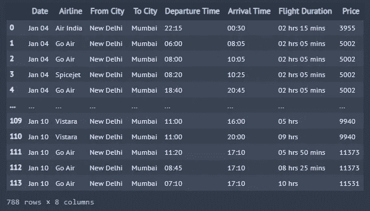
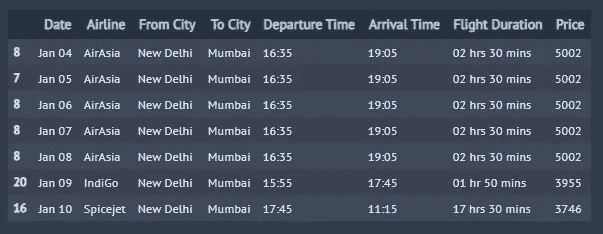
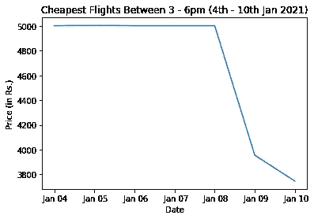

# 使用 Python 查找最便宜的机票及其时间

> 原文：<https://medium.com/analytics-vidhya/using-python-to-find-the-cheapest-air-tickets-and-their-timings-954c6a233e3d?source=collection_archive---------1----------------------->

这是一个方便的指南，教你如何使用网上报废来找到特定出发时间的最便宜的机票。


由 [Unsplash](https://unsplash.com?utm_source=medium&utm_medium=referral) 上的 [Cam DiCecca](https://unsplash.com/@camdicecca?utm_source=medium&utm_medium=referral) 拍摄的照片

多年来，ravel 聚合器在创建公共平台方面做得很好，人们可以在这个平台上选择过多的航班和酒店。这为用户和航空公司提供了更大的灵活性，他们现在可以根据自己喜欢的时间预订机票。事实上，这些年来网站的用户界面也变得更加友好，用户可以根据个人喜好进行分类和过滤。


资料来源:www.cxodaily.com

在我过去几个月对这些网站的研究中，我花了一些时间规划 COVID 后的旅行，我发现大多数网站都缺少一个关键的特征。这些网站通常会在某一天按价格(从低到高)对期权进行排序。一些网站甚至在日期选择面板中显示未来几天按天计算的最便宜的选项。然而，在像新冠肺炎这样的许多州都有夜间宵禁的时期，或者从安全的角度来看，一个主要的问题是，人们希望在优选时间段期间利用最便宜的选择。到目前为止，还没有网站提供查询未来几天特定时间段最便宜航班的选项。这一功能在当今时代变得非常重要，对于想要最终确定旅行路线的客户来说，可能会有很大的好处。因此，在旅游网站提供这种功能之前，我们将尝试使用 *Selenium* 在 *Python* 上构建这一功能。

# **场景**

假设一个人想从德里飞往孟买，旅行日期灵活，大约一周，但对出发时间的要求是下午 3 点到 6 点。

# **接近**

**警告！首先，如果你也计划建立这个工具，请参考各自网站的 *robots.txt* 并检查所有允许提取的内容。如果网站不允许废弃您需要的东西，请在继续之前给网站管理员发一封邮件。**

为了我们的分析，我们将选择印度最大的在线旅游聚合商之一，*。 ***MakeMyTrip*** 是纳斯达克上市公司，提供包括机票、国内外度假套餐、酒店预订、火车票、汽车票等在线旅游服务。要废弃网站，我们首先导入必要的库:*

```
*import selenium
from selenium import webdriver as wb
import pandas as pd
import numpy as np
import datetime
import time
from datetime import date
from selenium.webdriver.common.keys import Keys
from selenium.webdriver.support.ui import WebDriverWait
from selenium.webdriver.support import expected_conditions as EC
from selenium.webdriver.common.by import By*
```

*将工作目录设置为保存 *chromedriver* 和 *chromedriver* 的路径，如下所示:-*

```
*%cd "PATH WHERE YOUR CHROMEDRIVER IS SAVED"
driver = wb.Chrome("YOUR PATH\\chromedriver.exe")*
```

*由于我们想要查看一周的航班价格，我们随机选择了一月的第一周(2021 年 1 月 4 日-10 日)。我们设置了日、月和年变量。*

```
*month = [1,1,1,1,1,1,1]
month = [str(x).zfill(2) for x in month]
day = [4,5,6,7,8,9,10]
day = [str(x).zfill(2) for x in day]
year = [2021,2021,2021,2021,2021,2021,2021]
year = [str(x).zfill(4) for x in year]*
```

*现在，为了能够从网站中提取信息，我们首先需要研究 *url* 。搜索 2021 年 1 月 4 日从德里到孟买的航班的 url 显示如下*

```
*https://www.makemytrip.com/flight/search?tripType=O&itinerary=DEL-BOM-04/01/2021&paxType=A-1_C-0_I-0&cabinClass=E&sTime=1608889546521&forwardFlowRequired=true&mpo=&intl=false*
```

*上面的 *url* 给了我们一个清晰的指示，告诉我们需要在哪里输入上面创建的日、月和年变量。因此，我们将调用该网站如下:-*

```
*for a,b,c in zip(day,month,year):
    driver.get("[https://www.makemytrip.com/flight/search?tripType=O&itinerary=DEL-BOM-{}/{}/{}&paxType=A-1_C-0_I-0&cabinClass=E&sTime=1597828876664&forwardFlowRequired=true](https://www.makemytrip.com/flight/search?tripType=O&itinerary=DEL-BOM-{}/{}/{}&paxType=A-1_C-0_I-0&cabinClass=E&sTime=1597828876664&forwardFlowRequired=true)".format(a,b,c))*
```

*在 Instagram 和脸书这样的网站上，我们面临的一个主要挑战(从抓取的角度来看)是无限滚动，也就是说，只有当你向下滚动时，数据才会持续加载。默认情况下，我们的代码只能提取可见的部分，因此存在潜在的数据丢失风险。对于 *Makemytrip* ，我们面临类似的情况，所有列出的航班都不会加载，直到你向下滚动，这是我们必须在代码中包含的内容。*

```
*lenOfPage = driver.execute_script("window.scrollTo(0, document.body.scrollHeight);var lenOfPage=document.body.scrollHeight;return lenOfPage;")
    match=False
    while(match==False):
        lastCount = lenOfPage
        time.sleep(1)
        lenOfPage = driver.execute_script("window.scrollTo(0, document.body.scrollHeight);var lenOfPage=document.body.scrollHeight;return lenOfPage;")
        if lastCount==lenOfPage:
            match=True*
```

*现在，我们已经准备好提取我们首选时间段内所有航班的航班名称、价格、来源、目的地、持续时间、出发时间、到达时间和日期，并将信息保存到名为' *Flight_Prices* '的空*数据框*。*

```
*# Creating an empty dataframe called 'Flight_Prices'
Flight_Prices = pd.DataFrame()# Creating a for loop which will iterate through all the required pages of the website
for a,b,c in zip(day,month,year):
    driver.get("[https://www.makemytrip.com/flight/search?tripType=O&itinerary=DEL-BOM-{}/{}/{}&paxType=A-1_C-0_I-0&cabinClass=E&sTime=1597828876664&forwardFlowRequired=true](https://www.makemytrip.com/flight/search?tripType=O&itinerary=DEL-BOM-{}/{}/{}&paxType=A-1_C-0_I-0&cabinClass=E&sTime=1597828876664&forwardFlowRequired=true)".format(a,b,c))
    time.sleep(15)

    lenOfPage = driver.execute_script("window.scrollTo(0, document.body.scrollHeight);var lenOfPage=document.body.scrollHeight;return lenOfPage;")
    match=False
    while(match==False):
        lastCount = lenOfPage
        time.sleep(1)
        lenOfPage = driver.execute_script("window.scrollTo(0, document.body.scrollHeight);var lenOfPage=document.body.scrollHeight;return lenOfPage;")
        if lastCount==lenOfPage:
            match=True

    time.sleep(60)
    # Extracting all the Airline names using xpath
    FlightName_elements = driver.find_elements_by_xpath("//div[[@class](http://twitter.com/class)='pull-left airways-info-sect']")
    FlightName_elements = [x.text for x in FlightName_elements]
    FlightName = [x.split('\n')[0] for x in FlightName_elements]
    FlightName = pd.Series(FlightName)

    # Extracting all the prices using xpath
    Price_elements = driver.find_elements_by_xpath("//span[[@class](http://twitter.com/class)='actual-price']")
    Price = [x.text for x in Price_elements]
    Price = [i for i in Price if i]
    Price = pd.Series(Price)

    # Extracting all the Source City details using xpath
    Fromcity_elements = driver.find_elements_by_xpath("//p[[@class](http://twitter.com/class)='dept-city']")
    Fromcity = [x.text for x in Fromcity_elements]
    Fromcity = pd.Series(Fromcity)

    # Extracting all the Destination City details using xpath
    Tocity_elements = driver.find_elements_by_xpath("//p[[@class](http://twitter.com/class)='arrival-city']")
    Tocity = [x.text for x in Tocity_elements]
    Tocity = pd.Series(Tocity)

    # Extracting all the Duration details using xpath
    Duration_elements = driver.find_elements_by_xpath("//p[[@class](http://twitter.com/class)='fli-duration']")
    Duration = [x.text for x in Duration_elements]
    Duration = pd.Series(Duration)

     # Extracting all the Departure time details using xpath
    Deptime_elements = driver.find_elements_by_xpath("//div[[@class](http://twitter.com/class)='dept-time']")
    Deptime = [x.text for x in Deptime_elements]
    Deptime = pd.Series(Deptime)

     # Extracting all the Arrival Time details using xpath
    Arrtime_elements = driver.find_elements_by_xpath("//p[[@class](http://twitter.com/class)='reaching-time append_bottom3']")
    Arrtime = [x.text for x in Arrtime_elements]
    Arrtime = [x.split("+", 1)[0] for x in Arrtime]
    Arrtime = pd.Series(Arrtime)

    Date_elements = driver.find_elements_by_xpath("//div[[@class](http://twitter.com/class)='item blue_active']")
    Date_elements = [x.text for x in Date_elements]
    x = [x.split(',', 1)[1] for x in Date_elements]
    Date = [i.split('\n', 1)[0] for i in x]
    Date = pd.Series(Date)

    # Combining all the lists into a dataframe called 'df'
    df = pd.DataFrame({'Date':Date,"Airline":FlightName,"From City":Fromcity, "To City":Tocity, "Departure Time":Deptime,"Arrival Time":Arrtime,"Flight Duration":Duration,"Price":Price})

    # We will append the results obtained from every page into the empty datafram created earlier called 'Flight_Prices'
    Flight_Prices = Flight_Prices.append(df) 

Flight_Prices[Flight_Prices.Date==""] = np.NaN
Flight_Prices.Date = Flight_Prices.Date.fillna(method='ffill')
Flight_Prices.Price = Flight_Prices.Price.str.replace(",","").str.extract('(\d+)')
Flight_Prices*
```

**

*我们最终得到一个漂亮的*数据框架*，有 788 行飞行选项和各种相关功能。现在，在进入关键步骤之前，我们必须清理一下我们的数据。首先，我们需要确保我们的' *Price* '列是一个数值*

```
*Flight_Prices['Price'] = pd.to_numeric(Flight_Prices['Price'])*
```

*然后，我们筛选出出发时间仅在下午 3 点到 6 点之间的航空公司选项。*

```
*Flight_Prices = Flight_Prices[(Flight_Prices['Departure Time']>='15:00') & (Flight_Prices['Departure Time']<= '18:00')]*
```

*最后，我们按日期分组，找到一周中所有日期价格最便宜的航班，并得到想要的结果。*

```
*Flight_Prices.loc[Flight_Prices.groupby('Date')['Price'].idxmin()]
Flight_Prices.drop_duplicates('Date')*
```

**

*在折线图上画出同样的东西。*

**

*这个练习帮助我们做出决定。我们看到 1 月 10 日是我们首选时间段中最便宜的航班。然而，它似乎是一个转机航班，因为飞行时间为 17.5 小时。因此，我们将选择下一个最佳选择，即 1 月 9 日上市。这比一周内所有其他日期最便宜的航班便宜了将近 21%。*

# *结论*

*在这个练习中，我们看到了 *Python* 在开发小型黑客方面确实非常有用，可以帮助日常决策。这个过程可以简单到从相关网站上删除数据，根据我们的需要清理数据，并可视化以实现数据驱动的决策。帖子概述了该过程中使用的主要代码，完整代码可在[这里](https://github.com/aksbehera/Projects)找到。*